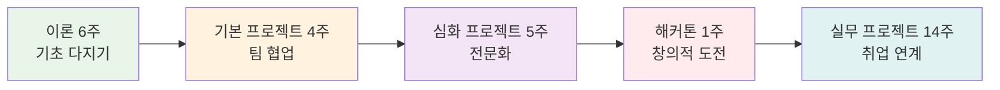

# Week 1 Day 1 Session 1: 오리엔테이션 & 과정 소개

<div align="center">

**🎓 KT Cloud TECH UP 2025 시작** • **라포 형성과 비전 공유**

*7개월 여정의 첫걸음 - 함께 성장할 동료들과의 만남*

</div>

---

## 🕘 세션 정보

**시간**: 09:00-09:50 (50분)  
**목표**: 과정 이해 + 동료들과 라포 형성 + 학습 동기 부여  
**방식**: 전체 참여형 오리엔테이션

---

## 🎯 세션 목표

### 📚 학습 목표
- **이해 목표**: KT Cloud TECH UP 2025 과정의 전체 구조와 목표 이해
- **적용 목표**: 7개월 학습 로드맵과 개인 목표 설정
- **협업 목표**: 11명 동료들과의 첫 만남과 친목 도모

### 🤔 왜 필요한가? (5분)
**현실 상황**:
- 💼 **취업 시장**: 클라우드 네이티브 전문가 수요 급증
- 🏠 **일상 비유**: 새로운 여행을 시작할 때 지도와 동반자가 필요하듯
- 📊 **시장 동향**: 디지털 전환으로 모든 기업이 클라우드 기술 필요

---

## 📖 핵심 내용 (35분)

### 🌟 KT Cloud TECH UP 2025 소개 (15분)

#### 과정 전체 구조


**🖼️ 클라우드 네이티브 로드맵**

*출처: CNCF Landscape*

#### 과정의 특별함
- 🏢 **KT Cloud 직접 운영**: 국내 최대 클라우드 인프라 경험
- 👨💼 **현직자 멘토링**: 실무 전문가와 함께하는 학습
- 🚀 **실무 프로젝트**: 실제 기업 과제 해결 경험
- 💼 **취업 연계**: KT Cloud 및 파트너사 취업 기회

#### 클라우드 시장 전망
```
글로벌 클라우드 시장
2023년: $545B → 2030년: $1,266B (연평균 13% 성장)

국내 클라우드 시장  
2023년: 4.2조원 → 2027년: 7.8조원 (85% 성장)

클라우드 네이티브 전문가 수요
현재 대비 300% 증가 예상 (2025년까지)
```

**🖼️ DevOps 시장 성장 전망**

*DevOps 시장 성장 추이*

### 👨🏫 강사 소개 및 교육 철학 (10분)

#### 강사 프로필
- **경력**: DevOps 및 클라우드 아키텍처 10년+ 경험
- **전문 분야**: DevOps, Kubernetes, 클라우드 아키텍처
- **실무 경험**: 대규모 클라우드 마이그레이션 및 DevOps 전환 프로젝트
- **교육 철학**: "이론과 실무의 완벽한 결합"

#### 교육 방침
- **협업 중심**: 다양한 배경의 학생들이 함께 성장하는 환경
- **상호 학습**: 서로 가르치고 배우며 전체가 발전
- **실무 연계**: 현장에서 바로 쓸 수 있는 기술과 협업 능력
- **자연스러운 성장**: 각자의 강점이 자연스럽게 발현되는 학습

### 🎲 아이스브레이킹: "3가지 키워드 자기소개" (10분)

#### 진행 방식
각자 3가지 키워드로 자신을 소개:
1. **배경** (전공, 관심사, 취미)
2. **목표** (이 과정을 통해 이루고 싶은 것)  
3. **특기** (자신만의 강점이나 재능)

**규칙**:
- 1인당 1분 30초 소개
- 다른 사람 소개 들으며 공통점 찾기
- 질문과 대화 자유롭게
- 모든 배경과 경험을 환영하는 분위기

---

## 💭 함께 생각해보기 (10분)

### 🤝 전체 토론
**토론 주제**:
1. "이 과정에서 가장 기대하는 것은 무엇인가요?"
2. "7개월 후 어떤 모습이 되고 싶나요?"
3. "함께 학습하는 동료들에게 기대하는 것은?"

### 🌟 우리 과정의 특별한 점
**11명의 다양한 배경이 만드는 시너지**:
- CS 전공자와 비전공자의 창의적 관점 융합  
- 신입부터 경력자까지 상호 보완적 지식 공유
- 각자의 인생 경험이 만드는 독특한 학습 환경

**🖼️ 다양성이 만드는 혁신**

*다양성이 혁신과 성과를 만드는 원동력*

### 💡 이해도 체크 질문
- ✅ "7개월 과정의 전체 구조를 설명할 수 있나요?"
- ✅ "이 과정에서 본인만의 목표를 설정했나요?"
- ✅ "동료들과 함께 학습하는 것에 대한 기대가 있나요?"

---

## 🔑 핵심 키워드

- **KT Cloud TECH UP 2025**: 클라우드 네이티브 전문가 양성 과정
- **협업 중심 학습**: 다양한 배경의 동료들과 함께 성장
- **실무 연계**: 이론과 실무를 결합한 실전 교육
- **취업 연계**: KT Cloud 및 파트너사 취업 기회

---

## 📝 세션 마무리

### ✅ 오늘 세션 성과
- [ ] 전체 과정 구조와 목표 이해
- [ ] 강사 및 교육 방침 파악
- [ ] 동료들과 첫 만남 및 자기소개 완료
- [ ] 개인 학습 목표 설정

### 🎯 다음 세션 준비
- **주제**: DevOps 기본 개념과 문화
- **준비사항**: 개발과 운영의 경험이나 어려움 생각해보기
- **마음가짐**: 새로운 개념 학습에 대한 열린 자세

---

<div align="center">

**🎉 KT Cloud TECH UP 2025 여정의 시작을 축하합니다! 🎉**

*함께 성장하는 7개월, 클라우드 네이티브 전문가로의 변화*

**다음**: [Session 2 - DevOps 기본 개념](./session_2.md)

</div>