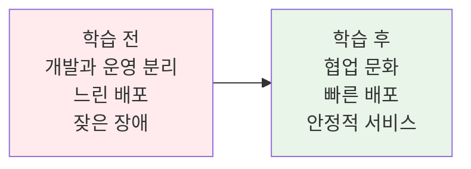
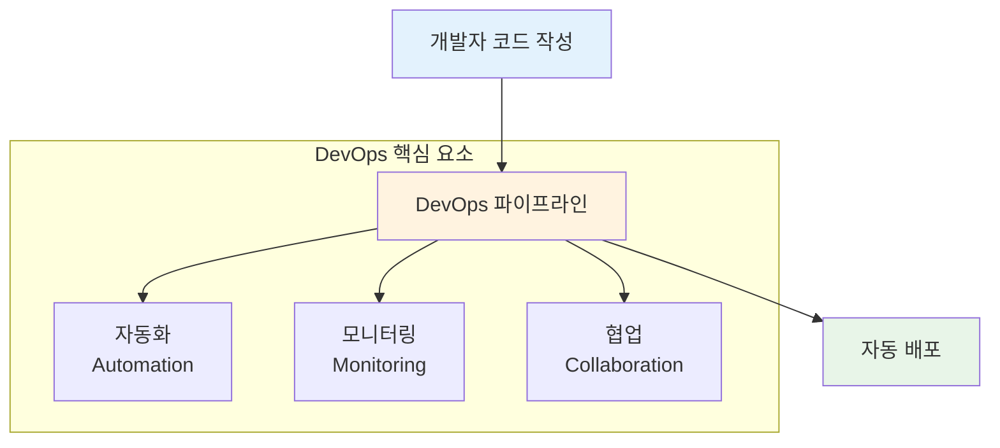
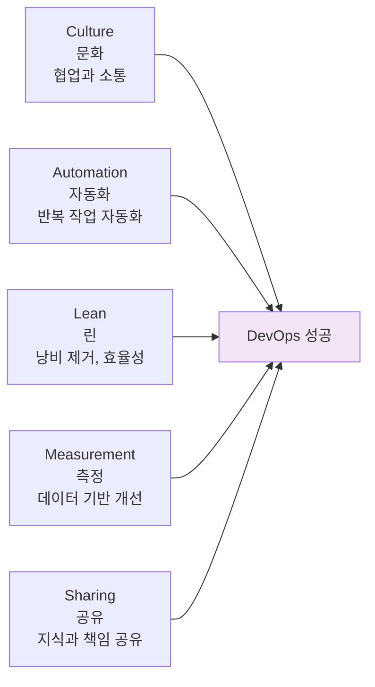
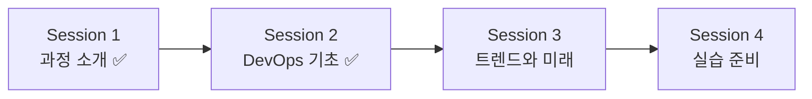

# Week 1 Day 1 Session 2: DevOps 기본 개념

**🤝 개발과 운영의 만남** • **DevOps 문화의 이해**

*전통적 개발 방식에서 협업 중심 DevOps로의 패러다임 전환*

---

## 🕘 세션 정보

**시간**: 10:00-10:50 (50분)  
**목표**: DevOps 기본 정의 이해 + 전통적 방식과의 차이점 파악  
**방식**: 이론 설명 + 페어 토론 + 전체 공유

---

## 🎯 세션 목표

### 📚 학습 목표
- **이해 목표**: DevOps의 기본 정의와 핵심 가치 완전 이해
- **적용 목표**: 전통적 개발 방식과 DevOps 방식의 차이점 구분
- **협업 목표**: 페어 토론을 통한 개념 정리와 경험 공유

### 🤔 왜 필요한가? (5분)
**현실 문제 상황**:
- 💼 **실무 시나리오**: 개발팀이 만든 코드가 운영 환경에서 동작하지 않는 문제
- 🏠 **일상 비유**: 요리사(개발)와 서빙(운영)이 따로 놀면 고객 불만족
- 📊 **시장 동향**: 빠른 변화에 대응하지 못하는 기업들의 경쟁력 상실

**학습 전후 비교**:

---

## 📖 핵심 개념 (35분)

### 🔍 개념 1: DevOps의 기본 정의 (12분)

> **정의**: Development(개발) + Operations(운영) = 협업을 통한 빠르고 안정적인 소프트웨어 배포

#### 상세 설명
- **핵심 원리**: 개발과 운영의 벽을 허물고 하나의 팀으로 협업
- **주요 특징**: 
  - 지속적 통합/배포 (CI/CD)
  - 자동화된 테스트와 배포
  - 모니터링과 피드백 루프
  - 문화적 변화와 협업
- **사용 목적**: 소프트웨어 품질 향상과 배포 속도 증가

#### 시각적 이해

### 🔍 개념 2: 전통적 방식 vs DevOps (12분)

> **정의**: 기존의 분리된 개발/운영 방식에서 통합된 협업 방식으로의 전환

#### 단계별 이해
1. **1단계**: 개발팀과 운영팀이 완전히 분리된 상태 (Silos)
2. **2단계**: 일부 협업이 시작되지만 여전히 벽이 존재 (Collaboration)
3. **3단계**: 완전한 DevOps 문화로 하나의 팀처럼 협업 (Integration)

#### 종합 비교표
| 구분 | 전통적 방식 | DevOps 방식 | 핵심 차이점 |
|------|-------------|-------------|-------------|
| **팀 구조** | 개발팀 ↔ 운영팀 분리 | 통합된 크로스펑셔널 팀 | 협업 vs 분리 |
| **배포 주기** | 몇 달에 한 번 | 매일 또는 실시간 | 속도 vs 안정성 |
| **책임 범위** | 개발 vs 운영으로 분리 | 전체 생명주기 공유 | 공유 책임 |
| **문제 해결** | 서로 책임 전가 | 함께 해결 | 협력적 문제 해결 |
| **도구 사용** | 수동 작업 중심 | 자동화 도구 활용 | 효율성 증대 |

#### 실무 연결
- **사용 사례**: Netflix의 마이크로서비스 아키텍처, Amazon의 2-pizza 팀
- **장단점**: 
  - 장점: 빠른 배포, 높은 품질, 빠른 피드백
  - 한계점: 문화 변화의 어려움, 초기 투자 비용
- **대안 기술**: Agile, Lean, Site Reliability Engineering (SRE)

### 🔍 개념 3: DevOps 핵심 가치 - CALMS (11분)

> **정의**: DevOps 성공을 위한 5가지 핵심 요소

#### CALMS 프레임워크

#### 각 요소별 상세 설명
- **Culture (문화)**: 협업, 신뢰, 투명성을 바탕으로 한 조직 문화
- **Automation (자동화)**: 빌드, 테스트, 배포 등 반복 작업의 자동화
- **Lean (린)**: 가치 창출에 집중하고 낭비 요소 제거
- **Measurement (측정)**: 성능, 품질, 사용자 만족도 등 지속적 측정
- **Sharing (공유)**: 지식, 도구, 책임의 투명한 공유

---

## 💭 함께 생각해보기 (10분)

### 🤝 페어 토론 (7분)
**토론 주제**:
1. **개념 적용**: "여러분의 경험에서 개발과 운영이 분리되어 생긴 문제가 있었나요?"
2. **문제 해결**: "DevOps 문화가 있었다면 그 문제를 어떻게 해결할 수 있었을까요?"
3. **경험 공유**: "협업이 잘 되었던 경험이나 잘 안 되었던 경험을 공유해주세요"

### 🎯 전체 공유 (3분)
- **인사이트 공유**: 페어 토론에서 나온 좋은 아이디어
- **질문 수집**: 아직 이해가 어려운 부분
- **다음 연결**: 다음 세션과의 연결고리 확인

### 💡 이해도 체크 질문
- ✅ "DevOps를 한 문장으로 설명할 수 있나요?"
- ✅ "전통적 방식과 DevOps의 가장 큰 차이점은 무엇인가요?"
- ✅ "CALMS 중에서 가장 중요하다고 생각하는 요소는 무엇인가요?"

---

## 🔑 핵심 키워드

### 새로운 용어
- **DevOps(데브옵스)**: 개발과 운영의 협업 문화
- **CI/CD**: Continuous Integration/Continuous Deployment (지속적 통합/배포)
- **Silo(사일로)**: 부서 간 분리된 상태

### 중요 개념
- **자동화(Automation)**: 반복 작업의 자동화로 효율성 증대
- **모니터링(Monitoring)**: 시스템 상태 지속적 관찰
- **협업 문화(Collaboration Culture)**: 팀 간 벽을 허무는 문화적 변화

### 실무 용어
- **파이프라인(Pipeline)**: 코드에서 배포까지의 자동화된 흐름
- **배포(Deployment)**: 개발된 소프트웨어를 운영 환경에 적용
- **피드백 루프(Feedback Loop)**: 지속적인 개선을 위한 순환 구조

---

## 📝 세션 마무리

### ✅ 오늘 세션 성과
- [ ] DevOps 기본 정의와 핵심 가치 이해
- [ ] 전통적 방식과 DevOps 방식의 차이점 파악
- [ ] CALMS 프레임워크를 통한 DevOps 성공 요소 학습
- [ ] 페어 토론을 통한 개념 정리와 경험 공유

### 🎯 다음 세션 준비
- **주제**: DevOps 최신 트렌드와 미래 전망
- **준비사항**: 관심 있는 IT 기술 트렌드나 도구 생각해보기
- **연결고리**: 오늘 배운 DevOps 기본 개념이 어떻게 발전하고 있는지

### 📊 학습 진도 체크

---

**🤝 DevOps 문화의 핵심을 이해했습니다**

*개발과 운영의 협업이 만드는 혁신적 변화*

**이전**: [Session 1 - 과정 소개](./session_1.md) | **다음**: [Session 3 - DevOps 트렌드](./session_3.md)

