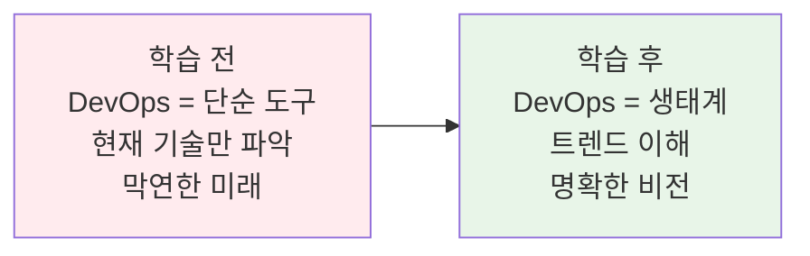
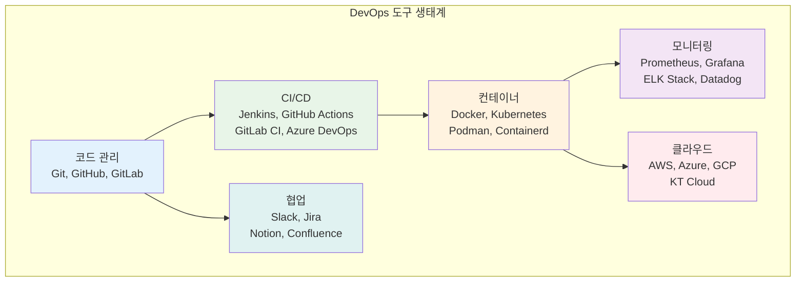
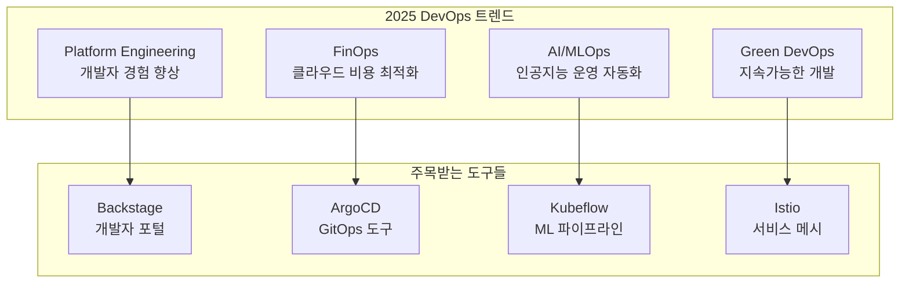
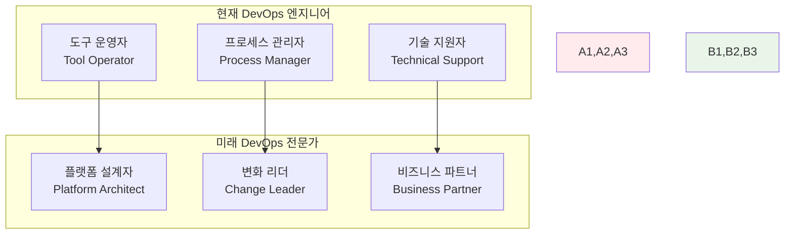
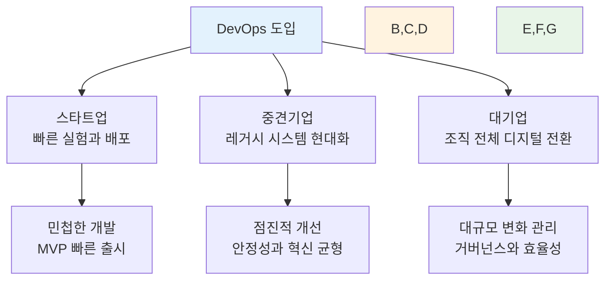
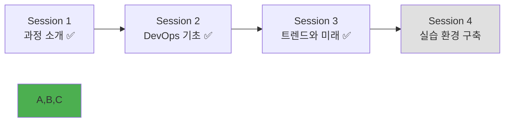

# Week 1 Day 1 Session 3: DevOps 트렌드와 미래

**🚀 2025년 DevOps 생태계** • **미래 전문가로의 비전**

*현재 DevOps 도구들부터 최신 트렌드까지, 전문가로 성장하는 로드맵*

---

## 🕘 세션 정보

**시간**: 11:00-11:50 (50분)  
**목표**: 현재 DevOps 생태계 이해 + 2025년 트렌드 파악 + 미래 비전 수립  
**방식**: 이론 설명 + 실무 사례 분석 + 비전 공유

---

## 🎯 세션 목표

### 📚 학습 목표
- **이해 목표**: 현재 DevOps 도구 생태계와 2025년 최신 트렌드 파악
- **적용 목표**: 실무에서 사용되는 DevOps 도구들의 역할과 연관성 이해
- **협업 목표**: 미래 DevOps 전문가로서의 개인 비전과 목표 설정

### 🤔 왜 필요한가? (5분)
**현실 상황**:
- 💼 **취업 시장**: DevOps 엔지니어 수요 연평균 20% 증가
- 🏠 **일상 비유**: 스마트폰 기술 발전처럼 DevOps 도구도 빠르게 진화
- 📊 **시장 동향**: AI, 클라우드, 자동화 기술의 융합으로 새로운 기회 창출

**학습 전후 비교**:

---

## 📖 핵심 개념 (35분)

### 🔍 개념 1: 현재 DevOps 도구 생태계 (12분)

> **정의**: DevOps 구현을 위한 다양한 도구들의 통합적 활용 환경

#### 주요 DevOps 도구 카테고리

#### 글로벌 기업 성공 사례
- **Netflix**: 
  - 하루 1000번 이상 배포
  - 마이크로서비스 아키텍처
  - Chaos Engineering으로 장애 대응력 강화
- **Amazon**: 
  - 11.7초마다 배포
  - 2-pizza 팀 문화 (팀 크기를 피자 2판으로 제한)
  - AWS 서비스를 활용한 완전 자동화
- **Google**: 
  - 20억 개 컨테이너 운영
  - SRE(Site Reliability Engineering) 문화
  - Kubernetes 오픈소스 기여

### 🔍 개념 2: 2025년 최신 DevOps 트렌드 (12분)

> **정의**: 현재 주목받고 있는 DevOps 기술과 문화적 변화 동향

#### 핫한 기술 트렌드

#### 각 트렌드별 상세 설명
1. **Platform Engineering**: 
   - 개발자 경험(DX) 향상을 위한 내부 플랫폼 구축
   - 셀프서비스 인프라와 개발자 포털
   - 예: Spotify의 Backstage, Netflix의 내부 플랫폼

2. **FinOps**: 
   - 클라우드 비용 최적화와 재무 운영의 결합
   - 실시간 비용 모니터링과 예산 관리
   - 예: AWS Cost Explorer, Azure Cost Management

3. **AI/MLOps**: 
   - 인공지능 모델의 개발, 배포, 운영 자동화
   - 모델 버전 관리와 A/B 테스팅
   - 예: MLflow, Kubeflow, Seldon

4. **Green DevOps**: 
   - 지속가능한 소프트웨어 개발과 환경 고려
   - 에너지 효율적인 코드와 인프라
   - 탄소 발자국 측정과 최적화

### 🔍 개념 3: DevOps 전문가의 미래와 기회 (11분)

> **정의**: DevOps 기술 발전에 따른 전문가 역할의 변화와 새로운 기회

#### 미래 역할 변화

#### 취업 시장 전망
**DevOps 엔지니어 전망**:
- 📈 **수요 증가**: 연평균 20% 성장 (2025년까지)
- 💰 **연봉 수준**: 
  - 신입: 4,000만원 ~ 5,500만원
  - 3년차: 6,000만원 ~ 8,000만원
  - 5년차+: 8,000만원 ~ 1억 2천만원
- 🏢 **채용 기업**: 
  - IT 기업: 네이버, 카카오, 쿠팡, 토스
  - 전통 기업: 삼성, LG, 현대, 신한은행
  - 글로벌 기업: AWS, Microsoft, Google
- 🌍 **글로벌 기회**: 원격 근무 가능한 직군으로 해외 취업 기회

#### 전문화 경로
- **인프라 전문가**: Kubernetes, 클라우드 아키텍처
- **자동화 전문가**: CI/CD, Infrastructure as Code
- **보안 전문가**: DevSecOps, 컴플라이언스
- **플랫폼 전문가**: 개발자 경험, 내부 도구 개발

---

## 🌟 실무 연계 (10분)

### 📊 업계 동향 분석
**시장 현황**:
- DevOps 도구 시장: 연평균 20% 성장
- 클라우드 네이티브 기술 도입률: 85% 이상
- 컨테이너 기술 사용률: 90% 이상 (대기업 기준)

**주요 기업 사례**:
- **Spotify**: Squad 모델과 자율적 팀 문화
- **Uber**: 마이크로서비스 전환으로 확장성 확보
- **Airbnb**: 데이터 드리븐 DevOps로 의사결정 최적화

### 🏢 기업 규모별 DevOps 적용

### ⚠️ 실무 주의사항
- 🚨 **흔한 실수**: 도구만 도입하고 문화 변화 없이 진행
- 💡 **베스트 프랙티스**: 작은 것부터 시작해서 점진적 확장
- 🔧 **성공 요인**: 경영진 지원, 팀 간 협업, 지속적 학습

---

## 💭 함께 생각해보기 (5분)

### 🎯 개인 비전 설정
**질문과 토론**:
1. "2025년 DevOps 트렌드 중 가장 관심 있는 분야는?"
2. "7개월 후 어떤 DevOps 전문가가 되고 싶나요?"
3. "우리 과정에서 어떤 기술을 가장 깊이 배우고 싶나요?"

### 💡 이해도 체크 질문
- ✅ "현재 DevOps 도구 생태계의 주요 카테고리를 설명할 수 있나요?"
- ✅ "2025년 DevOps 트렌드 중 하나를 선택해서 설명할 수 있나요?"
- ✅ "DevOps 전문가로서 본인만의 목표를 설정했나요?"

---

## 🔑 핵심 키워드

### 최신 트렌드 용어
- **Platform Engineering**: 개발자 경험 향상을 위한 내부 플랫폼 구축
- **FinOps**: Financial Operations, 클라우드 비용 최적화
- **MLOps**: Machine Learning Operations, AI 모델 운영 자동화
- **Green DevOps**: 지속가능한 소프트웨어 개발

### 핵심 도구
- **Backstage**: Spotify에서 개발한 개발자 포털 플랫폼
- **ArgoCD**: Kubernetes를 위한 GitOps 도구
- **Kubeflow**: Kubernetes 기반 ML 워크플로우 플랫폼
- **Istio**: 서비스 메시 플랫폼

### 미래 역할
- **Platform Architect**: 플랫폼 설계 전문가
- **DevOps Evangelist**: 조직 변화를 이끄는 리더
- **Cloud Native Engineer**: 클라우드 네이티브 기술 전문가

---

## 📝 세션 마무리

### ✅ 오늘 세션 성과
- [ ] 현재 DevOps 도구 생태계 전체 구조 이해
- [ ] 2025년 최신 DevOps 트렌드 4가지 파악
- [ ] DevOps 전문가로서의 미래 비전과 기회 인식
- [ ] 개인별 관심 분야와 목표 설정

### 🎯 다음 세션 준비
- **주제**: 개발 환경 설정과 Git 협업 실습
- **준비사항**: 노트북 준비, 설치할 도구 목록 확인
- **연결고리**: 오늘 배운 DevOps 도구들을 직접 설치하고 사용해보기

### 📊 학습 진도 체크

### 🔮 이론에서 실습으로
**오전 이론 학습 완료**:
- DevOps 문화와 철학 이해 ✅
- 현재와 미래의 기술 트렌드 파악 ✅
- 개인 비전과 목표 설정 ✅

**오후 실습 준비**:
- 실제 DevOps 도구 설치와 사용
- Git을 활용한 첫 협업 경험
- 자동화 도구의 기초 체험

---

**🚀 DevOps 트렌드와 미래를 이해했습니다**

*현재에서 미래로, 이론에서 실습으로*

**이전**: [Session 2 - DevOps 기초](./session_2.md) | **다음**: [Session 4 - 실습 환경 구축](./session_4.md)

