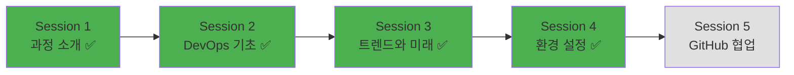

# Week 1 Day 1 Session 4: 개발 환경 설정 실습

<div align="center">

**🛠️ DevOps 도구 설치와 설정** • **첫 실습 경험**

*이론에서 실습으로, DevOps 도구들과의 첫 만남*

</div>

---

## 🕘 세션 정보

**시간**: 13:00-13:50 (50분)  
**목표**: DevOps 필수 도구 설치 + 기본 사용법 익히기  
**방식**: 실습 중심 + 페어 프로그래밍 + 상호 지원

---

## 🎯 세션 목표

### 📚 학습 목표
- **이해 목표**: DevOps 필수 도구들의 역할과 중요성 체험
- **적용 목표**: Git, VS Code, Docker 설치 및 기본 사용법 습득
- **협업 목표**: 페어 프로그래밍을 통한 상호 지원과 문제 해결

### 🤔 왜 필요한가? (3분)
**실습의 중요성**:
- 💼 **실무 연결**: 이론만으로는 실제 업무 수행 불가
- 🏠 **일상 비유**: 운전 이론을 배워도 실제 운전해봐야 익숙해지듯
- 📊 **학습 효과**: 직접 해보는 것이 이해도와 기억력을 10배 향상

---

## 🛠️ 실습 내용 (42분)

### 🚀 Phase 1: 필수 도구 설치 (20분)

#### 설치할 도구 목록
1. **Git**: 버전 관리 시스템
2. **VS Code**: 통합 개발 환경
3. **Docker Desktop**: 컨테이너 플랫폼
4. **WSL2** (Windows 사용자): Linux 환경

#### 🔧 단계별 설치 가이드

**Step 1: Git 설치 및 설정 (5분)**
```bash
# Git 설치 확인
git --version

# Git 사용자 설정 (본인 정보로 변경)
git config --global user.name "Your Name"
git config --global user.email "your.email@example.com"

# 설정 확인
git config --list
```

**Step 2: VS Code 설치 및 확장 프로그램 (7분)**
- VS Code 공식 사이트에서 다운로드 및 설치
- 필수 확장 프로그램 설치:
  - **Git Graph**: Git 히스토리 시각화
  - **Docker**: Docker 컨테이너 관리
  - **YAML**: YAML 파일 편집 지원
  - **Korean Language Pack**: 한국어 지원

**Step 3: Docker Desktop 설치 (8분)**
```bash
# Docker 설치 확인
docker --version

# Docker 정상 작동 테스트
docker run hello-world

# Docker 이미지 목록 확인
docker images
```

#### ✅ Phase 1 체크포인트
- [ ] Git 명령어 정상 실행 확인
- [ ] VS Code에서 Git 연동 확인
- [ ] Docker Hello World 성공적 실행
- [ ] 모든 도구 설치 완료

### 🌟 Phase 2: Git 기초 실습 (15분)

#### 🤝 페어 프로그래밍 진행
- **페어 구성**: 2명씩 자유롭게 매칭
- **역할 분담**: Driver(타이핑) / Navigator(가이드) 5분마다 교체
- **상호 지원**: 어려운 부분은 서로 도우며 해결

#### Git 기본 워크플로우 실습

**Step 1: 로컬 저장소 생성 (3분)**
```bash
# 새 디렉토리 생성
mkdir my-first-devops-project
cd my-first-devops-project

# Git 저장소 초기화
git init

# README 파일 생성
echo "# My First DevOps Project" > README.md
```

**Step 2: 첫 커밋 만들기 (4분)**
```bash
# 파일 상태 확인
git status

# 파일을 스테이징 영역에 추가
git add README.md

# 첫 번째 커밋
git commit -m "Initial commit: Add README"

# 커밋 히스토리 확인
git log --oneline
```

**Step 3: 브랜치 생성 및 작업 (4분)**
```bash
# 새 브랜치 생성 및 이동
git checkout -b feature/add-info

# README 파일 수정 (VS Code에서)
echo "## 프로젝트 소개" >> README.md
echo "DevOps 학습을 위한 첫 번째 프로젝트입니다." >> README.md

# 변경사항 커밋
git add README.md
git commit -m "Add project description"
```

**Step 4: 브랜치 병합 (4분)**
```bash
# main 브랜치로 이동
git checkout main

# feature 브랜치 병합
git merge feature/add-info

# 브랜치 삭제
git branch -d feature/add-info

# 최종 결과 확인
git log --oneline --graph
```

#### ✅ Phase 2 체크포인트
- [ ] Git 저장소 생성 및 초기화 완료
- [ ] 첫 번째 커밋 성공
- [ ] 브랜치 생성, 작업, 병합 완료
- [ ] 페어와 함께 문제 해결 경험

### 🏆 Phase 3: Docker 기초 체험 (7분)

#### 컨테이너 기본 명령어 실습

**Step 1: 첫 컨테이너 실행 (2분)**
```bash
# Hello World 컨테이너 실행
docker run hello-world

# 실행 결과 분석 및 이해
```

**Step 2: 웹 서버 컨테이너 실행 (3분)**
```bash
# Nginx 웹 서버 컨테이너 실행
docker run -d -p 8080:80 --name my-nginx nginx

# 브라우저에서 http://localhost:8080 접속 확인

# 실행 중인 컨테이너 확인
docker ps
```

**Step 3: 컨테이너 관리 (2분)**
```bash
# 컨테이너 로그 확인
docker logs my-nginx

# 컨테이너 중지
docker stop my-nginx

# 컨테이너 제거
docker rm my-nginx
```

#### ✅ Phase 3 체크포인트
- [ ] Hello World 컨테이너 실행 성공
- [ ] 웹 서버 컨테이너 실행 및 접속 확인
- [ ] 기본 Docker 명령어 사용 가능

---

## 💭 실습 회고 및 공유 (5분)

### 🤝 페어별 경험 공유
**공유 내용**:
1. "실습에서 가장 인상 깊었던 부분은?"
2. "어려웠던 점과 해결 방법은?"
3. "페어 프로그래밍에서 배운 점은?"

### 🎯 전체 공유
- **성공 사례**: 잘 해결한 문제들
- **어려움 공유**: 공통적으로 어려웠던 부분
- **상호 지원**: 서로 도운 경험들

### 💡 이해도 체크 질문
- ✅ "Git의 기본 워크플로우를 설명할 수 있나요?"
- ✅ "Docker 컨테이너와 이미지의 차이를 이해했나요?"
- ✅ "VS Code에서 Git을 사용할 수 있나요?"

---

## 🔑 핵심 키워드

### Git 관련 용어
- **Repository(저장소)**: 프로젝트의 모든 파일과 히스토리를 저장하는 공간
- **Commit(커밋)**: 변경사항을 저장소에 기록하는 행위
- **Branch(브랜치)**: 독립적인 작업 공간을 만드는 기능
- **Merge(병합)**: 서로 다른 브랜치의 변경사항을 합치는 과정

### Docker 관련 용어
- **Container(컨테이너)**: 애플리케이션과 실행 환경을 패키징한 단위
- **Image(이미지)**: 컨테이너를 만들기 위한 템플릿
- **Port Mapping(포트 매핑)**: 컨테이너 내부 포트를 호스트 포트에 연결

### 협업 관련 용어
- **Pair Programming(페어 프로그래밍)**: 두 명이 함께 코딩하는 방법
- **Driver/Navigator**: 페어 프로그래밍에서의 역할 분담

---

## 🔧 트러블슈팅 가이드

### 자주 발생하는 문제들
1. **Git 설치 문제**: 
   - Windows: Git Bash 설치 확인
   - Mac: Xcode Command Line Tools 설치
   - Linux: 패키지 매니저로 설치

2. **Docker 실행 문제**:
   - Windows: WSL2 활성화 필요
   - Mac: Docker Desktop 권한 설정
   - 포트 충돌: 다른 포트 번호 사용

3. **VS Code 확장 프로그램**:
   - 인터넷 연결 확인
   - 확장 프로그램 수동 설치
   - 재시작 후 다시 시도

### 해결 방법
```bash
# Git 상태 확인
git --version
git config --list

# Docker 상태 확인
docker --version
docker info

# 프로세스 확인 (포트 충돌 시)
netstat -an | grep 8080
```

---

## 📝 세션 마무리

### ✅ 오늘 세션 성과
- [ ] DevOps 필수 도구 3가지 설치 완료
- [ ] Git 기본 워크플로우 실습 완료
- [ ] Docker 컨테이너 기초 체험 완료
- [ ] 페어 프로그래밍을 통한 협업 경험

### 🎯 다음 세션 준비
- **주제**: GitHub 협업과 개별 상담
- **준비사항**: GitHub 계정 생성 (아직 없는 경우)
- **연결고리**: 로컬 Git에서 원격 저장소 협업으로 확장

### 📊 학습 진도 체크


### 🎉 첫 실습 완료!
**성취 사항**:
- 이론에서 실습으로의 성공적 전환 ✅
- DevOps 도구들과의 첫 만남 완료 ✅
- 페어 프로그래밍을 통한 협업 경험 ✅
- 문제 해결 능력 향상 ✅

---

<div align="center">

**🛠️ DevOps 도구 설정을 완료했습니다**

*이론에서 실습으로, 도구에서 협업으로*

**이전**: [Session 3 - DevOps 트렌드](./session_3.md) | **다음**: [Session 5 - GitHub 협업](./session_5.md)

</div>