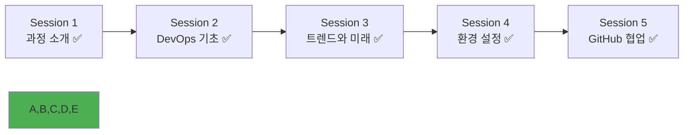

# Week 1 Day 1 Session 5: GitHub 협업 실습 & 개별 상담

<div align="center">

**🤝 첫 협업 경험** • **개별 맞춤 지원**

*로컬에서 원격으로, 개인에서 팀으로*

</div>

---

## 🕘 세션 정보

**시간**: 14:00-14:50 (50분)  
**목표**: GitHub 협업 체험  
**방식**: 팀 단위 협업 실습 + 결과 공유

---

## 🎯 세션 목표

### 📚 학습 목표
- **이해 목표**: GitHub를 활용한 원격 저장소 협업 방식 이해
- **적용 목표**: Pull Request 기반 협업 워크플로우 체험
- **협업 목표**: 실제 팀 프로젝트와 유사한 협업 경험

### 🤔 왜 필요한가? (2분)
**협업의 중요성**:
- 💼 **실무 현실**: 모든 개발 작업은 팀 단위로 진행
- 🏠 **일상 비유**: 구글 문서 공동 편집처럼 코드도 함께 작성
- 📊 **업계 표준**: GitHub는 전 세계 개발자들의 협업 플랫폼

---

## 🛠️ GitHub 협업 실습 (30분)

### 🚀 Phase 1: GitHub 저장소 설정 (10분)

#### 팀 구성 및 역할 분담
- **팀 구성**: 3-4명씩 자유롭게 팀 구성
- **역할 분담**:
  - **Repository Owner**: 저장소 생성 및 관리
  - **Collaborators**: 협업자로 참여
  - **Reviewers**: 코드 리뷰 담당

#### GitHub 저장소 생성 및 설정

**Step 1: 저장소 생성 (Repository Owner)**
```bash
# GitHub에서 새 저장소 생성
# 저장소 이름: team-devops-intro
# 설명: DevOps 학습을 위한 팀 프로젝트
# Public 저장소로 설정
# README.md 파일 포함하여 생성
```

**Step 2: 로컬과 원격 저장소 연결**
```bash
# 저장소 클론
git clone https://github.com/username/team-devops-intro.git
cd team-devops-intro

# 원격 저장소 확인
git remote -v
```

**Step 3: 협업자 초대**
- GitHub 저장소 Settings → Manage access → Invite a collaborator
- 팀원들의 GitHub 사용자명으로 초대
- 초대받은 팀원들은 이메일 확인 후 수락

#### ✅ Phase 1 체크포인트
- [ ] GitHub 저장소 생성 완료
- [ ] 팀원들 협업자로 초대 완료
- [ ] 모든 팀원이 저장소 클론 완료

### 🌟 Phase 2: 협업 워크플로우 실습 (15분)

#### Pull Request 기반 협업 체험

**Step 1: 개별 브랜치에서 작업 (5분)**
```bash
# 각자 개별 브랜치 생성 (본인 이름으로)
git checkout -b feature/add-member-info-yourname

# 팀원 소개 파일 생성
echo "# 팀원 소개" > team-members.md
echo "## [본인 이름]" >> team-members.md
echo "- 전공: [본인 전공]" >> team-members.md
echo "- 관심사: [관심 분야]" >> team-members.md
echo "- 목표: [학습 목표]" >> team-members.md

# 변경사항 커밋
git add team-members.md
git commit -m "Add member info: [본인 이름]"
```

**Step 2: 원격 저장소에 푸시 (3분)**
```bash
# 원격 저장소에 브랜치 푸시
git push origin feature/add-member-info-yourname
```

**Step 3: Pull Request 생성 (4분)**
- GitHub 웹사이트에서 Pull Request 생성
- 제목: "Add member info: [본인 이름]"
- 설명: 간단한 자기소개와 추가한 내용 설명
- Reviewers에 팀원들 지정

**Step 4: 코드 리뷰 및 병합 (3분)**
- 팀원들이 서로의 Pull Request 리뷰
- 간단한 코멘트나 승인 추가
- Repository Owner가 Pull Request 병합

#### ✅ Phase 2 체크포인트
- [ ] 개별 브랜치에서 작업 완료
- [ ] Pull Request 생성 및 리뷰 완료
- [ ] 모든 팀원의 변경사항 병합 완료

### 🏆 Phase 3: 협업 결과 확인 (5분)

#### 최종 결과물 확인

**Step 1: 최신 변경사항 동기화**
```bash
# main 브랜치로 이동
git checkout main

# 최신 변경사항 가져오기
git pull origin main

# 팀원들의 작업 결과 확인
cat team-members.md
```

**Step 2: Git 히스토리 확인**
```bash
# 커밋 히스토리 시각화
git log --oneline --graph --all

# 브랜치 정리
git branch -d feature/add-member-info-yourname
```

#### ✅ Phase 3 체크포인트
- [ ] 모든 팀원의 정보가 하나의 파일에 통합
- [ ] Git 히스토리에서 협업 과정 확인
- [ ] 브랜치 정리 완료

---

## 🎤 협업 결과 발표 및 공유 (15분)

### 🏆 팀별 결과 발표 (10분)
**발표 방식**: 팀당 2분씩 발표

**발표 내용**:
1. **팀 구성**: 팀원 소개와 역할 분담
2. **협업 과정**: Pull Request 과정에서 배운 점
3. **결과물**: 완성된 team-members.md 파일 시연
4. **소감**: GitHub 협업에서 인상 깊었던 부분

### 🤝 전체 공유 및 피드백 (5분)
**공유 주제**:
- "GitHub 협업과 로컬 Git의 가장 큰 차이점은?"
- "실무에서 이런 협업 방식이 어떻게 도움이 될까요?"
- "코드 리뷰 과정에서 느낀 점은?"

---

## 💭 실습 회고 및 공유 (3분)

### 🤝 팀별 협업 경험 공유
**공유 내용**:
1. "GitHub 협업에서 새롭게 배운 점은?"
2. "Pull Request 과정에서 인상 깊었던 부분은?"
3. "팀원들과의 협업에서 좋았던 점은?"

### 💡 이해도 체크 질문
- ✅ "GitHub의 Pull Request 워크플로우를 설명할 수 있나요?"
- ✅ "브랜치를 사용한 협업의 장점을 이해했나요?"
- ✅ "코드 리뷰의 중요성을 체감했나요?"

---

## 🔑 핵심 키워드

### GitHub 협업 용어
- **Pull Request (PR)**: 변경사항을 메인 브랜치에 병합하기 전 검토 요청
- **Code Review**: 동료가 작성한 코드를 검토하고 피드백하는 과정
- **Merge**: 서로 다른 브랜치의 변경사항을 하나로 합치는 작업
- **Collaborator**: 저장소에 쓰기 권한을 가진 협업자

### 협업 워크플로우
- **Feature Branch**: 새로운 기능 개발을 위한 별도 브랜치
- **Fork & Pull**: 오픈소스 프로젝트 기여 방식
- **Git Flow**: 브랜치 기반 협업 전략

### 팀워크 관련
- **Peer Review**: 동료 간 상호 검토
- **Collective Ownership**: 코드에 대한 공동 책임
- **Knowledge Sharing**: 지식과 경험의 공유

---

## 📝 세션 마무리

### ✅ 오늘 세션 성과
- [ ] GitHub를 활용한 원격 저장소 협업 체험
- [ ] Pull Request 기반 워크플로우 실습 완료
- [ ] 팀 단위 협업 경험 및 코드 리뷰 체험
- [ ] 협업 결과 발표를 통한 경험 공유

### 🎯 첫날 전체 성과
- [ ] KT Cloud TECH UP 2025 과정 이해 완료
- [ ] DevOps 기본 개념과 문화 학습 완료
- [ ] 최신 DevOps 트렌드와 미래 비전 파악
- [ ] 필수 개발 도구 설치 및 설정 완료
- [ ] Git과 GitHub를 활용한 협업 경험 완료

### 🔮 내일 준비사항
- **주제**: 컨테이너 기술 이론 (가상화 vs 컨테이너)
- **준비사항**: 
  - 오늘 설치한 Docker가 정상 작동하는지 확인
  - 가상머신 사용 경험이 있다면 떠올려보기
- **마음가짐**: DevOps 문화에서 기술로, 협업 경험을 바탕으로 한 학습

### 📊 Day 1 완주!


---

## 🎉 첫날 완주 축하!

### 🌟 오늘의 하이라이트
- **새로운 만남**: 11명의 다양한 동료들과의 첫 만남
- **DevOps 이해**: 문화부터 기술까지 DevOps의 전체 그림 파악
- **실습 경험**: 이론에서 실습으로, 개인에서 팀으로의 전환
- **협업 체험**: GitHub를 통한 실제 개발자 협업 방식 경험

### 🚀 내일을 향한 준비
- DevOps 문화적 기반 완성 ✅
- 필수 도구 환경 구축 완료 ✅
- 협업 경험과 팀워크 형성 ✅
- 컨테이너 기술 학습 준비 완료 ✅

---

<div align="center">

**🎉 Week 1 Day 1 완주를 축하합니다! 🎉**

*DevOps 여정의 첫걸음을 성공적으로 시작했습니다*

**내일**: [Day 2 - 컨테이너 기술 이론](../day2/session_1.md)

</div>