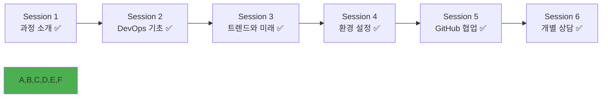

# Week 1 Day 1 Session 6: 개별 상담 & 직무별 Q&A

<div align="center">

**👥 맞춤형 개별 지원** • **💼 직무별 궁금증 해결**

*각자의 배경과 목표에 맞는 개인별 상담과 진로 가이드*

</div>

---

## 🕘 세션 정보

**시간**: 15:00-16:00 (60분)  
**목표**: 개별 맞춤 상담 + 직무별 진로 가이드  
**방식**: 1:1 개별 상담 (50분) + 직무별 Q&A (10분)

---

## 🎯 세션 목표

### 📚 학습 목표
- **이해 목표**: 개인별 학습 현황과 목표 명확화
- **적용 목표**: 7개월 과정에서의 개인별 학습 전략 수립
- **협업 목표**: 동료들과의 협업 방향과 역할 설정

### 🤔 왜 필요한가? (2분)
**개별 상담의 중요성**:
- 💼 **개인 맞춤**: 12명 모두 다른 배경과 목표를 가지고 있음
- 🏠 **일상 비유**: 의사가 환자 개별 진료하듯 맞춤형 학습 처방
- 📊 **성공 요인**: 개인별 강점을 살리고 약점을 보완하는 전략

---

## 👥 개별 상담 (50분)

### 🤝 1:1 개별 상담 진행

#### 상담 방식
- **시간**: 1인당 5분 × 12명 = 60분 (실제 50분 진행)
- **순서**: 자유롭게 신청 순서대로 진행
- **장소**: 조용한 공간에서 개별 진행
- **기록**: 개인별 상담 내용 간단 기록 (개인정보 보호)

#### 상담 구조 (5분 구성)

**1분: 편안한 분위기 조성**
- 간단한 인사와 오늘 하루 소감
- 긴장 완화를 위한 자연스러운 대화
- "오늘 하루 어떠셨어요? 피곤하지 않으세요?"

**2분: 학습 현황 및 어려움 파악**
```
핵심 질문들:
1. "오늘 5개 세션 중 가장 어려웠던 부분은?"
2. "DevOps 개념 중 더 깊이 알고 싶은 영역은?"
3. "실습에서 막혔던 부분이나 궁금한 점은?"
4. "동료들과의 협업에서 느낀 점은?"
```

**1분: 개인 배경 및 목표 확인**
```
배경 파악:
- 이전 경험 (개발, 운영, 기타 분야)
- 관심 있는 기술 분야
- 선호하는 학습 방식

목표 설정:
- 7개월 후 되고 싶은 모습
- 취업 희망 분야 (개발/인프라/DevOps)
- 개인적으로 도전하고 싶은 것
```

**1분: 맞춤형 지원 방안 제시**
```
개인별 지원 계획:
- 강점을 살릴 수 있는 역할 제안
- 부족한 부분 보완 방법 안내
- 추천 학습 자료나 방법 제시
- 동료 매칭 및 협업 방향 제안
```

### 🎯 개별 지원 계획 수립

#### 학습 스타일별 맞춤 지원

**🎨 시각적 학습자 (Visual Learner)**
- 다이어그램과 차트 중심 자료 제공
- 마인드맵과 플로우차트 활용
- 색상과 아이콘을 활용한 정리법 안내
- 시각적 실습 도구 우선 활용

**👂 청각적 학습자 (Auditory Learner)**
- 설명과 토론 기회 확대
- 페어 프로그래밍에서 설명자 역할 권장
- 기술 발표 기회 적극 제공
- 팟캐스트나 동영상 강의 추천

**✋ 체험적 학습자 (Kinesthetic Learner)**
- 실습과 프로젝트 중심 학습 강화
- 직접 만들어보는 경험 확대
- 문제 해결 중심 학습 방법
- 실무 시나리오 기반 실습 제공

#### 협업 성향별 역할 매칭

**🌟 리더십 성향**
- 팀 프로젝트에서 리더 역할 기회 제공
- 기술 세미나나 발표 주도 권장
- 어려워하는 동료 멘토링 역할
- 프로젝트 기획과 일정 관리 경험

**🤝 지원 성향**
- 어려워하는 동료 도움 역할 부여
- 페어 프로그래밍에서 네비게이터 역할
- 팀 내 소통과 조율 역할
- 문서화와 정리 업무 담당

**💡 창의적 성향**
- 새로운 아이디어 제안 기회 확대
- 프로젝트에서 혁신적 접근 권장
- 최신 기술 트렌드 연구 역할
- 문제 해결의 다양한 방법 모색

#### 배경별 DevOps 전환 가이드

**💻 개발자 → DevOps 전환**
- **강점 활용**: 코딩 능력과 애플리케이션 이해도
- **보완 필요**: 인프라, 네트워킹, 시스템 운영 지식
- **주의사항**: 운영 관점에서 생각하는 습관 필요
- **학습 우선순위**: Docker/Kubernetes → CI/CD → 모니터링

**🏗️ 인프라/시스템 관리자 → DevOps 전환**
- **강점 활용**: 시스템 운영과 네트워킹 경험
- **보완 필요**: 개발 프로세스, 코딩, 자동화 스크립팅
- **주의사항**: 수동 작업에서 자동화 사고로 전환
- **학습 우선순위**: 스크립팅 → IaC → CI/CD 파이프라인

**🎓 비전공자/신입 → DevOps 전환**
- **강점 활용**: 새로운 관점과 학습 의욕
- **보완 필요**: 기술 전반에 대한 기초 지식
- **주의사항**: 너무 많은 것을 한번에 배우려 하지 말 것
- **학습 우선순위**: Linux 기초 → Docker → 기본 스크립팅

**🔧 QA/테스터 → DevOps 전환**
- **강점 활용**: 품질 관리와 테스트 자동화 경험
- **보완 필요**: 인프라 구축과 배포 프로세스
- **주의사항**: 개발과 운영의 전체 흐름 이해 필요
- **학습 우선순위**: CI/CD → 테스트 자동화 → 모니터링

---

## 💼 직무별 Q&A (10분)

### 🎤 배경별 DevOps 전환 궁금증 해결

#### 진행 방식
- 기존 배경별로 그룹 형성 (개발자, 인프라, 비전공자, 기타)
- 각 그룹별 2-3분씩 Q&A 진행
- 전체 공유할 만한 내용은 마지막에 공유

#### 배경별 DevOps 전환 Q&A

**💻 개발자 배경 전환 관련**
```
Q: 개발자에서 DevOps로 전환할 때 가장 어려운 점은?
A: 코드 중심 사고에서 시스템 전체를 보는 관점으로 전환하는 것.
   개발뿐만 아니라 배포, 운영, 모니터링까지 고려해야 함

Q: 개발 경험이 DevOps에서 어떻게 도움이 되나요?
A: 애플리케이션 구조 이해, 디버깅 능력, 자동화 스크립트 작성 등
   특히 CI/CD 파이프라인 구축에서 큰 강점

Q: 인프라 지식이 부족한데 어떻게 보완해야 하나요?
A: Linux 기초부터 시작해서 네트워킹, 클라우드 서비스 순서로 학습.
   실습을 통해 점진적으로 경험 쌓기
```

**🏗️ 인프라/시스템 관리 배경 전환 관련**
```
Q: 기존 인프라 경험이 DevOps에서 어떤 장점이 되나요?
A: 시스템 운영 경험, 장애 대응 능력, 네트워킹 지식 등이 큰 강점.
   특히 Kubernetes 클러스터 운영에서 유리

Q: 개발 프로세스를 이해하기 어려운데 어떻게 해야 하나요?
A: 간단한 애플리케이션부터 시작해서 빌드, 테스트, 배포 과정 체험.
   개발자와 협업하며 점진적으로 이해도 향상

Q: 자동화 사고로 전환하는 팁은?
A: "이 작업을 매번 반복한다면?"이라고 항상 생각하기.
   작은 것부터 스크립트로 자동화해보는 연습
```

**🎓 비전공자/신입 배경 전환 관련**
```
Q: 기술적 배경이 없어도 DevOps를 할 수 있나요?
A: 가능합니다. 오히려 새로운 관점과 학습 의욕이 장점이 될 수 있음.
   체계적인 학습과 꾸준한 실습이 핵심

Q: 어떤 순서로 학습하는 것이 좋나요?
A: Linux 기초 → Docker → 기본 스크립팅 → CI/CD → Kubernetes 순서.
   각 단계를 충분히 익힌 후 다음 단계로 진행

Q: 실무 경험 부족을 어떻게 보완하나요?
A: 개인 프로젝트를 통한 포트폴리오 구축, 오픈소스 기여,
   커뮤니티 활동을 통한 네트워킹과 경험 공유
```

**🔧 QA/테스터 배경 전환 관련**
```
Q: 테스트 경험이 DevOps에서 어떻게 활용되나요?
A: 품질 관리 마인드, 자동화 테스트 경험, 시스템 검증 능력 등이 강점.
   특히 CI/CD 파이프라인의 테스트 단계에서 전문성 발휘

Q: 인프라 지식 부족을 어떻게 극복하나요?
A: 테스트 환경 구축부터 시작해서 점진적으로 프로덕션 환경 이해.
   컨테이너 기반 테스트 환경 구축 경험이 도움

Q: DevOps에서 품질 관리는 어떻게 다른가요?
A: 코드 품질뿐만 아니라 인프라, 배포 프로세스, 모니터링까지 포함.
   전체 시스템의 품질과 안정성을 보장하는 역할
```

### 🌟 공통 질문 및 답변

**Q: 비전공자도 DevOps 분야에서 성공할 수 있나요?**
A: 충분히 가능합니다. 오히려 다양한 배경이 창의적 문제 해결에 도움이 됩니다. 
   중요한 것은 지속적인 학습 의지와 실습을 통한 경험 축적입니다.

**Q: 7개월 과정으로 실무에 바로 투입될 수 있나요?**
A: 기초부터 실무까지 체계적으로 학습하므로 가능합니다. 
   특히 실무 프로젝트 14주를 통해 실제 업무 경험을 쌓게 됩니다.

**Q: 취업 시장에서 신입 DevOps 엔지니어 전망은?**
A: 매우 밝습니다. 디지털 전환으로 모든 기업이 DevOps 인재를 필요로 하며,
   특히 클라우드 네이티브 기술을 아는 인재는 더욱 귀합니다.

---

## 📝 개별 상담 기록 양식

### 📋 상담 기록 템플릿 (개인정보 보호)
```
학생 ID: [익명 처리]
상담 일시: 2024.09.23 15:00-16:00

1. 학습 현황
   - 어려운 부분: 
   - 관심 분야: 
   - 이해도 수준: 

2. 개인 배경
   - 이전 경험: 
   - 학습 스타일: 
   - 선호 방식: 

3. 목표 및 진로
   - 7개월 목표: 
   - DevOps 전환 동기: 
   - 개인 도전: 

4. 지원 계획
   - 강점 활용: 
   - 보완 필요: 
   - 추천 방법: 
   - 동료 매칭: 

5. 특이사항
   - 개별 요청: 
   - 주의사항: 
   - 추가 지원: 
```

---

## 🔑 핵심 키워드

### 개별 상담 관련
- **맞춤형 학습**: 개인의 배경과 목표에 맞는 학습 전략
- **학습 스타일**: 시각적, 청각적, 체험적 학습 방식
- **협업 성향**: 리더십, 지원, 창의적 성향별 역할
- **진로 가이드**: 직무별 필요 역량과 학습 방향

### 배경별 전환 포인트
- **개발자 → DevOps**: 시스템 운영 관점, 인프라 자동화, 모니터링
- **인프라 → DevOps**: 개발 프로세스 이해, 코딩 스킬, CI/CD 구축
- **비전공자 → DevOps**: 기술 기초 학습, 실습 경험, 포트폴리오 구축
- **QA → DevOps**: 인프라 지식, 전체 시스템 품질 관리, 자동화 확장

---

## 📝 세션 마무리

### ✅ 오늘 세션 성과
- [ ] 12명 전체 개별 상담 완료 (5분 × 12명)
- [ ] 개인별 학습 현황과 목표 파악
- [ ] 맞춤형 학습 지원 계획 수립
- [ ] 직무별 궁금증 해결 및 진로 가이드 제공

### 🎯 개별 상담 주요 성과
- **개인 이해**: 각자의 배경, 목표, 학습 스타일 파악
- **맞춤 지원**: 개인별 강점과 보완점에 따른 지원 방안
- **진로 가이드**: 희망 직무별 학습 방향과 필요 역량 안내
- **동기 부여**: 개인별 성장 가능성과 미래 비전 제시

### 🔮 내일 준비사항
- **주제**: 컨테이너 기술 이론 (가상화 vs 컨테이너)
- **개별 준비**: 오늘 상담에서 제안받은 개인별 학습 방향 고려
- **팀 준비**: 오늘 형성된 협업 관계를 바탕으로 한 학습
- **마음가짐**: 개인의 강점을 살리면서 동료와 함께 성장하는 자세

### 📊 Day 1 완전 완주!


---

## 🎉 완벽한 첫날 마무리!

### 🌟 오늘의 완전한 성취
- **이론 학습**: DevOps 문화부터 최신 트렌드까지 완벽 이해 ✅
- **실습 경험**: 도구 설치부터 GitHub 협업까지 실전 체험 ✅
- **팀워크**: 다양한 동료들과의 자연스러운 협업 경험 ✅
- **개별 지원**: 각자의 목표와 특성에 맞는 맞춤형 상담 ✅

### 🚀 내일을 향한 완벽한 준비
- **문화적 기반**: DevOps 철학과 협업 문화 완전 이해 ✅
- **기술적 기반**: 필수 도구 환경 구축과 기본 사용법 습득 ✅
- **협업 기반**: 팀워크와 상호 지원 관계 형성 ✅
- **개인적 기반**: 명확한 목표와 맞춤형 학습 전략 수립 ✅

### 💝 특별한 첫날의 의미
오늘은 단순한 오리엔테이션이 아닌, 7개월 여정의 든든한 기반을 다진 특별한 하루였습니다. 
12명의 서로 다른 배경을 가진 동료들이 하나의 팀이 되어, 각자의 꿈을 향해 함께 걸어갈 준비를 완료했습니다.

---

<div align="center">

**🎉 Week 1 Day 1 완벽 완주를 축하합니다! 🎉**

*개별 맞춤 지원으로 더욱 단단해진 DevOps 여정의 시작*

**내일**: [Day 2 - 컨테이너 기술 이론](../day2/session_1.md)

</div>