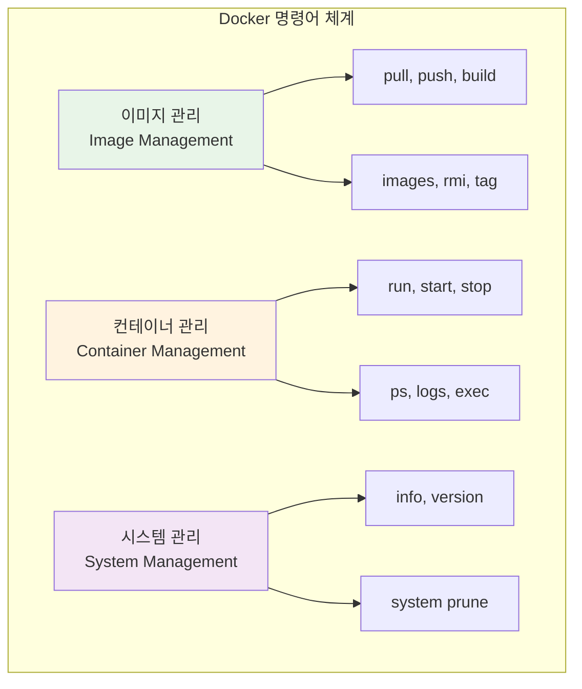
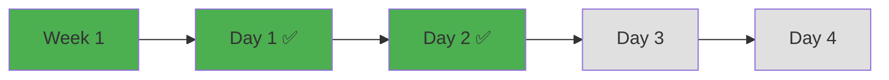

# Week 1 Day 2: 컨테이너 기술 & Docker 아키텍처

<div align="center">


**🐳 컨테이너 기술 핵심** • **🏗️ Docker 아키텍처**

*가상화에서 컨테이너로, Docker의 전체 구조 이해*

</div>

---

## 🕘 일일 스케줄

### 📊 시간 배분
```
📚 이론 강의: 4시간 (50%) - 50분×5세션
🛠️ 실습 챌린지: 2.5시간 (31.25%) - 통합 실습
👥 학생 케어: 1.5시간 (18.75%) - 효율적 지원
```

### 🗓️ 상세 스케줄
| 시간 | 구분 | 내용 | 목적 |
|------|------|------|------|
| **09:00-09:50** | 📚 이론 1 | 가상화 기술의 진화 (50분) | VM vs Container 이해 |
| **09:50-10:00** | ☕ 휴식 | 10분 휴식 | |
| **10:00-10:50** | 📚 이론 2 | Docker 아키텍처 (50분) | Docker 전체 구조 |
| **10:50-11:00** | ☕ 휴식 | 10분 휴식 | |
| **11:00-11:50** | 📚 이론 3 | Docker Engine & 런타임 (50분) | 내부 동작 원리 |
| **11:50-12:00** | ☕ 휴식 | 10분 휴식 | |
| **12:00-12:50** | 📚 이론 4 | Docker 명령어 & 실습 준비 (50분) | 기본 사용법 |
| **12:50-13:50** | 🍽️ 점심 | 점심시간 (60분) | |
| **13:50-14:00** | ☕ 휴식 | 10분 휴식 | |
| **14:00-14:50** | 📚 이론 5 | Docker 개발 워크플로우 & 디버깅 (50분) | 실습 중심 |
| **14:50-15:00** | ☕ 휴식 | 10분 휴식 | |
| **15:00-17:30** | 🛠️ 챌린지 | Docker 설치 & 기본 실습 (2.5시간) | 실무 적용 |
| **17:30-18:00** | 👥 케어 | 개별 멘토링 & 회고 (30분) | 맞춤 지원 |

---

## 📚 이론 강의 (4시간 - 50분×5세션)

### [Session 1: 가상화 기술의 진화](./session_1.md)
- VM vs Container 비교 분석
- 컨테이너 기술 등장 배경
- 성능 및 효율성 비교

### [Session 2: Docker 아키텍처](./session_2.md)
- Docker 클라이언트-서버 구조
- 이미지와 컨테이너 관계
- 네트워킹과 스토리지 기초

### [Session 3: Docker Engine & 런타임](./session_3.md)
- Docker Engine 내부 구조
- 컨테이너 생명주기 관리
- Linux 커널 격리 기술

### [Session 4: Docker 명령어 & 실습 준비](./session_4.md)
- 기본 Docker 명령어
- 컨테이너 조작 실습
- 실습 환경 준비

### [Session 5: Docker 개발 워크플로우 & 디버깅](./session_5.md)
- 실습 중심 개발 워크플로우
- 컨테이너 디버깅 기법
- 문제 해결 실전 연습

### Session 4: Docker 명령어 & 실습 준비 (50분)

#### 🎯 학습 목표
- **이해 목표**: Docker 핵심 명령어와 사용법 완전 습득
- **적용 목표**: 실습에서 사용할 명령어들을 자유자재로 활용
- **협업 목표**: 팀원들과 명령어 실습 및 문제 해결 경험

#### 📖 핵심 개념 (35분)

**🔍 개념 1: 기본 명령어 그룹 (12분)**
> **정의**: Docker 사용을 위한 필수 명령어들의 체계적 분류

**명령어 분류**:


**🔍 개념 2: 실무 필수 명령어 (12분)**
> **정의**: 실제 개발과 운영에서 가장 자주 사용하는 명령어들

**자주 사용하는 명령어**:
```bash
# 컨테이너 실행 (가장 중요)
docker run -d -p 8080:80 --name web nginx

# 컨테이너 상태 확인
docker ps -a

# 로그 확인
docker logs -f web

# 컨테이너 접속
docker exec -it web bash

# 정리 작업
docker system prune -a
```

**🔍 개념 3: 명령어 옵션과 플래그 (11분)**
> **정의**: 명령어의 동작을 세밀하게 제어하는 옵션들

**중요한 옵션들**:
- `-d`: 백그라운드 실행 (detached)
- `-it`: 인터랙티브 터미널
- `-p`: 포트 매핑
- `--name`: 컨테이너 이름 지정
- `-v`: 볼륨 마운트
- `--rm`: 종료 시 자동 삭제

#### 💭 함께 생각해보기 (15분)

**🤝 페어 실습** (10분):
**실습 주제**:
1. **명령어 연습**: 기본 명령어들을 실제로 실행해보기
2. **옵션 조합**: 다양한 옵션을 조합해서 컨테이너 실행
3. **문제 해결**: 명령어 실행 중 발생하는 오류 해결

**🎯 전체 공유** (5분):
- **명령어 숙련도**: 기본 명령어 사용 능력 확인
- **실습 준비**: 오후 실습에서 사용할 명령어 정리

### Session 5: Docker 보안 & 베스트 프랙티스 (50분)

*[Session 5 내용은 별도 파일 참조: session_5.md]*

---

## 🛠️ 실습 챌린지 (2.5시간)

### 🎯 챌린지 개요
**통합 실습 목표**:
- Docker 설치부터 보안 설정까지 완전 습득
- 컨테이너 생명주기 직접 체험
- 보안 베스트 프랙티스 적용 실습
- 팀 협업을 통한 문제 해결 경험

### 📋 챌린지 준비 (15분)
**환경 설정**:
- Docker Desktop 설치 확인
- 팀 구성 (3-4명씩 자유 구성)
- 실습 목표 및 규칙 공유

### 🚀 Phase 1: Docker 설치 & 첫 컨테이너 (60분)

#### 🔧 구현 단계
**Step 1: Docker 설치 확인**
```bash
# Docker 버전 확인
docker --version
docker info

# Hello World 컨테이너 실행
docker run hello-world
```

**Step 2: 기본 이미지 다운로드**
```bash
# 인기 있는 이미지들 다운로드
docker pull nginx
docker pull ubuntu
docker pull node:18-alpine

# 이미지 목록 확인
docker images
```

**Step 3: 첫 웹 서버 실행**
```bash
# Nginx 웹 서버 실행
docker run -d -p 8080:80 --name my-nginx nginx

# 컨테이너 상태 확인
docker ps
```

#### ✅ Phase 1 체크포인트
- [ ] Docker 정상 설치 및 실행 확인
- [ ] 기본 이미지 다운로드 완료
- [ ] 웹 서버 컨테이너 실행 성공
- [ ] 브라우저에서 localhost:8080 접속 확인

### 🌟 Phase 2: 컨테이너 생명주기 & 보안 실습 (60분)

#### 🔧 생명주기 체험
**컨테이너 상태 변경 실습**:
```bash
# 컨테이너 생성 (실행하지 않음)
docker create --name lifecycle-test ubuntu sleep 3600

# 컨테이너 시작
docker start lifecycle-test

# 컨테이너 일시정지
docker pause lifecycle-test

# 컨테이너 재개
docker unpause lifecycle-test

# 컨테이너 정지
docker stop lifecycle-test

# 컨테이너 삭제
docker rm lifecycle-test
```

#### 🔐 보안 설정 실습
**보안 강화 컨테이너 실행**:
```bash
# 비root 사용자로 실행
docker run --user 1000:1000 -it ubuntu bash

# 읽기 전용 파일시스템
docker run --read-only --tmpfs /tmp nginx

# 리소스 제한
docker run --memory="256m" --cpus="0.5" nginx

# 네트워크 보안 (localhost만)
docker run -p 127.0.0.1:8080:80 nginx
```

#### ✅ Phase 2 체크포인트
- [ ] 컨테이너 생명주기 모든 단계 체험
- [ ] 인터랙티브 모드로 컨테이너 접속 성공
- [ ] 컨테이너 변경사항을 이미지로 저장
- [ ] 각 상태에서의 컨테이너 동작 이해

### 🏆 Phase 3: 팀 협업 보안 실습 (30분)

#### 🤝 팀별 보안 미션
**미션**: 각 팀이 보안 설정을 적용한 웹 애플리케이션 컨테이너 실행

**팀별 할당**:
- **Team 1**: Apache 웹 서버 (httpd) + 보안 설정
- **Team 2**: Node.js 애플리케이션 + 비root 사용자
- **Team 3**: Python Flask 앱 + 리소스 제한
- **Team 4**: PHP 웹 애플리케이션 + 읽기 전용 FS

**공통 보안 요구사항**:
- localhost만 바인딩 (127.0.0.1)
- 비root 사용자로 실행
- 리소스 제한 적용
- 보안 체크리스트 작성

### 🎤 결과 발표 및 공유 (20분)
**팀별 발표** (5분×4팀):
- 적용한 보안 설정과 이유
- 보안 실습 중 어려웠던 점과 해결 방법
- 팀별 보안 체크리스트 공유
- Docker 보안에 대한 새로운 이해

---

## 👥 학생 케어 (30분)

### 🤝 통합 케어 (효율적 지원) - 30분
**전체 회고 및 정리**:
- Docker 전체 개념 정리 및 질의응답
- 보안 실습 결과 공유 및 피드백
- 내일 학습(이미지 빌드) 준비 상태 점검
- 개별 질문 및 어려운 부분 해결

---

## 📝 일일 마무리

### ✅ 오늘의 성과
- [ ] 가상화 기술 진화 과정 이해
- [ ] Docker 전체 아키텍처 파악
- [ ] Docker 명령어 완전 습득
- [ ] 컨테이너 보안 베스트 프랙티스 적용
- [ ] 보안 설정을 포함한 실습 완료
- [ ] 팀 협업을 통한 문제 해결 경험

### 🎯 내일 준비사항
- **예습**: Dockerfile 작성법 기초 개념
- **복습**: Docker 기본 명령어 정리
- **환경**: Docker 이미지 빌드 환경 확인

### 📊 학습 진도 체크


---

<div align="center">

**🐳 컨테이너 기술 이해** • **🏗️ Docker 아키텍처 완성** • **🤝 협업 실습 성공**

*가상화에서 컨테이너로의 패러다임 전환을 완전히 이해했습니다*

</div>