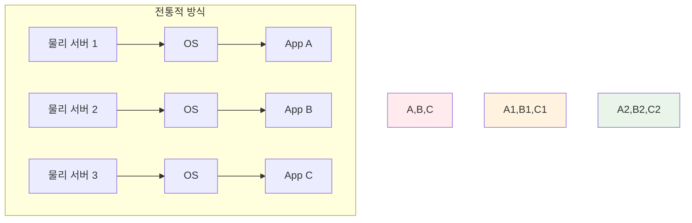
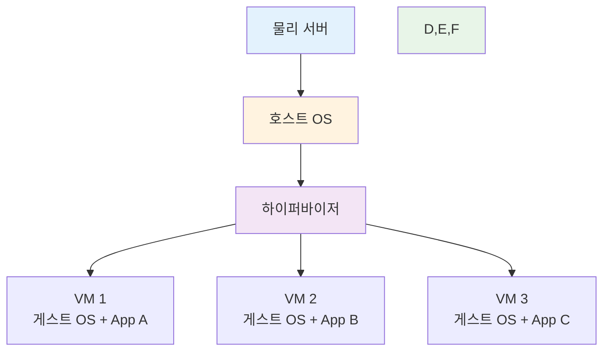
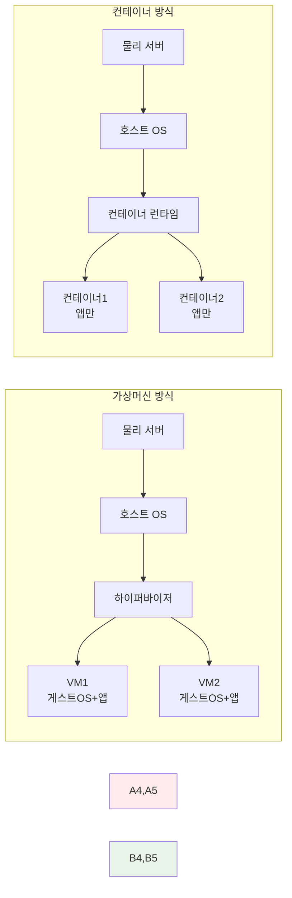
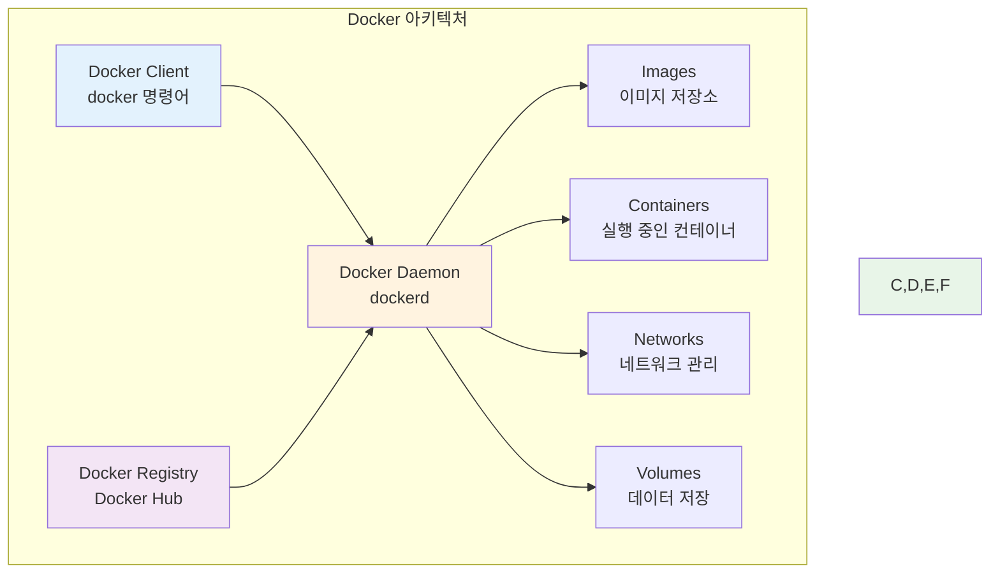
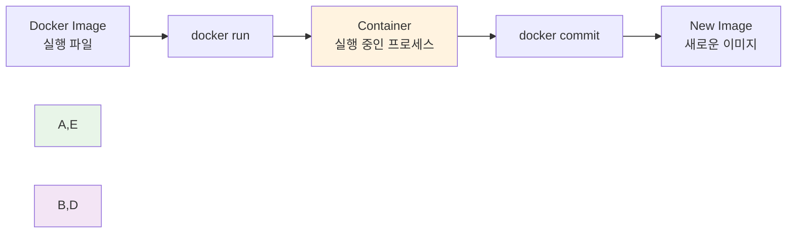
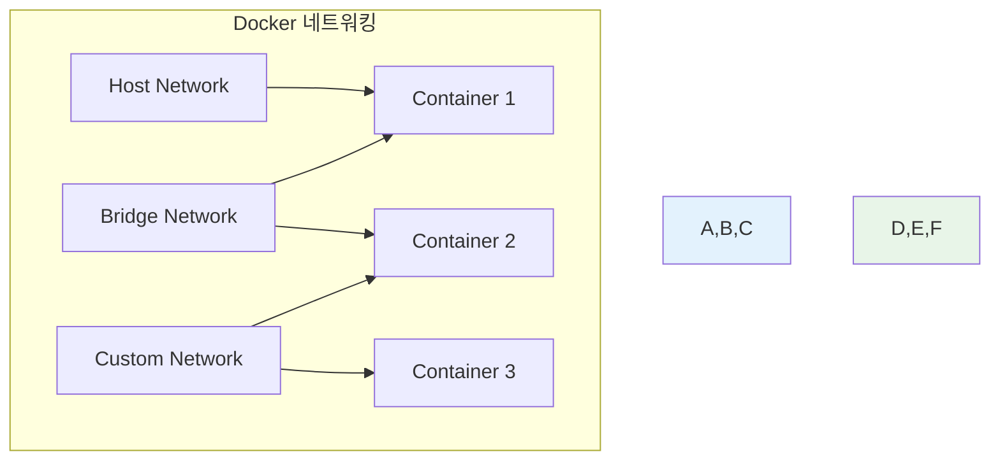
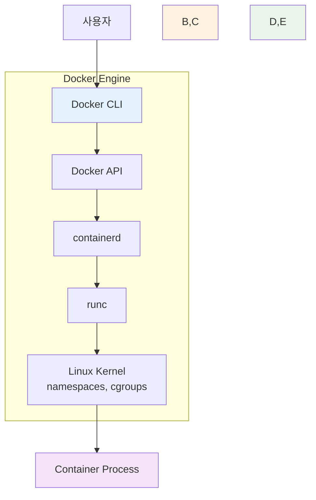
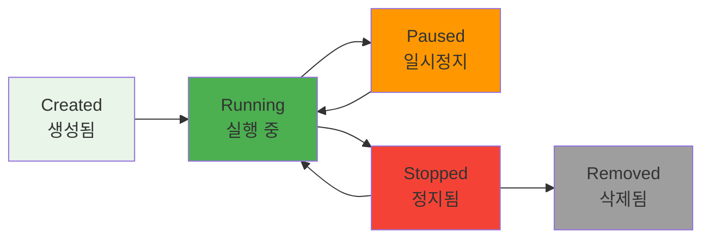
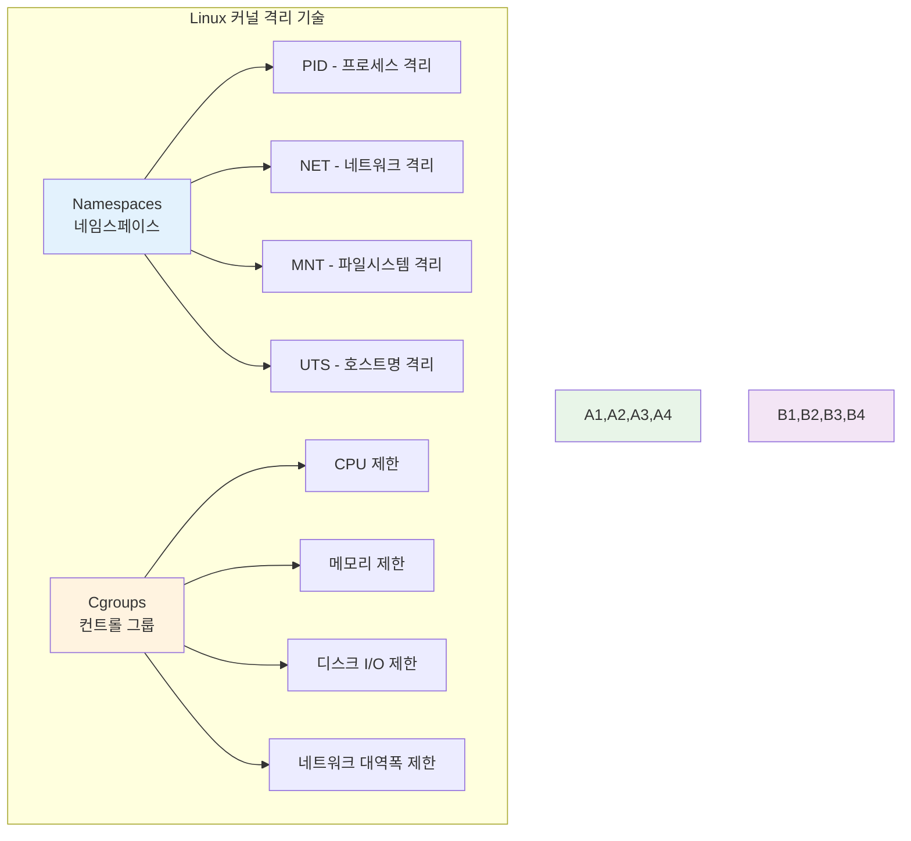
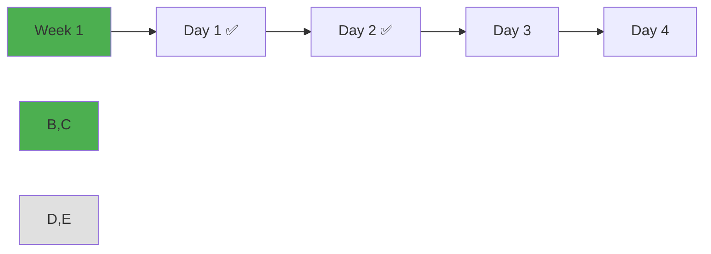

# Week 1 Day 2: 컨테이너 기술 & Docker 아키텍처

<div align="center">


**🐳 컨테이너 기술 핵심** • **🏗️ Docker 아키텍처**

*가상화에서 컨테이너로, Docker의 전체 구조 이해*

</div>

---

## 🕘 일일 스케줄

### 📊 시간 배분
```
📚 이론 강의: 2.5시간 (31.25%) - 50분×3세션
🛠️ 실습 챌린지: 3시간 (37.5%) - 통합 실습
👥 학생 케어: 2.5시간 (31.25%) - 개별 지원 강화
```

### 🗓️ 상세 스케줄
| 시간 | 구분 | 내용 | 목적 |
|------|------|------|------|
| **09:00-09:50** | 📚 이론 1 | 가상화 기술의 진화 (50분) | VM vs Container 이해 |
| **09:50-10:00** | ☕ 휴식 | 10분 휴식 | |
| **10:00-10:50** | 📚 이론 2 | Docker 아키텍처 (50분) | Docker 전체 구조 |
| **10:50-11:00** | ☕ 휴식 | 10분 휴식 | |
| **11:00-11:50** | 📚 이론 3 | Docker Engine & 런타임 (50분) | 내부 동작 원리 |
| **11:50-13:00** | 🍽️ 점심 | 점심시간 (70분) | |
| **13:00-16:00** | 🛠️ 챌린지 | Docker 설치 & 기본 실습 (3시간) | 실무 적용 |
| **16:00-16:15** | ☕ 휴식 | 15분 휴식 | |
| **16:15-18:00** | 👥 케어 | 개별 멘토링 & 회고 (105분) | 맞춤 지원 |

---

## 📚 이론 강의 (2.5시간 - 50분×3세션)

### Session 1: 가상화 기술의 진화 (50분)

#### 🎯 학습 목표
- **이해 목표**: 가상화 기술의 발전 과정과 컨테이너 등장 배경 이해
- **적용 목표**: VM과 컨테이너의 차이점을 실제 사례로 설명 가능
- **협업 목표**: 팀원들과 가상화 경험 공유 및 토론

#### 🤔 왜 필요한가? (5분)
**현실 문제 상황**:
- 💼 **서버 비용 문제**: 물리 서버 1대에 애플리케이션 1개만 설치하는 비효율
- 🏠 **일상 비유**: 아파트 한 동에 한 가족만 사는 것과 같은 자원 낭비
- 📊 **시장 동향**: 클라우드 시대에 필수적인 가상화 기술의 진화

#### 📖 핵심 개념 (35분)

**🔍 개념 1: 물리 서버의 한계 (12분)**
> **정의**: 하나의 물리 서버에서 하나의 애플리케이션만 실행하는 전통적 방식

**문제점들**:
- **자원 낭비**: CPU, 메모리 사용률 10-15%
- **확장성 부족**: 트래픽 증가 시 전체 서버 교체 필요
- **관리 복잡성**: 서버마다 다른 OS, 설정, 보안 패치

**시각적 이해**:


**🔍 개념 2: 가상머신(VM)의 등장 (12분)**
> **정의**: 하나의 물리 서버에서 여러 개의 가상 서버를 실행하는 기술

**VM의 장점**:
- **자원 효율성**: 물리 서버 활용률 70-80% 향상
- **격리성**: 각 VM은 독립적인 OS와 환경
- **유연성**: 필요에 따라 VM 생성/삭제 가능

**VM의 한계**:
- **무거운 구조**: 각 VM마다 완전한 OS 필요
- **느린 시작**: VM 부팅에 수 분 소요
- **리소스 오버헤드**: 하이퍼바이저와 게스트 OS의 추가 부담

**VM 아키텍처**:


**🔍 개념 3: 컨테이너의 혁신 (11분)**
> **정의**: OS 커널을 공유하면서 애플리케이션을 격리하여 실행하는 경량 가상화 기술

**컨테이너의 혁신적 특징**:
- **경량성**: VM 대비 10배 이상 가벼움
- **빠른 시작**: 초 단위로 시작/종료
- **높은 밀도**: 동일 서버에서 더 많은 애플리케이션 실행
- **일관성**: 개발/테스트/운영 환경 동일성 보장

**컨테이너 vs VM 비교**:


**성능 비교표**:
| 구분 | 가상머신 | 컨테이너 |
|------|----------|----------|
| **시작 시간** | 수 분 | 수 초 |
| **메모리 사용** | GB 단위 | MB 단위 |
| **디스크 사용** | GB 단위 | MB 단위 |
| **성능 오버헤드** | 5-10% | 1-2% |
| **격리 수준** | 완전 격리 | 프로세스 격리 |

#### 💭 함께 생각해보기 (10분)

**🤝 페어 토론** (5분):
**토론 주제**:
1. **경험 공유**: "VM이나 컨테이너를 사용해본 경험이 있나요?"
2. **문제 해결**: "개발 환경과 운영 환경이 달라서 겪은 문제가 있나요?"
3. **적용 상황**: "어떤 상황에서 VM보다 컨테이너가 유리할까요?"

**🎯 전체 공유** (5분):
- **인사이트 공유**: 페어 토론에서 나온 실무 경험과 아이디어
- **질문 수집**: 가상화 기술에 대한 궁금한 점들
- **다음 연결**: Docker 아키텍처 학습 동기 부여

### Session 2: Docker 아키텍처 (50분)

#### 🎯 학습 목표
- **이해 목표**: Docker의 전체 아키텍처와 구성 요소 이해
- **적용 목표**: Docker 명령어와 내부 동작 원리 연결
- **협업 목표**: 팀원들과 Docker 구조 설명 및 토론

#### 📖 핵심 개념 (35분)

**🔍 개념 1: Docker 전체 아키텍처 (12분)**
> **정의**: 클라이언트-서버 구조로 동작하는 컨테이너 플랫폼

**Docker 아키텍처 구성**:


**주요 구성 요소**:
- **Docker Client**: 사용자가 명령어를 입력하는 인터페이스
- **Docker Daemon**: 실제 컨테이너를 관리하는 백그라운드 서비스
- **Docker Images**: 컨테이너 실행을 위한 템플릿
- **Docker Containers**: 실행 중인 애플리케이션 인스턴스
- **Docker Registry**: 이미지를 저장하고 공유하는 저장소

**🔍 개념 2: Docker 이미지와 컨테이너 (12분)**
> **정의**: 이미지는 실행 파일, 컨테이너는 실행 중인 프로세스

**이미지 vs 컨테이너 관계**:


**실생활 비유**:
- **이미지**: 요리 레시피 (한 번 작성하면 여러 번 사용)
- **컨테이너**: 실제 요리 (레시피로 만든 음식)
- **Registry**: 레시피 책 (여러 레시피를 모아둔 곳)

**🔍 개념 3: Docker 네트워킹과 스토리지 (11분)**
> **정의**: 컨테이너 간 통신과 데이터 영속성을 위한 시스템

**네트워킹 구조**:


**스토리지 옵션**:
- **Volumes**: Docker가 관리하는 영속적 데이터 저장
- **Bind Mounts**: 호스트 파일시스템과 직접 연결
- **tmpfs**: 메모리에 임시 저장

#### 💭 함께 생각해보기 (15분)

**🤝 페어 토론** (10분):
**토론 주제**:
1. **구조 이해**: "Docker의 클라이언트-서버 구조가 왜 필요할까요?"
2. **실무 적용**: "이미지와 컨테이너의 차이를 어떻게 활용할 수 있을까요?"
3. **문제 해결**: "컨테이너가 종료되면 데이터가 사라지는 문제를 어떻게 해결할까요?"

**🎯 전체 공유** (5분):
- **아키텍처 이해도**: Docker 구조에 대한 이해 확인
- **실습 준비**: 오후 실습에서 사용할 개념들 정리

### Session 3: Docker Engine & 런타임 (50분)

#### 🎯 학습 목표
- **이해 목표**: Docker Engine의 내부 동작 원리와 런타임 이해
- **적용 목표**: 컨테이너 생명주기와 상태 관리 실습 준비
- **협업 목표**: 팀원들과 Docker 내부 동작 원리 토론

#### 📖 핵심 개념 (35분)

**🔍 개념 1: Docker Engine 구조 (12분)**
> **정의**: 컨테이너를 실행하고 관리하는 핵심 엔진

**Docker Engine 내부 구조**:


**각 구성 요소 역할**:
- **Docker CLI**: 사용자 명령어 인터페이스
- **Docker API**: REST API를 통한 통신
- **containerd**: 컨테이너 생명주기 관리
- **runc**: 실제 컨테이너 실행
- **Linux Kernel**: 격리 기술 제공

**🔍 개념 2: 컨테이너 생명주기 (12분)**
> **정의**: 컨테이너가 생성부터 삭제까지 거치는 단계들

**생명주기 단계**:


**상태별 특징**:
- **Created**: 이미지에서 컨테이너 생성, 아직 실행 안됨
- **Running**: 프로세스가 실행 중인 상태
- **Paused**: 프로세스가 일시정지된 상태
- **Stopped**: 프로세스가 종료된 상태
- **Removed**: 컨테이너가 완전히 삭제된 상태

**🔍 개념 3: 리소스 관리와 격리 (11분)**
> **정의**: Linux 커널 기능을 활용한 컨테이너 격리 기술

**격리 기술들**:


**실무 활용**:
- **개발 환경**: 각 개발자마다 독립적인 환경
- **마이크로서비스**: 서비스별 리소스 격리
- **멀티 테넌트**: 고객별 격리된 환경 제공

#### 💭 함께 생각해보기 (15분)

**🤝 페어 토론** (10분):
**토론 주제**:
1. **내부 동작**: "Docker 명령어를 실행했을 때 내부에서 어떤 일이 일어날까요?"
2. **리소스 관리**: "컨테이너의 CPU나 메모리를 제한해야 하는 상황은?"
3. **실무 적용**: "컨테이너 생명주기 관리에서 주의할 점은?"

**🎯 전체 공유** (5분):
- **이해도 확인**: Docker Engine 동작 원리 이해 점검
- **실습 연결**: 오후 실습에서 확인할 내용들 정리

---

## 🛠️ 실습 챌린지 (3시간)

### 🎯 챌린지 개요
**통합 실습 목표**:
- Docker 설치부터 기본 사용법까지 완전 습득
- 컨테이너 생명주기 직접 체험
- 팀 협업을 통한 문제 해결 경험

### 📋 챌린지 준비 (15분)
**환경 설정**:
- Docker Desktop 설치 확인
- 팀 구성 (3-4명씩 자유 구성)
- 실습 목표 및 규칙 공유

### 🚀 Phase 1: Docker 설치 & 첫 컨테이너 (90분)

#### 🔧 구현 단계
**Step 1: Docker 설치 확인**
```bash
# Docker 버전 확인
docker --version
docker info

# Hello World 컨테이너 실행
docker run hello-world
```

**Step 2: 기본 이미지 다운로드**
```bash
# 인기 있는 이미지들 다운로드
docker pull nginx
docker pull ubuntu
docker pull node:18-alpine

# 이미지 목록 확인
docker images
```

**Step 3: 첫 웹 서버 실행**
```bash
# Nginx 웹 서버 실행
docker run -d -p 8080:80 --name my-nginx nginx

# 컨테이너 상태 확인
docker ps
```

#### ✅ Phase 1 체크포인트
- [ ] Docker 정상 설치 및 실행 확인
- [ ] 기본 이미지 다운로드 완료
- [ ] 웹 서버 컨테이너 실행 성공
- [ ] 브라우저에서 localhost:8080 접속 확인

### 🌟 Phase 2: 컨테이너 생명주기 실습 (90분)

#### 🔧 생명주기 체험
**컨테이너 상태 변경 실습**:
```bash
# 컨테이너 생성 (실행하지 않음)
docker create --name lifecycle-test ubuntu sleep 3600

# 컨테이너 시작
docker start lifecycle-test

# 컨테이너 일시정지
docker pause lifecycle-test

# 컨테이너 재개
docker unpause lifecycle-test

# 컨테이너 정지
docker stop lifecycle-test

# 컨테이너 삭제
docker rm lifecycle-test
```

**인터랙티브 컨테이너 실습**:
```bash
# Ubuntu 컨테이너에 접속
docker run -it ubuntu bash

# 컨테이너 내부에서 작업
apt update
apt install -y curl
curl --version
exit

# 변경사항을 새 이미지로 저장
docker commit <container-id> my-ubuntu:v1
```

#### ✅ Phase 2 체크포인트
- [ ] 컨테이너 생명주기 모든 단계 체험
- [ ] 인터랙티브 모드로 컨테이너 접속 성공
- [ ] 컨테이너 변경사항을 이미지로 저장
- [ ] 각 상태에서의 컨테이너 동작 이해

### 🏆 Phase 3: 팀 협업 실습 (15분)

#### 🤝 팀별 미션
**미션**: 각 팀이 다른 웹 애플리케이션 컨테이너 실행

**팀별 할당**:
- **Team 1**: Apache 웹 서버 (httpd)
- **Team 2**: Node.js 애플리케이션
- **Team 3**: Python Flask 앱
- **Team 4**: PHP 웹 애플리케이션

**공통 요구사항**:
- 포트 8081, 8082, 8083, 8084 사용
- 간단한 HTML 페이지 표시
- 팀명과 멤버 이름 포함

### 🎤 결과 발표 및 공유 (30분)
**팀별 발표** (5분×4팀):
- 사용한 이미지와 설정 방법
- 실습 중 어려웠던 점과 해결 방법
- 팀 협업에서 배운 점
- Docker에 대한 새로운 이해

---

## 👥 학생 케어 (105분)

### 🟢 초급자 케어 (집중 지원) - 45분
**개별 멘토링**:
- Docker 기본 개념 완전 이해 확인
- 명령어 사용법 반복 연습
- 실습에서 어려웠던 부분 해결
- 내일 학습을 위한 준비 상태 점검

### 🟡 중급자 케어 (리더십 개발) - 45분
**그룹 멘토링**:
- Docker 아키텍처 심화 토론
- 실무에서의 Docker 활용 방안
- 초급자 도움 제공 경험 공유
- 내일 이미지 빌드 실습 준비

### 🔴 고급자 케어 (전문성 강화) - 15분
**심화 토론**:
- Docker 내부 구조 깊이 있는 분석
- 컨테이너 보안 고려사항
- 성능 최적화 방안
- 오픈소스 기여 가능성 탐색

---

## 📝 일일 마무리

### ✅ 오늘의 성과
- [ ] 가상화 기술 진화 과정 이해
- [ ] Docker 전체 아키텍처 파악
- [ ] 컨테이너 생명주기 실습 완료
- [ ] 팀 협업을 통한 문제 해결 경험

### 🎯 내일 준비사항
- **예습**: Dockerfile 작성법 기초 개념
- **복습**: Docker 기본 명령어 정리
- **환경**: Docker 이미지 빌드 환경 확인

### 📊 학습 진도 체크


---

<div align="center">

**🐳 컨테이너 기술 이해** • **🏗️ Docker 아키텍처 완성** • **🤝 협업 실습 성공**

*가상화에서 컨테이너로의 패러다임 전환을 완전히 이해했습니다*

</div>