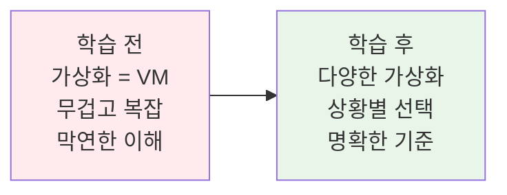
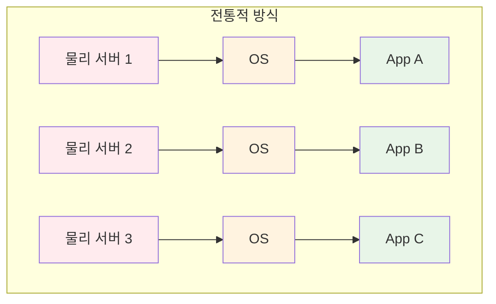
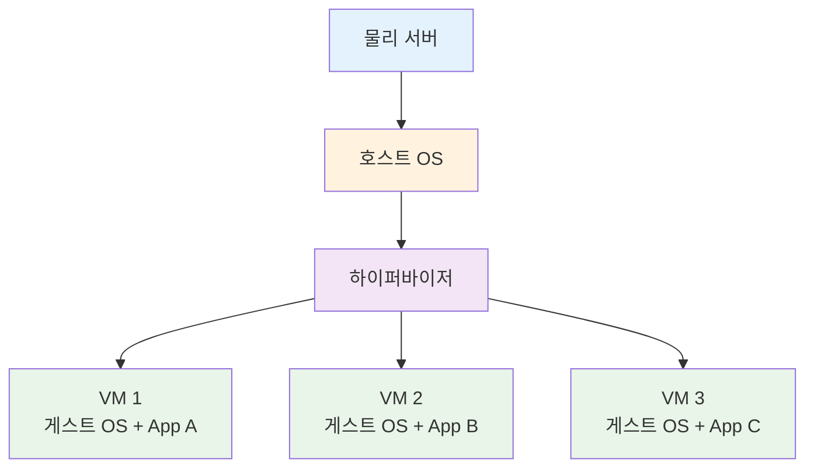
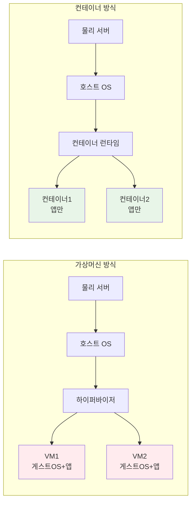

# Week 1 Day 2 Session 1: 가상화 기술의 진화

**🖥️ VM에서 컨테이너로** • **가상화 패러다임의 변화**

*전통적 가상화의 한계를 넘어 컨테이너 혁명의 시작*

---

## 🕘 세션 정보

**시간**: 09:00-09:50 (50분)  
**목표**: VM과 컨테이너의 차이점 완전 이해  
**방식**: 이론 설명 + 페어 비교 분석 + 실제 성능 체험

---

## 🎯 세션 목표

### 📚 학습 목표
- **이해 목표**: 가상화 기술의 발전 과정과 컨테이너 등장 배경 이해
- **적용 목표**: VM과 컨테이너의 차이점을 실제 사례로 설명 가능
- **협업 목표**: 페어 토론을 통한 가상화 경험 공유 및 비교 분석

### 🤔 왜 필요한가? (5분)

**현실 문제 상황**:
- 💼 **서버 비용 문제**: 물리 서버 1대에 애플리케이션 1개만 설치하는 비효율
- 🏠 **일상 비유**: 아파트 한 동에 한 가족만 사는 것과 같은 자원 낭비
- 📊 **시장 동향**: 클라우드 시대에 필수적인 가상화 기술의 진화

**학습 전후 비교**:

---

## 📖 핵심 개념 (35분)

### 🔍 개념 1: 물리 서버의 한계 (12분)

> **정의**: 하나의 물리 서버에서 하나의 애플리케이션만 실행하는 전통적 방식

**문제점들**:
- **자원 낭비**: CPU, 메모리 사용률 10-15%
- **확장성 부족**: 트래픽 증가 시 전체 서버 교체 필요
- **관리 복잡성**: 서버마다 다른 OS, 설정, 보안 패치

**시각적 이해**:

**🖼️ 서버 활용률 비교**

*출처: VMware*

### 🔍 개념 2: 가상머신(VM)의 등장 (12분)

> **정의**: 하나의 물리 서버에서 여러 개의 가상 서버를 실행하는 기술

**VM의 장점**:
- **자원 효율성**: 물리 서버 활용률 70-80% 향상
- **격리성**: 각 VM은 독립적인 OS와 환경
- **유연성**: 필요에 따라 VM 생성/삭제 가능

**VM의 한계**:
- **무거운 구조**: 각 VM마다 완전한 OS 필요
- **느린 시작**: VM 부팅에 수 분 소요
- **리소스 오버헤드**: 하이퍼바이저와 게스트 OS의 추가 부담

**VM 아키텍처**:

**🖼️ 가상화 기술 진화**

*출처: Red Hat*

### 🔍 개념 3: 컨테이너의 혁신 (11분)

> **정의**: OS 커널을 공유하면서 애플리케이션을 격리하여 실행하는 경량 가상화 기술

**컨테이너의 혁신적 특징**:
- **경량성**: VM 대비 10배 이상 가벼움
- **빠른 시작**: 초 단위로 시작/종료
- **높은 밀도**: 동일 서버에서 더 많은 애플리케이션 실행
- **일관성**: 개발/테스트/운영 환경 동일성 보장

**컨테이너 vs VM 비교**:

**🖼️ VM vs 컨테이너 아키텍처 비교**

*출처: Docker 공식 문서*

**🖼️ 컨테이너 성능 비교**

*컨테이너의 높은 자원 효율성*

**성능 비교표**:
| 구분 | 가상머신 | 컨테이너 |
|------|----------|----------|
| **시작 시간** | 수 분 | 수 초 |
| **메모리 사용** | GB 단위 | MB 단위 |
| **디스크 사용** | GB 단위 | MB 단위 |
| **성능 오버헤드** | 5-10% | 1-2% |
| **격리 수준** | 완전 격리 | 프로세스 격리 |

---

## 💭 함께 생각해보기 (10분)

### 🤝 페어 토론 (5분)
**토론 주제**:
1. **경험 공유**: "VM이나 컨테이너를 사용해본 경험이 있나요?"
2. **문제 해결**: "개발 환경과 운영 환경이 달라서 겪은 문제가 있나요?"
3. **적용 상황**: "어떤 상황에서 VM보다 컨테이너가 유리할까요?"

### 🎯 전체 공유 (5분)
- **인사이트 공유**: 페어 토론에서 나온 실무 경험과 아이디어
- **질문 수집**: 가상화 기술에 대한 궁금한 점들
- **다음 연결**: Docker 아키텍처 학습 동기 부여

### 💡 이해도 체크 질문
- ✅ "VM과 컨테이너의 가장 큰 차이점을 한 문장으로 설명할 수 있나요?"
- ✅ "어떤 상황에서 VM을, 어떤 상황에서 컨테이너를 선택하시겠어요?"
- ✅ "컨테이너가 VM보다 빠른 이유를 설명할 수 있나요?"

---

## 🔑 핵심 키워드

### 가상화 기술 기본
- **Virtual Machine (VM)**: 하드웨어 가상화를 통한 완전한 OS 실행 환경
- **Hypervisor**: VM을 생성하고 관리하는 가상화 소프트웨어
- **Container**: OS 수준 가상화를 통한 애플리케이션 격리 환경
- **Container Runtime**: 컨테이너를 실행하고 관리하는 소프트웨어

### 핵심 차이점
- **Hardware Virtualization**: 하드웨어 수준에서의 가상화 (VM)
- **OS-level Virtualization**: 운영체제 수준에서의 가상화 (Container)
- **Resource Overhead**: 가상화로 인한 추가 리소스 사용량
- **Isolation Level**: 격리 수준의 강도와 범위

---

## 📝 세션 마무리

### ✅ 오늘 세션 성과
- [ ] VM과 컨테이너의 근본적 차이점 완전 이해
- [ ] 상황별 가상화 기술 선택 기준 습득
- [ ] 성능과 리소스 관점에서의 비교 분석 완료
- [ ] 페어 토론을 통한 다각적 관점 분석 경험

### 🎯 다음 세션 준비
- **주제**: Docker 아키텍처와 구성 요소
- **연결고리**: 컨테이너 기술 이해 → Docker 플랫폼 구조
- **준비사항**: 컨테이너가 어떻게 관리되고 실행되는지 궁금증 가지기

---

**🖥️ 가상화 기술의 진화를 완전히 이해했습니다**

*VM에서 컨테이너로, 패러다임 변화의 핵심 파악*

**다음**: [Session 2 - Docker 아키텍처](./session_2.md)

