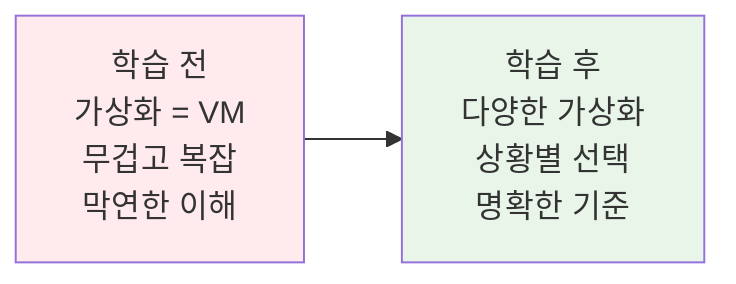
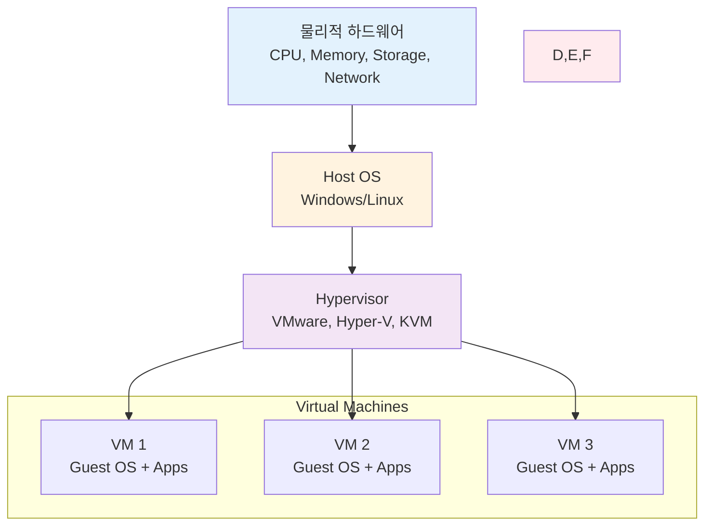
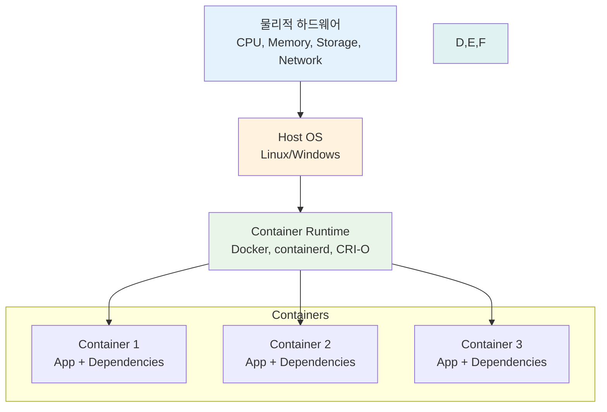
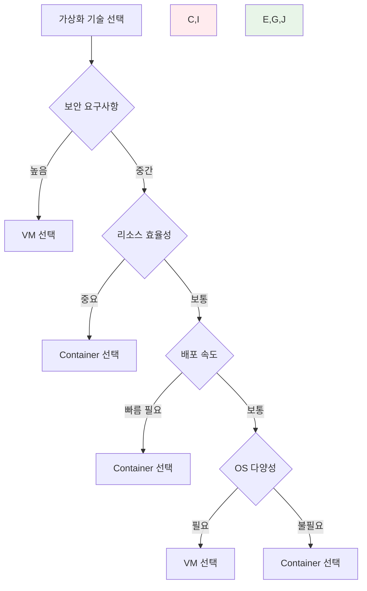
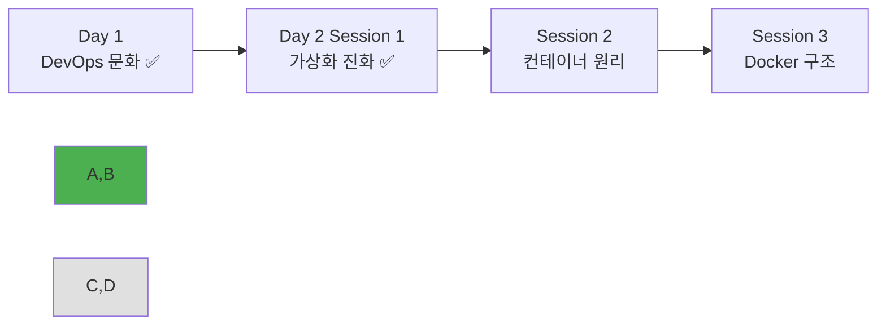

# Week 1 Day 2 Session 1: 가상화 기술의 진화

<div align="center">

**🖥️ VM에서 컨테이너로** • **가상화 패러다임의 변화**

*전통적 가상화의 한계를 넘어 컨테이너 혁명의 시작*

</div>

---

## 🕘 세션 정보

**시간**: 09:00-09:50 (50분)  
**목표**: VM과 컨테이너의 차이점 완전 이해  
**방식**: 이론 설명 + 페어 비교 분석 + 실제 성능 체험

---

## 🎯 세션 목표

### 📚 학습 목표
- **이해 목표**: 전통적 가상화와 컨테이너 기술의 근본적 차이점 파악
- **적용 목표**: 상황별 가상화 기술 선택 기준과 판단 능력 습득
- **협업 목표**: 페어 토론을 통한 기술 비교 분석과 인사이트 공유

### 🤔 왜 필요한가? (5분)
**가상화 기술 이해의 중요성**:
- 💼 **실무 현실**: 모든 현대 IT 인프라는 가상화 기술 기반
- 🏠 **일상 비유**: 아파트(VM)와 원룸텔(컨테이너)의 차이처럼 자원 활용 방식이 다름
- 📊 **기술 트렌드**: 클라우드 네이티브 시대의 핵심 기반 기술

**학습 전후 비교**:


---

## 📖 핵심 개념 (35분)

### 🔍 개념 1: 전통적 가상화 (VM) (12분)

> **정의**: 하드웨어를 가상화하여 하나의 물리적 서버에서 여러 개의 완전한 운영체제를 실행하는 기술

#### 상세 설명
- **핵심 원리**: 하이퍼바이저가 하드웨어를 추상화하여 각 VM에 독립적인 하드웨어 환경 제공
- **주요 특징**: 
  - 완전한 OS 격리
  - 강력한 보안 경계
  - 하드웨어 수준 가상화
  - 높은 리소스 오버헤드
- **사용 목적**: 서버 통합, 레거시 애플리케이션 격리, 강력한 보안이 필요한 환경

#### VM 아키텍처


#### 실무 연결
- **사용 사례**: 
  - 데이터센터 서버 통합
  - 개발/테스트 환경 분리
  - 레거시 시스템 마이그레이션
- **장점**: 완전한 격리, 다양한 OS 지원, 성숙한 기술
- **단점**: 높은 리소스 사용량, 느린 시작 시간, 관리 복잡성

### 🔍 개념 2: 컨테이너 가상화 (12분)

> **정의**: 운영체제 수준에서 프로세스를 격리하여 애플리케이션과 의존성을 패키징하는 경량 가상화 기술

#### 상세 설명
- **핵심 원리**: 호스트 OS 커널을 공유하면서 프로세스 수준에서 격리
- **주요 특징**:
  - OS 커널 공유
  - 빠른 시작 시간
  - 낮은 리소스 오버헤드
  - 애플리케이션 중심 패키징
- **사용 목적**: 마이크로서비스, CI/CD, 클라우드 네이티브 애플리케이션

#### 컨테이너 아키텍처


#### 실무 연결
- **사용 사례**:
  - 마이크로서비스 아키텍처
  - CI/CD 파이프라인
  - 클라우드 네이티브 애플리케이션
- **장점**: 빠른 시작, 낮은 오버헤드, 이식성, 확장성
- **단점**: OS 제약, 보안 경계 약함, 상대적으로 새로운 기술

### 🔍 개념 3: VM vs 컨테이너 비교 분석 (11분)

> **정의**: 두 가상화 기술의 특성을 다각도로 비교하여 상황별 최적 선택 기준 제시

#### 종합 비교표
| 구분 | Virtual Machine | Container | 선택 기준 |
|------|-----------------|-----------|----------|
| **가상화 수준** | 하드웨어 수준 | OS 수준 | 격리 강도 요구사항 |
| **리소스 사용** | 높음 (GB 단위) | 낮음 (MB 단위) | 리소스 효율성 |
| **시작 시간** | 느림 (분 단위) | 빠름 (초 단위) | 배포 속도 요구사항 |
| **격리 수준** | 강함 (완전 격리) | 중간 (프로세스 격리) | 보안 요구사항 |
| **OS 지원** | 다양한 OS | 호스트 OS 제약 | 플랫폼 다양성 |
| **관리 복잡성** | 높음 | 낮음 | 운영 복잡도 |

#### 상황별 선택 가이드


#### 실제 성능 비교 (예시)
```
리소스 사용량 비교:
- VM: 2GB RAM + 20GB Disk (OS 포함)
- Container: 100MB RAM + 500MB Disk (앱만)

시작 시간 비교:
- VM: 30-60초 (OS 부팅 시간)
- Container: 1-3초 (프로세스 시작 시간)

밀도 비교 (8GB RAM 서버):
- VM: 3-4개 VM 실행 가능
- Container: 50-100개 컨테이너 실행 가능
```

---

## 💭 함께 생각해보기 (10분)

### 🤝 페어 비교 분석 (7분)
**분석 주제**:
1. **실무 시나리오**: "웹 애플리케이션 배포 시 VM vs 컨테이너 선택 기준은?"
2. **성능 관점**: "같은 하드웨어에서 더 많은 서비스를 실행하려면?"
3. **보안 관점**: "금융 시스템과 일반 웹서비스의 가상화 전략 차이는?"

**페어 활동 가이드**:
- 👥 **역할 분담**: 한 명은 VM 옹호자, 다른 한 명은 컨테이너 옹호자
- 🔄 **관점 교환**: 3분 후 역할 바꿔서 반대 입장에서 분석
- 📝 **결론 도출**: 상황별 최적 선택 기준 정리

### 🎯 전체 공유 (3분)
- **인사이트 공유**: 페어 분석에서 나온 흥미로운 관점들
- **실무 경험**: 가상화 기술 사용 경험이 있다면 공유
- **질문 해결**: 아직 명확하지 않은 부분들 해결

### 💡 이해도 체크 질문
- ✅ "VM과 컨테이너의 가장 큰 차이점을 한 문장으로 설명할 수 있나요?"
- ✅ "어떤 상황에서 VM을, 어떤 상황에서 컨테이너를 선택하시겠어요?"
- ✅ "컨테이너가 VM보다 빠른 이유를 설명할 수 있나요?"

---

## 🔑 핵심 키워드

### 가상화 기술 기본
- **Virtual Machine (VM)**: 하드웨어 가상화를 통한 완전한 OS 실행 환경
- **Hypervisor**: VM을 생성하고 관리하는 가상화 소프트웨어
- **Container**: OS 수준 가상화를 통한 애플리케이션 격리 환경
- **Container Runtime**: 컨테이너를 실행하고 관리하는 소프트웨어

### 핵심 차이점
- **Hardware Virtualization**: 하드웨어 수준에서의 가상화 (VM)
- **OS-level Virtualization**: 운영체제 수준에서의 가상화 (Container)
- **Resource Overhead**: 가상화로 인한 추가 리소스 사용량
- **Isolation Level**: 격리 수준의 강도와 범위

### 성능 지표
- **Boot Time**: 시작 시간 (VM: 분 단위, Container: 초 단위)
- **Resource Density**: 동일 하드웨어에서 실행 가능한 인스턴스 수
- **Memory Footprint**: 메모리 사용량 (VM: GB, Container: MB)
- **Storage Overhead**: 저장공간 오버헤드

---

## 📝 세션 마무리

### ✅ 오늘 세션 성과
- [ ] VM과 컨테이너의 근본적 차이점 완전 이해
- [ ] 상황별 가상화 기술 선택 기준 습득
- [ ] 성능과 리소스 관점에서의 비교 분석 완료
- [ ] 페어 토론을 통한 다각적 관점 분석 경험

### 🎯 다음 세션 준비
- **주제**: 컨테이너 기술의 핵심 원리 (네임스페이스, cgroups)
- **연결고리**: VM vs 컨테이너 이해 → 컨테이너 내부 동작 원리
- **준비사항**: 오늘 배운 컨테이너의 장점들이 어떻게 구현되는지 궁금증 가지기

### 📊 학습 진도 체크


---

<div align="center">

**🖥️ 가상화 기술의 진화를 완전히 이해했습니다**

*VM에서 컨테이너로, 패러다임 변화의 핵심 파악*

**다음**: [Session 2 - 컨테이너 기술의 핵심 원리](./session_2.md)

</div>