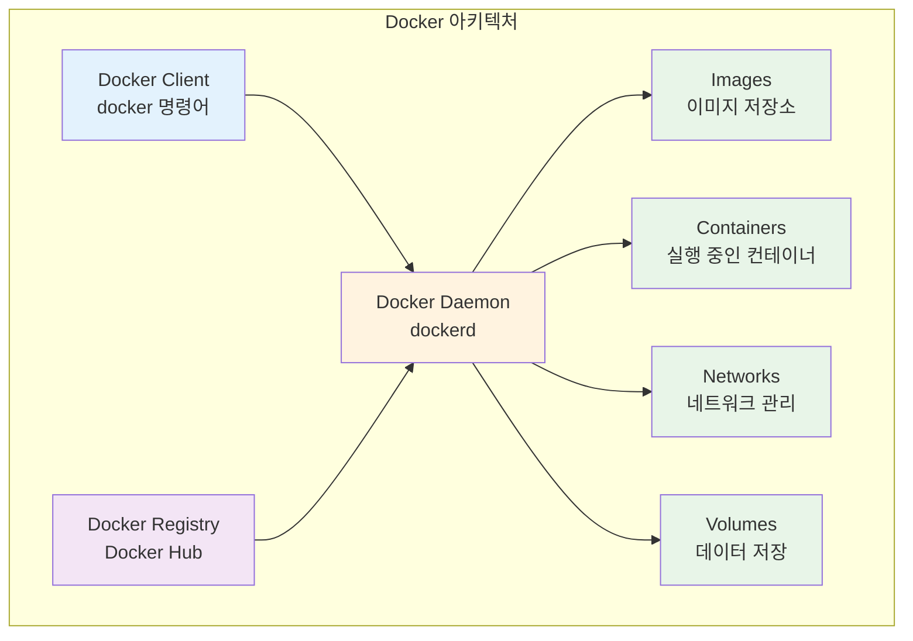
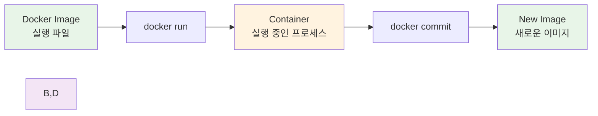
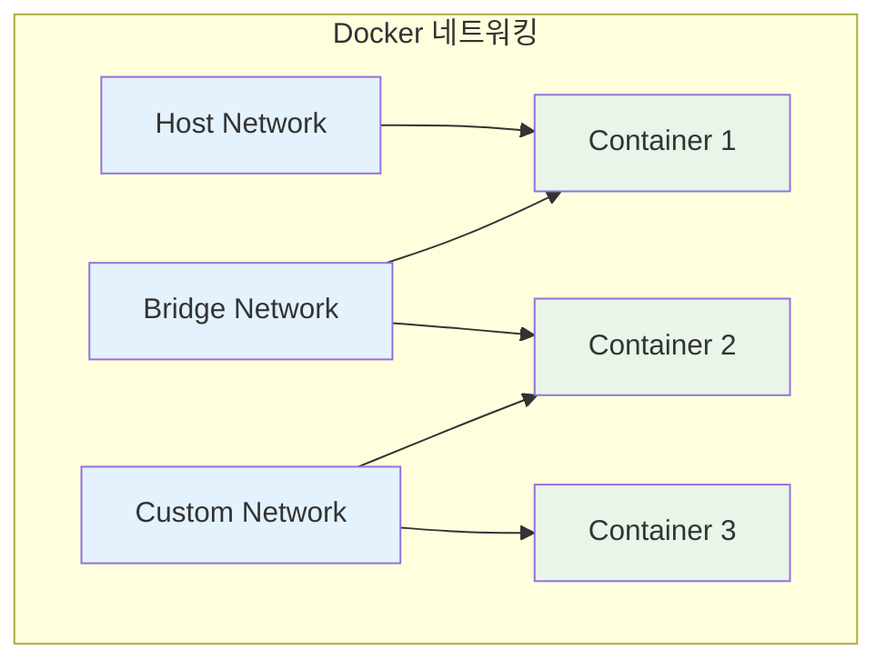

# Week 1 Day 2 Session 2: Docker 아키텍처

**🏗️ Docker 플랫폼 구조** • **클라이언트-서버 아키텍처**

*Docker의 전체 구조와 구성 요소 완전 이해*

---

## 🕘 세션 정보

**시간**: 10:00-10:50 (50분)  
**목표**: Docker 아키텍처와 구성 요소 완전 이해  
**방식**: 구조 분석 + 실습 연계 + 팀 토론

---

## 🎯 세션 목표

### 📚 학습 목표
- **이해 목표**: Docker의 전체 아키텍처와 구성 요소 이해
- **적용 목표**: Docker 명령어와 내부 동작 원리 연결
- **협업 목표**: 페어 토론을 통한 Docker 구조 이해 및 공유

### 🤔 왜 필요한가? (5분)

**Docker 아키텍처 이해의 중요성**:
- 💼 **실무 필요성**: Docker 문제 해결과 최적화를 위한 구조 이해
- 🏠 **일상 비유**: 자동차 운전을 위해 엔진 구조를 아는 것처럼
- 📊 **기술 발전**: 컨테이너 생태계의 핵심 플랫폼 이해

---

## 📖 핵심 개념 (35분)

### 🔍 개념 1: Docker 전체 아키텍처 (12분)

> **정의**: 클라이언트-서버 구조로 동작하는 컨테이너 플랫폼

**Docker 아키텍처 구성**:

**주요 구성 요소**:
- **Docker Client**: 사용자가 명령어를 입력하는 인터페이스
- **Docker Daemon**: 실제 컨테이너를 관리하는 백그라운드 서비스
- **Docker Images**: 컨테이너 실행을 위한 템플릿
- **Docker Containers**: 실행 중인 애플리케이션 인스턴스
- **Docker Registry**: 이미지를 저장하고 공유하는 저장소

### 🔍 개념 2: Docker 이미지와 컨테이너 (12분)

> **정의**: 이미지는 실행 파일, 컨테이너는 실행 중인 프로세스

**이미지 vs 컨테이너 관계**:

**실생활 비유**:
- **이미지**: 요리 레시피 (한 번 작성하면 여러 번 사용)
- **컨테이너**: 실제 요리 (레시피로 만든 음식)
- **Registry**: 레시피 책 (여러 레시피를 모아둔 곳)

### 🔍 개념 3: Docker 네트워킹과 스토리지 (11분)

> **정의**: 컨테이너 간 통신과 데이터 영속성을 위한 시스템

**네트워킹 구조**:

**스토리지 옵션**:
- **Volumes**: Docker가 관리하는 영속적 데이터 저장
- **Bind Mounts**: 호스트 파일시스템과 직접 연결
- **tmpfs**: 메모리에 임시 저장

---

## 💭 함께 생각해보기 (10분)

### 🤝 페어 토론 (7분)
**토론 주제**:
1. **구조 이해**: "Docker의 클라이언트-서버 구조가 왜 필요할까요?"
2. **실무 적용**: "이미지와 컨테이너의 차이를 어떻게 활용할 수 있을까요?"
3. **문제 해결**: "컨테이너가 종료되면 데이터가 사라지는 문제를 어떻게 해결할까요?"

### 🎯 전체 공유 (3분)
- **아키텍처 이해도**: Docker 구조에 대한 이해 확인
- **실습 준비**: 오후 실습에서 사용할 개념들 정리

---

## 🔑 핵심 키워드

### Docker 구성 요소
- **Docker Client**: 사용자 인터페이스, CLI 명령어 도구
- **Docker Daemon**: 백그라운드 서비스, 컨테이너 관리 엔진
- **Docker Image**: 컨테이너 실행을 위한 읽기 전용 템플릿
- **Docker Container**: 이미지의 실행 가능한 인스턴스

### 데이터 관리
- **Docker Volume**: Docker가 관리하는 데이터 저장 공간
- **Bind Mount**: 호스트 파일시스템 직접 마운트
- **Docker Registry**: 이미지 저장소 (Docker Hub, 프라이빗 레지스트리)

---

## 📝 세션 마무리

### ✅ 오늘 세션 성과
- [ ] Docker 전체 아키텍처 구조 이해
- [ ] 이미지와 컨테이너의 관계 파악
- [ ] 네트워킹과 스토리지 개념 습득
- [ ] 실습 준비를 위한 기본 지식 완성

### 🎯 다음 세션 준비
- **주제**: Docker Engine과 런타임 구조
- **연결고리**: Docker 아키텍처 → 내부 동작 원리
- **준비사항**: Docker 명령어가 내부적으로 어떻게 처리되는지 궁금증 가지기

---

**🏗️ Docker 아키텍처를 완전히 이해했습니다**

*클라이언트-서버 구조와 핵심 구성 요소 파악*

**다음**: [Session 3 - Docker Engine & 런타임](./session_3.md)

