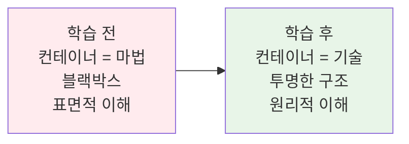
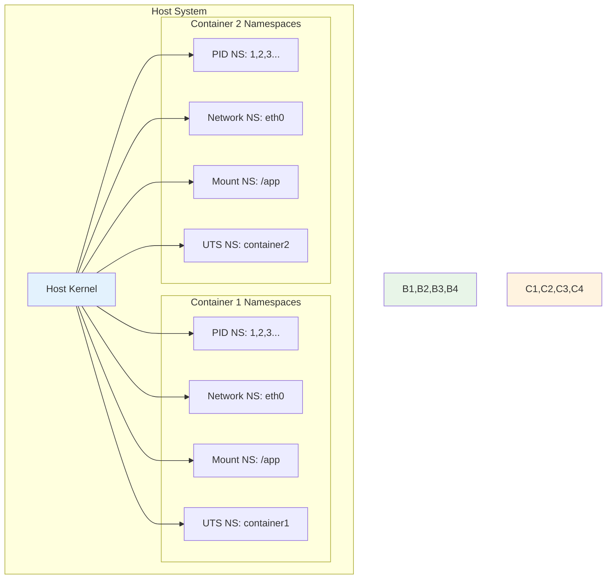
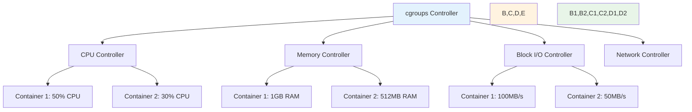
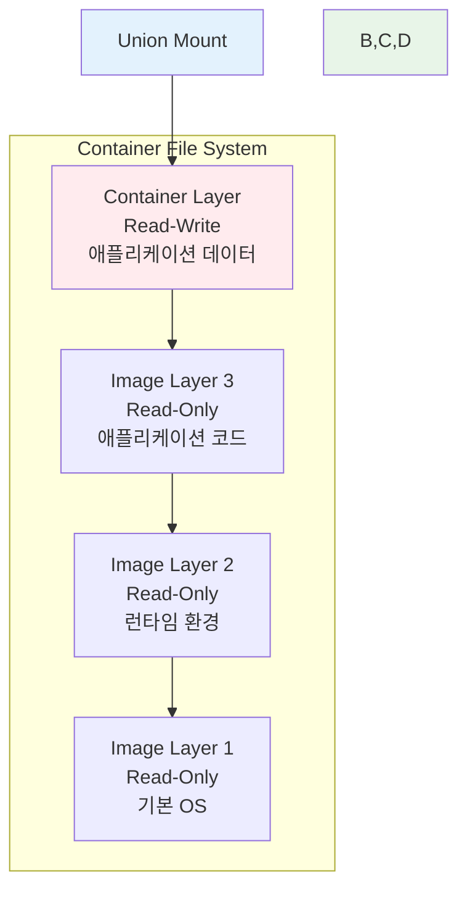
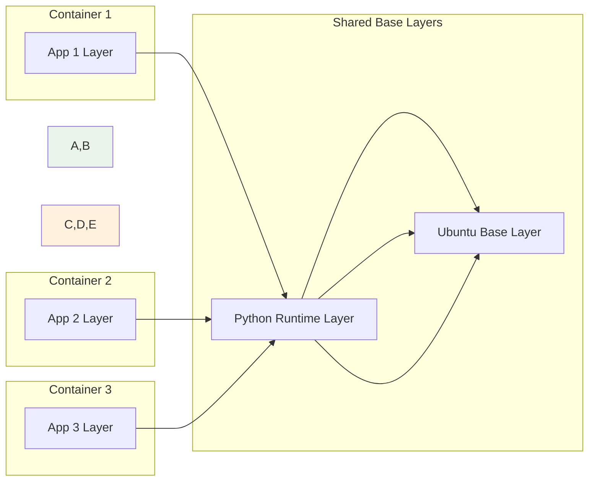
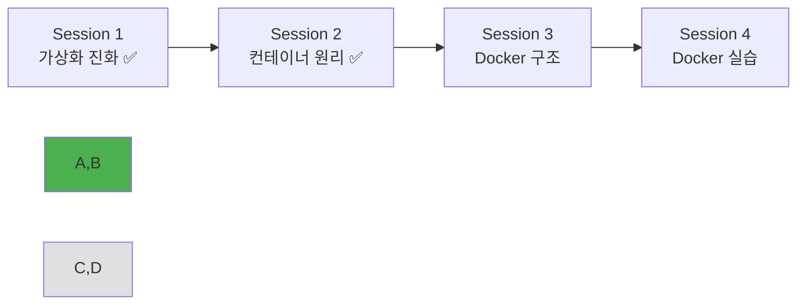

# Week 1 Day 2 Session 2: 컨테이너 기술의 핵심 원리

**🔧 컨테이너 내부 동작 원리** • **Linux 커널 기술의 활용**

*네임스페이스, cgroups, 유니온 파일시스템으로 이해하는 컨테이너의 비밀*

---

## 🕘 세션 정보

**시간**: 10:00-10:50 (50분)  
**목표**: 컨테이너 격리와 리소스 관리 원리 완전 이해  
**방식**: 이론 설명 + 팀별 기술 요소 분석 + 실제 확인 실습

---

## 🎯 세션 목표

### 📚 학습 목표
- **이해 목표**: 네임스페이스, cgroups, 유니온 파일시스템 등 컨테이너 핵심 기술 이해
- **적용 목표**: 컨테이너 격리와 리소스 관리가 어떻게 구현되는지 파악
- **협업 목표**: 팀별로 컨테이너 기술 요소를 분석하고 발표

### 🤔 왜 필요한가? (5분)
**컨테이너 내부 원리 이해의 중요성**:
- 💼 **실무 필요성**: 컨테이너 문제 해결과 최적화를 위해 내부 동작 원리 필수
- 🏠 **일상 비유**: 자동차 운전만 할 줄 아는 것과 엔진 구조까지 아는 차이
- 📊 **기술 발전**: 컨테이너 기술의 발전 방향과 한계를 이해하기 위한 기반

**학습 전후 비교**:

---

## 📖 핵심 개념 (35분)

### 🔍 개념 1: Linux Namespaces (프로세스 격리) (12분)

> **정의**: Linux 커널에서 제공하는 프로세스 격리 기술로, 각 프로세스가 독립적인 시스템 뷰를 갖도록 하는 기능

#### 상세 설명
- **핵심 원리**: 시스템 리소스를 논리적으로 분할하여 각 네임스페이스가 독립적인 환경 제공
- **주요 네임스페이스 종류**:
  - **PID Namespace**: 프로세스 ID 격리
  - **Network Namespace**: 네트워크 인터페이스 격리
  - **Mount Namespace**: 파일시스템 마운트 포인트 격리
  - **UTS Namespace**: 호스트명과 도메인명 격리
  - **IPC Namespace**: 프로세스 간 통신 격리
  - **User Namespace**: 사용자 ID와 그룹 ID 격리

#### 네임스페이스 동작 원리

#### 실무 연결
- **격리 효과**: 각 컨테이너가 독립적인 시스템으로 인식
- **보안 강화**: 프로세스 간 간섭 방지
- **리소스 관리**: 네임스페이스별 독립적 관리 가능

### 🔍 개념 2: Control Groups (cgroups) - 리소스 관리 (12분)

> **정의**: Linux 커널에서 제공하는 프로세스 그룹의 리소스 사용량을 제한하고 모니터링하는 기능

#### 상세 설명
- **핵심 원리**: 프로세스를 그룹으로 묶어 CPU, 메모리, 디스크 I/O 등의 리소스 사용량 제어
- **주요 cgroup 서브시스템**:
  - **cpu**: CPU 사용량 제한
  - **memory**: 메모리 사용량 제한
  - **blkio**: 블록 디바이스 I/O 제한
  - **net_cls**: 네트워크 트래픽 분류
  - **devices**: 디바이스 접근 제어
  - **freezer**: 프로세스 일시 정지/재개

#### cgroups 리소스 제어

#### 실무 연결
- **리소스 보장**: 각 컨테이너의 최소 리소스 보장
- **리소스 제한**: 특정 컨테이너가 시스템 전체에 영향 방지
- **성능 튜닝**: 애플리케이션 특성에 맞는 리소스 할당

### 🔍 개념 3: Union File System (레이어 기반 파일시스템) (11분)

> **정의**: 여러 개의 파일시스템을 하나로 합쳐서 보여주는 기술로, 컨테이너 이미지의 레이어 구조를 구현

#### 상세 설명
- **핵심 원리**: 읽기 전용 레이어들을 쌓고, 최상위에 쓰기 가능한 레이어를 추가
- **주요 특징**:
  - **Copy-on-Write (CoW)**: 파일 수정 시에만 복사
  - **레이어 공유**: 동일한 베이스 이미지 레이어 공유
  - **공간 효율성**: 중복 데이터 제거로 저장공간 절약
  - **빠른 시작**: 전체 복사 없이 즉시 시작 가능

#### Union File System 구조

#### 레이어 공유 효과

#### 실무 연결
- **저장공간 효율**: 동일한 베이스 이미지 공유로 공간 절약
- **빠른 배포**: 변경된 레이어만 전송하여 배포 시간 단축
- **버전 관리**: 레이어별 버전 관리로 롤백 용이

---

## 💭 함께 생각해보기 (10분)

### 🤝 팀별 기술 요소 분석 (7분)
**팀 구성**: 3-4명씩 3개 팀으로 구성

**팀별 분석 주제**:
- **Team 1**: Namespaces 심화 분석
  - 각 네임스페이스의 실제 사용 사례
  - 네임스페이스 격리의 한계점
  - 보안 관점에서의 네임스페이스 활용
  
- **Team 2**: cgroups 심화 분석
  - 리소스 제한 정책 설계 방법
  - 컨테이너 성능 튜닝 전략
  - 리소스 모니터링 방법
  
- **Team 3**: Union File System 심화 분석
  - 레이어 최적화 전략
  - 이미지 크기 최소화 방법
  - 파일시스템 성능 고려사항

**활동 가이드**:
- 📊 **분석 방법**: 주어진 주제에 대해 장단점, 사용 사례, 주의사항 분석
- 🎯 **결과 정리**: 핵심 포인트 3가지로 요약
- 🎤 **발표 준비**: 2분 발표 준비

### 🎯 팀별 발표 및 전체 공유 (3분)
- **Team 발표**: 각 팀 2분씩 핵심 분석 결과 발표
- **질의응답**: 다른 팀의 분석에 대한 질문과 토론
- **통합 이해**: 3가지 기술이 어떻게 협력하여 컨테이너 구현하는지 정리

### 💡 이해도 체크 질문
- ✅ "컨테이너가 격리되는 원리를 네임스페이스 관점에서 설명할 수 있나요?"
- ✅ "컨테이너의 리소스 사용량이 제한되는 방법을 설명할 수 있나요?"
- ✅ "컨테이너 이미지가 공간 효율적인 이유를 설명할 수 있나요?"

---

## 🔑 핵심 키워드

### Linux Namespaces
- **PID Namespace**: 프로세스 ID 공간 격리
- **Network Namespace**: 네트워크 인터페이스 격리
- **Mount Namespace**: 파일시스템 마운트 포인트 격리
- **UTS Namespace**: 호스트명/도메인명 격리
- **IPC Namespace**: 프로세스 간 통신 격리
- **User Namespace**: 사용자/그룹 ID 격리

### Control Groups (cgroups)
- **Resource Controller**: 리소스 사용량 제어 모듈
- **CPU Controller**: CPU 사용량 제한 및 스케줄링
- **Memory Controller**: 메모리 사용량 제한 및 관리
- **Block I/O Controller**: 디스크 I/O 제한
- **Resource Limit**: 리소스 사용량 상한선
- **Resource Guarantee**: 리소스 사용량 보장

### Union File System
- **Layer**: 파일시스템의 계층 구조
- **Copy-on-Write (CoW)**: 수정 시 복사 메커니즘
- **Base Image**: 기본 이미지 레이어
- **Container Layer**: 컨테이너 전용 쓰기 가능 레이어
- **Image Sharing**: 이미지 레이어 공유
- **Overlay**: 레이어를 합쳐서 보여주는 기술

---

## 📝 세션 마무리

### ✅ 오늘 세션 성과
- [ ] 컨테이너 격리 원리 (Namespaces) 완전 이해
- [ ] 컨테이너 리소스 관리 (cgroups) 메커니즘 파악
- [ ] 컨테이너 파일시스템 (Union FS) 구조 이해
- [ ] 팀별 기술 요소 심화 분석 및 발표 완료

### 🎯 다음 세션 준비
- **주제**: Docker 아키텍처와 구성 요소
- **연결고리**: 컨테이너 핵심 기술 → Docker 구현체 → 전체 아키텍처
- **준비사항**: 오늘 배운 기술들이 Docker에서 어떻게 활용되는지 생각해보기

### 📊 학습 진도 체크

---

**🔧 컨테이너 기술의 핵심 원리를 완전히 이해했습니다**

*네임스페이스, cgroups, Union FS로 풀어낸 컨테이너의 비밀*

**이전**: [Session 1 - 가상화 기술의 진화](./session_1.md) | **다음**: [Session 3 - Docker 아키텍처](./session_3.md)

