# Week 1 Day 2 Session 2: Docker 아키텍처

<div align="center">

**🏗️ Docker 플랫폼 구조** • **클라이언트-서버 아키텍처**

*Docker의 전체 구조와 구성 요소 완전 이해*

</div>

---

## 🕘 세션 정보

**시간**: 10:00-10:50 (50분)  
**목표**: Docker 아키텍처와 구성 요소 완전 이해  
**방식**: 구조 분석 + 실습 연계 + 팀 토론

---

## 🎯 세션 목표

### 📚 학습 목표
- **이해 목표**: Docker의 전체 아키텍처와 구성 요소 이해
- **적용 목표**: Docker 명령어와 내부 동작 원리 연결
- **협업 목표**: 페어 토론을 통한 Docker 구조 이해 및 공유

### 🤔 왜 필요한가? (5분)

**Docker 아키텍처 이해의 중요성**:
- 💼 **실무 필요성**: Docker 문제 해결과 최적화를 위한 구조 이해
- 🏠 **일상 비유**: 자동차 운전을 위해 엔진 구조를 아는 것처럼
- 📊 **기술 발전**: 컨테이너 생태계의 핵심 플랫폼 이해

---

## 📖 핵심 개념 (35분)

### 🔍 개념 1: Docker 전체 아키텍처 (12분)

> **정의**: 클라이언트-서버 구조로 동작하는 컨테이너 플랫폼

**🏗️ VM vs Docker 아키텍처 비교**

```mermaid
graph TB
    subgraph "가상머신 방식"
        A1[물리 서버] --> A2[호스트 OS]
        A2 --> A3[하이퍼바이저]
        A3 --> A4[VM1: 게스트OS + 앱]
        A3 --> A5[VM2: 게스트OS + 앱]
    end
    
    subgraph "Docker 방식"
        B1[물리 서버] --> B2[호스트 OS]
        B2 --> B3[Docker Engine]
        B3 --> B4[컨테이너 1: 앱]
        B3 --> B5[컨테이너 2: 앱]
    end
    
    style A4 fill:#ffebee
    style A5 fill:#ffebee
    style B4 fill:#e8f5e8
    style B5 fill:#e8f5e8
```

*VM vs Docker 아키텍처 비교*

**Docker 아키텍처 구성**:

```mermaid
graph TB
    subgraph "Docker 아키텍처"
        A[Docker Client<br/>docker 명령어] --> B[Docker Daemon<br/>dockerd]
        B --> C[Images<br/>이미지 저장소]
        B --> D[Containers<br/>실행 중인 컨테이너]
        B --> E[Networks<br/>네트워크 관리]
        B --> F[Volumes<br/>데이터 저장]
        
        G[Docker Registry<br/>Docker Hub] --> B
    end
    
    style A fill:#e3f2fd
    style B fill:#fff3e0
    style C fill:#e8f5e8
    style D fill:#e8f5e8
    style E fill:#e8f5e8
    style F fill:#e8f5e8
    style G fill:#f3e5f5
```


**🌐 Docker 전체 에코시스템**

```mermaid
graph TB
    subgraph "Docker 에코시스템"
        A[Docker Client<br/>CLI 명령어] --> B[Docker Host]
        
        subgraph B["Docker Host"]
            C[Docker Daemon<br/>dockerd]
            D[Images]
            E[Containers]
            F[Networks]
            G[Volumes]
        end
        
        H[Docker Registry<br/>Docker Hub] --> C
        C --> D
        C --> E
        C --> F
        C --> G
    end
    
    style A fill:#e3f2fd
    style C fill:#fff3e0
    style D fill:#e8f5e8
    style E fill:#e8f5e8
    style F fill:#e8f5e8
    style G fill:#e8f5e8
    style H fill:#f3e5f5
```

*Docker 전체 에코시스템*

**주요 구성 요소**:
- **Docker Client**: 사용자가 명령어를 입력하는 인터페이스
- **Docker Daemon**: 실제 컨테이너를 관리하는 백그라운드 서비스
- **Docker Images**: 컨테이너 실행을 위한 템플릿
- **Docker Containers**: 실행 중인 애플리케이션 인스턴스
- **Docker Registry**: 이미지를 저장하고 공유하는 저장소

**🔄 DevOps 무한 루프 (지속적 개선)**

```mermaid
graph TB
    subgraph "DevOps 사이클"
        A[Plan] --> B[Code]
        B --> C[Build]
        C --> D[Test]
        D --> E[Release]
        E --> F[Deploy]
        F --> G[Operate]
        G --> H[Monitor]
        H --> A
    end
    
    I[Docker는 Build, Deploy,<br/>Operate 단계에서<br/>핵심 역할 수행]
    
    C --> I
    F --> I
    G --> I
    
    style C fill:#4caf50
    style F fill:#4caf50
    style G fill:#4caf50
    style I fill:#e3f2fd
```

*DevOps 사이클에서 Docker의 역할*

### 🔍 개념 2: Docker 이미지와 컨테이너 (12분)

> **정의**: 이미지는 실행 파일, 컨테이너는 실행 중인 프로세스

**📊 Docker 이미지 레이어 구조**

```mermaid
graph TB
    subgraph "이미지 레이어"
        A[Container Layer<br/>읽기/쓰기 가능]
        B[Image Layer 3<br/>애플리케이션]
        C[Image Layer 2<br/>라이브러리]
        D[Image Layer 1<br/>기본 OS]
        
        A --> B
        B --> C
        C --> D
    end
    
    E[이미지는 읽기 전용<br/>컨테이너만 쓰기 가능]
    
    style A fill:#ffebee
    style B fill:#e8f5e8
    style C fill:#e8f5e8
    style D fill:#e8f5e8
    style E fill:#e3f2fd
```

*Docker 이미지 레이어 구조*

**이미지 vs 컨테이너 관계**:

```mermaid
graph LR
    A[Docker Image<br/>실행 파일] --> B[docker run]
    B --> C[Container<br/>실행 중인 프로세스]
    C --> D[docker commit]
    D --> E[New Image<br/>새로운 이미지]
    
    style A fill:#e8f5e8
    style E fill:#e8f5e8
    style C fill:#fff3e0
    style B fill:#f3e5f5
    style D fill:#f3e5f5
```


**🐳 Docker 로고와 컨테이너 개념**
```mermaid
graph LR
    subgraph "고래 배 (Docker Host)"
        A[컨테이너 1<br/>Web App]
        B[컨테이너 2<br/>Database]
        C[컨테이너 3<br/>Cache]
        D[컨테이너 4<br/>API]
    end
    
    E[바다 (Network)<br/>컨테이너 간 통신]
    
    A --> E
    B --> E
    C --> E
    D --> E
    
    style A fill:#e8f5e8
    style B fill:#e8f5e8
    style C fill:#e8f5e8
    style D fill:#e8f5e8
    style E fill:#e3f2fd
```
*Docker의 고래 로고는 컨테이너를 운반하는 배를 상징*

**실생활 비유**:
- **이미지**: 요리 레시피 (한 번 작성하면 여러 번 사용)
- **컨테이너**: 실제 요리 (레시피로 만든 음식)
- **Registry**: 레시피 책 (여러 레시피를 모아둔 곳)

### 🔍 개념 3: Docker 네트워킹과 스토리지 (11뵔)

> **정의**: 컨테이너 간 통신과 데이터 영속성을 위한 시스템

**🌐 Docker 네트워크 아키텍처**

```mermaid
graph TB
    subgraph "Docker 네트워크"
        A[Host Network<br/>호스트와 동일]
        B[Bridge Network<br/>기본 네트워크]
        C[Custom Network<br/>사용자 정의]
        D[None Network<br/>네트워크 없음]
    end
    
    E[컨테이너 1] --> B
    F[컨테이너 2] --> B
    G[컨테이너 3] --> C
    H[컨테이너 4] --> A
    
    style A fill:#e3f2fd
    style B fill:#e3f2fd
    style C fill:#e3f2fd
    style D fill:#e3f2fd
    style E fill:#e8f5e8
    style F fill:#e8f5e8
    style G fill:#e8f5e8
    style H fill:#e8f5e8
```

*Docker 네트워크 아키텍처*

**네트워킹 구조**:

```mermaid
graph TB
    subgraph "Docker 네트워킹"
        A[Host Network] --> D[Container 1]
        B[Bridge Network] --> D
        B --> E[Container 2]
        C[Custom Network] --> E
        C --> F[Container 3]
    end
    
    style A fill:#e3f2fd
    style B fill:#e3f2fd
    style C fill:#e3f2fd
    style D fill:#e8f5e8
    style E fill:#e8f5e8
    style F fill:#e8f5e8
```


**💾 Docker 볼륨 유형**

```mermaid
graph TB
    subgraph "Docker 스토리지 옵션"
        A[Volumes<br/>Docker 관리<br/>영속적 데이터]
        B[Bind Mounts<br/>호스트 파일시스템<br/>직접 연결]
        C[tmpfs Mounts<br/>메모리에 임시 저장<br/>컨테이너 종료 시 삭제]
    end
    
    D[컨테이너] --> A
    D --> B
    D --> C
    
    E[데이터 영속성<br/>• Volumes: 최고
• Bind Mounts: 중간
• tmpfs: 없음]
    
    style A fill:#4caf50
    style B fill:#ff9800
    style C fill:#f44336
    style D fill:#e8f5e8
    style E fill:#e3f2fd
```

*Docker 볼륨 유형*

**스토리지 옵션**:
- **Volumes**: Docker가 관리하는 영속적 데이터 저장
- **Bind Mounts**: 호스트 파일시스템과 직접 연결
- **tmpfs**: 메모리에 임시 저장

---

## 💭 함께 생각해보기 (10분)

### 🤝 페어 토론 (7분)
**토론 주제**:
1. **구조 이해**: "Docker의 클라이언트-서버 구조가 왜 필요할까요?"
2. **실무 적용**: "이미지와 컨테이너의 차이를 어떻게 활용할 수 있을까요?"
3. **문제 해결**: "컨테이너가 종료되면 데이터가 사라지는 문제를 어떻게 해결할까요?"

### 🎯 전체 공유 (3분)
- **아키텍처 이해도**: Docker 구조에 대한 이해 확인
- **실습 준비**: 오후 실습에서 사용할 개념들 정리

---

## 🔑 핵심 키워드

### Docker 구성 요소
- **Docker Client**: 사용자 인터페이스, CLI 명령어 도구
- **Docker Daemon**: 백그라운드 서비스, 컨테이너 관리 엔진
- **Docker Image**: 컨테이너 실행을 위한 읽기 전용 템플릿
- **Docker Container**: 이미지의 실행 가능한 인스턴스

### 데이터 관리
- **Docker Volume**: Docker가 관리하는 데이터 저장 공간
- **Bind Mount**: 호스트 파일시스템 직접 마운트
- **Docker Registry**: 이미지 저장소 (Docker Hub, 프라이빗 레지스트리)

---

## 📝 세션 마무리

### ✅ 오늘 세션 성과
- [ ] Docker 전체 아키텍처 구조 이해
- [ ] 이미지와 컨테이너의 관계 파악
- [ ] 네트워킹과 스토리지 개념 습득
- [ ] 실습 준비를 위한 기본 지식 완성

### 🖼️ 추가 시각 자료
- **DevOps 로드맵**: [DevOps RoadMap 2024](https://roadmap.sh/devops)
- **Docker 공식 가이드**: [Docker Get Started](https://docs.docker.com/get-started/)
- **컨테이너 생태계**: [CNCF Landscape](https://landscape.cncf.io/)

### 🎯 다음 세션 준비
- **주제**: Docker Engine과 런타임 구조
- **연결고리**: Docker 아키텍처 → 내부 동작 원리
- **준비사항**: Docker 명령어가 내부적으로 어떻게 처리되는지 궁금증 가지기

---

<div align="center">

**🏗️ Docker 아키텍처를 완전히 이해했습니다**

*클라이언트-서버 구조와 핵심 구성 요소 파악*

**다음**: [Session 3 - Docker Engine & 런타임](./session_3.md)

</div>