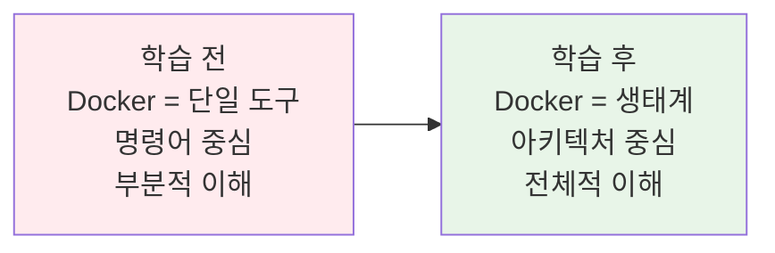
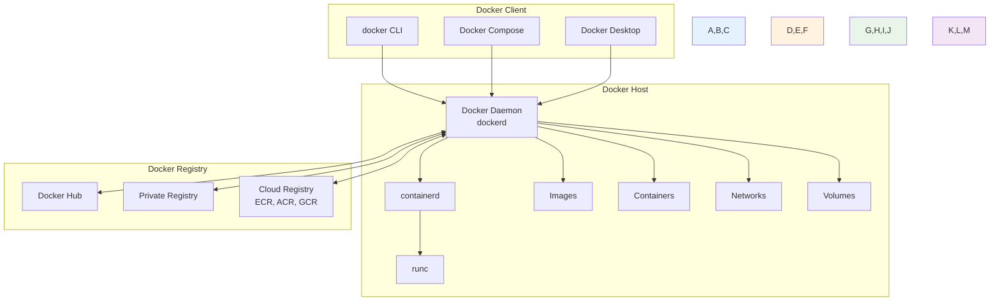
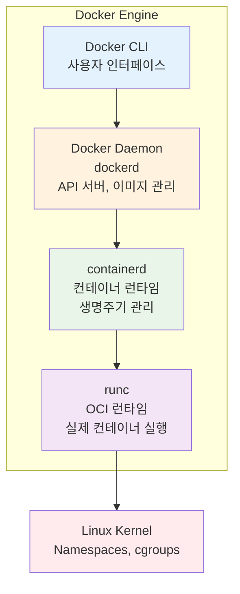
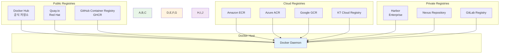
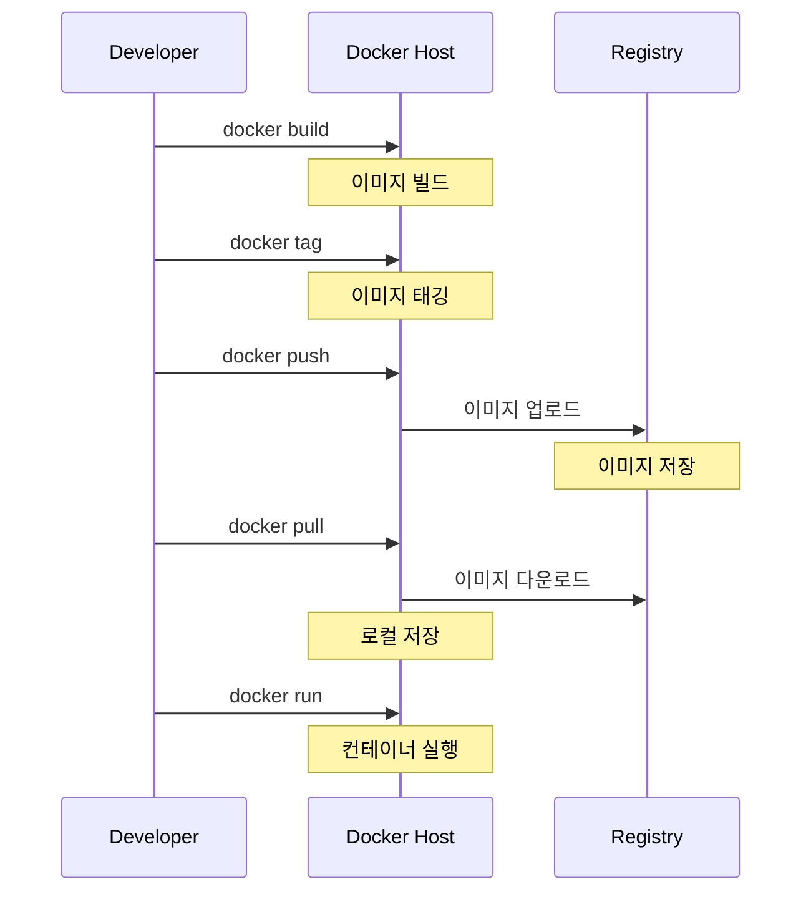
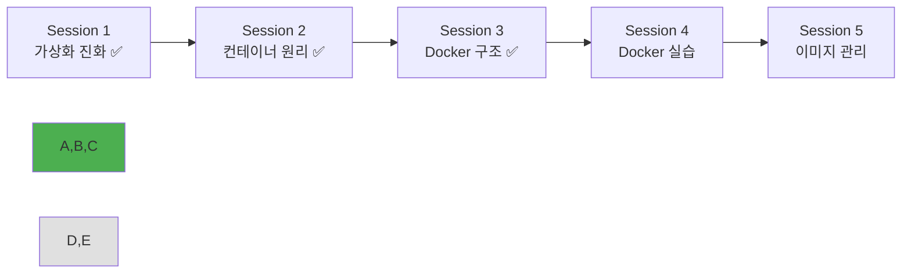

# Week 1 Day 2 Session 3: Docker 아키텍처와 구성 요소

**🐳 Docker 생태계 완전 분석** • **클라이언트-서버 아키텍처**

*Docker Engine부터 Registry까지, 전체 Docker 생태계의 구조와 동작 원리*

---

## 🕘 세션 정보

**시간**: 11:00-11:50 (50분)  
**목표**: Docker 전체 아키텍처와 각 구성 요소의 역할 완전 이해  
**방식**: 이론 설명 + 팀별 아키텍처 다이어그램 작성 + 구성 요소 역할 분석

---

## 🎯 세션 목표

### 📚 학습 목표
- **이해 목표**: Docker Engine, 클라이언트-서버 구조, Registry 등 전체 아키텍처 파악
- **적용 목표**: Docker 생태계의 각 구성 요소가 어떻게 협력하여 동작하는지 이해
- **협업 목표**: 팀별로 Docker 아키텍처 다이어그램을 공동 작성하고 발표

### 🤔 왜 필요한가? (5분)
**Docker 아키텍처 이해의 중요성**:
- 💼 **실무 필요성**: Docker 문제 해결과 최적화를 위해 전체 구조 이해 필수
- 🏠 **일상 비유**: 스마트폰 앱 사용법만 아는 것과 전체 시스템 구조까지 아는 차이
- 📊 **확장성**: 복잡한 컨테이너 환경 구축을 위한 기반 지식

**학습 전후 비교**:

---

## 📖 핵심 개념 (35분)

### 🔍 개념 1: Docker 전체 아키텍처 개요 (12분)

> **정의**: Docker는 클라이언트-서버 아키텍처를 기반으로 하는 컨테이너 플랫폼으로, 여러 구성 요소가 협력하여 컨테이너 생명주기를 관리

#### Docker 전체 아키텍처

#### 주요 구성 요소 개요
- **Docker Client**: 사용자 인터페이스 (CLI, GUI, API)
- **Docker Host**: 컨테이너 실행 환경 (Daemon, Runtime, Storage)
- **Docker Registry**: 이미지 저장소 (Public, Private, Cloud)

#### 통신 흐름
1. **Client → Daemon**: REST API를 통한 명령 전달
2. **Daemon → containerd**: 컨테이너 생명주기 관리 요청
3. **containerd → runc**: 실제 컨테이너 실행
4. **Daemon ↔ Registry**: 이미지 pull/push 작업

### 🔍 개념 2: Docker Engine 상세 구조 (12분)

> **정의**: Docker Engine은 Docker의 핵심 구성 요소로, Docker Daemon, containerd, runc로 구성된 계층적 아키텍처

#### Docker Engine 계층 구조

#### 각 계층의 역할
**Docker Daemon (dockerd)**:
- REST API 서버 역할
- 이미지 관리 (빌드, 태깅, 저장)
- 네트워크 및 볼륨 관리
- 클라이언트 요청 처리

**containerd**:
- 컨테이너 생명주기 관리
- 이미지 전송 및 저장
- 네트워크 네임스페이스 관리
- OCI 런타임과의 인터페이스

**runc**:
- OCI(Open Container Initiative) 표준 구현
- 실제 컨테이너 프로세스 생성
- 네임스페이스 및 cgroups 설정
- 컨테이너 보안 정책 적용

#### 실무 연결
- **모듈화**: 각 계층의 독립적 업그레이드 가능
- **표준화**: OCI 표준 준수로 호환성 보장
- **안정성**: 계층 분리로 장애 격리 효과

### 🔍 개념 3: Docker Registry와 이미지 관리 (11분)

> **정의**: Docker Registry는 Docker 이미지를 저장, 관리, 배포하는 중앙 저장소로, 컨테이너 생태계의 핵심 인프라

#### Registry 생태계

#### 이미지 관리 워크플로우

#### Registry 선택 기준
| 구분 | Public Registry | Cloud Registry | Private Registry |
|------|-----------------|----------------|------------------|
| **비용** | 무료/저렴 | 사용량 기반 | 구축/운영 비용 |
| **보안** | 공개 | 클라우드 보안 | 완전 제어 |
| **성능** | 인터넷 의존 | 리전별 최적화 | 내부 네트워크 |
| **관리** | 제한적 | 관리형 서비스 | 완전 제어 |
| **적용 사례** | 오픈소스, 학습 | 클라우드 네이티브 | 기업 내부 |

#### 실무 연결
- **이미지 전략**: 베이스 이미지 선택과 레이어 최적화
- **보안 관리**: 이미지 스캔과 취약점 관리
- **배포 전략**: 이미지 버전 관리와 롤백 전략

---

## 💭 함께 생각해보기 (10분)

### 🤝 팀별 아키텍처 다이어그램 작성 (7분)
**팀 구성**: 3-4명씩 3개 팀으로 구성

**팀별 작성 주제**:
- **Team 1**: "웹 애플리케이션 개발 환경"
  - 개발자 로컬 환경에서의 Docker 아키텍처
  - 코드 변경부터 컨테이너 실행까지의 흐름
  - 개발 효율성을 위한 구성 요소 배치

- **Team 2**: "프로덕션 배포 환경"
  - CI/CD 파이프라인에서의 Docker 아키텍처
  - 이미지 빌드부터 프로덕션 배포까지의 흐름
  - 보안과 안정성을 위한 구성 요소 배치

- **Team 3**: "마이크로서비스 환경"
  - 여러 서비스가 있는 환경에서의 Docker 아키텍처
  - 서비스 간 통신과 데이터 공유 방법
  - 확장성과 관리 효율성을 위한 구성

**활동 가이드**:
- 📊 **다이어그램 작성**: 화이트보드나 종이에 아키텍처 그리기
- 🔄 **흐름 표시**: 데이터와 명령의 흐름 화살표로 표시
- 💡 **핵심 포인트**: 해당 환경에서 중요한 구성 요소 강조

### 🎯 팀별 발표 및 아키텍처 비교 (3분)
- **Team 발표**: 각 팀 1분씩 아키텍처 다이어그램 설명
- **차이점 분석**: 환경별 아키텍처 차이점과 이유 토론
- **통합 이해**: Docker 아키텍처의 유연성과 확장성 이해

### 💡 이해도 체크 질문
- ✅ "Docker 클라이언트와 데몬 간의 통신 방식을 설명할 수 있나요?"
- ✅ "Docker Engine의 3계층 구조를 설명할 수 있나요?"
- ✅ "상황에 따른 Registry 선택 기준을 설명할 수 있나요?"

---

## 🔑 핵심 키워드

### Docker 아키텍처
- **Client-Server Architecture**: 클라이언트-서버 구조
- **Docker Client**: 사용자 인터페이스 (CLI, GUI, API)
- **Docker Host**: 컨테이너 실행 환경
- **Docker Registry**: 이미지 저장소

### Docker Engine
- **Docker Daemon (dockerd)**: Docker 서비스 프로세스
- **containerd**: 컨테이너 런타임 관리자
- **runc**: OCI 런타임 구현체
- **REST API**: 클라이언트-데몬 간 통신 인터페이스

### Registry 관리
- **Docker Hub**: 공식 퍼블릭 레지스트리
- **Private Registry**: 기업 내부 레지스트리
- **Cloud Registry**: 클라우드 제공 레지스트리
- **Image Repository**: 이미지 저장 단위

### 이미지 관리
- **Image Layer**: 이미지 계층 구조
- **Image Tag**: 이미지 버전 관리
- **Image Manifest**: 이미지 메타데이터
- **Image Digest**: 이미지 고유 식별자

---

## 📝 세션 마무리

### ✅ 오늘 세션 성과
- [ ] Docker 전체 아키텍처와 구성 요소 완전 이해
- [ ] Docker Engine의 계층적 구조 파악
- [ ] Registry 생태계와 이미지 관리 워크플로우 이해
- [ ] 팀별 아키텍처 다이어그램 작성 및 발표 완료

### 🎯 다음 세션 준비
- **주제**: Docker 실습 - 기본 명령어와 컨테이너 생명주기
- **연결고리**: Docker 아키텍처 이해 → 실제 Docker 명령어 사용
- **준비사항**: 오늘 배운 구성 요소들이 명령어 실행 시 어떻게 동작하는지 생각해보기

### 📊 학습 진도 체크

### 🔮 이론에서 실습으로
**오전 이론 학습 완료**:
- 가상화 기술의 진화 과정 이해 ✅
- 컨테이너 핵심 기술 원리 파악 ✅
- Docker 전체 아키텍처 구조 완성 ✅

**오후 실습 준비**:
- Docker 명령어를 통한 실제 조작
- 컨테이너 생명주기 직접 체험
- 이미지 빌드와 관리 실습

---

**🐳 Docker 아키텍처를 완전히 이해했습니다**

*클라이언트부터 Registry까지, 전체 생태계 구조 완성*

**이전**: [Session 2 - 컨테이너 기술 원리](./session_2.md) | **다음**: [Session 4 - Docker 기본 실습](./session_4.md)

