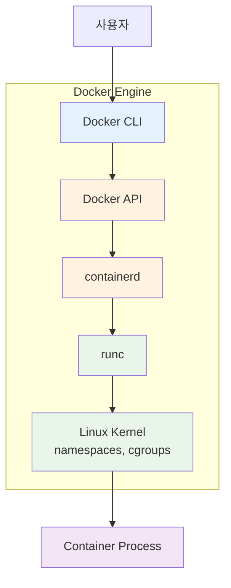
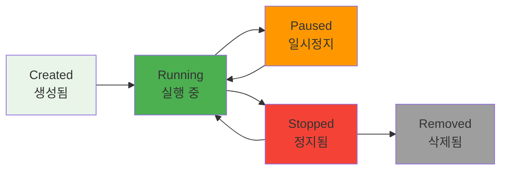
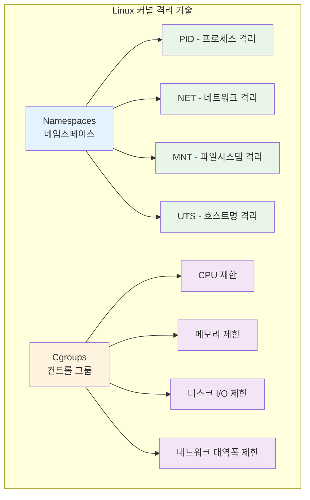

# Week 1 Day 2 Session 3: Docker Engine & 런타임

**⚙️ Docker 내부 동작 원리** • **컨테이너 생명주기**

*Docker Engine의 구조와 컨테이너 실행 메커니즘*

---

## 🕘 세션 정보

**시간**: 11:00-11:50 (50분)  
**목표**: Docker Engine 내부 동작 원리와 컨테이너 생명주기 이해  
**방식**: 구조 분석 + 생명주기 체험 + 실습 연계

---

## 🎯 세션 목표

### 📚 학습 목표
- **이해 목표**: Docker Engine의 내부 동작 원리와 런타임 이해
- **적용 목표**: 컨테이너 생명주기와 상태 관리 실습 준비
- **협업 목표**: 페어 토론을 통한 Docker 내부 동작 원리 이해

### 🤔 왜 필요한가? (5분)

**Docker Engine 이해의 중요성**:
- 💼 **문제 해결**: 컨테이너 오류 발생 시 근본 원인 파악
- 🏠 **일상 비유**: 자동차 엔진 구조를 알면 고장 진단이 쉬운 것처럼
- 📊 **성능 최적화**: 내부 구조 이해를 통한 성능 튜닝

---

## 📖 핵심 개념 (35분)

### 🔍 개념 1: Docker Engine 구조 (12분)

> **정의**: 컨테이너를 실행하고 관리하는 핵심 엔진

**Docker Engine 내부 구조**:

**각 구성 요소 역할**:
- **Docker CLI**: 사용자 명령어 인터페이스
- **Docker API**: REST API를 통한 통신
- **containerd**: 컨테이너 생명주기 관리
- **runc**: 실제 컨테이너 실행
- **Linux Kernel**: 격리 기술 제공

### 🔍 개념 2: 컨테이너 생명주기 (12분)

> **정의**: 컨테이너가 생성부터 삭제까지 거치는 단계들

**생명주기 단계**:

**상태별 특징**:
- **Created**: 이미지에서 컨테이너 생성, 아직 실행 안됨
- **Running**: 프로세스가 실행 중인 상태
- **Paused**: 프로세스가 일시정지된 상태
- **Stopped**: 프로세스가 종료된 상태
- **Removed**: 컨테이너가 완전히 삭제된 상태

### 🔍 개념 3: 리소스 관리와 격리 (11분)

> **정의**: Linux 커널 기능을 활용한 컨테이너 격리 기술

**격리 기술들**:

**실무 활용**:
- **개발 환경**: 각 개발자마다 독립적인 환경
- **마이크로서비스**: 서비스별 리소스 격리
- **멀티 테넌트**: 고객별 격리된 환경 제공

---

## 💭 함께 생각해보기 (10분)

### 🤝 페어 토론 (7분)
**토론 주제**:
1. **내부 동작**: "Docker 명령어를 실행했을 때 내부에서 어떤 일이 일어날까요?"
2. **리소스 관리**: "컨테이너의 CPU나 메모리를 제한해야 하는 상황은?"
3. **실무 적용**: "컨테이너 생명주기 관리에서 주의할 점은?"

### 🎯 전체 공유 (3분)
- **이해도 확인**: Docker Engine 동작 원리 이해 점검
- **실습 연결**: 오후 실습에서 확인할 내용들 정리

---

## 🔑 핵심 키워드

### Docker Engine 구성
- **containerd**: 컨테이너 런타임, 이미지 관리, 생명주기 관리
- **runc**: OCI 런타임 구현체, 실제 컨테이너 실행
- **Docker API**: RESTful API, 클라이언트-데몬 통신
- **Docker CLI**: 명령행 인터페이스, 사용자 도구

### 격리 기술
- **Namespaces**: 프로세스, 네트워크, 파일시스템 격리
- **Cgroups**: 리소스 제한 및 모니터링
- **Union File System**: 레이어드 파일시스템
- **Container Runtime**: 컨테이너 실행 환경

---

## 📝 세션 마무리

### ✅ 오늘 세션 성과
- [ ] Docker Engine 내부 구조 완전 이해
- [ ] 컨테이너 생명주기 각 단계 파악
- [ ] Linux 커널 격리 기술 이해
- [ ] 실습을 위한 이론적 기반 완성

### 🎯 실습 챌린지 준비
- **연결고리**: 이론 학습 → 실제 Docker 설치 및 사용
- **실습 내용**: 컨테이너 생명주기 직접 체험
- **준비사항**: Docker 명령어로 내부 동작 확인해보기

---

**⚙️ Docker Engine 구조를 완전히 이해했습니다**

*내부 동작 원리와 컨테이너 생명주기 완전 파악*

**다음**: [실습 챌린지 - Docker 설치 & 기본 실습](../README.md#실습-챌린지)

