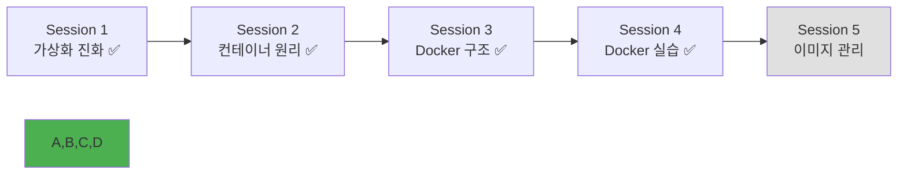

# Week 1 Day 2 Session 4: Docker 실습 - 기본 명령어

<div align="center">

**🛠️ Docker CLI 마스터하기** • **컨테이너 생명주기 체험**

*이론에서 실습으로, Docker 명령어를 통한 컨테이너 조작의 모든 것*

</div>

---

## 🕘 세션 정보

**시간**: 13:00-13:50 (50분)  
**목표**: Docker CLI를 활용한 컨테이너 생명주기 관리 완전 습득  
**방식**: 페어 프로그래밍 + 단계별 실습 + 문제 해결 협업

---

## 🎯 세션 목표

### 📚 학습 목표
- **이해 목표**: 컨테이너 생명주기와 상태 변화 과정 완전 이해
- **적용 목표**: Docker CLI 명령어로 컨테이너를 자유자재로 조작
- **협업 목표**: 페어 프로그래밍을 통한 실습과 상호 문제 해결

### 🤔 왜 필요한가? (3분)
**Docker 명령어 실습의 중요성**:
- 💼 **실무 필수**: 모든 Docker 작업의 기본이 되는 CLI 명령어
- 🏠 **일상 비유**: 자동차 운전에서 기본 조작법을 익히는 것과 같음
- 📊 **기반 기술**: 고급 Docker 기능 사용을 위한 필수 기초

---

## 🛠️ 실습 내용 (42분)

### 🚀 Phase 1: 오픈소스 예제로 시작하기 (15분)

#### 🤝 페어 프로그래밍 설정
- **페어 구성**: 2명씩 자유롭게 매칭 (경험자 + 초보자 권장)
- **역할 분담**: Driver(타이핑) / Navigator(가이드) 5분마다 교체
- **상호 지원**: 어려운 부분은 서로 도우며 해결

#### Step 1: 인기 오픈소스 컨테이너 체험 (8분)
```bash
# 1. Nginx 웹서버 (가장 인기있는 웹서버)
docker run -d -p 8080:80 --name my-nginx nginx:alpine

# 2. Redis 캐시 서버 (인메모리 데이터베이스)
docker run -d -p 6379:6379 --name my-redis redis:alpine

# 3. PostgreSQL 데이터베이스
docker run -d -p 5432:5432 --name my-postgres \
  -e POSTGRES_PASSWORD=mypassword \
  -e POSTGRES_DB=testdb \
  postgres:15-alpine

# 4. 실행 중인 서비스 확인
docker ps
curl http://localhost:8080  # Nginx 응답 확인
```

**🔍 관찰 포인트**:
- 실제 서비스들이 어떻게 컨테이너로 실행되는지
- alpine 이미지의 경량화 효과
- 환경변수(-e)를 통한 설정 방법
- 실무에서 자주 사용하는 포트 번호들

#### Step 2: 개발 환경 컨테이너 체험 (7분)
```bash
# Node.js 개발 환경 (웹 개발자들이 많이 사용)
docker run -it --name node-dev node:18-alpine sh
# 컨테이너 내부에서
node --version
npm --version
exit

# Python 개발 환경 (데이터 분석, AI 개발)
docker run -it --name python-dev python:3.11-slim bash
# 컨테이너 내부에서
python --version
pip --version
exit

# 실행 중인 Nginx 컨테이너에 접속해보기
docker exec -it my-nginx sh
# 컨테이너 내부에서
ls /usr/share/nginx/html
cat /usr/share/nginx/html/index.html
exit
```

**🔍 관찰 포인트**:
- 다양한 개발 환경을 컨테이너로 쉽게 구성
- 호스트 환경을 오염시키지 않는 격리된 개발 환경
- 팀 전체가 동일한 개발 환경 사용 가능

#### Step 3: 컨테이너 상태 관리 (5분)
```bash
# 컨테이너 중지
docker stop my-nginx

# 컨테이너 시작
docker start my-nginx

# 컨테이너 재시작
docker restart my-nginx

# 컨테이너 일시 정지
docker pause my-nginx

# 컨테이너 재개
docker unpause my-nginx

# 컨테이너 강제 종료
docker kill my-nginx
```

**🔍 관찰 포인트**:
- stop과 kill의 차이점
- pause/unpause의 동작 원리
- 컨테이너 상태 변화 과정

#### ✅ Phase 1 체크포인트
- [ ] 컨테이너 실행 및 상태 확인 완료
- [ ] 인터랙티브 모드와 데몬 모드 차이 이해
- [ ] 컨테이너 생명주기 명령어 숙달

### 🌟 Phase 2: 실무 시나리오 - 웹앱 + 데이터베이스 연동 (15분)

#### Step 1: 실무 웹 애플리케이션 예제 (7분)
```bash
# 1. WordPress + MySQL 조합 (실제 웹사이트)
docker network create wordpress-net

# MySQL 데이터베이스 실행
docker run -d --name wordpress-db \
  --network wordpress-net \
  -e MYSQL_ROOT_PASSWORD=rootpass \
  -e MYSQL_DATABASE=wordpress \
  -e MYSQL_USER=wpuser \
  -e MYSQL_PASSWORD=wppass \
  mysql:8.0

# WordPress 웹사이트 실행
docker run -d --name wordpress-site \
  --network wordpress-net \
  -p 8090:80 \
  -e WORDPRESS_DB_HOST=wordpress-db \
  -e WORDPRESS_DB_USER=wpuser \
  -e WORDPRESS_DB_PASSWORD=wppass \
  -e WORDPRESS_DB_NAME=wordpress \
  wordpress:latest

# 브라우저에서 http://localhost:8090 접속하여 WordPress 설치 화면 확인
```

**🔍 관찰 포인트**:
- 실제 서비스는 여러 컨테이너가 협력해서 동작
- 컨테이너 간 네트워크 통신 방법
- 환경변수를 통한 설정 전달

#### Step 2: 데이터 영속성과 개발 환경 구성 (8분)
```bash
# 1. 개발용 코드 폴더 생성
mkdir -p ~/my-website
cd ~/my-website

# 2. 간단한 HTML 파일 생성 (AI 생성 권장!)
cat > index.html << 'EOF'
<!DOCTYPE html>
<html>
<head>
    <title>My Docker Website</title>
    <style>
        body { font-family: Arial; text-align: center; padding: 50px; }
        .container { max-width: 600px; margin: 0 auto; }
        .highlight { color: #007acc; }
    </style>
</head>
<body>
    <div class="container">
        <h1>🐳 Docker로 만든 웹사이트</h1>
        <p>이 페이지는 <span class="highlight">Docker 컨테이너</span>에서 실행되고 있습니다!</p>
        <p>파일을 수정하면 실시간으로 반영됩니다.</p>
    </div>
</body>
</html>
EOF

# 3. 로컬 파일을 Nginx 컨테이너에 마운트
docker run -d -p 8095:80 \
  -v "$(pwd):/usr/share/nginx/html" \
  --name my-website nginx:alpine

# 4. 브라우저에서 http://localhost:8095 확인
# 5. index.html 파일을 수정하고 새로고침해보기
```

**💡 AI 활용 팁**:
- **웹 개발 가능자**: 직접 HTML/CSS/JS 작성 권장
- **AI 활용자**: ChatGPT, Claude 등으로 웹페이지 생성

**🤖 AI 프롬프트 예제**:
```
"Docker 학습용 간단한 반응형 웹페이지를 만들어주세요. 
- 제목: 'Docker 컨테이너 웹사이트'
- 현재 시간을 표시하는 JavaScript 포함
- 깔끔한 CSS 스타일링
- 모바일 친화적 디자인"
```

#### ✅ Phase 2 체크포인트
- [ ] 포트 매핑을 통한 서비스 노출 완료
- [ ] 볼륨 마운트를 통한 데이터 공유 완료
- [ ] 네트워크와 스토리지 개념 이해

### 🏆 Phase 3: 실무 모니터링과 관리 (12분)

#### Step 1: 실무 모니터링 도구 체험 (6분)
```bash
# 1. 모든 컨테이너 상태 한눈에 보기
docker stats --no-stream

# 2. WordPress 사이트 로그 확인 (실제 웹 트래픽)
docker logs wordpress-site --tail 20

# 3. 실시간 로그 모니터링 (새 터미널에서)
docker logs -f wordpress-site

# 4. Portainer 관리 도구 실행 (Docker GUI 관리)
docker run -d -p 9000:9000 --name portainer \
  -v /var/run/docker.sock:/var/run/docker.sock \
  -v portainer_data:/data \
  portainer/portainer-ce:latest

# 브라우저에서 http://localhost:9000 접속
# 관리자 계정 생성 후 Docker 환경 GUI로 관리

# 5. 컨테이너 헬스체크
docker inspect wordpress-site | grep -A 10 Health
```

**🔍 관찰 포인트**:
- GUI 도구로 더 쉬운 컨테이너 관리
- 실시간 모니터링의 중요성
- 헬스체크를 통한 서비스 상태 확인

#### Step 2: 실무 관리 스크립트와 정리 (6분)
```bash
# 1. 실무에서 자주 사용하는 관리 명령어들
# 모든 컨테이너 상태 요약
docker ps --format "table {{.Names}}\t{{.Status}}\t{{.Ports}}"

# 2. 개발 환경 일괄 정리 스크립트
cat > cleanup.sh << 'EOF'
#!/bin/bash
echo "🧹 개발 환경 정리 시작..."
docker stop $(docker ps -q) 2>/dev/null || true
docker rm $(docker ps -aq) 2>/dev/null || true
docker network prune -f
docker volume prune -f
echo "✅ 정리 완료!"
EOF

chmod +x cleanup.sh

# 3. 백업용 컨테이너 내보내기
docker export wordpress-site > wordpress-backup.tar
ls -lh wordpress-backup.tar

# 4. 디스크 사용량 체크 (실무 필수!)
docker system df
echo "💾 Docker 디스크 사용량 확인 완료"

# 5. 선택적 정리 (안전한 방법)
docker container prune -f  # 중지된 컨테이너만
docker image prune -f       # 태그 없는 이미지만
```

**💡 실무 팁**:
- 정기적인 정리 스크립트 작성
- 중요한 데이터는 백업 후 정리
- 디스크 사용량 모니터링 습관화

#### ✅ Phase 3 체크포인트
- [ ] 컨테이너 로그 및 모니터링 완료
- [ ] 컨테이너 정리 및 관리 완료
- [ ] 시스템 리소스 관리 이해

---

## 💭 실습 회고 및 아이디어 공유 (5분)

### 🤝 페어별 경험 공유
**공유 내용**:
1. "가장 흥미로웠던 오픈소스 서비스는?"
2. "AI로 생성한 코드의 품질은 어땠나요?"
3. "실무에서 어떻게 활용할 수 있을까요?"

### 🚀 창의적 아이디어 브레인스토밍
**실무 활용 아이디어**:
- **개발팀**: 로컬 개발환경 표준화
- **테스트팀**: 다양한 버전 테스트 환경
- **운영팀**: 서비스 모니터링 대시보드
- **개인 프로젝트**: 포트폴리오 웹사이트 호스팅

### 🔧 공통 문제 해결 + AI 활용법
**자주 발생하는 문제들**:
- **포트 충돌**: `docker ps`로 사용 중인 포트 확인
- **권한 문제**: Docker Desktop 재시작 또는 관리자 권한
- **이미지 다운로드**: 네트워크 연결 또는 Docker Hub 미러 사용
- **AI 생성 코드**: 문법 오류 시 AI에게 디버깅 요청

**🤖 AI 활용 가이드**:
```
# 에러 해결 프롬프트 예제
"Docker에서 다음 에러가 발생했습니다: [에러 메시지]
해결 방법을 단계별로 알려주세요."

# 코드 개선 프롬프트
"이 HTML 코드를 더 예쁘게 만들어주세요: [코드]
- 반응형 디자인 적용
- 현대적인 CSS 스타일
- 애니메이션 효과 추가"
```

### 💡 이해도 체크 질문
- ✅ "컨테이너의 생명주기를 명령어로 설명할 수 있나요?"
- ✅ "포트 매핑과 볼륨 마운트의 차이를 설명할 수 있나요?"
- ✅ "컨테이너 문제 발생 시 어떤 명령어로 디버깅하시겠어요?"

---

## 🔑 핵심 키워드

### 컨테이너 생명주기
- **docker run**: 컨테이너 생성 및 실행
- **docker start/stop**: 컨테이너 시작/중지
- **docker restart**: 컨테이너 재시작
- **docker pause/unpause**: 컨테이너 일시정지/재개
- **docker kill**: 컨테이너 강제 종료
- **docker rm**: 컨테이너 제거

### 컨테이너 조작
- **docker ps**: 컨테이너 목록 확인
- **docker exec**: 실행 중인 컨테이너에 명령 실행
- **docker logs**: 컨테이너 로그 확인
- **docker inspect**: 컨테이너 상세 정보 확인
- **docker stats**: 리소스 사용량 모니터링
- **docker top**: 컨테이너 프로세스 확인

### 네트워킹과 스토리지
- **Port Mapping (-p)**: 호스트-컨테이너 포트 연결
- **Volume Mount (-v)**: 데이터 영속성 및 공유
- **Bind Mount**: 호스트 디렉토리 마운트
- **Docker Volume**: Docker 관리 볼륨
- **Network**: 컨테이너 네트워크 관리

### 시스템 관리
- **docker system df**: 디스크 사용량 확인
- **docker system prune**: 시스템 정리
- **docker container prune**: 중지된 컨테이너 정리
- **docker image prune**: 사용하지 않는 이미지 정리

---

## 📝 세션 마무리

### ✅ 오늘 세션 성과
- [ ] 실무에서 자주 사용하는 오픈소스 서비스 컨테이너 실행
- [ ] WordPress + MySQL 실제 웹사이트 구축 완료
- [ ] AI 도구를 활용한 웹 콘텐츠 생성 경험
- [ ] Portainer GUI 도구로 컨테이너 관리 체험
- [ ] 실무 시나리오 기반 모니터링과 관리 기법 습득
- [ ] 페어 프로그래밍을 통한 협업 및 지식 공유

### 🎯 다음 세션 준비
- **주제**: Docker 실습 - 이미지 관리와 Dockerfile
- **연결고리**: 컨테이너 조작 → 이미지 생성 → 커스텀 이미지 제작
- **준비사항**: 간단한 웹 애플리케이션 코드 (다음 세션에서 제공)

### 📊 학습 진도 체크


### 🎉 실무 중심 Docker 실습 완료!
**성취 사항**:
- 실제 서비스 구축을 통한 실무 경험 ✅
- 오픈소스 생태계 이해와 활용 능력 ✅
- AI 도구를 활용한 효율적 개발 경험 ✅
- GUI 관리 도구로 운영 효율성 체험 ✅
- 창의적 아이디어와 실무 적용 방안 도출 ✅

---

<div align="center">

**🛠️ Docker CLI를 완전히 마스터했습니다**

*컨테이너 생명주기부터 네트워킹까지, 실전 Docker 조작 능력 완성*

**이전**: [Session 3 - Docker 아키텍처](./session_3.md) | **다음**: [Session 5 - 이미지 관리](./session_5.md)

</div>