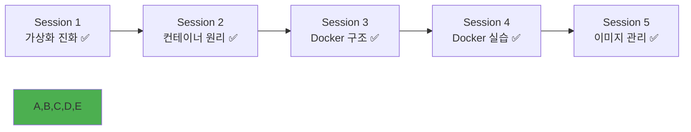

# Week 1 Day 2 Session 5: Docker 실습 - 이미지 관리

<div align="center">

**📦 Docker 이미지 마스터하기** • **커스텀 이미지 제작**

*이미지 빌드부터 레지스트리 관리까지, Docker 이미지의 모든 것*

</div>

---

## 🕘 세션 정보

**시간**: 14:00-14:50 (50분)  
**목표**: Docker 이미지 빌드, 관리, 공유 완전 습득  
**방식**: 페어별 멀티 컨테이너 구성 + 네트워킹 실습 + 문제 해결 경험

---

## 🎯 세션 목표

### 📚 학습 목표
- **이해 목표**: Docker 이미지 구조와 레이어 시스템 완전 이해
- **적용 목표**: Dockerfile 작성과 이미지 빌드, 태깅, 배포 과정 습득
- **협업 목표**: 페어 프로그래밍을 통한 이미지 제작 및 공유 경험

### 🤔 왜 필요한가? (3분)
**Docker 이미지 관리의 중요성**:
- 💼 **실무 핵심**: 모든 컨테이너 배포의 시작점이 되는 이미지 관리
- 🏠 **일상 비유**: 요리 레시피(Dockerfile)로 요리(이미지)를 만들어 나눠먹는 것
- 📊 **효율성**: 이미지 최적화로 배포 속도와 저장공간 효율성 확보

---

## 🛠️ 실습 내용 (42분)

### 🚀 Phase 1: 오픈 이미지 활용 기초 (12분)

#### Step 1: 다양한 오픈 이미지 탐색 (6분)
```bash
# 인기 있는 오픈 이미지들 확인
docker search nginx
docker search mysql
docker search redis

# 공식 이미지들 다운로드
docker pull nginx:alpine
docker pull mysql:8.0
docker pull redis:7-alpine
docker pull adminer:latest

# 이미지 크기 및 정보 비교
docker images
docker history nginx:alpine
docker history mysql:8.0
```

**🔍 관찰 포인트**:
- 공식 이미지 vs 커뮤니티 이미지의 차이
- alpine 태그의 특징 (경량화)
- 이미지 크기와 레이어 구조 비교

#### Step 2: 단일 컨테이너 실행 테스트 (6분)
```bash
# 웹 서버 실행
docker run -d -p 8080:80 --name web-server nginx:alpine

# 데이터베이스 실행 (환경변수 설정)
docker run -d \
  --name mysql-db \
  -e MYSQL_ROOT_PASSWORD=rootpass \
  -e MYSQL_DATABASE=testdb \
  -e MYSQL_USER=testuser \
  -e MYSQL_PASSWORD=testpass \
  mysql:8.0

# Redis 캐시 서버 실행
docker run -d --name redis-cache redis:7-alpine

# 실행 상태 확인
docker ps

# 각 서비스 로그 확인
docker logs web-server
docker logs mysql-db
docker logs redis-cache
```

**🔍 관찰 포인트**:
- 환경변수를 통한 컨테이너 설정
- 각 서비스의 시작 시간과 로그 패턴
- 컨테이너 간 격리 상태

#### ✅ Phase 1 체크포인트
- [ ] 다양한 오픈 이미지 다운로드 완료
- [ ] 개별 컨테이너 실행 및 확인 완료
- [ ] 환경변수 설정 방법 이해

### 🌟 Phase 2: 멀티 컨테이너 통신 구성 (20분)

#### 🤝 페어별 멀티 컨테이너 애플리케이션 구축
**페어 구성**: 2명씩 페어링 (6개 페어)

**페어별 선택 프로젝트** (자유 선택):
- **Option 1**: 웹 + 데이터베이스 + 관리도구 (Nginx + MySQL + Adminer)
- **Option 2**: 웹 + 캐시 + 데이터베이스 (Nginx + Redis + MySQL)
- **Option 3**: 로드밸런서 + 웹서버 + 모니터링 (Nginx + Apache + Grafana)
- **Option 4**: 자유 구성 (관심 있는 서비스 조합)

#### Step 1: Docker 네트워크 생성 (5분)
```bash
# 페어별 커스텀 네트워크 생성 (페어 번호 사용)
docker network create pair1-network  # 페어1
docker network create pair2-network  # 페어2
# ... 각 페어별로 고유한 네트워크 이름 사용

# 네트워크 목록 확인
docker network ls

# 네트워크 상세 정보 확인
docker network inspect pair1-network
```

**🚨 의도적 오류 포인트 1**: 네트워크 이름 중복
```bash
# 같은 이름으로 네트워크 재생성 시도 (오류 발생)
docker network create pair1-network
# Error: network with name pair1-network already exists
```
**💡 힌트**: `docker network ls`로 기존 네트워크 확인 후 다른 이름 사용

#### Step 2: 페어별 멀티 컨테이너 구성 (10분)

**Option 1 선택 시**: 웹 + DB + 관리도구
```bash
# MySQL 데이터베이스 실행 (페어별 고유 이름 사용)
docker run -d \
  --name pair1-mysql \
  --network pair1-network \
  -e MYSQL_ROOT_PASSWORD=rootpass123 \
  -e MYSQL_DATABASE=webapp \
  -e MYSQL_USER=webuser \
  -e MYSQL_PASSWORD=webpass123 \
  mysql:8.0

# 웹 서버 실행
docker run -d \
  --name pair1-web \
  --network pair1-network \
  -p 8081:80 \
  nginx:alpine

# Adminer (DB 관리 도구) 실행
docker run -d \
  --name pair1-adminer \
  --network pair1-network \
  -p 8082:8080 \
  adminer:latest
```

**🚨 의도적 오류 포인트 2**: 포트 충돌
```bash
# 같은 포트로 다른 컨테이너 실행 시도 (오류 발생)
docker run -d -p 8081:80 --name another-web nginx:alpine
# Error: port is already allocated
```
**💡 힌트**: 페어별로 다른 포트 사용 (8081-8082, 8083-8084, 8085-8086 등)

**Option 2 선택 시**: 웹 + 캐시 + DB
```bash
# Redis 캐시 서버
docker run -d \
  --name pair2-redis \
  --network pair2-network \
  redis:7-alpine

# MySQL 데이터베이스
docker run -d \
  --name pair2-mysql \
  --network pair2-network \
  -e MYSQL_ROOT_PASSWORD=rootpass123 \
  -e MYSQL_DATABASE=cacheapp \
  mysql:8.0

# Nginx 웹 서버
docker run -d \
  --name pair2-web \
  --network pair2-network \
  -p 8083:80 \
  nginx:alpine
```

**Option 3 선택 시**: 로드밸런서 + 웹서버 + 모니터링
```bash
# Apache 웹 서버들 (다중 인스턴스)
docker run -d \
  --name pair3-web1 \
  --network pair3-network \
  httpd:alpine

docker run -d \
  --name pair3-web2 \
  --network pair3-network \
  httpd:alpine

# Nginx 로드밸런서
docker run -d \
  --name pair3-lb \
  --network pair3-network \
  -p 8085:80 \
  nginx:alpine

# Grafana 모니터링
docker run -d \
  --name pair3-grafana \
  --network pair3-network \
  -p 8086:3000 \
  -e GF_SECURITY_ADMIN_PASSWORD=admin123 \
  grafana/grafana:latest
```

#### Step 3: 컨테이너 간 통신 테스트 (5분)
```bash
# 네트워크 내 컨테이너 확인 (각 페어별)
docker network inspect pair1-network

# 컨테이너 간 ping 테스트 (예시: Option 1 선택 페어)
docker exec pair1-web ping pair1-mysql
docker exec pair1-adminer ping pair1-mysql

# 서비스 연결 테스트
docker exec pair1-adminer nslookup pair1-mysql

# Option 2 선택 페어 예시
docker exec pair2-web ping pair2-redis
docker exec pair2-web ping pair2-mysql
```

**🚨 의도적 오류 포인트 3**: 네트워크 연결 문제
```bash
# 다른 네트워크의 컨테이너와 통신 시도 (오류 발생)
docker run -d --name isolated-container nginx:alpine
docker exec pair1-web ping isolated-container
# ping: bad address 'isolated-container'
```
**💡 힌트**: 같은 네트워크에 있는 컨테이너끼리만 이름으로 통신 가능

#### ✅ Phase 2 체크포인트
- [ ] 페어별 멀티 컨테이너 구성 완료
- [ ] 컨테이너 간 네트워크 통신 확인
- [ ] 서비스 간 연결 테스트 완료

### 🏆 Phase 3: 통합 테스트와 문제 해결 (10분)

#### Step 1: 전체 서비스 상태 확인 (3분)
```bash
# 모든 컨테이너 상태 확인
docker ps -a

# 네트워크 연결 상태 확인 (각 페어별)
docker network inspect pair1-network
docker network inspect pair2-network

# 리소스 사용량 확인
docker stats --no-stream
```

#### Step 2: 서비스 접속 테스트 (4분)
```bash
# 각 페어의 서비스 접속 테스트
# Option 1 선택 페어: http://localhost:8081 (웹), http://localhost:8082 (Adminer)
# Option 2 선택 페어: http://localhost:8083 (웹)
# Option 3 선택 페어: http://localhost:8085 (로드밸런서), http://localhost:8086 (Grafana)

# 브라우저에서 접속 확인
# Adminer에서 MySQL 연결 테스트 (pair1-mysql:3306)
# Grafana 로그인 (admin/admin123)
```

**🚨 의도적 오류 포인트 4**: 서비스 시작 순서 문제
```bash
# MySQL이 완전히 시작되기 전에 연결 시도 (오류 발생)
# Adminer에서 "Connection refused" 오류
```
**💡 힌트**: `docker logs mysql-container`로 "ready for connections" 메시지 확인

#### Step 3: 환경 정리 (3분)
```bash
# 모든 컨테이너 중지 및 제거
docker stop $(docker ps -q)
docker rm $(docker ps -aq)

# 네트워크 제거 (각 페어별)
docker network rm pair1-network pair2-network pair3-network

# 시스템 정리
docker system prune -f
```

#### ✅ Phase 3 체크포인트
- [ ] 전체 멀티 컨테이너 애플리케이션 동작 확인
- [ ] 서비스 간 통신 및 연결 테스트 완료
- [ ] 발생한 오류들을 페어워크로 해결 완료

---

## 💭 페어별 결과 발표 및 공유 (5분)

### 🎤 페어별 발표 (3분)
**발표 내용** (페어당 30초):
1. **선택한 구성**: 어떤 옵션을 선택했고 왜 선택했는지
2. **구현 결과**: 멀티 컨테이너 통신이 잘 동작하는지
3. **발생한 문제**: 실습 중 만난 오류와 해결 방법
4. **배운 점**: 멀티 컨테이너 구성에서 배운 점

### 🤝 전체 공유 및 비교 (2분)
- **구성 비교**: 페어별로 선택한 서비스 조합과 특징
- **네트워킹 이해**: 컨테이너 간 통신 방법과 네트워크 격리
- **문제 해결**: 공통으로 발생한 문제들과 해결 방법
- **실무 적용**: 실제 개발 환경에서 활용할 수 있는 패턴들

### 💡 이해도 체크 질문
- ✅ "Dockerfile의 각 명령어가 어떻게 레이어를 만드는지 설명할 수 있나요?"
- ✅ "이미지 크기를 줄이는 방법들을 설명할 수 있나요?"
- ✅ "이미지를 다른 사람과 공유하는 방법들을 설명할 수 있나요?"

---

## 🔑 핵심 키워드

### 오픈 이미지 활용
- **Official Images**: Docker Hub 공식 이미지
- **Community Images**: 커뮤니티 제작 이미지
- **Alpine Images**: 경량화된 Linux 배포판 기반
- **Environment Variables**: 환경변수를 통한 컨테이너 설정

### 멀티 컨테이너 네트워킹
- **docker network create**: 커스텀 네트워크 생성
- **--network**: 컨테이너를 특정 네트워크에 연결
- **Container Name Resolution**: 컨테이너 이름으로 통신
- **Service Discovery**: 네트워크 내 서비스 자동 발견

### 컨테이너 간 통신
- **Internal Communication**: 네트워크 내부 통신
- **Port Mapping**: 외부 접근을 위한 포트 매핑
- **DNS Resolution**: 컨테이너 이름 기반 DNS 해석
- **Network Isolation**: 네트워크별 격리

### 문제 해결 및 디버깅
- **docker logs**: 컨테이너 로그 확인
- **docker exec**: 컨테이너 내부 접근
- **docker network inspect**: 네트워크 상태 확인
- **nslookup/ping**: 네트워크 연결 테스트

---

## 📝 세션 마무리

### ✅ 오늘 세션 성과
- [ ] 다양한 오픈 이미지 활용법 완전 이해
- [ ] 멀티 컨테이너 네트워킹과 통신 구현 완료
- [ ] 페어 협업을 통한 복합 서비스 구축 경험
- [ ] 컨테이너 간 통신 문제 해결 능력 습득

### 🎯 Day 2 전체 성과
- [ ] 가상화 기술의 진화 과정 완전 이해 ✅
- [ ] 컨테이너 핵심 기술 원리 파악 ✅
- [ ] Docker 아키텍처 전체 구조 이해 ✅
- [ ] Docker CLI 명령어 실전 활용 ✅
- [ ] 멀티 컨테이너 통신 및 네트워킹 ✅

### 🔮 내일 준비사항
- **주제**: Docker 심화 - Dockerfile 최적화와 멀티스테이지 빌드
- **준비사항**: 
  - 오늘 만든 이미지들 보관 (내일 최적화 실습에 활용)
  - 더 복잡한 애플리케이션 컨테이너화 아이디어 생각해보기
- **연결고리**: 기본 이미지 제작 → 고급 최적화 기법 → 프로덕션 준비

### 📊 Day 2 완주!


---

## 🎉 Day 2 완벽 완주!

### 🌟 오늘의 완전한 성취
- **이론 완성**: 가상화부터 컨테이너까지 완벽한 이해 ✅
- **실습 완성**: Docker 명령어부터 이미지 제작까지 실전 경험 ✅
- **협업 완성**: 페어 프로그래밍을 통한 협업과 상호 학습 ✅
- **창작 완성**: 각 페어만의 독창적인 멀티 컨테이너 구성 제작 ✅

### 🚀 내일을 향한 완벽한 준비
- **기술적 기반**: Docker 기초부터 고급까지 탄탄한 기반 ✅
- **실무 역량**: 실제 애플리케이션 컨테이너화 경험 ✅
- **협업 경험**: 페어 프로그래밍을 통한 협업 경험 ✅
- **문제 해결**: 실습 중 발생한 다양한 문제 해결 경험 ✅

---

<div align="center">

**🐳 Docker 이미지 관리를 완전히 마스터했습니다**

*Dockerfile 작성부터 이미지 최적화까지, 실전 Docker 개발 능력 완성*

**이전**: [Session 4 - Docker 기본 실습](./session_4.md) | **내일**: [Day 3 - Docker 심화](../day3/README.md)

</div>