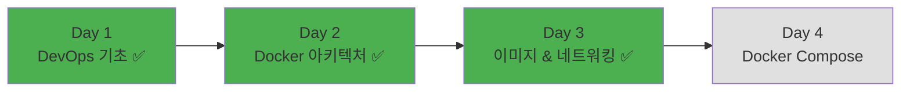

# Week 1 Day 3: Docker 이미지 & 네트워킹 & 스토리지

<div align="center">


**📦 이미지 구조 마스터** • **🌐 네트워킹 & 💾 스토리지**

*Dockerfile부터 데이터 영속성까지, Docker 핵심 기능 통합 학습*

</div>

---

## 🎯 일일 학습 목표

### 📚 핵심 목표
- **Docker 이미지 구조**: 레이어 시스템과 최적화 전략 완전 이해
- **Dockerfile 마스터**: 효율적이고 안전한 이미지 빌드 기법 습득
- **네트워킹 & 스토리지**: 컨테이너 간 통신과 데이터 영속성 구현
- **통합 실습**: 실무 수준의 멀티 컨테이너 환경 구축

### 🤝 협업 목표
- **페어 프로그래밍**: Dockerfile 작성 및 리뷰
- **팀 프로젝트**: 3-tier 웹 애플리케이션 아키텍처 구축
- **지식 공유**: 이미지 최적화 방법과 네트워크 구성 전략 공유

---

## 🕘 일일 스케줄

### 📊 시간 배분
```
📚 이론 강의: 2.5시간 (31.25%) - 50분×3세션
🛠️ 실습 챌린지: 3시간 (37.5%) - 통합 실습
👥 학생 케어: 2.5시간 (31.25%) - 개별 지원 강화
```

### 🗓️ 상세 스케줄
| 시간 | 구분 | 내용 | 목적 |
|------|------|------|------|
| **09:00-09:50** | 📚 이론 1 | [Docker 이미지 구조](./session_1.md) | 레이어 시스템 이해 |
| **09:50-10:00** | ☕ 휴식 | 10분 휴식 | |
| **10:00-10:50** | 📚 이론 2 | [Dockerfile 작성법](./session_2.md) | 이미지 빌드 마스터 |
| **10:50-11:00** | ☕ 휴식 | 10분 휴식 | |
| **11:00-11:50** | 📚 이론 3 | [네트워킹 & 스토리지](./session_3.md) | 데이터 관리 |
| **11:50-13:00** | 🍽️ 점심 | 점심시간 (70분) | |
| **13:00-16:00** | 🛠️ 챌린지 | 이미지 빌드 & 네트워크 실습 | 실무 적용 |
| **16:00-16:15** | ☕ 휴식 | 15분 휴식 | |
| **16:15-18:00** | 👥 케어 | 개별 멘토링 & 회고 | 맞춤 지원 |

---

## 📚 세션별 개요

### [Session 1: Docker 이미지 구조와 레이어 시스템](./session_1.md)
**시간**: 09:00-09:50 (50분)

#### 🎯 핵심 내용
- **이미지 레이어 구조**: 읽기 전용 레이어의 스택 구조
- **레이어 공유 효율성**: 저장 공간 절약과 빌드 속도 향상
- **이미지 식별과 태깅**: Repository, Tag, Image ID 관리
- **최적화 기법**: 멀티스테이지 빌드와 Alpine Linux 활용

#### 🔑 핵심 키워드
- Layer, Union File System, Image ID, Tag
- Multi-stage Build, Alpine Linux, Layer Caching

### [Session 2: Dockerfile 작성법과 베스트 프랙티스](./session_2.md)
**시간**: 10:00-10:50 (50분)

#### 🎯 핵심 내용
- **Dockerfile 문법**: FROM, WORKDIR, COPY, RUN, CMD 등 주요 명령어
- **멀티스테이지 빌드**: 빌드와 런타임 환경 분리로 이미지 최적화
- **베스트 프랙티스**: 보안, 성능, 유지보수성을 고려한 작성법
- **레이어 최적화**: 캐시 활용과 빌드 시간 단축 전략

#### 🔑 핵심 키워드
- FROM, WORKDIR, COPY, RUN, CMD
- Multi-stage Build, .dockerignore, 비root 사용자

### [Session 3: Docker 네트워킹과 볼륨 관리](./session_3.md)
**시간**: 11:00-11:50 (50분)

#### 🎯 핵심 내용
- **네트워킹 모델**: bridge, host, none, overlay 네트워크 타입
- **컨테이너 간 통신**: 커스텀 네트워크를 통한 서비스 연결
- **데이터 영속성**: Volumes, Bind Mounts, tmpfs 비교
- **실무 적용**: 마이크로서비스 아키텍처에서의 네트워크 구성

#### 🔑 핵심 키워드
- Bridge Network, Custom Network, Port Mapping
- Docker Volume, Bind Mount, Data Persistence

---

## 🛠️ 실습 챌린지 (3시간)

### 🎯 챌린지 개요
**통합 실습 목표**: 커스텀 이미지 빌드부터 네트워크 구성까지 완전 습득

### 📋 실습 단계
1. **Phase 1 (90분)**: 커스텀 이미지 빌드 & 최적화
   - 기본 Dockerfile 작성
   - 멀티스테이지 빌드로 최적화
   - 이미지 크기 비교 및 분석

2. **Phase 2 (90분)**: 네트워크 구성 & 데이터 영속성
   - 커스텀 네트워크 생성
   - 데이터베이스 볼륨 설정
   - 컨테이너 간 통신 구현

3. **Phase 3 (30분)**: 팀별 통합 프로젝트
   - 3-tier 웹 애플리케이션 구축
   - 팀 협업 및 결과 발표

### 🏆 기대 성과
- 실무 수준의 Dockerfile 작성 능력
- 컨테이너 네트워킹 구성 및 관리
- 데이터 영속성 보장 방법 습득
- 팀 협업을 통한 복합 시스템 구축

---

## 👥 학생 케어 (105분)

### 🟢 초급자 케어 (45분)
- Dockerfile 문법 완전 이해 확인
- 이미지 빌드 과정 오류 해결
- 네트워킹과 볼륨 개념 재설명
- 실습 결과물 완성도 점검

### 🟡 중급자 케어 (45분)
- 이미지 최적화 고급 기법 토론
- 실무 네트워크 보안 고려사항
- 팀 프로젝트 리더십 경험 공유
- 내일 Docker Compose 학습 준비

### 🔴 고급자 케어 (15분)
- 컨테이너 보안 스캔 도구 활용
- 이미지 레지스트리 구축 방안
- 네트워크 정책 및 마이크로세그멘테이션
- 오픈소스 기여를 위한 Dockerfile 작성

---

## 📝 일일 마무리

### ✅ 성취 목표
- [ ] Docker 이미지 레이어 구조 완전 이해
- [ ] 효율적인 Dockerfile 작성 능력 습득
- [ ] 컨테이너 네트워킹과 데이터 관리 구현
- [ ] 팀 협업을 통한 멀티 컨테이너 시스템 구축

### 🎯 내일 준비사항
- **예습**: Docker Compose YAML 문법 기초
- **복습**: 오늘 작성한 Dockerfile 최적화 방안 정리
- **환경**: 멀티 컨테이너 실습을 위한 환경 준비

### 📊 학습 진도


---

<div align="center">

**📦 이미지 빌드 마스터** • **🌐 네트워킹 구성 완료** • **💾 데이터 영속성 구현**

*Docker의 핵심 기능들을 통합적으로 활용할 수 있게 되었습니다*

**다음**: [Day 4 - Docker Compose & 멀티 컨테이너](../day4/README.md)

</div>