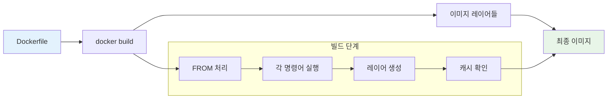
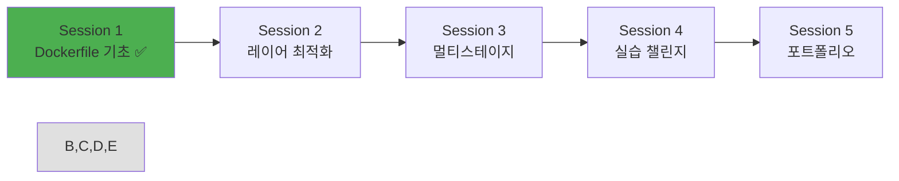

# Week 1 Day 3 Session 1: Dockerfile 기초와 명령어

<div align="center">

**🏗️ Dockerfile 문법 완전 정복** • **커스텀 이미지 제작 시작**

*FROM부터 ENTRYPOINT까지, Dockerfile의 모든 명령어 마스터하기*

</div>

---

## 🕘 세션 정보

**시간**: 09:00-09:50 (50분)  
**목표**: Dockerfile 기본 문법과 모든 명령어 완전 습득  
**방식**: 페어 프로그래밍 + 단계별 실습 + 코드 리뷰

---

## 🎯 세션 목표

### 📚 학습 목표
- **이해 목표**: Dockerfile의 모든 명령어와 작동 원리 완전 이해
- **적용 목표**: 실제 애플리케이션을 위한 Dockerfile 작성 능력
- **협업 목표**: 페어 프로그래밍을 통한 Dockerfile 코드 리뷰 경험

### 🤔 왜 필요한가? (3분)
**Dockerfile 마스터의 중요성**:
- 💼 **실무 필수**: 모든 컨테이너 배포의 시작점
- 🏠 **일상 비유**: 집을 짓는 설계도면과 같은 역할
- 📊 **효율성**: 올바른 Dockerfile로 크기, 보안, 성능 최적화

---

## 📖 핵심 개념 (35분)

### 🔍 개념 1: Dockerfile 기본 구조 (12분)

#### Dockerfile이란?
> **정의**: 컨테이너 이미지를 자동으로 빌드하기 위한 텍스트 파일

**기본 구조**:
```dockerfile
# 주석: 베이스 이미지 선택
FROM ubuntu:20.04

# 메타데이터 추가
LABEL maintainer="developer@example.com"
LABEL version="1.0"

# 작업 디렉토리 설정
WORKDIR /app

# 파일 복사
COPY . .

# 패키지 설치
RUN apt-get update && apt-get install -y python3

# 포트 노출
EXPOSE 8000

# 실행 명령
CMD ["python3", "app.py"]
```

**Dockerfile 작성 원칙**:
- **한 줄 한 명령**: 각 명령어는 새로운 레이어 생성
- **순서 중요**: 명령어 순서가 빌드 효율성에 영향
- **캐시 활용**: 변경이 적은 명령어를 앞쪽에 배치
- **명확성**: 주석과 라벨로 의도 명확히 표현

#### 빌드 과정 이해


### 🔍 개념 2: 필수 명령어 완전 정복 (12분)

#### FROM - 베이스 이미지 선택
```dockerfile
# 공식 이미지 사용 (권장)
FROM node:18-alpine

# 특정 버전 지정 (안정성)
FROM python:3.11-slim

# 멀티스테이지 빌드용
FROM golang:1.19 AS builder
```

**베이스 이미지 선택 기준**:
- **공식 이미지**: Docker Hub 공식 이미지 우선
- **태그 명시**: latest 태그 사용 금지
- **크기 고려**: alpine, slim 버전 활용
- **보안성**: 정기 업데이트되는 이미지 선택

#### RUN - 빌드 시 명령 실행
```dockerfile
# 단일 명령어
RUN apt-get update

# 여러 명령어 체이닝 (레이어 최소화)
RUN apt-get update && \
    apt-get install -y python3 python3-pip && \
    apt-get clean && \
    rm -rf /var/lib/apt/lists/*

# 패키지 설치 최적화 패턴
RUN apt-get update && apt-get install -y \
    curl \
    git \
    vim \
    && rm -rf /var/lib/apt/lists/*
```

#### COPY vs ADD - 파일 복사
```dockerfile
# COPY: 단순 파일 복사 (권장)
COPY package.json /app/
COPY src/ /app/src/

# ADD: 고급 기능 (URL, 압축 해제)
ADD https://example.com/file.tar.gz /tmp/
ADD archive.tar.gz /app/  # 자동 압축 해제
```

**COPY vs ADD 선택 기준**:
- **COPY**: 일반적인 파일 복사 (90% 상황)
- **ADD**: URL 다운로드나 압축 해제 필요 시만

#### WORKDIR - 작업 디렉토리
```dockerfile
# 절대 경로 사용 권장
WORKDIR /app

# 디렉토리 자동 생성
WORKDIR /app/src/components

# 환경변수 사용 가능
ENV APP_HOME /application
WORKDIR $APP_HOME
```

### 🔍 개념 3: 고급 명령어와 베스트 프랙티스 (11분)

#### ENV - 환경변수 설정
```dockerfile
# 단일 환경변수
ENV NODE_ENV production

# 여러 환경변수 (한 레이어로)
ENV NODE_ENV=production \
    PORT=3000 \
    DATABASE_URL=postgresql://localhost/mydb

# 빌드 시에만 사용하는 변수
ARG BUILD_VERSION=1.0
ENV APP_VERSION=$BUILD_VERSION
```

#### EXPOSE - 포트 노출 선언
```dockerfile
# 단일 포트
EXPOSE 3000

# 여러 포트
EXPOSE 3000 8080

# 프로토콜 명시
EXPOSE 53/udp
EXPOSE 80/tcp
```

**주의사항**: EXPOSE는 문서화 목적, 실제 포트 바인딩은 docker run -p

#### USER - 보안 강화
```dockerfile
# 비root 사용자 생성 및 사용
RUN groupadd -r appuser && useradd -r -g appuser appuser
USER appuser

# 또는 기존 사용자 활용
USER node  # node 이미지의 기본 사용자
```

#### VOLUME - 데이터 영속성
```dockerfile
# 볼륨 마운트 포인트 선언
VOLUME ["/data", "/logs"]

# 단일 볼륨
VOLUME /var/lib/mysql
```

#### CMD vs ENTRYPOINT - 실행 명령
```dockerfile
# CMD: 기본 명령어 (오버라이드 가능)
CMD ["python", "app.py"]
CMD python app.py  # shell form (비권장)

# ENTRYPOINT: 고정 명령어 (오버라이드 불가)
ENTRYPOINT ["python", "app.py"]

# 조합 사용 (유연성 + 고정성)
ENTRYPOINT ["python", "app.py"]
CMD ["--port", "8000"]
```

**CMD vs ENTRYPOINT 선택 기준**:
- **CMD**: 일반적인 애플리케이션 실행
- **ENTRYPOINT**: 특정 도구나 스크립트 실행
- **조합**: 기본 명령어 + 옵션 매개변수

---

## 💭 함께 생각해보기 (10분)

### 🤝 페어 토론 (5분)
**토론 주제**:
1. "어떤 상황에서 어떤 베이스 이미지를 선택하시겠어요?"
2. "RUN 명령어를 체이닝하는 이유는 무엇일까요?"
3. "보안을 위해 Dockerfile에서 주의해야 할 점들은?"

**페어 활동 가이드**:
- 👥 **경험 공유**: 각자 알고 있는 Docker 경험 공유
- 🔄 **코드 리뷰**: 간단한 Dockerfile 예제 함께 검토
- 📝 **베스트 프랙티스**: 좋은 Dockerfile 작성 원칙 정리

### 🎯 전체 공유 (5분)
- **인사이트 공유**: 페어 토론에서 나온 좋은 아이디어
- **질문 수집**: 아직 이해가 어려운 명령어나 개념
- **실습 준비**: 다음 세션 실습을 위한 준비 상태 확인

### 💡 이해도 체크 질문
- ✅ "FROM과 RUN 명령어의 차이점을 설명할 수 있나요?"
- ✅ "COPY와 ADD 중 어떤 것을 언제 사용해야 하나요?"
- ✅ "CMD와 ENTRYPOINT의 차이점과 사용 시나리오는?"

---

## 🔑 핵심 키워드

### 기본 명령어
- **FROM**: 베이스 이미지 선택 (필수)
- **RUN**: 빌드 시 명령 실행
- **COPY**: 파일 복사 (권장)
- **ADD**: 고급 파일 복사 (URL, 압축)
- **WORKDIR**: 작업 디렉토리 설정

### 설정 명령어
- **ENV**: 환경변수 설정
- **ARG**: 빌드 시 변수
- **EXPOSE**: 포트 노출 선언
- **VOLUME**: 볼륨 마운트 포인트
- **USER**: 실행 사용자 설정

### 실행 명령어
- **CMD**: 기본 실행 명령 (오버라이드 가능)
- **ENTRYPOINT**: 고정 실행 명령
- **HEALTHCHECK**: 컨테이너 상태 확인
- **ONBUILD**: 하위 이미지 빌드 시 실행

### 메타데이터
- **LABEL**: 이미지 메타데이터
- **MAINTAINER**: 관리자 정보 (deprecated)
- **SHELL**: 기본 셸 변경

---

## 📝 세션 마무리

### ✅ 오늘 세션 성과
- [ ] Dockerfile 기본 구조와 작동 원리 완전 이해
- [ ] 모든 주요 명령어의 사용법과 차이점 습득
- [ ] 베스트 프랙티스와 보안 고려사항 파악
- [ ] 페어 프로그래밍을 통한 코드 리뷰 경험

### 🎯 다음 세션 준비
- **주제**: 이미지 레이어와 최적화 기법
- **연결고리**: Dockerfile 기본 문법 → 레이어 구조 이해 → 최적화 적용
- **준비사항**: 오늘 배운 명령어들을 활용한 실습 준비

### 📊 학습 진도 체크


---

<div align="center">

**🏗️ Dockerfile 기본 문법을 완전히 마스터했습니다**

*FROM부터 ENTRYPOINT까지, 모든 명령어를 자유자재로 활용 가능*

**다음**: [Session 2 - 이미지 레이어와 최적화](./session_2.md)

</div>