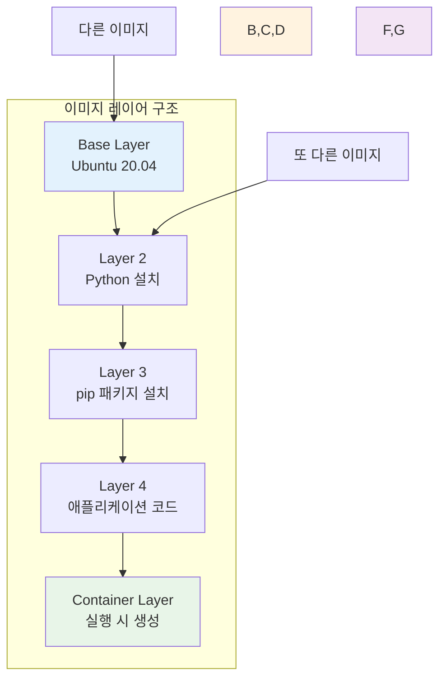
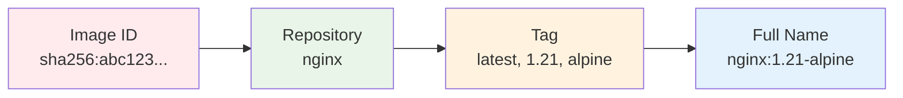
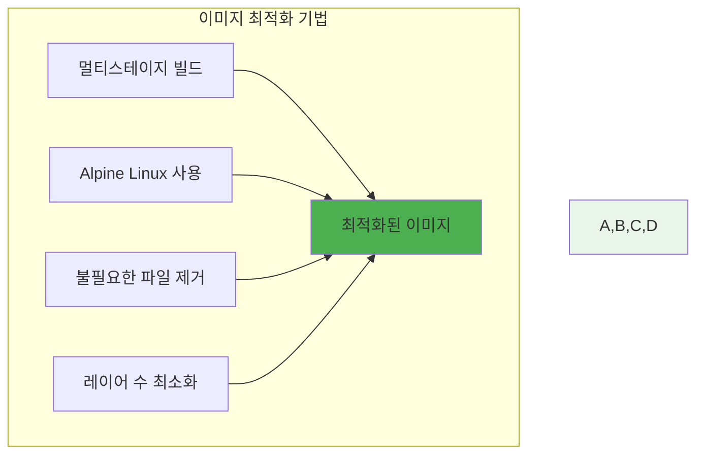

# Week 1 Day 3 Session 1: Docker 이미지 구조와 레이어 시스템

**📦 이미지 레이어 구조** • **효율적인 이미지 관리**

*Docker 이미지의 내부 구조와 레이어 시스템 완전 이해*

---

## 🕘 세션 정보

**시간**: 09:00-09:50 (50분)  
**목표**: Docker 이미지의 레이어 구조와 동작 원리 완전 이해  
**방식**: 구조 분석 + 실습 연계 + 최적화 전략

---

## 🎯 세션 목표

### 📚 학습 목표
- **이해 목표**: Docker 이미지의 레이어 구조와 동작 원리 완전 이해
- **적용 목표**: 이미지 최적화를 위한 레이어 관리 기법 습득
- **협업 목표**: 페어 토론을 통한 이미지 구조 분석 및 최적화 방안 공유

### 🤔 왜 필요한가? (5분)

**현실 문제 상황**:
- 💼 **이미지 크기 문제**: 수 GB 크기의 무거운 이미지로 인한 배포 지연
- 🏠 **일상 비유**: 이사할 때 짐을 효율적으로 포장하는 것과 같은 최적화
- 📊 **시장 동향**: 마이크로서비스 시대에 필수적인 경량 이미지 구축

---

## 📖 핵심 개념 (35분)

### 🔍 개념 1: 이미지 레이어 구조 (12분)

> **정의**: Docker 이미지는 여러 개의 읽기 전용 레이어가 쌓인 구조

**🖼️ Docker 이미지 레이어 구조**

*출처: Docker 공식 문서*

**레이어 시스템의 장점**:

**🖼️ 이미지 공유 효율성**

*동일한 레이어를 여러 이미지가 공유*

**레이어 공유의 효율성**:
- **저장 공간 절약**: 동일한 베이스 이미지 공유
- **네트워크 효율성**: 변경된 레이어만 다운로드
- **빌드 속도 향상**: 캐시된 레이어 재사용

### 🔍 개념 2: 이미지 식별과 태깅 (12분)

> **정의**: 이미지를 구분하고 관리하기 위한 식별 체계

**이미지 식별 방법**:

**태깅 전략**:
- **버전 태그**: `app:1.0.0`, `app:1.0.1`
- **환경 태그**: `app:dev`, `app:staging`, `app:prod`
- **특징 태그**: `app:alpine`, `app:slim`

### 🔍 개념 3: 이미지 최적화 기법 (11분)

> **정의**: 이미지 크기를 줄이고 성능을 향상시키는 방법들

**🖼️ 멀티스테이지 빌드 개념**

*출처: Docker 공식 문서*

**최적화 전략**:

**🖼️ 이미지 크기 비교**

*베이스 이미지별 크기 차이*

**크기 비교 예시**:
| 베이스 이미지 | 크기 | 용도 |
|---------------|------|------|
| `ubuntu:20.04` | 72MB | 일반적인 용도 |
| `node:18` | 993MB | Node.js 개발 |
| `node:18-alpine` | 174MB | 경량 Node.js |
| `node:18-slim` | 244MB | 중간 크기 |

---

## 💭 함께 생각해보기 (10분)

### 🤝 페어 토론 (5분)
**토론 주제**:
1. **레이어 이해**: "이미지 레이어가 공유되는 것의 장점은?"
2. **최적화 방안**: "이미지 크기를 줄이는 다양한 방법들은?"
3. **태깅 전략**: "실무에서 효과적인 이미지 태깅 방법은?"

### 🎯 전체 공유 (5분)
- **최적화 아이디어**: 이미지 크기 줄이기 방안 공유
- **실무 경험**: 이미지 관리 경험 공유

---

## 🔑 핵심 키워드

### 이미지 구조
- **Layer**: 이미지를 구성하는 읽기 전용 계층
- **Union File System**: 여러 레이어를 하나로 합치는 파일시스템
- **Image ID**: 이미지의 고유 식별자 (SHA256 해시)
- **Tag**: 이미지 버전이나 특성을 나타내는 라벨

### 최적화 기법
- **Multi-stage Build**: 빌드와 런타임 환경 분리
- **Alpine Linux**: 경량 리눅스 배포판
- **Layer Caching**: 빌드 시 레이어 캐시 활용
- **.dockerignore**: 불필요한 파일 빌드 제외

---

## 📝 세션 마무리

### ✅ 오늘 세션 성과
- [ ] Docker 이미지 레이어 구조 완전 이해
- [ ] 이미지 식별과 태깅 전략 습득
- [ ] 이미지 최적화 기법 파악
- [ ] 실무 적용을 위한 기반 지식 완성

### 🎯 다음 세션 준비
- **주제**: Dockerfile 작성법과 베스트 프랙티스
- **연결고리**: 이미지 구조 이해 → Dockerfile 최적화
- **준비사항**: 효율적인 Dockerfile 작성 방법 궁금증 가지기

---

**📦 Docker 이미지 구조를 완전히 이해했습니다**

*레이어 시스템과 최적화 전략 완전 파악*

**다음**: [Session 2 - Dockerfile 작성법과 베스트 프랙티스](./session_2.md)

