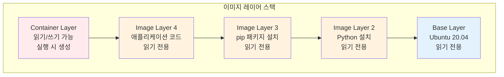
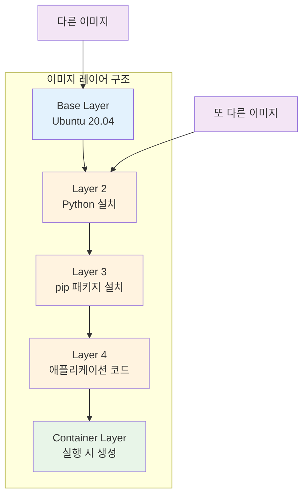
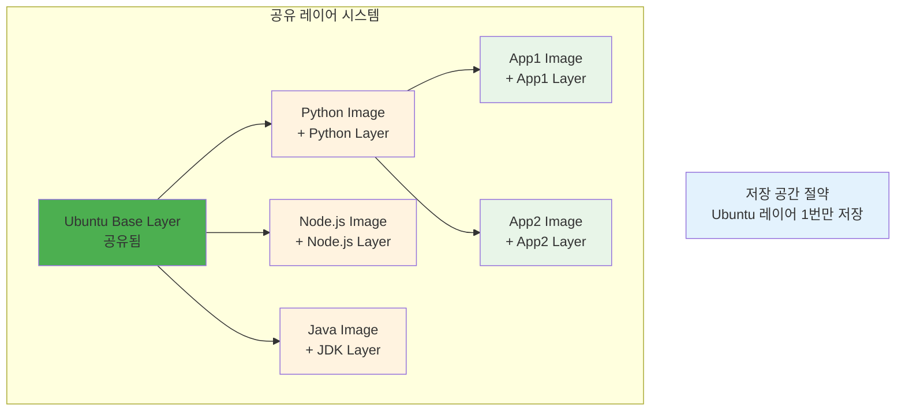
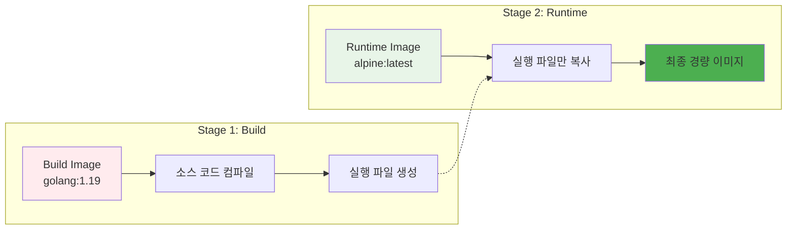
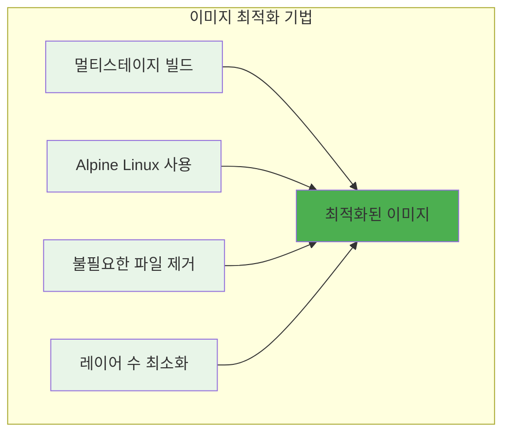
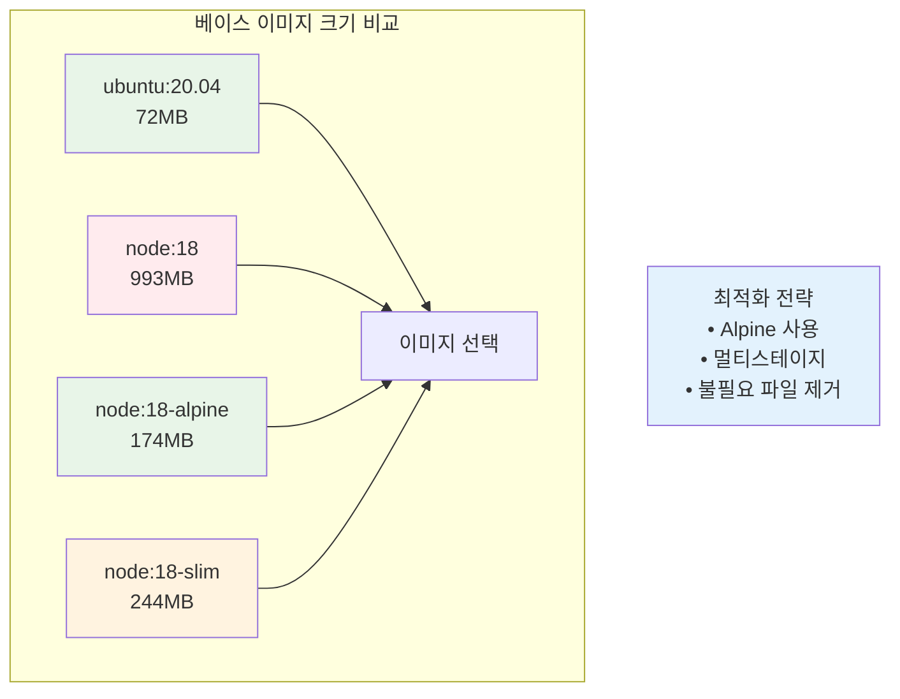

# Week 1 Day 3 Session 1: Docker 이미지 구조와 레이어 시스템

<div align="center">

**📦 이미지 레이어 구조** • **효율적인 이미지 관리**

*Docker 이미지의 내부 구조와 레이어 시스템 완전 이해*

</div>

---

## 🕘 세션 정보

**시간**: 09:00-09:50 (50분)  
**목표**: Docker 이미지의 레이어 구조와 동작 원리 완전 이해  
**방식**: 구조 분석 + 실습 연계 + 최적화 전략

---

## 🎯 세션 목표

### 📚 학습 목표
- **이해 목표**: Docker 이미지의 레이어 구조와 동작 원리 완전 이해
- **적용 목표**: 이미지 최적화를 위한 레이어 관리 기법 습득
- **협업 목표**: 페어 토론을 통한 이미지 구조 분석 및 최적화 방안 공유

### 🤔 왜 필요한가? (5분)

**현실 문제 상황**:
- 💼 **이미지 크기 문제**: 수 GB 크기의 무거운 이미지로 인한 배포 지연
- 🏠 **일상 비유**: 이사할 때 짐을 효율적으로 포장하는 것과 같은 최적화
- 📊 **시장 동향**: 마이크로서비스 시대에 필수적인 경량 이미지 구축

---

## 📖 핵심 개념 (35분)

### 🔍 개념 1: 이미지 레이어 구조 (12분)

> **정의**: Docker 이미지는 여러 개의 읽기 전용 레이어가 쌓인 구조

**📊 Docker 이미지 레이어 구조**

*Docker 이미지의 레이어 구조*

**레이어 시스템의 장점**:


**🔄 이미지 공유 효율성**

*동일한 레이어를 여러 이미지가 공유*

**📊 레이어별 역할 분담**:

### 🔒 **이미지 레이어 (Read-Only)**
```
Layer 4: [App Dependencies]     ← 읽기 전용
Layer 3: [Application Code]     ← 읽기 전용  
Layer 2: [Runtime Environment]  ← 읽기 전용
Layer 1: [Base OS]             ← 읽기 전용
```

### ✏️ **컨테이너 레이어 (Read/Write)**
```
Container Layer: [모든 변경사항]  ← 읽기/쓰기 가능
├── 새로 생성된 파일들
├── 수정된 파일들의 복사본
└── 삭제 마킹된 파일들
```

**📝 실제 동작 예시**:
```bash
# 1. 컨테이너 실행
docker run -it --name demo ubuntu:20.04 bash

# 2. 이미지 레이어의 파일 확인
cat /etc/hostname  # 원본 파일 (이미지 레이어)

# 3. 파일 수정 (Copy-on-Write 발생)
echo "modified-hostname" > /etc/hostname

# 4. 수정된 파일 확인
cat /etc/hostname  # 이제 Container Layer의 복사본을 읽음
```

### 🔍 개념 2: 실습으로 확인하기 (12분)

> **목표**: 레이어 구조와 Copy-on-Write를 실제로 확인해보기

**📝 레이어 구조 확인**
```bash
# 1. 이미지 레이어 확인
docker inspect nginx:alpine | grep -A 10 "RootFS"

# 2. 컨테이너 실행 후 변경사항 확인
docker run -d --name web nginx:alpine
docker exec web sh -c "echo 'test' > /tmp/newfile.txt"

# 3. 컨테이너의 변경사항 확인
docker diff web
# A /tmp/newfile.txt  (A = Added)
# C /var/log          (C = Changed)
```

**🔍 파일 시스템 레이어 확인**
```bash
# 컨테이너의 실제 파일 시스템 위치 확인
docker inspect web | grep MergedDir

# 결과: /var/lib/docker/overlay2/[hash]/merged
# 이 디렉토리가 모든 레이어가 합쳐진 최종 파일 시스템
```

### 🔍 개념 3: 핵심 포인트 정리 (11분)

> **목표**: Docker 레이어 시스템의 핵심 이해사항 정리

**✅ 이해해야 할 점**
1. **이미지 = 읽기 전용 레이어들의 스택**
2. **컨테이너 = 이미지 + 읽기/쓰기 레이어**
3. **파일 수정 시 Copy-on-Write로 컨테이너 레이어에 복사**
4. **여러 컨테이너가 동일한 이미지 레이어 공유**

**🎯 실무 의미**
- **효율성**: 동일한 이미지로 100개 컨테이너 실행해도 이미지는 1개만 저장
- **격리성**: 각 컨테이너의 변경사항은 서로 영향 없음
- **임시성**: 컨테이너 삭제 시 변경사항 모두 사라짐 (데이터 영속성 필요 시 볼륨 사용)

**🏗️ 멀티스테이지 빌드 개념**

*빌드와 런타임 환경 분리*

**최적화 전략**:


**📊 이미지 크기 비교**

*베이스 이미지별 크기 차이*

**크기 비교 예시**:
| 베이스 이미지 | 크기 | 용도 |
|---------------|------|------|
| `ubuntu:20.04` | 72MB | 일반적인 용도 |
| `node:18` | 993MB | Node.js 개발 |
| `node:18-alpine` | 174MB | 경량 Node.js |
| `node:18-slim` | 244MB | 중간 크기 |

---

## 💭 함께 생각해보기 (10분)

### 🤝 페어 토론 (5분)
**토론 주제**:
1. **레이어 이해**: "이미지 레이어가 공유되는 것의 장점은?"
2. **최적화 방안**: "이미지 크기를 줄이는 다양한 방법들은?"
3. **태깅 전략**: "실무에서 효과적인 이미지 태깅 방법은?"

### 🎯 전체 공유 (5분)
- **최적화 아이디어**: 이미지 크기 줄이기 방안 공유
- **실무 경험**: 이미지 관리 경험 공유

---

## 🔑 핵심 키워드

### 이미지 구조
- **Layer**: 이미지를 구성하는 읽기 전용 계층
- **Union File System**: 여러 레이어를 하나로 합치는 파일시스템
- **Image ID**: 이미지의 고유 식별자 (SHA256 해시)
- **Tag**: 이미지 버전이나 특성을 나타내는 라벨

### 최적화 기법
- **Multi-stage Build**: 빌드와 런타임 환경 분리
- **Alpine Linux**: 경량 리눅스 배포판
- **Layer Caching**: 빌드 시 레이어 캐시 활용
- **.dockerignore**: 불필요한 파일 빌드 제외

---

## 📝 세션 마무리

### ✅ 오늘 세션 성과
- [ ] Docker 이미지 레이어 구조 완전 이해
- [ ] 이미지 식별과 태깅 전략 습득
- [ ] 이미지 최적화 기법 파악
- [ ] 실무 적용을 위한 기반 지식 완성

### 🎯 다음 세션 준비
- **주제**: Dockerfile 작성법과 베스트 프랙티스
- **연결고리**: 이미지 구조 이해 → Dockerfile 최적화
- **준비사항**: 효율적인 Dockerfile 작성 방법 궁금증 가지기

---

<div align="center">

**📦 Docker 이미지 구조를 완전히 이해했습니다**

*레이어 시스템과 최적화 전략 완전 파악*

**다음**: [Session 2 - Dockerfile 작성법과 베스트 프랙티스](./session_2.md)

</div>