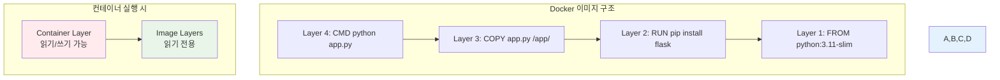
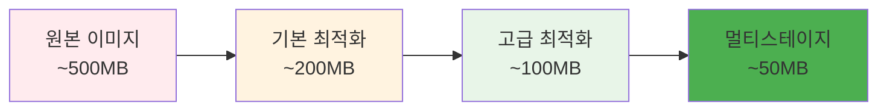

# Week 1 Day 3 Session 2: 이미지 레이어와 최적화

<div align="center">

**📦 Docker 레이어 시스템 이해** • **이미지 최적화 전략**

*레이어 구조부터 크기 최적화까지, 효율적인 이미지 제작의 핵심*

</div>

---

## 🕘 세션 정보

**시간**: 10:00-10:50 (50분)  
**목표**: Docker 레이어 시스템 이해와 이미지 최적화 기법 습득  
**방식**: 이론 + 실습 + 페어 분석 + 최적화 경쟁

---

## 🎯 세션 목표

### 📚 학습 목표
- **이해 목표**: Docker 레이어 시스템과 이미지 구조 완전 이해
- **적용 목표**: 이미지 크기와 빌드 시간 최적화 기법 적용
- **협업 목표**: 페어별 최적화 경쟁을 통한 상호 학습

### 🤔 왜 필요한가? (3분)
**이미지 최적화의 중요성**:
- 💼 **실무 필수**: 배포 속도와 저장 비용 직결
- 🏠 **일상 비유**: 짐을 쌀 때 불필요한 물건을 빼는 것과 같음
- 📊 **효과**: 이미지 크기 50-90% 감소, 빌드 시간 2-5배 단축 가능

---

## 📖 핵심 개념 (35분)

### 🔍 개념 1: Docker 레이어 시스템 이해 (12분)

#### 레이어란?
> **정의**: Dockerfile의 각 명령어가 생성하는 읽기 전용 파일시스템 계층

**레이어 구조 시각화**:


**레이어 생성 명령어**:
```dockerfile
FROM python:3.11-slim    # Layer 1 생성
RUN pip install flask    # Layer 2 생성
COPY app.py /app/        # Layer 3 생성
CMD ["python", "app.py"] # Layer 4 생성
```

#### 레이어 캐싱 메커니즘
```bash
# 레이어 히스토리 확인
docker history my-app:latest

# 레이어별 크기 확인
docker images --format "table {{.Repository}}\t{{.Tag}}\t{{.Size}}"
```

**캐싱 규칙**:
- **변경 감지**: 파일 내용이나 명령어 변경 시 캐시 무효화
- **순차 처리**: 한 레이어가 변경되면 이후 모든 레이어 재빌드
- **컨텍스트 의존**: 빌드 컨텍스트 내 파일 변경도 영향

### 🔍 개념 2: 이미지 크기 최적화 전략 (12분)

#### 1. 베이스 이미지 최적화
```dockerfile
# ❌ 비효율적 - 큰 베이스 이미지
FROM ubuntu:20.04
RUN apt-get update && apt-get install -y python3 python3-pip

# ✅ 효율적 - 경량 베이스 이미지
FROM python:3.11-alpine
```

**베이스 이미지 크기 비교**:
| 베이스 이미지 | 크기 | 용도 |
|---------------|------|------|
| `ubuntu:20.04` | ~72MB | 개발/디버깅 |
| `python:3.11-slim` | ~45MB | 일반적 사용 |
| `python:3.11-alpine` | ~17MB | 프로덕션 |
| `distroless/python3` | ~12MB | 최고 보안 |

#### 2. RUN 명령어 최적화
```dockerfile
# ❌ 비효율적 - 여러 레이어
FROM python:3.11-alpine
RUN apk update
RUN apk add --no-cache gcc musl-dev
RUN pip install flask
RUN apk del gcc musl-dev

# ✅ 효율적 - 단일 레이어
FROM python:3.11-alpine
RUN apk update && \
    apk add --no-cache --virtual .build-deps gcc musl-dev && \
    pip install flask && \
    apk del .build-deps && \
    rm -rf /var/cache/apk/*
```

#### 3. 파일 복사 최적화
```dockerfile
# ❌ 비효율적 - 전체 복사
COPY . /app/

# ✅ 효율적 - 선택적 복사
COPY requirements.txt /app/
RUN pip install -r requirements.txt
COPY src/ /app/src/
```

#### 4. .dockerignore 활용
```dockerignore
# .dockerignore 파일
node_modules/
npm-debug.log
.git/
.gitignore
README.md
.env
.nyc_output
coverage/
.nyc_output
.coverage
.pytest_cache
__pycache__/
*.pyc
*.pyo
*.pyd
.Python
```

### 🔍 개념 3: 고급 최적화 기법 (11분)

#### 1. 멀티스테이지 빌드 미리보기
```dockerfile
# 빌드 스테이지
FROM node:18-alpine AS builder
WORKDIR /app
COPY package*.json ./
RUN npm ci --only=production

# 런타임 스테이지
FROM node:18-alpine AS runtime
WORKDIR /app
COPY --from=builder /app/node_modules ./node_modules
COPY src/ ./src/
CMD ["node", "src/index.js"]
```

#### 2. 보안 최적화
```dockerfile
# 비root 사용자 생성
RUN addgroup -g 1001 -S nodejs && \
    adduser -S nextjs -u 1001

# 권한 설정
COPY --chown=nextjs:nodejs . .
USER nextjs

# 불필요한 패키지 제거
RUN apk add --no-cache --virtual .gyp python3 make g++ && \
    npm install && \
    apk del .gyp
```

#### 3. 빌드 컨텍스트 최적화
```bash
# 빌드 컨텍스트 크기 확인
docker build --no-cache -t test . 2>&1 | grep "Sending build context"

# 특정 디렉토리만 빌드 컨텍스트로 사용
docker build -f Dockerfile.prod ./dist
```

**최적화 체크리스트**:
- [ ] 경량 베이스 이미지 사용
- [ ] RUN 명령어 체이닝
- [ ] .dockerignore 파일 작성
- [ ] 불필요한 패키지 설치 후 제거
- [ ] 캐시 친화적 레이어 순서
- [ ] 비root 사용자 설정

---

## 💭 함께 생각해보기 (10분)

### 🤝 페어 최적화 경쟁 (7분)
**경쟁 미션**: 주어진 Dockerfile을 최대한 최적화하기

**원본 Dockerfile** (비효율적 버전):
```dockerfile
FROM ubuntu:20.04

RUN apt-get update
RUN apt-get install -y python3
RUN apt-get install -y python3-pip
RUN apt-get install -y curl
RUN apt-get install -y git

COPY . /app/
WORKDIR /app

RUN pip3 install flask
RUN pip3 install requests
RUN pip3 install gunicorn

EXPOSE 8000

CMD python3 app.py
```

**페어 활동**:
- 👥 **분석**: 현재 Dockerfile의 문제점 찾기
- 🔧 **최적화**: 배운 기법들을 적용하여 개선
- 📊 **측정**: 예상 크기 감소율 계산
- 🏆 **경쟁**: 가장 많이 최적화한 페어 선정

### 🎯 전체 공유 (3분)
- **최적화 결과**: 각 페어의 최적화 결과 발표
- **기법 공유**: 사용한 최적화 기법과 효과
- **우승 페어**: 가장 효과적인 최적화 달성 페어 선정

### 💡 이해도 체크 질문
- ✅ "Docker 레이어가 어떻게 생성되고 캐싱되는지 설명할 수 있나요?"
- ✅ "이미지 크기를 줄이는 5가지 방법을 말할 수 있나요?"
- ✅ ".dockerignore 파일의 역할과 중요성을 설명할 수 있나요?"

---

## 🔑 핵심 키워드

### 레이어 시스템
- **Layer**: Dockerfile 명령어별 파일시스템 계층
- **Layer Caching**: 레이어 재사용을 통한 빌드 최적화
- **Layer History**: docker history로 레이어 구조 확인
- **Union File System**: 여러 레이어를 하나로 합치는 시스템

### 크기 최적화
- **Alpine Linux**: 경량 Linux 배포판 (5MB)
- **Slim Images**: 불필요한 패키지 제거된 이미지
- **Distroless**: 런타임만 포함된 최소 이미지
- **Multi-stage Build**: 빌드와 런타임 분리

### 빌드 최적화
- **Build Context**: 빌드에 사용되는 파일들
- **.dockerignore**: 빌드 컨텍스트에서 제외할 파일 목록
- **Layer Ordering**: 캐시 효율성을 위한 명령어 순서
- **Command Chaining**: 여러 명령어를 하나의 RUN으로 결합

### 보안 최적화
- **Non-root User**: 보안을 위한 비root 사용자 실행
- **Package Cleanup**: 설치 후 불필요한 패키지 제거
- **Minimal Attack Surface**: 공격 표면 최소화
- **Security Scanning**: 취약점 스캔 도구 활용

---

## 📝 세션 마무리

### ✅ 오늘 세션 성과
- [ ] Docker 레이어 시스템과 캐싱 메커니즘 완전 이해
- [ ] 이미지 크기 최적화 기법 5가지 이상 습득
- [ ] 실제 Dockerfile 최적화 경험 및 효과 측정
- [ ] 페어 경쟁을 통한 최적화 노하우 공유

### 🎯 다음 세션 준비
- **주제**: 멀티스테이지 빌드와 고급 최적화
- **연결고리**: 기본 최적화 → 멀티스테이지 빌드 → 프로덕션 최적화
- **준비사항**: 오늘 최적화한 Dockerfile을 멀티스테이지로 발전

### 📊 최적화 성과 예상


### 🏆 페어별 최적화 결과
**우승 기준**: 이미지 크기 감소율 + 보안 개선 + 빌드 시간 단축

---

<div align="center">

**📦 Docker 이미지 최적화 전문가가 되었습니다**

*레이어 시스템부터 고급 최적화까지, 효율적인 이미지 제작 능력 완성*

**이전**: [Session 1 - Dockerfile 기초](./session_1.md) | **다음**: [Session 3 - 멀티스테이지 빌드](./session_3.md)

</div>