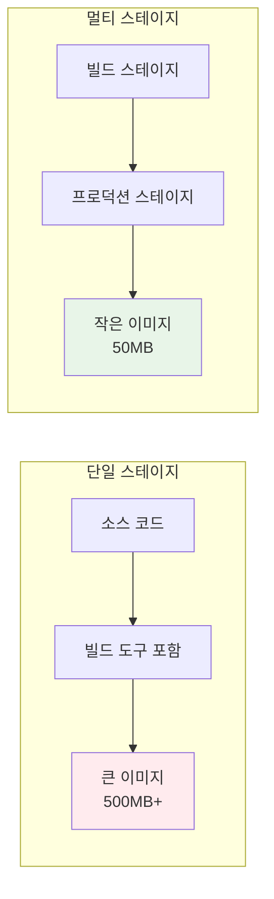

# Week 1 Day 3 Session 2: Dockerfile 작성법과 베스트 프랙티스

<div align="center">

**📝 Dockerfile 마스터** • **효율적인 이미지 빌드**

*Dockerfile 문법부터 멀티스테이지 빌드까지*

</div>

---

## 🕘 세션 정보

**시간**: 10:00-10:50 (50분)  
**목표**: Dockerfile 작성 및 멀티스테이지 빌드 습득  
**방식**: 실습 중심 + 페어 프로그래밍 + 코드 리뷰

---

## 🎯 세션 목표

### 📚 학습 목표
- **이해 목표**: Dockerfile 문법과 각 명령어의 역할 완전 이해
- **적용 목표**: 효율적이고 안전한 Dockerfile 작성 능력 습득
- **협업 목표**: 페어 토론을 통한 Dockerfile 리뷰 및 개선 방안 공유

### 🤔 왜 필요한가? (5분)

**Dockerfile 마스터의 중요성**:
- 💼 **실무 필수**: 모든 컨테이너 배포의 시작점
- 🏠 **일상 비유**: 집을 짓는 설계도면과 같은 역할
- 📊 **효율성**: 올바른 Dockerfile로 크기, 보안, 성능 최적화

---

## 📖 핵심 개념 (35분)

### 🔍 개념 1: Dockerfile 기본 문법 (12분)

> **정의**: Docker 이미지를 빌드하기 위한 명령어들을 담은 텍스트 파일

**주요 명령어들**:
```dockerfile
# 베이스 이미지 지정
FROM node:18-alpine

# 메타데이터 추가
LABEL maintainer="developer@company.com"
LABEL version="1.0.0"

# 작업 디렉토리 설정
WORKDIR /app

# 파일 복사
COPY package*.json ./
COPY . .

# 명령어 실행
RUN npm install --production

# 환경 변수 설정
ENV NODE_ENV=production

# 포트 노출
EXPOSE 3000

# 실행 명령어
CMD ["npm", "start"]
```

**명령어별 역할**:
- **FROM**: 베이스 이미지 선택
- **WORKDIR**: 작업 디렉토리 설정
- **COPY/ADD**: 파일 복사
- **RUN**: 빌드 시 명령어 실행
- **CMD/ENTRYPOINT**: 컨테이너 실행 시 명령어

### 🔍 개념 2: 멀티스테이지 빌드 (12분)

> **정의**: 여러 단계로 나누어 최종 이미지 크기를 최소화하는 빌드 방법

**🖼️ Dockerfile 베스트 프랙티스**

*Dockerfile 작성 베스트 프랙티스*

**멀티스테이지 빌드 예시**:
```dockerfile
# 빌드 스테이지
FROM node:18-alpine AS builder
WORKDIR /app
COPY package*.json ./
RUN npm install
COPY . .
RUN npm run build

# 프로덕션 스테이지
FROM nginx:alpine
COPY --from=builder /app/dist /usr/share/nginx/html
EXPOSE 80
CMD ["nginx", "-g", "daemon off;"]
```

**멀티스테이지의 장점**:


### 🔍 개념 3: Dockerfile 베스트 프랙티스 (11분)

> **정의**: 효율적이고 안전한 Dockerfile 작성을 위한 권장사항들

**🖼️ Dockerfile 레이어 최적화**

*레이어 캠시와 최적화 전략*

**베스트 프랙티스 목록**:
```dockerfile
# ❌ 나쁜 예
FROM ubuntu
RUN apt-get update && apt-get install -y python3 python3-pip curl git
COPY . /app
WORKDIR /app
RUN pip3 install -r requirements.txt
USER root

# ✅ 좋은 예
FROM python:3.9-alpine
WORKDIR /app
COPY requirements.txt .
RUN pip install --no-cache-dir -r requirements.txt
COPY . .
RUN adduser -D appuser
USER appuser
EXPOSE 8000
CMD ["python", "app.py"]
```

**주요 원칙들**:
- **경량 베이스 이미지**: Alpine Linux 사용
- **레이어 최적화**: RUN 명령어 결합
- **캐시 활용**: 자주 변경되지 않는 파일 먼저 복사
- **보안 강화**: 비root 사용자 사용
- **불필요한 파일 제외**: .dockerignore 활용

---

## 💭 함께 생각해보기 (10분)

### 🤝 페어 토론 (7분)
**토론 주제**:
1. **문법 이해**: "각 Dockerfile 명령어의 차이점과 사용 시기는?"
2. **최적화 방법**: "멀티스테이지 빌드가 필요한 상황은?"
3. **보안 고려**: "Dockerfile에서 보안을 위해 주의할 점들은?"

### 🎯 전체 공유 (3분)
- **베스트 프랙티스**: 효과적인 Dockerfile 작성 팁 공유
- **실습 준비**: 오후 실습에서 작성할 Dockerfile 계획

---

## 🔑 핵심 키워드

### Dockerfile 명령어
- **FROM**: 베이스 이미지 선택 (필수)
- **WORKDIR**: 작업 디렉토리 설정
- **COPY**: 파일 복사 (권장)
- **RUN**: 빌드 시 명령 실행
- **CMD**: 기본 실행 명령

### 최적화 기법
- **Multi-stage Build**: 빌드와 런타임 분리
- **Layer Caching**: 빌드 캐시 활용
- **Alpine Linux**: 경량 베이스 이미지
- **.dockerignore**: 불필요한 파일 제외

---

## 📝 세션 마무리

### ✅ 오늘 세션 성과
- [ ] Dockerfile 기본 문법 완전 이해
- [ ] 멀티스테이지 빌드 개념 습득
- [ ] 베스트 프랙티스 파악
- [ ] 실습을 위한 준비 완료

### 🎯 다음 세션 준비
- **주제**: Docker 네트워킹과 볼륨 관리
- **연결고리**: Dockerfile 작성 → 컨테이너 실행 환경
- **준비사항**: 컨테이너 간 통신과 데이터 관리 방법 궁금증 가지기

---

<div align="center">

**📝 Dockerfile 작성법을 완전히 마스터했습니다**

*기본 문법부터 멀티스테이지 빌드까지*

**다음**: [Session 3 - Docker 네트워킹과 볼륨 관리](./session_3.md)

</div>