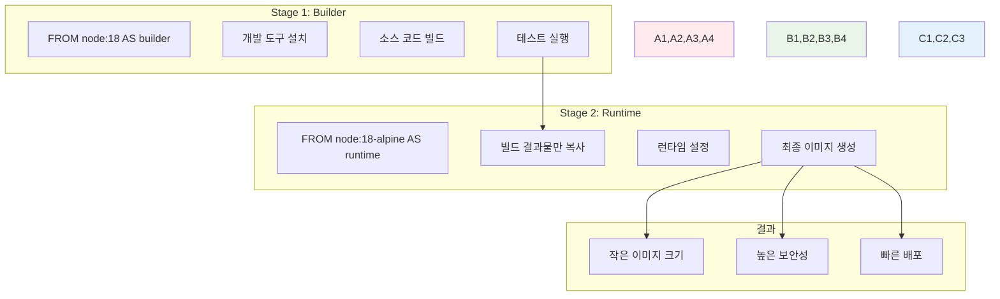
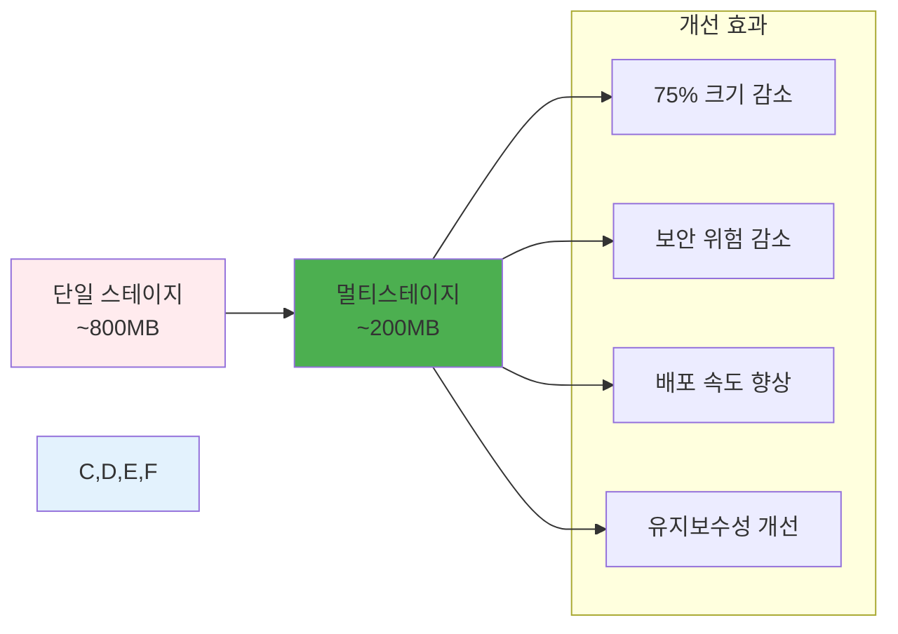

# Week 1 Day 3 Session 3: 멀티스테이지 빌드

<div align="center">

**🚀 멀티스테이지 빌드 마스터** • **프로덕션급 이미지 제작**

*빌드와 런타임 분리로 최적화와 보안을 동시에 달성하는 고급 기법*

</div>

---

## 🕘 세션 정보

**시간**: 11:00-11:50 (50분)  
**목표**: 멀티스테이지 빌드 완전 습득과 프로덕션 이미지 제작  
**방식**: 단계별 실습 + 페어 프로그래밍 + 성능 비교 분석

---

## 🎯 세션 목표

### 📚 학습 목표
- **이해 목표**: 멀티스테이지 빌드의 원리와 장점 완전 이해
- **적용 목표**: 다양한 언어와 프레임워크에 멀티스테이지 적용
- **협업 목표**: 페어별 멀티스테이지 빌드 구현 및 성능 비교

### 🤔 왜 필요한가? (3분)
**멀티스테이지 빌드의 혁신**:
- 💼 **실무 필수**: 프로덕션 환경의 표준 기법
- 🏠 **일상 비유**: 요리할 때 재료 준비와 서빙을 분리하는 것
- 📊 **효과**: 이미지 크기 70-90% 감소, 보안 위험 대폭 감소

---

## 📖 핵심 개념 (35분)

### 🔍 개념 1: 멀티스테이지 빌드 기본 원리 (12분)

#### 멀티스테이지 빌드란?
> **정의**: 하나의 Dockerfile에서 여러 FROM 문을 사용하여 빌드와 런타임을 분리하는 기법

**기존 방식의 문제점**:
```dockerfile
# ❌ 단일 스테이지 - 모든 것이 최종 이미지에 포함
FROM node:18
WORKDIR /app
COPY package*.json ./
RUN npm install  # 개발 의존성도 모두 설치
COPY . .
RUN npm run build  # 빌드 도구들이 이미지에 남음
CMD ["npm", "start"]
```

**멀티스테이지 해결책**:
```dockerfile
# ✅ 멀티스테이지 - 빌드와 런타임 분리
# Stage 1: 빌드 환경
FROM node:18 AS builder
WORKDIR /app
COPY package*.json ./
RUN npm ci --only=production
COPY . .
RUN npm run build

# Stage 2: 런타임 환경
FROM node:18-alpine AS runtime
WORKDIR /app
COPY --from=builder /app/dist ./dist
COPY --from=builder /app/node_modules ./node_modules
EXPOSE 3000
CMD ["node", "dist/index.js"]
```

#### 멀티스테이지 구조 시각화


### 🔍 개념 2: 언어별 멀티스테이지 패턴 (12분)

#### 1. Node.js 애플리케이션
```dockerfile
# 빌드 스테이지
FROM node:18 AS builder
WORKDIR /app
COPY package*.json ./
RUN npm ci
COPY . .
RUN npm run build
RUN npm prune --production

# 프로덕션 스테이지
FROM node:18-alpine
RUN addgroup -g 1001 -S nodejs
RUN adduser -S nextjs -u 1001
WORKDIR /app
COPY --from=builder --chown=nextjs:nodejs /app/dist ./dist
COPY --from=builder --chown=nextjs:nodejs /app/node_modules ./node_modules
USER nextjs
EXPOSE 3000
CMD ["node", "dist/index.js"]
```

#### 2. Python 애플리케이션
```dockerfile
# 빌드 스테이지
FROM python:3.11 AS builder
WORKDIR /app
COPY requirements.txt .
RUN pip install --user -r requirements.txt

# 프로덕션 스테이지
FROM python:3.11-slim
RUN useradd --create-home --shell /bin/bash app
WORKDIR /app
COPY --from=builder /root/.local /home/app/.local
COPY . .
RUN chown -R app:app /app
USER app
ENV PATH=/home/app/.local/bin:$PATH
CMD ["python", "app.py"]
```

#### 3. Go 애플리케이션 (극한 최적화)
```dockerfile
# 빌드 스테이지
FROM golang:1.19 AS builder
WORKDIR /app
COPY go.mod go.sum ./
RUN go mod download
COPY . .
RUN CGO_ENABLED=0 GOOS=linux go build -a -installsuffix cgo -o main .

# 프로덕션 스테이지 (Distroless)
FROM gcr.io/distroless/static-debian11
COPY --from=builder /app/main /
EXPOSE 8080
ENTRYPOINT ["/main"]
```

#### 4. React 정적 사이트
```dockerfile
# 빌드 스테이지
FROM node:18 AS builder
WORKDIR /app
COPY package*.json ./
RUN npm ci
COPY . .
RUN npm run build

# 서빙 스테이지
FROM nginx:alpine
COPY --from=builder /app/build /usr/share/nginx/html
COPY nginx.conf /etc/nginx/nginx.conf
EXPOSE 80
CMD ["nginx", "-g", "daemon off;"]
```

### 🔍 개념 3: 고급 멀티스테이지 기법 (11분)

#### 1. 다중 빌드 스테이지
```dockerfile
# 의존성 설치 스테이지
FROM node:18 AS deps
WORKDIR /app
COPY package*.json ./
RUN npm ci

# 빌드 스테이지
FROM node:18 AS builder
WORKDIR /app
COPY --from=deps /app/node_modules ./node_modules
COPY . .
RUN npm run build

# 테스트 스테이지
FROM node:18 AS tester
WORKDIR /app
COPY --from=deps /app/node_modules ./node_modules
COPY . .
RUN npm test

# 프로덕션 스테이지
FROM node:18-alpine AS runner
WORKDIR /app
COPY --from=builder /app/dist ./dist
COPY --from=deps /app/node_modules ./node_modules
CMD ["node", "dist/index.js"]
```

#### 2. 조건부 스테이지 선택
```dockerfile
# 개발용 스테이지
FROM node:18 AS development
WORKDIR /app
COPY package*.json ./
RUN npm install
COPY . .
CMD ["npm", "run", "dev"]

# 프로덕션용 스테이지
FROM node:18-alpine AS production
WORKDIR /app
COPY --from=builder /app/dist ./dist
CMD ["node", "dist/index.js"]

# 기본 스테이지 (빌드 시 --target으로 선택)
FROM production
```

#### 3. 외부 이미지에서 복사
```dockerfile
# 외부 이미지에서 바이너리 복사
FROM alpine AS runtime
COPY --from=nginx:alpine /usr/sbin/nginx /usr/sbin/nginx
COPY --from=redis:alpine /usr/local/bin/redis-server /usr/local/bin/redis-server
```

#### 4. 빌드 인자와 조합
```dockerfile
ARG BUILD_ENV=production

FROM node:18 AS base
WORKDIR /app
COPY package*.json ./

FROM base AS development
RUN npm install
COPY . .
CMD ["npm", "run", "dev"]

FROM base AS production
RUN npm ci --only=production
COPY . .
RUN npm run build
CMD ["npm", "start"]

FROM ${BUILD_ENV} AS final
```

**빌드 명령어**:
```bash
# 개발용 빌드
docker build --target development -t myapp:dev .

# 프로덕션용 빌드
docker build --target production -t myapp:prod .

# 빌드 인자 사용
docker build --build-arg BUILD_ENV=development -t myapp:custom .
```

---

## 💭 함께 생각해보기 (10분)

### 🤝 페어 멀티스테이지 구현 (7분)
**실습 미션**: 주어진 단일 스테이지 Dockerfile을 멀티스테이지로 변환

**원본 Python Flask 앱**:
```dockerfile
FROM python:3.11
WORKDIR /app
COPY requirements.txt .
RUN pip install -r requirements.txt
COPY . .
RUN python -m pytest tests/
EXPOSE 5000
CMD ["python", "app.py"]
```

**페어 활동**:
- 👥 **분석**: 현재 구조의 문제점 파악
- 🔧 **설계**: 멀티스테이지 구조 설계
- 💻 **구현**: 멀티스테이지 Dockerfile 작성
- 📊 **비교**: 예상 크기 감소와 보안 향상 분석

**구현 가이드**:
1. **테스트 스테이지**: 테스트 실행 후 결과 확인
2. **빌드 스테이지**: 의존성 설치 및 애플리케이션 준비
3. **런타임 스테이지**: 최소한의 런타임 환경

### 🎯 전체 공유 (3분)
- **구현 결과**: 각 페어의 멀티스테이지 설계 발표
- **최적화 효과**: 예상 크기 감소율과 보안 개선점
- **베스트 프랙티스**: 가장 효과적인 구현 방법 선정

### 💡 이해도 체크 질문
- ✅ "멀티스테이지 빌드의 주요 장점 3가지를 설명할 수 있나요?"
- ✅ "--from 옵션의 역할과 사용법을 설명할 수 있나요?"
- ✅ "언제 멀티스테이지 빌드를 사용해야 하나요?"

---

## 🔑 핵심 키워드

### 멀티스테이지 기본
- **Multi-stage Build**: 여러 FROM 문을 사용한 단계별 빌드
- **Stage Naming**: AS 키워드로 스테이지 이름 지정
- **COPY --from**: 이전 스테이지에서 파일 복사
- **Build Target**: --target 옵션으로 특정 스테이지 빌드

### 스테이지 유형
- **Builder Stage**: 컴파일, 빌드, 테스트 수행
- **Runtime Stage**: 실행에 필요한 최소 환경
- **Test Stage**: 테스트 실행 전용 스테이지
- **Dependencies Stage**: 의존성 설치 전용

### 최적화 효과
- **Size Reduction**: 이미지 크기 70-90% 감소
- **Security Enhancement**: 빌드 도구 제거로 공격 표면 축소
- **Build Efficiency**: 스테이지별 캐싱으로 빌드 시간 단축
- **Separation of Concerns**: 빌드와 런타임 관심사 분리

### 고급 기법
- **Conditional Stages**: 조건부 스테이지 선택
- **External Copy**: 외부 이미지에서 파일 복사
- **Build Arguments**: ARG와 조합한 동적 빌드
- **Parallel Builds**: 독립적 스테이지 병렬 빌드

---

## 📝 세션 마무리

### ✅ 오늘 세션 성과
- [ ] 멀티스테이지 빌드 원리와 장점 완전 이해
- [ ] 다양한 언어별 멀티스테이지 패턴 습득
- [ ] 실제 Dockerfile을 멀티스테이지로 변환 경험
- [ ] 고급 기법과 최적화 전략 학습

### 🎯 다음 세션 준비
- **주제**: Dockerfile 최적화 챌린지 (3시간 실습)
- **연결고리**: 이론 학습 → 실전 적용 → 최적화 경쟁
- **준비사항**: 오늘 배운 모든 기법을 종합 적용할 실습 프로젝트

### 📊 멀티스테이지 효과 비교


### 🏆 실습 준비 완료
**오후 챌린지 목표**:
- 실제 애플리케이션 멀티스테이지 구현
- 이미지 크기 50% 이상 감소 달성
- 보안 취약점 0개 달성
- 빌드 시간 최적화

---

<div align="center">

**🚀 멀티스테이지 빌드 전문가가 되었습니다**

*빌드와 런타임 분리로 최적화와 보안을 동시에 달성하는 고급 기법 완성*

**이전**: [Session 2 - 이미지 최적화](./session_2.md) | **다음**: [Session 4 - 최적화 챌린지](./session_4.md)

</div>