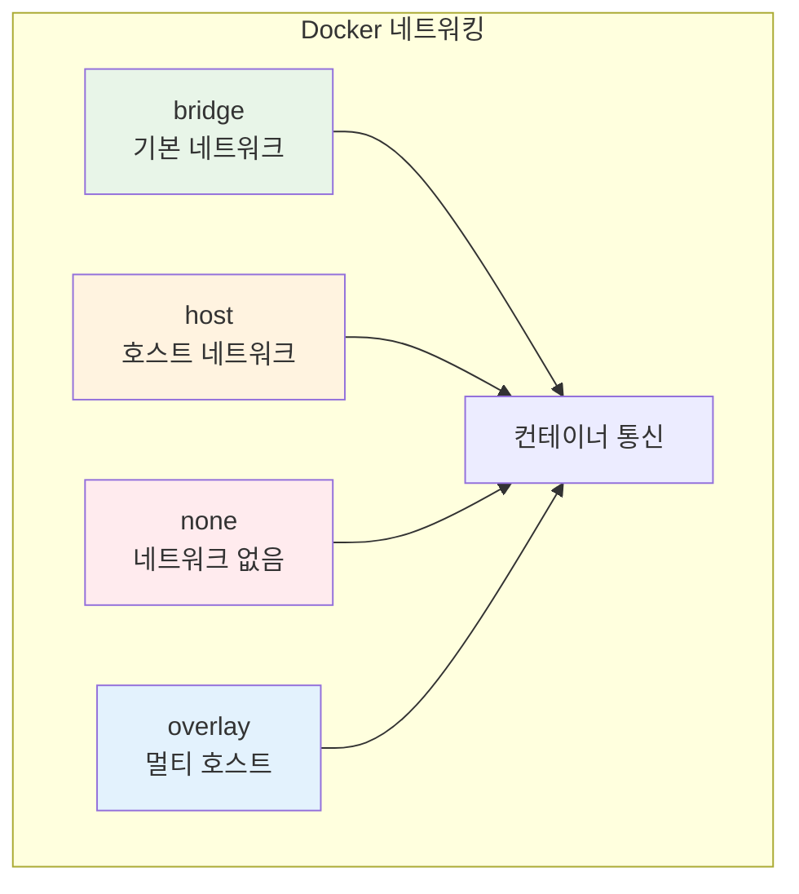
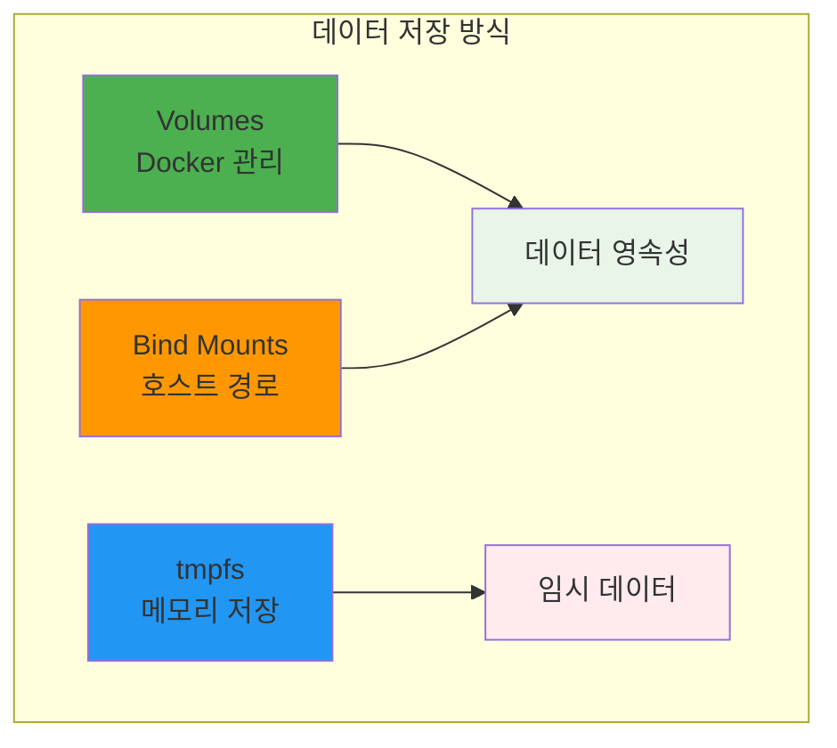
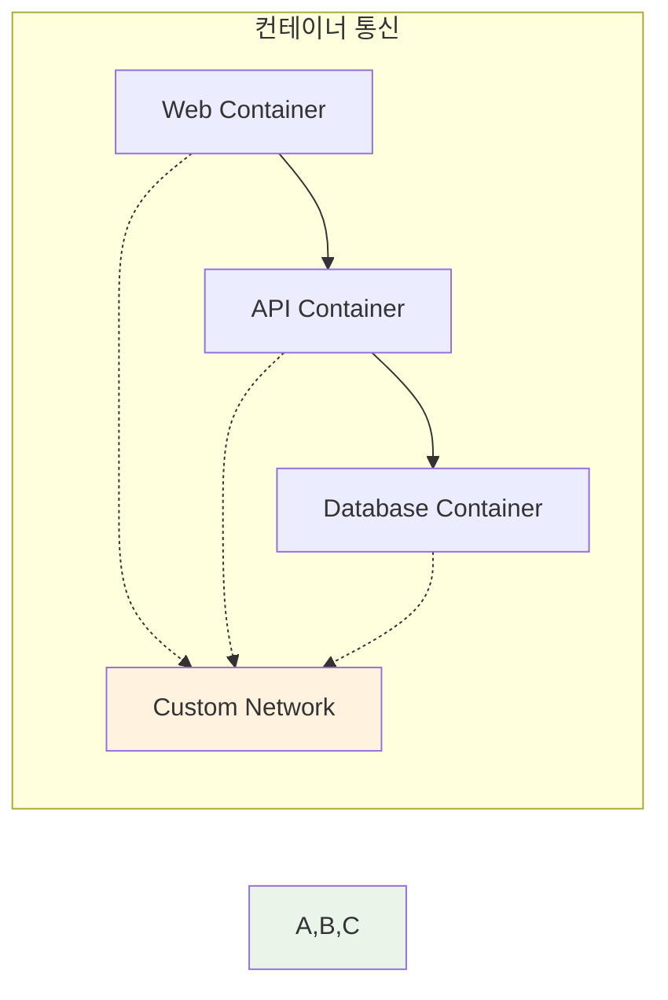

# Week 1 Day 3 Session 3: Docker 네트워킹과 볼륨 관리

<div align="center">

**🌐 컨테이너 네트워킹** • **💾 데이터 영속성**

*컨테이너 간 통신과 데이터 관리의 핵심*

</div>

---

## 🕘 세션 정보

**시간**: 11:00-11:50 (50분)  
**목표**: Docker 네트워킹 모델과 데이터 영속성 관리 방법 이해  
**방식**: 구조 분석 + 실습 연계 + 팀 토론

---

## 🎯 세션 목표

### 📚 학습 목표
- **이해 목표**: Docker 네트워킹 모델과 데이터 영속성 관리 방법 이해
- **적용 목표**: 컨테이너 간 통신과 데이터 보존 실습 능력 습득
- **협업 목표**: 페어 토론을 통한 네트워크 구성 및 데이터 관리 전략 공유

### 🤔 왜 필요한가? (5분)

**네트워킹과 스토리지의 중요성**:
- 💼 **실무 필요성**: 마이크로서비스 간 통신과 데이터 보존
- 🏠 **일상 비유**: 집안의 전화선과 창고 같은 필수 인프라
- 📊 **확장성**: 복잡한 애플리케이션 구축의 기반

---

## 📖 핵심 개념 (35분)

### 🔍 개념 1: Docker 네트워킹 모델 (12분)

> **정의**: 컨테이너 간 통신과 외부 네트워크 연결을 위한 시스템

**🖼️ Docker 네트워크 유형**

*출처: Docker 공식 문서*

**네트워크 드라이버 종류**:


**네트워크 타입별 특징**:
- **bridge**: 기본 네트워크, 컨테이너 간 통신 가능
- **host**: 호스트 네트워크 직접 사용, 성능 우수
- **none**: 네트워크 연결 없음, 완전 격리
- **overlay**: 여러 Docker 호스트 간 통신

### 🔍 개념 2: 볼륨과 데이터 관리 (12분)

> **정의**: 컨테이너가 삭제되어도 데이터를 보존하는 방법들

**🖼️ Docker 스토리지 옵션**

*출처: Docker 공식 문서*

**데이터 저장 방식 비교**:


**각 방식의 특징**:
- **Volumes**: Docker가 관리, 백업과 마이그레이션 용이
- **Bind Mounts**: 호스트 파일시스템 직접 연결
- **tmpfs**: 메모리에 저장, 컨테이너 종료 시 삭제

### 🔍 개념 3: 컨테이너 간 통신 (11분)

> **정의**: 여러 컨테이너가 서로 데이터를 주고받는 방법

**통신 방법들**:


**통신 설정 예시**:
```bash
# 커스텀 네트워크 생성
docker network create myapp-network

# 데이터베이스 컨테이너 실행
docker run -d --name db --network myapp-network postgres

# 웹 애플리케이션 컨테이너 실행
docker run -d --name web --network myapp-network -p 8080:80 nginx
```

---

## 💭 함께 생각해보기 (10분)

### 🤝 페어 토론 (7분)
**토론 주제**:
1. **네트워크 선택**: "어떤 상황에서 어떤 네트워크 타입을 사용할까요?"
2. **데이터 관리**: "데이터베이스 컨테이너의 데이터를 어떻게 보존할까요?"
3. **보안 고려**: "컨테이너 간 통신에서 보안을 위한 고려사항은?"

### 🎯 전체 공유 (3분)
- **네트워크 전략**: 효과적인 컨테이너 네트워킹 방안
- **데이터 전략**: 안전한 데이터 관리 방법

---

## 🔑 핵심 키워드

### 네트워킹
- **Bridge Network**: 기본 네트워크 드라이버
- **Host Network**: 호스트 네트워크 직접 사용
- **Custom Network**: 사용자 정의 네트워크
- **Port Mapping**: 포트 바인딩 (-p 옵션)

### 데이터 관리
- **Docker Volume**: Docker가 관리하는 데이터 저장소
- **Bind Mount**: 호스트 디렉토리 마운트
- **tmpfs Mount**: 메모리 기반 임시 저장소
- **Data Persistence**: 데이터 영속성

---

## 📝 세션 마무리

### ✅ 오늘 세션 성과
- [ ] Docker 네트워킹 모델 완전 이해
- [ ] 데이터 영속성 관리 방법 습득
- [ ] 컨테이너 간 통신 구성 방법 파악
- [ ] 실습을 위한 이론적 기반 완성

### 🎯 실습 챌린지 준비
- **연결고리**: 이론 학습 → 실제 이미지 빌드 및 네트워크 구성
- **실습 내용**: 커스텀 이미지 빌드, 네트워킹, 데이터 관리
- **준비사항**: Dockerfile 작성과 컨테이너 연결 실습

---

<div align="center">

**🌐 Docker 네트워킹과 데이터 관리를 완전히 이해했습니다**

*컨테이너 간 통신과 데이터 영속성의 핵심 파악*

**다음**: [실습 챌린지 - 이미지 빌드 & 네트워크 실습](../README.md#실습-챌린지)

</div>