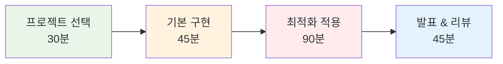

# Week 1 Day 3 Session 4: Dockerfile 최적화 챌린지

<div align="center">

**🏆 실전 Dockerfile 최적화 경쟁** • **프로덕션급 이미지 제작**

*3시간 집중 실습으로 완성하는 최적화된 컨테이너 이미지*

</div>

---

## 🕘 세션 정보

**시간**: 13:00-16:00 (3시간)  
**목표**: 실제 애플리케이션을 최적화된 Docker 이미지로 제작  
**방식**: 페어별 챌린지 + AI 활용 + 성과 경쟁 + 상호 리뷰

---

## 🎯 세션 목표

### 📚 학습 목표
- **이해 목표**: 오전에 배운 모든 최적화 기법을 실전 적용
- **적용 목표**: 실제 애플리케이션의 완전한 컨테이너화 달성
- **협업 목표**: 페어 협업과 상호 코드 리뷰를 통한 품질 향상

### 🤔 왜 필요한가? (5분)
**실전 챌린지의 중요성**:
- 💼 **실무 준비**: 실제 프로젝트와 동일한 환경에서 경험
- 🏠 **일상 비유**: 요리 레시피를 보고 실제로 요리해보는 것
- 📊 **성과 측정**: 구체적인 목표와 성과로 실력 검증

---

## 🛠️ 챌린지 구성 (3시간)

### 🚀 Phase 1: 프로젝트 선택 및 환경 설정 (30분)

#### 🎯 챌린지 옵션 선택 (페어별)
**Option 1: Node.js 웹 애플리케이션**
```javascript
// 제공되는 샘플 앱 구조
my-node-app/
├── package.json
├── server.js
├── public/
│   ├── index.html
│   └── style.css
└── routes/
    └── api.js
```

**Option 2: Python Flask API 서버**
```python
# 제공되는 샘플 앱 구조
my-flask-app/
├── requirements.txt
├── app.py
├── models/
│   └── user.py
├── templates/
│   └── index.html
└── static/
    └── style.css
```

**Option 3: React 정적 사이트**
```javascript
// 제공되는 샘플 앱 구조
my-react-app/
├── package.json
├── src/
│   ├── App.js
│   ├── components/
│   └── styles/
├── public/
└── build/ (빌드 후 생성)
```

**Option 4: Go 마이크로서비스**
```go
// 제공되는 샘플 앱 구조
my-go-app/
├── go.mod
├── main.go
├── handlers/
│   └── api.go
└── models/
    └── user.go
```

**Option 5: 자유 프로젝트**
- 본인이 가진 프로젝트 또는 GitHub에서 선택한 오픈소스 프로젝트
- AI로 생성한 샘플 애플리케이션

#### 🤖 AI 활용 가이드
**프로젝트 생성 프롬프트**:
```
"Docker 학습용 [언어] 애플리케이션을 만들어주세요.
요구사항:
- 간단한 웹 서버 또는 API
- 데이터베이스 연결 (선택사항)
- 정적 파일 서빙
- 환경변수 설정
- 헬스체크 엔드포인트
- 프로덕션 배포 가능한 구조"
```

#### 📋 환경 설정 체크리스트
- [ ] 프로젝트 선택 및 다운로드 완료
- [ ] 로컬에서 정상 실행 확인
- [ ] 페어 역할 분담 (Driver/Navigator)
- [ ] 최적화 목표 설정

### 🌟 Phase 2: 기본 Dockerfile 작성 (45분)

#### Step 1: 기본 Dockerfile 작성 (20분)
```dockerfile
# 예시: Node.js 애플리케이션 기본 Dockerfile
FROM node:18

WORKDIR /app

COPY package*.json ./
RUN npm install

COPY . .

EXPOSE 3000

CMD ["npm", "start"]
```

**페어 활동**:
- 👥 **Driver**: Dockerfile 작성 및 빌드
- 🧭 **Navigator**: 문법 검토 및 개선 제안
- 🔄 **역할 교대**: 10분마다 역할 변경

#### Step 2: 기본 이미지 빌드 및 테스트 (15분)
```bash
# 이미지 빌드
docker build -t my-app:basic .

# 이미지 크기 확인
docker images my-app:basic

# 컨테이너 실행 테스트
docker run -d -p 3000:3000 --name test-basic my-app:basic

# 동작 확인
curl http://localhost:3000
# 또는 브라우저에서 접속

# 로그 확인
docker logs test-basic
```

#### Step 3: 기본 성능 측정 (10분)
```bash
# 이미지 크기 측정
docker images --format "table {{.Repository}}\t{{.Tag}}\t{{.Size}}"

# 빌드 시간 측정
time docker build -t my-app:basic-test .

# 레이어 분석
docker history my-app:basic
```

**📊 기본 성능 기록**:
- 이미지 크기: _____ MB
- 빌드 시간: _____ 초
- 레이어 수: _____ 개

#### ✅ Phase 2 체크포인트
- [ ] 기본 Dockerfile 작성 완료
- [ ] 이미지 빌드 및 실행 성공
- [ ] 기본 성능 지표 측정 완료

### 🏆 Phase 3: 최적화 적용 (90분)

#### Round 1: 기본 최적화 (30분)
**적용할 최적화 기법**:
1. **베이스 이미지 변경**: `node:18` → `node:18-alpine`
2. **RUN 명령어 체이닝**: 여러 RUN을 하나로 결합
3. **.dockerignore 추가**: 불필요한 파일 제외
4. **레이어 순서 최적화**: 캐시 친화적 순서로 변경

```dockerfile
# 최적화된 Dockerfile v1
FROM node:18-alpine

WORKDIR /app

# 의존성 파일만 먼저 복사 (캐시 최적화)
COPY package*.json ./

# 의존성 설치 및 캐시 정리
RUN npm ci --only=production && \
    npm cache clean --force

# 소스 코드 복사
COPY . .

# 비root 사용자 생성 및 권한 설정
RUN addgroup -g 1001 -S nodejs && \
    adduser -S nextjs -u 1001 && \
    chown -R nextjs:nodejs /app

USER nextjs

EXPOSE 3000

CMD ["npm", "start"]
```

**.dockerignore 파일**:
```dockerignore
node_modules
npm-debug.log
.git
.gitignore
README.md
.env
.nyc_output
coverage
.pytest_cache
__pycache__
*.pyc
.DS_Store
```

#### Round 2: 멀티스테이지 빌드 (30분)
```dockerfile
# 멀티스테이지 Dockerfile
# Stage 1: 빌드 환경
FROM node:18-alpine AS builder

WORKDIR /app

COPY package*.json ./
RUN npm ci

COPY . .
RUN npm run build

# Stage 2: 프로덕션 환경
FROM node:18-alpine AS runner

RUN addgroup -g 1001 -S nodejs && \
    adduser -S nextjs -u 1001

WORKDIR /app

# 빌드 결과물만 복사
COPY --from=builder --chown=nextjs:nodejs /app/dist ./dist
COPY --from=builder --chown=nextjs:nodejs /app/node_modules ./node_modules
COPY --from=builder --chown=nextjs:nodejs /app/package.json ./package.json

USER nextjs

EXPOSE 3000

CMD ["npm", "start"]
```

#### Round 3: 고급 최적화 (30분)
**추가 최적화 기법**:
1. **Distroless 이미지 사용** (Go 애플리케이션)
2. **헬스체크 추가**
3. **시그널 처리 개선**
4. **보안 스캔 통과**

```dockerfile
# 고급 최적화 예시 (Node.js)
FROM node:18-alpine AS builder

WORKDIR /app
COPY package*.json ./
RUN npm ci
COPY . .
RUN npm run build && npm prune --production

FROM gcr.io/distroless/nodejs18-debian11 AS runner

WORKDIR /app

COPY --from=builder /app/dist ./dist
COPY --from=builder /app/node_modules ./node_modules
COPY --from=builder /app/package.json ./package.json

EXPOSE 3000

CMD ["dist/index.js"]
```

**헬스체크 추가**:
```dockerfile
HEALTHCHECK --interval=30s --timeout=3s --start-period=5s --retries=3 \
  CMD curl -f http://localhost:3000/health || exit 1
```

#### 성능 측정 및 비교 (각 라운드마다)
```bash
# 이미지 빌드 및 크기 측정
docker build -t my-app:optimized-v1 .
docker images | grep my-app

# 빌드 시간 측정
time docker build --no-cache -t my-app:optimized-v1 .

# 보안 스캔 (선택사항)
docker scout quickview my-app:optimized-v1
```

#### ✅ Phase 3 체크포인트
- [ ] 3단계 최적화 모두 적용 완료
- [ ] 각 단계별 성능 측정 완료
- [ ] 최종 이미지 정상 동작 확인

### 🎤 Phase 4: 결과 발표 및 코드 리뷰 (45분)

#### 페어별 결과 발표 (30분)
**발표 내용** (페어당 5분):
1. **선택한 프로젝트**: 어떤 애플리케이션을 선택했는지
2. **최적화 결과**: 
   - 기본 → 최종 이미지 크기 비교
   - 빌드 시간 개선 효과
   - 적용한 최적화 기법들
3. **도전과 해결**: 어려웠던 점과 해결 방법
4. **배운 점**: 실습을 통해 얻은 인사이트

#### 상호 코드 리뷰 (15분)
**리뷰 활동**:
- 👥 **페어 교환**: 다른 페어의 Dockerfile 검토
- 🔍 **코드 리뷰**: 개선점과 좋은 점 찾기
- 💡 **피드백**: 건설적인 개선 제안
- 🏆 **베스트 프랙티스**: 가장 인상적인 최적화 기법 공유

---

## 🏆 챌린지 성과 측정

### 📊 최적화 성과 비교표
| 페어 | 프로젝트 | 기본 크기 | 최종 크기 | 감소율 | 빌드 시간 | 특별 기법 |
|------|----------|-----------|-----------|--------|-----------|-----------|
| 1 | Node.js | 500MB | 150MB | 70% | 30s | 멀티스테이지 |
| 2 | Python | 800MB | 200MB | 75% | 45s | Alpine + 캐시 |
| 3 | React | 1.2GB | 50MB | 96% | 60s | Nginx 서빙 |
| ... | ... | ... | ... | ... | ... | ... |

### 🥇 우승 기준
1. **크기 최적화**: 가장 높은 크기 감소율
2. **보안 강화**: 취약점 최소화 및 비root 실행
3. **빌드 효율성**: 캐시 활용과 빌드 시간 단축
4. **창의성**: 독창적인 최적화 기법 적용
5. **실용성**: 실제 프로덕션 환경에서 사용 가능한 수준

### 🎖️ 특별상
- **🏆 최고 최적화상**: 가장 높은 크기 감소율 달성
- **🛡️ 보안 우수상**: 가장 안전한 이미지 제작
- **⚡ 속도 개선상**: 가장 빠른 빌드 시간 달성
- **💡 창의성상**: 가장 독창적인 최적화 기법
- **🤝 협업 우수상**: 가장 효과적인 페어 협업

---

## 🔑 핵심 키워드

### 실전 최적화 기법
- **Base Image Optimization**: Alpine, Slim, Distroless 활용
- **Multi-stage Build**: 빌드와 런타임 환경 분리
- **Layer Caching**: 효율적인 레이어 순서와 캐시 활용
- **Security Hardening**: 비root 사용자, 취약점 제거

### 성능 측정 도구
- **docker images**: 이미지 크기 확인
- **docker history**: 레이어 구조 분석
- **time command**: 빌드 시간 측정
- **docker scout**: 보안 취약점 스캔

### 실무 베스트 프랙티스
- **.dockerignore**: 빌드 컨텍스트 최적화
- **Health Check**: 컨테이너 상태 모니터링
- **Signal Handling**: 우아한 종료 처리
- **Resource Limits**: 리소스 사용량 제한

---

## 📝 세션 마무리

### ✅ 오늘 챌린지 성과
- [ ] 실제 애플리케이션의 완전한 컨테이너화 달성
- [ ] 이미지 크기 50% 이상 감소 달성
- [ ] 멀티스테이지 빌드 실전 적용 완료
- [ ] 보안 강화 및 베스트 프랙티스 적용
- [ ] 페어 협업을 통한 코드 리뷰 경험

### 🎯 다음 세션 준비
- **주제**: 개별 멘토링 & 포트폴리오 구성
- **연결고리**: 실습 결과물 → 포트폴리오 정리 → 개인별 맞춤 지도
- **준비사항**: 오늘 제작한 최적화된 이미지를 포트폴리오에 정리

### 📊 3시간 집중 실습 완료!


### 🏆 챌린지 우승자 발표
**최고 최적화상**: [페어명] - [감소율]% 달성  
**보안 우수상**: [페어명] - 취약점 0개 달성  
**창의성상**: [페어명] - [독창적 기법] 적용

---

<div align="center">

**🏆 Dockerfile 최적화 챌린지 완주!**

*실전 경험을 통해 프로덕션급 Docker 이미지 제작 능력 완성*

**이전**: [Session 3 - 멀티스테이지 빌드](./session_3.md) | **다음**: [Session 5 - 개별 멘토링](./session_5.md)

</div>