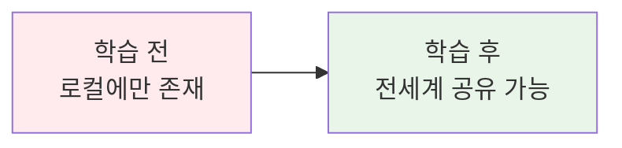

# Week 1 Day 3 Session 5: Docker 이미지 레지스트리와 배포 실습

<div align="center">
**🚀 이미지 배포** • **📦 레지스트리 활용**
*내가 만든 이미지를 세상과 공유하기*
</div>

---

## 🕘 세션 정보
**시간**: 15:15-16:05 (50분)
**목표**: Docker 이미지 레지스트리 활용과 배포 프로세스 실습
**방식**: 실습 중심 + 개인 프로젝트 + 배포 경험

## 🎯 세션 목표
### 📚 학습 목표
- **이해 목표**: Docker Hub와 이미지 레지스트리 개념 이해
- **적용 목표**: 내가 만든 이미지를 레지스트리에 업로드하고 배포
- **협업 목표**: 팀원들과 이미지 공유 및 상호 리뷰

### 🤔 왜 필요한가? (5분)

**실무 배포 시나리오**:
- 💼 **팀 협업**: 개발한 이미지를 팀원들과 공유
- 🏠 **일상 비유**: 요리 레시피를 요리책에 올려서 다른 사람들도 만들 수 있게 하는 것
- 📊 **실무 필요성**: CI/CD 파이프라인에서 이미지 배포는 필수 과정

**학습 전후 비교**:


## 🛠️ 실습 중심 학습 (35분)

### 🚀 실습 1: Docker Hub 계정 및 첫 이미지 푸시 (15분)
> **목표**: Docker Hub에 내가 만든 이미지 업로드하기

#### 📋 실습 준비 (3분)
**Docker Hub 계정 생성**:
1. [Docker Hub](https://hub.docker.com) 접속
2. 무료 계정 생성 (이미 있다면 로그인)
3. 사용자명 기억해두기 (예: `myusername`)

#### 🔧 Step 1: 로컬 이미지 준비 (4분)
```bash
# 어제 만든 이미지 확인
docker images

# 없다면 간단한 이미지 빠르게 생성
mkdir ~/quick-app && cd ~/quick-app
echo '<h1>My Shared App</h1>' > index.html

cat > Dockerfile << 'EOF'
FROM nginx:alpine
COPY index.html /usr/share/nginx/html/
EXPOSE 80
EOF

# 이미지 빌드
docker build -t my-shared-app .
```

#### 🌐 Step 2: Docker Hub 로그인 및 태깅 (4분)
```bash
# Docker Hub 로그인
docker login
# 사용자명과 패스워드 입력

# 이미지에 레지스트리 태그 추가
docker tag my-shared-app [사용자명]/my-shared-app:v1.0

# 예시: docker tag my-shared-app john123/my-shared-app:v1.0
```

#### 📤 Step 3: 이미지 푸시 (4분)
```bash
# Docker Hub에 이미지 업로드
docker push [사용자명]/my-shared-app:v1.0

# 업로드 진행 상황 확인
# Docker Hub 웹사이트에서 업로드된 이미지 확인
```

**🎯 개인 미션**: 각자 자신만의 이미지를 Docker Hub에 업로드하고 URL 공유하기

### 📦 실습 2: 다른 사람의 이미지 사용해보기 (10분)
> **목표**: 레지스트리에서 이미지를 다운로드하고 실행해보기

#### 🔍 Step 1: 이미지 검색 및 다운로드 (5분)
```bash
# Docker Hub에서 이미지 검색
docker search nginx
docker search node

# 특정 이미지 다운로드 (팀원의 이미지 사용)
docker pull [팀원사용자명]/[이미지명]:태그

# 예시: docker pull jane456/web-app:latest
```

#### 🏃 Step 2: 다운로드한 이미지 실행 (5분)
```bash
# 다운로드한 이미지로 컨테이너 실행
docker run -d -p 8090:80 --name shared-app [팀원사용자명]/[이미지명]:태그

# 브라우저에서 localhost:8090 확인
# 팀원이 만든 애플리케이션 체험

# 실행 중인 컨테이너 확인
docker ps
```

**🤝 팀 미션**: 옆 사람의 이미지를 다운로드해서 실행해보고 피드백 주기

### 🏷️ 실습 3: 이미지 태깅과 버전 관리 (10분)
> **목표**: 이미지 버전 관리와 태깅 전략 실습

#### 📝 Step 1: 이미지 업데이트 (5분)
```bash
# 기존 애플리케이션 수정
cd ~/quick-app
echo '<h1>My Shared App v2.0</h1><p>Updated version!</p>' > index.html

# 새 버전 빌드
docker build -t my-shared-app:v2.0 .

# 여러 태그 추가
docker tag my-shared-app:v2.0 [사용자명]/my-shared-app:v2.0
docker tag my-shared-app:v2.0 [사용자명]/my-shared-app:latest
```

#### 🚀 Step 2: 버전별 푸시 (5분)
```bash
# 새 버전 푸시
docker push [사용자명]/my-shared-app:v2.0
docker push [사용자명]/my-shared-app:latest

# 이미지 히스토리 확인
docker images | grep my-shared-app

# Docker Hub에서 태그 확인
```

**💡 실습 포인트**:
- 버전 태그의 중요성 이해
- latest 태그 사용 시 주의사항
- 이미지 크기와 레이어 공유 효율성

## 💭 함께 생각해보기 (5분)

### 🤝 개인 성과 공유 (5분)
**공유 내용**:
1. **업로드 성공**: "내 이미지 Docker Hub URL은?"
2. **발견한 점**: "다른 사람 이미지 사용해보니 어땠나요?"
3. **버전 관리**: "태깅 전략에서 배운 점은?"
4. **실무 적용**: "실제 프로젝트에서 어떻게 활용할 수 있을까요?"

**공유 가이드**:
- 🌐 **URL 공유**: 각자 업로드한 Docker Hub 이미지 링크
- 🔄 **경험 교환**: 업로드/다운로드 과정에서의 어려움과 해결책
- 📝 **개선 아이디어**: 이미지 최적화나 태깅 전략 아이디어

## 🔑 핵심 키워드

### 🆕 새로운 용어
- **Docker Registry**: 이미지를 저장하고 공유하는 저장소
- **Docker Hub**: Docker의 공식 퍼블릭 레지스트리
- **Image Tag**: 이미지 버전을 구분하는 라벨
- **Push/Pull**: 이미지 업로드/다운로드 명령

### 🔤 기술 용어
- **docker login**: 레지스트리 인증
- **docker tag**: 이미지에 태그 추가
- **docker push**: 이미지 업로드
- **docker pull**: 이미지 다운로드

### 🔤 실무 용어
- **Image Repository**: 이미지 저장소
- **Semantic Versioning**: 의미있는 버전 관리 (v1.0.0)
- **Latest Tag**: 최신 버전을 가리키는 기본 태그
- **Private Registry**: 비공개 이미지 저장소

## 📝 세션 마무리
### ✅ 오늘 세션 성과
- Docker Hub 계정 생성 및 첫 이미지 업로드
- 다른 사람의 이미지 다운로드 및 실행 경험
- 이미지 태깅과 버전 관리 실습
- 팀원들과 이미지 공유 및 피드백 경험

### 🎯 다음 세션 준비
- **내일 연결**: Docker Compose에서 내가 만든 이미지 활용
- **실무 적용**: CI/CD 파이프라인에서의 이미지 배포 과정
- **심화 학습**: Private Registry 구축 방법

---

## 🛠️ 실습 연계 가이드

### 📋 레지스트리 활용 체크리스트 (실습용)
```bash
# 1. Docker Hub 로그인 확인
docker login

# 2. 이미지 태깅 규칙
docker tag [로컬이미지] [사용자명]/[저장소명]:[태그]

# 3. 이미지 푸시
docker push [사용자명]/[저장소명]:[태그]

# 4. 이미지 풀
docker pull [사용자명]/[저장소명]:[태그]

# 5. 로컬 이미지 정리
docker rmi [이미지명]:[태그]
```

### 🔍 이미지 관리 명령어
```bash
# 이미지 목록 확인
docker images

# 이미지 상세 정보
docker inspect [이미지명]

# 이미지 히스토리
docker history [이미지명]

# 사용하지 않는 이미지 정리
docker image prune
```

### ⚠️ 실습 주의사항
- **개인정보 보호**: Dockerfile에 민감한 정보 포함하지 않기
- **이미지 크기**: 불필요한 파일 포함하지 않도록 .dockerignore 활용
- **태그 관리**: 의미있는 태그명 사용하여 버전 관리
- **퍼블릭 주의**: Docker Hub는 기본적으로 공개 저장소

---

<div align="center">

**🚀 이미지 배포 마스터** • **📦 레지스트리 활용 완료** • **🌐 전세계 공유 성공**

*내가 만든 Docker 이미지를 세상과 공유하는 방법을 완전히 습득했습니다*

</div>