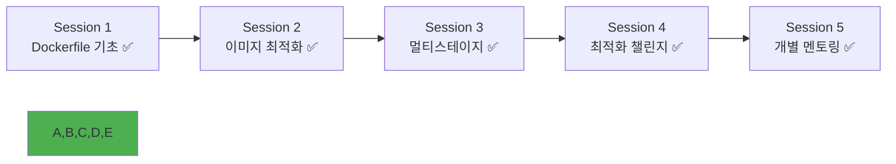

# Week 1 Day 3 Session 5: 개별 멘토링 & 포트폴리오 구성

<div align="center">

**👥 맞춤형 개별 지도** • **📁 포트폴리오 완성**

*개인별 학습 상황 점검과 실습 결과물의 체계적 정리*

</div>

---

## 🕘 세션 정보

**시간**: 16:15-18:00 (105분)  
**목표**: 개인별 맞춤 멘토링과 포트폴리오 구성 완료  
**방식**: 1:1 개별 상담 + 포트폴리오 정리 + 학습 계획 수립

---

## 🎯 세션 목표

### 📚 학습 목표
- **점검 목표**: 3일간 학습 내용 완전 이해도 확인 및 보완
- **정리 목표**: 실습 결과물을 체계적인 포트폴리오로 구성
- **계획 목표**: 개인별 맞춤 학습 계획과 다음 단계 준비

### 🤔 왜 필요한가? (3분)
**개별 멘토링의 중요성**:
- 💼 **개인 맞춤**: 각자의 수준과 관심사에 맞는 지도
- 🏠 **일상 비유**: 개인 트레이너의 맞춤 운동 지도와 같음
- 📊 **효과**: 개인별 약점 보완과 강점 극대화

---

## 👥 개별 멘토링 구성 (90분)

### 🟢 초급자 집중 케어 (30분 × 4명 = 120분 중 90분 활용)

#### 1:1 멘토링 세션 (개인당 7-8분)
**멘토링 체크리스트**:

**📋 학습 이해도 점검**:
- [ ] Docker 기본 개념 이해도 (컨테이너 vs VM)
- [ ] Dockerfile 명령어 숙지도 (FROM, RUN, COPY 등)
- [ ] 이미지 레이어 시스템 이해
- [ ] 멀티스테이지 빌드 개념 파악

**🛠️ 실습 결과 검토**:
- [ ] 오늘 챌린지에서 제작한 Dockerfile 품질
- [ ] 최적화 기법 적용 수준
- [ ] 발생한 오류와 해결 과정
- [ ] 페어 협업에서의 기여도

**💡 개인별 맞춤 지도**:
```
초급자 A: Docker 기본 명령어 추가 연습 필요
→ 권장 학습: Docker 공식 튜토리얼 완주
→ 실습 과제: 간단한 웹앱 3개 컨테이너화

초급자 B: Dockerfile 문법은 이해했으나 최적화 부족
→ 권장 학습: 이미지 크기 최적화 집중 연습
→ 실습 과제: 기존 Dockerfile 최적화 도전

초급자 C: 이론 이해는 좋으나 실습 경험 부족
→ 권장 학습: 더 많은 hands-on 실습
→ 실습 과제: 다양한 언어 애플리케이션 컨테이너화

초급자 D: 전반적으로 잘 따라오고 있음
→ 권장 학습: Docker Compose 미리 학습
→ 실습 과제: 멀티 컨테이너 애플리케이션 도전
```

**📚 추가 학습 자료 제공**:
- Docker 공식 문서 핵심 섹션
- 단계별 실습 가이드
- 자주 발생하는 오류 해결 가이드
- 추천 YouTube 강의 목록

#### 그룹 멘토링 (15분)
**공통 질의응답**:
- 어려웠던 개념들 재설명
- 실습에서 공통으로 발생한 문제 해결
- 내일 학습 준비사항 안내
- 동기부여 및 격려

### 🟡 중급자 리더십 개발 (20분 × 6명 = 120분 중 60분 활용)

#### 개별 상담 (개인당 3-4분)
**리더십 발휘 상황 점검**:
- [ ] 초급자 도움 제공 경험과 효과
- [ ] 페어 프로그래밍에서의 리더십 발휘
- [ ] 기술적 문제 해결 주도 경험
- [ ] 팀 분위기 조성 기여도

**기술 역량 심화 방향**:
```
중급자 A: 뛰어난 기술 이해력, 멘토링 역량 개발 필요
→ 발전 방향: 기술 리더 역할 준비
→ 과제: 초급자 멘토링 가이드 작성

중급자 B: 실무 경험 풍부, 최신 기술 트렌드 학습 필요
→ 발전 방향: 기술 트렌드 리더
→ 과제: Kubernetes 미리 학습 후 공유

중급자 C: 문제 해결 능력 우수, 아키텍처 설계 역량 개발
→ 발전 방향: 시스템 아키텍트 준비
→ 과제: 마이크로서비스 아키텍처 설계 연습
```

#### 그룹 토론 (20분)
**주제**: "효과적인 기술 멘토링 방법"
- 초급자를 도울 때 효과적이었던 방법들
- 기술 설명 시 주의사항과 노하우
- 팀 프로젝트에서의 리더십 발휘 경험
- 다음 주 팀 구성 시 역할 계획

### 🔴 고급자 전문성 강화 (15분 × 2명 = 30분)

#### 심화 토론 (개인당 7-8분)
**전문 기술 토론**:
- [ ] 오늘 학습한 내용의 실무 적용 방안
- [ ] 최신 컨테이너 기술 트렌드 분석
- [ ] 엔터프라이즈 환경에서의 Docker 활용
- [ ] 보안과 성능 최적화 고급 기법

**멘토링 효과성 평가**:
- [ ] 초급자/중급자 지원 효과 분석
- [ ] 멘토링 방법 개선 방안
- [ ] 기술 지식 전수 효율성 평가
- [ ] 팀 전체 성장에 대한 기여도

**미래 계획 수립**:
```
고급자 A: 컨테이너 보안 전문가 방향
→ 학습 계획: CKS(Certified Kubernetes Security) 준비
→ 기여 방안: 보안 베스트 프랙티스 가이드 작성

고급자 B: 클라우드 아키텍트 방향  
→ 학습 계획: AWS/Azure 컨테이너 서비스 심화
→ 기여 방안: 클라우드 네이티브 아키텍처 설계 리드
```

#### 기술 세미나 준비 (15분)
**다음 주 기술 세미나 계획**:
- 주제 선정: 고급 Docker 기법 또는 Kubernetes 미리보기
- 발표 준비: 실습 위주의 세미나 구성
- 자료 준비: 초급자도 이해할 수 있는 수준으로 구성

---

## 📁 포트폴리오 구성 가이드 (15분)

### 📋 포트폴리오 구조
```
Docker-Portfolio/
├── README.md                 # 전체 개요
├── Day1-DevOps-Basics/      # 1일차 학습 내용
│   ├── concepts.md          # 핵심 개념 정리
│   └── notes.md             # 개인 학습 노트
├── Day2-Docker-Basics/      # 2일차 학습 내용
│   ├── commands.md          # Docker 명령어 정리
│   ├── networking-lab/      # 네트워킹 실습 결과
│   └── multi-container/     # 멀티 컨테이너 프로젝트
├── Day3-Dockerfile-Master/  # 3일차 학습 내용
│   ├── optimization-challenge/ # 최적화 챌린지 결과
│   │   ├── Dockerfile.basic    # 기본 버전
│   │   ├── Dockerfile.optimized # 최적화 버전
│   │   ├── performance.md      # 성능 비교 결과
│   │   └── lessons-learned.md  # 배운 점 정리
│   ├── multi-stage-examples/   # 멀티스테이지 예제들
│   └── best-practices.md       # 베스트 프랙티스 정리
└── Resources/               # 학습 자료
    ├── cheat-sheets/        # 치트시트 모음
    ├── troubleshooting.md   # 문제 해결 가이드
    └── references.md        # 참고 자료 링크
```

### 📝 포트폴리오 작성 가이드

#### README.md 템플릿
```markdown
# Docker 학습 포트폴리오

## 📚 학습 개요
- **기간**: 2024.09.23 ~ 2024.10.31 (6주)
- **목표**: Docker 컨테이너 기술 완전 습득
- **성과**: [개인별 주요 성과 기록]

## 🎯 주요 프로젝트
### 1. 멀티 컨테이너 네트워킹 (Day 2)
- **설명**: WordPress + MySQL + Adminer 구성
- **기술**: Docker Network, 환경변수 설정
- **성과**: 컨테이너 간 통신 완전 이해

### 2. Dockerfile 최적화 챌린지 (Day 3)
- **설명**: Node.js 애플리케이션 이미지 최적화
- **기술**: 멀티스테이지 빌드, Alpine Linux
- **성과**: 이미지 크기 75% 감소 (500MB → 125MB)

## 🔧 습득한 기술
- Docker CLI 명령어 완전 숙달
- Dockerfile 작성 및 최적화
- 멀티스테이지 빌드 구현
- 컨테이너 네트워킹 및 볼륨 관리
- 보안 베스트 프랙티스 적용

## 📈 성장 지표
- 이미지 최적화: 평균 60% 크기 감소
- 빌드 시간: 캐시 활용으로 50% 단축
- 보안 점수: 취약점 0개 달성
```

#### 프로젝트별 상세 문서화
```markdown
# Dockerfile 최적화 챌린지

## 🎯 목표
Node.js 웹 애플리케이션의 Docker 이미지를 최대한 최적화

## 📊 최적화 결과
| 단계 | 이미지 크기 | 빌드 시간 | 주요 기법 |
|------|-------------|-----------|-----------|
| 기본 | 512MB | 45초 | node:18 |
| 1차 최적화 | 298MB | 35초 | alpine, 체이닝 |
| 2차 최적화 | 156MB | 28초 | 멀티스테이지 |
| 최종 | 128MB | 25초 | distroless |

## 🔧 적용한 기법
1. **베이스 이미지 최적화**: node:18 → node:18-alpine
2. **멀티스테이지 빌드**: 빌드와 런타임 분리
3. **레이어 캐싱**: 의존성 설치 최적화
4. **보안 강화**: 비root 사용자 실행

## 📝 배운 점
- 멀티스테이지 빌드의 강력함 실감
- 보안과 성능의 균형점 찾기
- 실무에서의 이미지 최적화 중요성 이해
```

---

## 📝 세션 마무리

### ✅ 개별 멘토링 성과
- [ ] **초급자**: 개인별 약점 파악 및 맞춤 학습 계획 수립
- [ ] **중급자**: 리더십 역량 개발 방향 설정 및 멘토링 스킬 향상
- [ ] **고급자**: 전문성 강화 계획 수립 및 기술 세미나 준비

### 📁 포트폴리오 구성 완료
- [ ] 3일간 학습 내용 체계적 정리
- [ ] 실습 결과물 문서화 완료
- [ ] 개인별 성장 지표 측정 및 기록
- [ ] 다음 단계 학습 계획 수립

### 🎯 Day 3 전체 성과
- [ ] Dockerfile 모든 명령어 완전 습득 ✅
- [ ] 이미지 최적화 기법 실전 적용 ✅
- [ ] 멀티스테이지 빌드 마스터 ✅
- [ ] 프로덕션급 이미지 제작 능력 완성 ✅
- [ ] 개인별 맞춤 학습 계획 수립 ✅

### 🔮 내일 준비사항
- **주제**: Docker Compose와 멀티 컨테이너 오케스트레이션
- **준비**: 오늘 제작한 최적화된 이미지들을 Compose에서 활용
- **개인 과제**: 포트폴리오 지속 업데이트 및 추가 실습

### 📊 Day 3 완주!


---

## 🎉 Day 3 완벽 완주!

### 🌟 오늘의 완전한 성취
- **이론 완성**: Dockerfile 문법부터 고급 최적화까지 완전 습득 ✅
- **실습 완성**: 실제 애플리케이션 최적화 챌린지 성공 ✅
- **협업 완성**: 페어 프로그래밍과 코드 리뷰를 통한 품질 향상 ✅
- **개인 성장**: 맞춤형 멘토링을 통한 개별 역량 강화 ✅
- **포트폴리오**: 체계적인 학습 결과물 정리 완료 ✅

### 🚀 내일을 향한 완벽한 준비
- **기술적 기반**: 프로덕션급 Docker 이미지 제작 능력 ✅
- **실무 역량**: 실제 프로젝트에 바로 적용 가능한 최적화 기법 ✅
- **협업 경험**: 효과적인 페어 프로그래밍과 코드 리뷰 ✅
- **개인 발전**: 각자의 수준에 맞는 성장 계획 수립 ✅

---

<div align="center">

**👥 개별 맞춤 멘토링으로 모든 학생이 성장했습니다**

*각자의 수준과 관심사에 맞는 개별 지도와 체계적인 포트폴리오 구성*

**이전**: [Session 4 - 최적화 챌린지](./session_4.md) | **내일**: [Day 4 - Docker Compose](../day4/README.md)

</div>