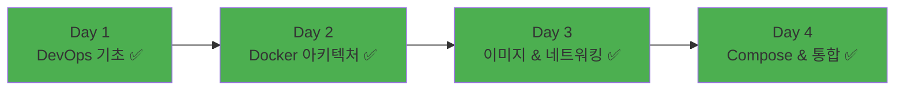

# Week 1 Day 4: Docker Compose & 멀티 컨테이너

<div align="center">


**🎼 Docker Compose 마스터** • **🏗️ 멀티 컨테이너 아키텍처**

*YAML로 정의하는 멀티 컨테이너 애플리케이션, Week 1 통합 프로젝트 완성*

</div>

---

## 🎯 일일 학습 목표

### 📚 핵심 목표
- **Docker Compose 마스터**: YAML 기반 멀티 컨테이너 관리 완전 습득
- **아키텍처 설계**: 3-Tier 및 마이크로서비스 아키텍처 이해
- **환경 관리**: 개발/스테이징/프로덕션 환경별 설정 분리
- **Week 1 통합**: 지금까지 학습한 모든 내용을 활용한 실무 프로젝트

### 🤝 협업 목표
- **팀 프로젝트**: 풀스택 웹 애플리케이션 구축
- **역할 분담**: Frontend, Backend, DevOps, Monitoring 팀별 전문화
- **통합 작업**: 각 팀의 결과물을 하나의 시스템으로 통합

---

## 🕘 일일 스케줄

### 📊 시간 배분
```
📚 이론 강의: 2.5시간 (31.25%) - 50분×3세션
🛠️ 실습 프로젝트: 2시간 (25%) - Docker Compose 실전
👥 학생 케어: 3.5시간 (43.75%) - Week 1 총정리 & 회고
```

### 🗓️ 상세 스케줄
| 시간 | 구분 | 내용 | 목적 |
|------|------|------|------|
| **09:00-09:50** | 📚 이론 1 | [Docker Compose 개념](./session_1.md) | YAML 기반 관리 |
| **09:50-10:00** | ☕ 휴식 | 10분 휴식 | |
| **10:00-10:50** | 📚 이론 2 | [멀티 컨테이너 아키텍처](./session_2.md) | 서비스 설계 |
| **10:50-11:00** | ☕ 휴식 | 10분 휴식 | |
| **11:00-11:50** | 📚 이론 3 | [환경별 설정 관리](./session_3.md) | 운영 환경 대응 |
| **11:50-13:00** | 🍽️ 점심 | 점심시간 (70분) | |
| **12:00-12:50** | 🛠️ 실습 1 | [Docker Compose 실전 프로젝트](./lab_1.md) | 멀티 컨테이너 구축 |
| **12:50-13:00** | ☕ 휴식 | 10분 휴식 | |
| **13:00-14:00** | 🍽️ 점심 | 점심시간 (60분) | |
| **14:00-14:50** | 🛠️ 실습 2 | [Docker Compose 모니터링](./lab_2.md) | Prometheus + Grafana |
| **15:00-15:15** | ☕ 휴식 | 15분 휴식 | |
| **15:15-18:00** | 👥 케어 | Week 1 총정리 & 회고 | 성과 점검 & 포트폴리오 |

---

## 📚 세션별 개요

### [Session 1: Docker Compose 개념과 YAML 작성](./session_1.md)
**시간**: 09:00-09:50 (50분)

#### 🎯 핵심 내용
- **Docker Compose 소개**: 멀티 컨테이너 애플리케이션 관리 도구
- **YAML 문법**: services, volumes, networks 섹션 구조
- **서비스 간 의존성**: depends_on과 통신 설정
- **기본 명령어**: up, down, logs, exec 등 주요 명령어

#### 🔑 핵심 키워드
- Docker Compose, YAML, services, volumes, networks
- depends_on, environment, ports, volumes

### [Session 2: 멀티 컨테이너 아키텍처 설계](./session_2.md)
**시간**: 10:00-10:50 (50분)

#### 🎯 핵심 내용
- **3-Tier 아키텍처**: Presentation, Application, Data 계층 분리
- **마이크로서비스 패턴**: 서비스별 독립 배포와 확장
- **로드 밸런싱**: Nginx를 활용한 트래픽 분산
- **모니터링 통합**: Prometheus, Grafana를 활용한 관측성

#### 🔑 핵심 키워드
- 3-Tier Architecture, Microservices, Load Balancer
- Nginx, Prometheus, Grafana, ELK Stack

### [Session 3: 환경별 설정 관리 (dev/staging/prod)](./session_3.md)
**시간**: 11:00-11:50 (50분)

#### 🎯 핵심 내용
- **환경별 설정 분리**: 개발, 스테이징, 프로덕션 환경 차이점
- **환경 변수 관리**: .env 파일과 환경별 오버라이드
- **시크릿 관리**: 민감한 정보의 안전한 관리 방법
- **Compose 파일 확장**: 기본 설정과 환경별 오버라이드

#### 🔑 핵심 키워드
- Environment Variables, .env, Docker Secrets
- Override, extends, 환경별 배포

### [Lab 1: Docker Compose 실전 프로젝트](./lab_1.md)
**시간**: 12:00-12:50 (50분)

#### 🎯 핵심 내용
- **풀스택 애플리케이션**: React + Node.js + PostgreSQL + Redis
- **멀티 컨테이너 오케스트레이션**: 서비스 간 통신 및 의존성 관리
- **환경별 배포**: 개발/프로덕션 환경 설정 분리
- **실무 수준 구현**: 리버스 프록시, 데이터 영속성

#### 🔑 핵심 키워드
- Multi-container Application, Service Communication
- Environment Override, Production Deployment

### [Lab 2: Docker Compose 모니터링 시스템](./lab_2.md)
**시간**: 14:00-14:50 (50분)

#### 🎯 핵심 내용
- **모니터링 스택**: Prometheus + Grafana + Exporters
- **메트릭 수집**: 시스템, 컨테이너, 애플리케이션 메트릭
- **시각화 대시보드**: Grafana 대시보드 생성 및 커스터마이징
- **알림 시스템**: 임계치 기반 알림 및 자동화

#### 🔑 핵심 키워드
- Prometheus, Grafana, Monitoring Stack
- Metrics Collection, Alerting, Observability

---

## 🛠️ 실습 세션 개요

### 🎯 Lab 1: Docker Compose 실전 프로젝트 (50분)
**목표**: 실무와 유사한 풀스택 웹 애플리케이션 구축

#### 📋 아키텍처 요구사항
- **Frontend**: React 기반 SPA
- **Backend**: Node.js API 서버
- **Database**: PostgreSQL + Redis 조합
- **Load Balancer**: Nginx 리버스 프록시

#### 🚀 구현 단계
1. **프로젝트 구조 설계** (10분)
2. **서비스 구현** (30분)
3. **통합 테스트** (10분)

### 📊 Lab 2: Docker Compose 모니터링 (50분)
**목표**: Prometheus + Grafana 모니터링 시스템 구축

#### 📋 모니터링 스택
- **메트릭 수집**: Prometheus + Exporters
- **시각화**: Grafana 대시보드
- **알림**: 임계치 기반 알림 시스템

#### 🚀 구현 단계
1. **모니터링 스택 구성** (15분)
2. **Grafana 대시보드 설정** (20분)
3. **알림 및 자동화** (10분)
4. **고급 모니터링 기능** (5분)

### 🏆 기대 성과
- 실무 수준의 멀티 컨테이너 시스템 구축
- Docker Compose를 활용한 효율적 개발 환경 구성
- Prometheus + Grafana 모니터링 시스템 마스터
- 환경별 설정 관리 실무 경험

---

## 👥 Week 1 총정리 & 학생 케어 (165분)

### 📊 Week 1 성과 점검 (30분)
- 개인별 학습 목표 달성도 체크
- 기술 역량 성장 지표 확인
- 협업 능력 발전 상황 점검

### 🤝 협업 경험 회고 (45분)
- 팀별 협업 성과 공유 (20분)
- 개인 성장 회고 (25분)

### 🎯 Week 2 준비 및 동기부여 (30분)
- Week 2 학습 내용 미리보기
- 사전 학습 자료 안내
- Week 1 성취 축하 및 동기부여

---

## 📝 일일 마무리

### ✅ 성취 목표
- [ ] Docker Compose를 활용한 멀티 컨테이너 관리 습득
- [ ] 실무 수준의 아키텍처 설계 및 구현
- [ ] 환경별 설정 관리 방법 완전 이해
- [ ] Week 1 통합 프로젝트 성공적 완성

### 🎯 Week 2 준비사항
- **예습**: Kubernetes 기본 개념 학습
- **복습**: Week 1 전체 내용 정리 및 포트폴리오 작성
- **환경**: 컨테이너 오케스트레이션 실습 환경 준비

### 📊 Week 1 완료


---

<div align="center">

**🎼 Docker Compose 완성** • **🏗️ 멀티 컨테이너 마스터** • **🤝 팀 프로젝트 성공**

*Week 1을 통해 DevOps와 컨테이너 기술의 탄탄한 기초를 완성했습니다*

**시작**: [Session 1 - Docker Compose 개념](./session_1.md)  
**실습**: [Lab 1 - 실전 프로젝트](./lab_1.md) | [Lab 2 - 모니터링](./lab_2.md)

</div>