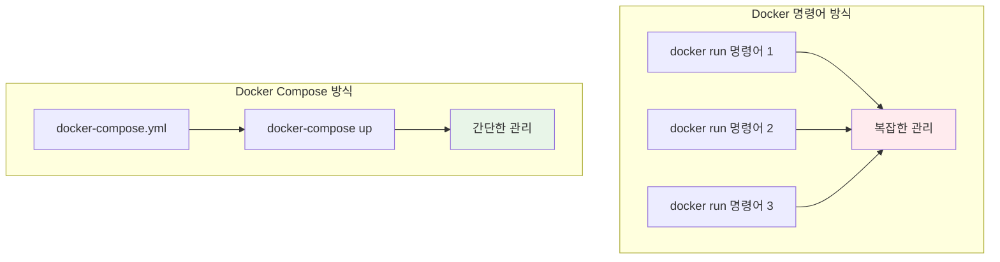
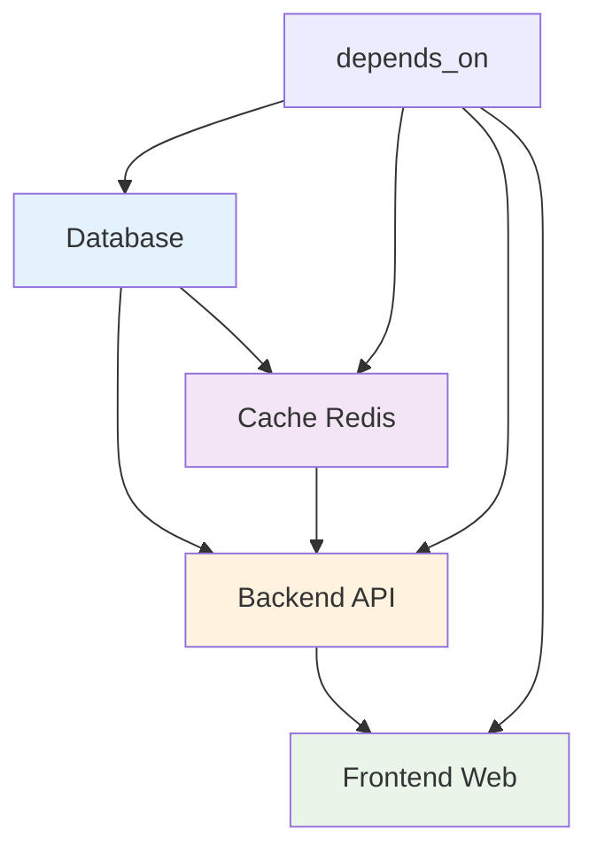

# Week 1 Day 4 Session 1: Docker Compose 개념과 YAML 작성

<div align="center">

**🎼 Docker Compose 마스터** • **YAML 기반 멀티 컨테이너**

*여러 컨테이너를 하나의 파일로 관리하는 혁신*

</div>

---

## 🕘 세션 정보

**시간**: 09:00-09:50 (50분)  
**목표**: Docker Compose의 필요성과 YAML 문법 완전 이해  
**방식**: 개념 설명 + YAML 작성 실습 + 팀 토론

---

## 🎯 세션 목표

### 📚 학습 목표
- **이해 목표**: Docker Compose의 필요성과 YAML 문법 완전 이해
- **적용 목표**: 복잡한 멀티 컨테이너 애플리케이션을 YAML로 정의 가능
- **협업 목표**: 페어 토론을 통한 Compose 파일 설계 및 리뷰

### 🤔 왜 필요한가? (5분)

**Docker Compose 탄생 배경**:
- 💼 **실무 문제**: 개발팀이 여러 컨테이너를 수동으로 관리하는 고통
- 🏠 **일상 비유**: 오케스트라 지휘자 없이 여러 연주자가 각자 연주하는 혼란
- 📊 **시장 요구**: 대형 기업들의 마이크로서비스 아키텍처 확산

**Docker Compose 이전 vs 이후**:
```bash
# Docker Compose 이전 (2014년 이전)
docker run -d --name db -e POSTGRES_DB=myapp postgres:13
docker run -d --name redis redis:alpine  
docker run -d --name api --link db --link redis -p 5000:5000 myapp:api
docker run -d --name web --link api -p 80:80 nginx:alpine
# 😱 4개 컨테이너만으로도 이미 복잡!

# Docker Compose 이후 (2014년 Fig 인수 후)
docker-compose up -d
# 🎉 한 줄로 해결!
```

**일반적인 개발팀 시나리오**:
- **문제**: 신입 개발자가 로컬 환경 구축에 오랜 시간 소요
- **해결**: Docker Compose로 단시간에 전체 스택 실행
- **효과**: 개발 환경 구축 시간 대폭 단축 및 생산성 향상

---

## 📖 핵심 개념 (35분)

### 🔍 개념 1: Docker Compose 소개 (12분)

> **정의**: 여러 컨테이너로 구성된 애플리케이션을 정의하고 실행하는 도구

**🖼️ Docker Compose 아키텍처**

*출처: Docker 공식 문서*

**Compose의 장점**:


**🖼️ 멀티 컨테이너 애플리케이션**

*전형적인 3-tier 애플리케이션 구조*

**실무 사용 시나리오 상세**:

**🏢 개발 환경 (가장 일반적)**:
```yaml
# 개발팀 표준 docker-compose.dev.yml
version: '3.8'
services:
  frontend:
    build: ./frontend
    volumes:
      - ./frontend/src:/app/src  # 🔥 핫 리로드
    ports:
      - "3000:3000"
  
  backend:
    build: ./backend
    volumes:
      - ./backend:/app  # 코드 변경 즉시 반영
    environment:
      - NODE_ENV=development
      - DEBUG=true  # 개발용 디버그 모드
```
**효과**: 신입 개발자도 `git clone && docker-compose up`으로 5분 만에 개발 시작

**🧪 테스트 환경 (CI/CD)**:
- **GitHub Actions**: 매 PR마다 자동으로 전체 스택 테스트
- **Jenkins**: 통합 테스트 시 격리된 환경 제공
- **실제 사례**: Airbnb는 1000+ 마이크로서비스를 Compose로 테스트

**🚀 소규모 프로덕션**:
- **스타트업**: AWS EC2 한 대에서 전체 서비스 운영
- **사이드 프로젝트**: 개인 서버에서 블로그 + DB + 모니터링 통합
- **주의**: 대규모는 Kubernetes 필요 (100+ 컨테이너 이상)

**📊 실제 기업 사용 통계**:
- **Docker Hub**: 일일 Compose 파일 다운로드 500만+
- **Stack Overflow**: Docker 질문 중 30%가 Compose 관련
- **GitHub**: 공개 저장소 중 40%가 docker-compose.yml 포함

### 🔍 개념 2: YAML 문법과 구조 (12분)

> **정의**: Docker Compose에서 사용하는 YAML 파일의 구조와 문법

**기본 YAML 구조**:
```yaml
version: '3.8'

services:
  web:
    build: .
    ports:
      - "8080:80"
    depends_on:
      - db
    environment:
      - NODE_ENV=production
    
  db:
    image: postgres:13
    environment:
      POSTGRES_DB: myapp
      POSTGRES_USER: user
      POSTGRES_PASSWORD: password
    volumes:
      - postgres_data:/var/lib/postgresql/data

volumes:
  postgres_data:

networks:
  default:
    driver: bridge
```

**YAML 문법 핵심 규칙**:
```yaml
# ❌ 잘못된 예시 (들여쓰기 오류)
services:
web:  # 들여쓰기 없음 - 오류!
  image: nginx

# ✅ 올바른 예시
services:
  web:  # 2칸 들여쓰기
    image: nginx
    ports:
      - "80:80"  # 4칸 들여쓰기
```

**주요 섹션 상세 설명**:
- **version**: `'3.8'` 권장 (Docker Engine 19.03+)
- **services**: 각 컨테이너 정의 (핵심 섹션)
- **volumes**: 데이터 영속성 보장 (DB 데이터 등)
- **networks**: 서비스 간 통신 제어
- **secrets**: 민감 정보 관리 (패스워드 등)
- **configs**: 설정 파일 외부 관리

**⚠️ YAML 작성 시 흔한 실수**:
1. **들여쓰기 오류**: 탭 대신 스페이스 2칸 사용
2. **따옴표 누락**: 포트 번호는 문자열로 `"80:80"`
3. **하이픈 위치**: 리스트 항목은 `-` 뒤에 공백
4. **환경변수**: `=` 앞뒤 공백 없이 `KEY=value`

**🔧 YAML 검증 도구**:
- **온라인**: yamllint.com
- **VS Code**: YAML 확장 프로그램
- **명령어**: `docker-compose config` (문법 검사)

### 🔍 개념 3: 서비스 간 의존성과 통신 (11분)

> **정의**: 컨테이너 간의 실행 순서와 통신 방법 정의

**🖼️ Docker Compose 워크플로우**

*개발부터 배포까지의 전체 워크플로우*

**의존성 관리**:


**🖼️ YAML 문법 가이드**

*YAML 파일의 기본 구조와 문법*

**서비스 간 통신 심화**:
```yaml
services:
  web:
    build: .
    depends_on:
      api:
        condition: service_healthy  # 🔥 헬스체크 대기
    networks:
      - frontend
      - backend
    
  api:
    build: ./api
    environment:
      # 🔥 서비스명으로 내부 DNS 해결
      - DATABASE_URL=postgresql://user:pass@db:5432/myapp
      - REDIS_URL=redis://redis:6379
    healthcheck:  # 🔥 헬스체크 정의
      test: ["CMD", "curl", "-f", "http://localhost:5000/health"]
      interval: 30s
      timeout: 10s
      retries: 3
    networks:
      - backend
  
  db:
    image: postgres:13
    networks:
      - backend  # 🔥 네트워크 분리로 보안 강화
    
networks:
  frontend:  # 웹-API 통신용
  backend:   # API-DB 통신용
```

**🌐 네트워크 통신 원리**:
- **내부 DNS**: 서비스명이 자동으로 호스트명이 됨
- **포트 노출**: `ports`는 외부 접근, `expose`는 내부만
- **네트워크 분리**: 보안을 위해 계층별 네트워크 구성

**⚠️ 의존성 관리 주의사항**:
1. **depends_on 한계**: 컨테이너 시작만 보장, 서비스 준비 상태는 별도
2. **순환 의존성**: A→B→A 형태는 불가능
3. **헬스체크 필수**: 실제 서비스 준비 상태 확인 필요
4. **재시작 정책**: `restart: unless-stopped` 권장

**🔧 실무 디버깅 팁**:
```bash
# 서비스 간 통신 테스트
docker-compose exec web ping api
docker-compose exec api nc -zv db 5432

# 로그 실시간 확인
docker-compose logs -f api

# 특정 서비스만 재시작
docker-compose restart api
```

---

## 💭 함께 생각해보기 (10분)

### 🤝 페어 토론 (5분)
**실무 중심 토론 주제**:
1. **개발 환경 표준화**: "팀에 신입이 들어왔을 때 개발 환경 구축을 어떻게 단순화할까요?"
2. **의존성 관리 전략**: "데이터베이스가 준비되기 전에 API가 시작되는 문제를 어떻게 해결할까요?"
3. **실무 적용 시나리오**: "현재 회사/프로젝트에서 Docker Compose를 도입한다면 어떤 부분부터 시작할까요?"

**💡 토론 가이드**:
- **경험 공유**: 개발 환경 구축에서 겪었던 어려움
- **문제 해결**: 서비스 시작 순서나 설정 관리 방법
- **실무 연결**: 현재 프로젝트에 적용 가능한 부분

### 🎯 전체 공유 (5분)
**실무 인사이트 공유**:
- **개발 환경 베스트 프랙티스**: 팀별 효과적인 Compose 파일 구조
- **문제 해결 경험**: 의존성 관리나 네트워크 설정에서 배운 점
- **도입 전략**: 기존 프로젝트에 Docker Compose 적용 방안

**🏆 우수 사례 선정**:
- 가장 실용적인 개발 환경 구성 아이디어
- 창의적인 문제 해결 방법
- 팀 협업에 도움이 되는 설정 방법

---

## 🔑 핵심 키워드

### Docker Compose 기본
- **docker-compose.yml**: 멀티 컨테이너 정의 파일
- **Services**: 컨테이너 서비스 정의 섹션
- **depends_on**: 서비스 간 의존성 정의
- **docker-compose up**: 전체 스택 실행 명령어

### YAML 구조
- **version**: Compose 파일 포맷 버전
- **build**: Dockerfile 기반 이미지 빌드
- **image**: 기존 이미지 사용
- **ports**: 포트 매핑 설정
- **environment**: 환경 변수 설정

---

## 🛠️ 간단 실습 (10분)

### 🚀 첫 번째 Docker Compose 파일 작성

**실습 목표**: 간단한 웹 + 데이터베이스 구성

```bash
# 실습 디렉토리 생성
mkdir ~/compose-practice && cd ~/compose-practice

# docker-compose.yml 작성
cat > docker-compose.yml << 'EOF'
version: '3.8'

services:
  web:
    image: nginx:alpine
    ports:
      - "8080:80"
    depends_on:
      - db
    volumes:
      - ./html:/usr/share/nginx/html
  
  db:
    image: postgres:13-alpine
    environment:
      POSTGRES_DB: testdb
      POSTGRES_USER: user
      POSTGRES_PASSWORD: password
    volumes:
      - postgres_data:/var/lib/postgresql/data

volumes:
  postgres_data:
EOF

# 간단한 HTML 파일 생성
mkdir html
cat > html/index.html << 'EOF'
<!DOCTYPE html>
<html>
<head>
    <title>Docker Compose 첫 실습</title>
</head>
<body>
    <h1>🎉 Docker Compose 성공!</h1>
    <p>웹 서버와 데이터베이스가 함께 실행 중입니다.</p>
</body>
</html>
EOF

# 실행 및 테스트
docker-compose up -d
docker-compose ps

# 브라우저에서 http://localhost:8080 접속 확인

# 정리
docker-compose down
```

### ✅ 실습 체크포인트
- [ ] docker-compose.yml 파일 작성 완료
- [ ] 서비스 간 의존성 설정 확인
- [ ] 웹 서버 접속 성공
- [ ] 컨테이너 상태 확인 및 정리

---

## 📝 세션 마무리

### ✅ 오늘 세션 성과
- [ ] Docker Compose 필요성과 장점 완전 이해
- [ ] YAML 기본 문법과 구조 습득
- [ ] 서비스 간 의존성 관리 방법 파악
- [ ] 간단한 Docker Compose 실습 완료
- [ ] 다음 세션 실습을 위한 기본 지식 완성

### 🎯 다음 세션 준비
- **주제**: 멀티 컨테이너 아키텍처 설계
- **연결고리**: Compose 기본 → 복잡한 아키텍처 설계
- **준비사항**: 실무에서 사용하는 아키텍처 패턴 궁금증 가지기

---

<div align="center">

**🎼 Docker Compose 기본을 완전히 마스터했습니다**

*YAML로 멀티 컨테이너 애플리케이션 정의하기*

**다음**: [Session 2 - 멀티 컨테이너 아키텍처 설계](./session_2.md)

</div>