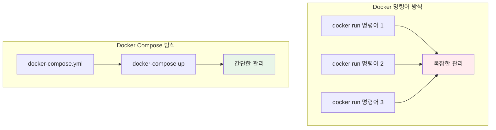
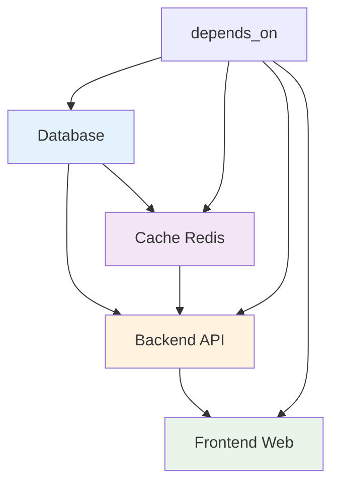

# Week 1 Day 4 Session 1: Docker Compose 개념과 YAML 작성

<div align="center">

**🎼 Docker Compose 마스터** • **YAML 기반 멀티 컨테이너**

*여러 컨테이너를 하나의 파일로 관리하는 혁신*

</div>

---

## 🕘 세션 정보

**시간**: 09:00-09:50 (50분)  
**목표**: Docker Compose의 필요성과 YAML 문법 완전 이해  
**방식**: 개념 설명 + YAML 작성 실습 + 팀 토론

---

## 🎯 세션 목표

### 📚 학습 목표
- **이해 목표**: Docker Compose의 필요성과 YAML 문법 완전 이해
- **적용 목표**: 복잡한 멀티 컨테이너 애플리케이션을 YAML로 정의 가능
- **협업 목표**: 페어 토론을 통한 Compose 파일 설계 및 리뷰

### 🤔 왜 필요한가? (5분)

**현실 문제 상황**:
- 💼 **복잡한 명령어**: 여러 컨테이너 실행 시 긴 docker run 명령어들
- 🏠 **일상 비유**: 오케스트라 지휘자처럼 여러 컨테이너를 조율
- 📊 **시장 동향**: 마이크로서비스 아키텍처에서 필수적인 컨테이너 오케스트레이션

---

## 📖 핵심 개념 (35분)

### 🔍 개념 1: Docker Compose 소개 (12분)

> **정의**: 여러 컨테이너로 구성된 애플리케이션을 정의하고 실행하는 도구

**🖼️ Docker Compose 아키텍처**

*출처: Docker 공식 문서*

**Compose의 장점**:


**🖼️ 멀티 컨테이너 애플리케이션**

*전형적인 3-tier 애플리케이션 구조*

**Compose 사용 시나리오**:
- **개발 환경**: 로컬에서 전체 스택 실행
- **테스트 환경**: CI/CD 파이프라인에서 테스트 환경 구성
- **단일 호스트 배포**: 간단한 프로덕션 환경

### 🔍 개념 2: YAML 문법과 구조 (12분)

> **정의**: Docker Compose에서 사용하는 YAML 파일의 구조와 문법

**기본 YAML 구조**:
```yaml
version: '3.8'

services:
  web:
    build: .
    ports:
      - "8080:80"
    depends_on:
      - db
    environment:
      - NODE_ENV=production
    
  db:
    image: postgres:13
    environment:
      POSTGRES_DB: myapp
      POSTGRES_USER: user
      POSTGRES_PASSWORD: password
    volumes:
      - postgres_data:/var/lib/postgresql/data

volumes:
  postgres_data:

networks:
  default:
    driver: bridge
```

**주요 섹션들**:
- **version**: Compose 파일 버전
- **services**: 컨테이너 서비스 정의
- **volumes**: 데이터 볼륨 정의
- **networks**: 네트워크 설정

### 🔍 개념 3: 서비스 간 의존성과 통신 (11분)

> **정의**: 컨테이너 간의 실행 순서와 통신 방법 정의

**🖼️ Docker Compose 워크플로우**

*개발부터 배포까지의 전체 워크플로우*

**의존성 관리**:


**🖼️ YAML 문법 가이드**

*YAML 파일의 기본 구조와 문법*

**서비스 간 통신**:
```yaml
services:
  web:
    build: .
    depends_on:
      - api
      - redis
    
  api:
    build: ./api
    environment:
      - DATABASE_URL=postgresql://user:pass@db:5432/myapp
      - REDIS_URL=redis://redis:6379
    depends_on:
      - db
      - redis
  
  db:
    image: postgres:13
    
  redis:
    image: redis:alpine
```

---

## 💭 함께 생각해보기 (10분)

### 🤝 페어 토론 (5분)
**토론 주제**:
1. **구조 이해**: "YAML 파일로 인프라를 정의하는 것의 장점은?"
2. **의존성 관리**: "서비스 간 의존성을 어떻게 효과적으로 관리할까요?"
3. **실무 적용**: "개발팀에서 Compose를 어떻게 활용할 수 있을까요?"

### 🎯 전체 공유 (5분)
- **YAML 설계**: 효과적인 Compose 파일 구조 아이디어
- **의존성 전략**: 서비스 간 의존성 관리 방안

---

## 🔑 핵심 키워드

### Docker Compose 기본
- **docker-compose.yml**: 멀티 컨테이너 정의 파일
- **Services**: 컨테이너 서비스 정의 섹션
- **depends_on**: 서비스 간 의존성 정의
- **docker-compose up**: 전체 스택 실행 명령어

### YAML 구조
- **version**: Compose 파일 포맷 버전
- **build**: Dockerfile 기반 이미지 빌드
- **image**: 기존 이미지 사용
- **ports**: 포트 매핑 설정
- **environment**: 환경 변수 설정

---

## 📝 세션 마무리

### ✅ 오늘 세션 성과
- [ ] Docker Compose 필요성과 장점 완전 이해
- [ ] YAML 기본 문법과 구조 습득
- [ ] 서비스 간 의존성 관리 방법 파악
- [ ] 실습을 위한 기본 지식 완성

### 🎯 다음 세션 준비
- **주제**: 멀티 컨테이너 아키텍처 설계
- **연결고리**: Compose 기본 → 복잡한 아키텍처 설계
- **준비사항**: 실무에서 사용하는 아키텍처 패턴 궁금증 가지기

---

<div align="center">

**🎼 Docker Compose 기본을 완전히 마스터했습니다**

*YAML로 멀티 컨테이너 애플리케이션 정의하기*

**다음**: [Session 2 - 멀티 컨테이너 아키텍처 설계](./session_2.md)

</div>