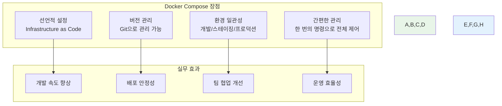
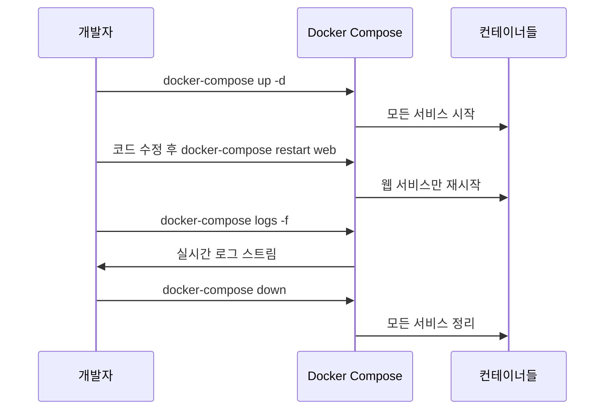
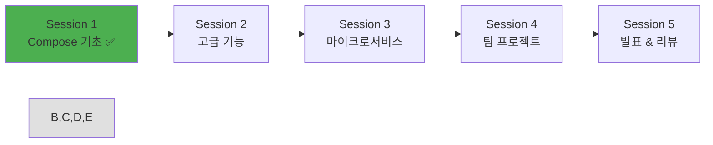

# Week 1 Day 4 Session 1: Docker Compose 기초

<div align="center">

**🎼 Docker Compose 시작하기** • **YAML로 멀티 컨테이너 관리**

*복잡한 docker run 명령어에서 벗어나 선언적 방식으로 컨테이너 오케스트레이션*

</div>

---

## 🕘 세션 정보

**시간**: 09:00-09:50 (50분)  
**목표**: Docker Compose 기본 개념과 YAML 문법 완전 습득  
**방식**: 이론 + 실습 + 페어 프로그래밍

---

## 🎯 세션 목표

### 📚 학습 목표
- **이해 목표**: Docker Compose의 필요성과 핵심 개념 완전 이해
- **적용 목표**: YAML 문법으로 멀티 컨테이너 애플리케이션 정의
- **협업 목표**: 페어 프로그래밍을 통한 Compose 파일 작성 경험

### 🤔 왜 필요한가? (3분)
**Docker Compose의 혁신**:
- 💼 **실무 필수**: 복잡한 docker run 명령어 대신 선언적 설정
- 🏠 **일상 비유**: 오케스트라 지휘자가 악보로 연주를 지휘하는 것
- 📊 **효율성**: 한 번의 명령으로 전체 애플리케이션 스택 관리

---

## 📖 핵심 개념 (35분)

### 🔍 개념 1: Docker Compose 기본 이해 (12분)

#### Docker Compose란?
> **정의**: 멀티 컨테이너 Docker 애플리케이션을 정의하고 실행하는 도구

**기존 방식의 문제점**:
```bash
# 복잡한 docker run 명령어들
docker network create myapp-network

docker run -d --name database \
  --network myapp-network \
  -e MYSQL_ROOT_PASSWORD=rootpass \
  -e MYSQL_DATABASE=myapp \
  -v db_data:/var/lib/mysql \
  mysql:8.0

docker run -d --name backend \
  --network myapp-network \
  -e DATABASE_URL=mysql://database:3306/myapp \
  -p 3000:3000 \
  myapp-backend:latest

docker run -d --name frontend \
  --network myapp-network \
  -p 80:80 \
  myapp-frontend:latest
```

**Compose 방식의 해결책**:
```yaml
# docker-compose.yml
version: '3.8'

services:
  database:
    image: mysql:8.0
    environment:
      MYSQL_ROOT_PASSWORD: rootpass
      MYSQL_DATABASE: myapp
    volumes:
      - db_data:/var/lib/mysql

  backend:
    image: myapp-backend:latest
    environment:
      DATABASE_URL: mysql://database:3306/myapp
    ports:
      - "3000:3000"
    depends_on:
      - database

  frontend:
    image: myapp-frontend:latest
    ports:
      - "80:80"
    depends_on:
      - backend

volumes:
  db_data:
```

#### Compose의 핵심 장점


### 🔍 개념 2: YAML 문법과 기본 구조 (12분)

#### YAML 기본 문법
```yaml
# 주석은 #으로 시작
version: '3.8'  # 문자열

# 객체 (딕셔너리)
services:
  web:
    image: nginx:alpine
    ports:
      - "80:80"  # 배열의 요소
    environment:
      - NODE_ENV=production  # 배열 형태
      # 또는
    environment:
      NODE_ENV: production   # 객체 형태
      DEBUG: "false"

# 배열 (리스트)
volumes:
  - db_data
  - app_data

# 멀티라인 문자열
command: |
  echo "Starting application..."
  npm start
```

#### docker-compose.yml 기본 구조
```yaml
version: '3.8'  # Compose 파일 버전

services:       # 컨테이너 서비스들 정의
  service1:
    # 서비스 설정
  service2:
    # 서비스 설정

networks:       # 네트워크 정의 (선택사항)
  network1:
    # 네트워크 설정

volumes:        # 볼륨 정의 (선택사항)
  volume1:
    # 볼륨 설정
```

#### 주요 서비스 설정 옵션
```yaml
services:
  myapp:
    # 이미지 지정
    image: nginx:alpine
    
    # 또는 Dockerfile로 빌드
    build: 
      context: .
      dockerfile: Dockerfile
    
    # 포트 매핑
    ports:
      - "8080:80"
      - "8443:443"
    
    # 환경변수
    environment:
      NODE_ENV: production
      DATABASE_URL: postgresql://db:5432/myapp
    
    # 볼륨 마운트
    volumes:
      - ./app:/usr/src/app
      - node_modules:/usr/src/app/node_modules
    
    # 의존성 설정
    depends_on:
      - database
      - redis
    
    # 재시작 정책
    restart: unless-stopped
    
    # 네트워크 연결
    networks:
      - frontend
      - backend
```

### 🔍 개념 3: 기본 명령어와 워크플로우 (11분)

#### 핵심 Compose 명령어
```bash
# 서비스 시작 (백그라운드)
docker-compose up -d

# 서비스 중지
docker-compose down

# 서비스 재시작
docker-compose restart

# 로그 확인
docker-compose logs
docker-compose logs -f web  # 특정 서비스 실시간 로그

# 서비스 상태 확인
docker-compose ps

# 서비스 스케일링
docker-compose up -d --scale web=3

# 설정 파일 검증
docker-compose config

# 이미지 빌드
docker-compose build

# 서비스 실행 (일회성)
docker-compose run web bash
```

#### 개발 워크플로우


#### 환경별 설정 관리
```bash
# 기본 파일
docker-compose.yml

# 개발 환경 오버라이드
docker-compose.override.yml

# 프로덕션 환경
docker-compose -f docker-compose.yml -f docker-compose.prod.yml up -d

# 환경변수 파일 사용
docker-compose --env-file .env.production up -d
```

---

## 💭 함께 생각해보기 (10분)

### 🤝 페어 실습: 첫 번째 Compose 파일 작성 (7분)
**실습 미션**: 간단한 웹 애플리케이션 스택 구성

**요구사항**:
- **웹 서버**: Nginx (포트 8080)
- **데이터베이스**: MySQL (환경변수 설정)
- **캐시**: Redis
- **모든 서비스가 통신 가능하도록 네트워크 구성**

**페어 활동**:
- 👥 **Driver**: YAML 파일 작성
- 🧭 **Navigator**: 문법 검토 및 개선 제안
- 🔄 **역할 교대**: 5분 후 역할 변경

**기본 템플릿**:
```yaml
version: '3.8'

services:
  web:
    image: nginx:alpine
    ports:
      - "8080:80"
    # TODO: 의존성 추가

  database:
    image: mysql:8.0
    environment:
      # TODO: 환경변수 설정
    volumes:
      # TODO: 데이터 영속성

  cache:
    image: redis:alpine
    # TODO: 추가 설정

volumes:
  # TODO: 볼륨 정의

networks:
  # TODO: 네트워크 정의 (선택사항)
```

### 🎯 전체 공유 (3분)
- **구현 결과**: 각 페어의 Compose 파일 공유
- **문제 해결**: 작성 중 발생한 문제와 해결 방법
- **베스트 프랙티스**: 가장 깔끔한 구성 선정

### 💡 이해도 체크 질문
- ✅ "Docker Compose를 사용하는 이유를 3가지 설명할 수 있나요?"
- ✅ "YAML에서 배열과 객체를 어떻게 표현하나요?"
- ✅ "depends_on의 역할과 한계점을 설명할 수 있나요?"

---

## 🔑 핵심 키워드

### Docker Compose 기본
- **docker-compose.yml**: 서비스 정의 파일
- **version**: Compose 파일 포맷 버전
- **services**: 컨테이너 서비스들 정의
- **docker-compose up/down**: 서비스 시작/중지

### YAML 문법
- **Key-Value**: 키: 값 형태의 객체
- **Array**: - 요소 형태의 배열
- **Multi-line**: | 또는 > 를 사용한 멀티라인
- **Comments**: # 으로 시작하는 주석

### 서비스 설정
- **image**: 사용할 Docker 이미지
- **build**: Dockerfile로 이미지 빌드
- **ports**: 포트 매핑 설정
- **environment**: 환경변수 설정
- **volumes**: 볼륨 마운트 설정
- **depends_on**: 서비스 의존성 정의

### 관리 명령어
- **docker-compose ps**: 서비스 상태 확인
- **docker-compose logs**: 로그 확인
- **docker-compose config**: 설정 검증
- **docker-compose restart**: 서비스 재시작

---

## 📝 세션 마무리

### ✅ 오늘 세션 성과
- [ ] Docker Compose의 필요성과 장점 완전 이해
- [ ] YAML 문법과 기본 구조 습득
- [ ] 첫 번째 docker-compose.yml 파일 작성 완료
- [ ] 기본 명령어와 워크플로우 파악

### 🎯 다음 세션 준비
- **주제**: 고급 Compose 기능 (네트워크, 볼륨, 환경 관리)
- **연결고리**: 기본 구성 → 고급 기능 → 실무 패턴
- **준비사항**: 오늘 작성한 Compose 파일을 고급 기능으로 확장

### 📊 학습 진도 체크


---

<div align="center">

**🎼 Docker Compose 기초를 완전히 마스터했습니다**

*복잡한 명령어에서 선언적 설정으로, 컨테이너 오케스트레이션의 첫 걸음*

**다음**: [Session 2 - 고급 Compose 기능](./session_2.md)

</div>