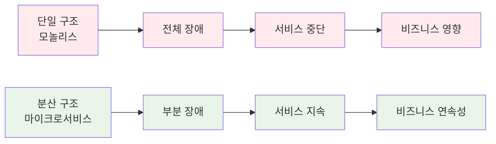
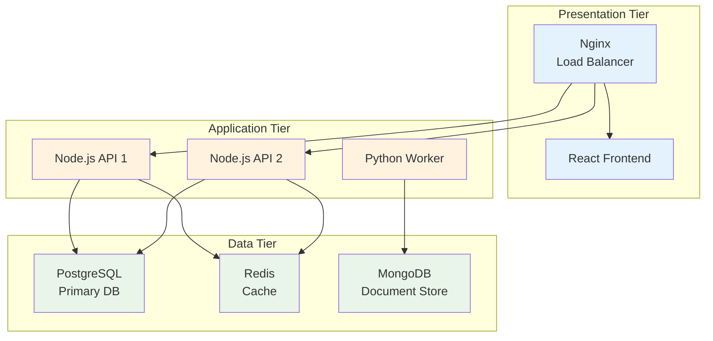
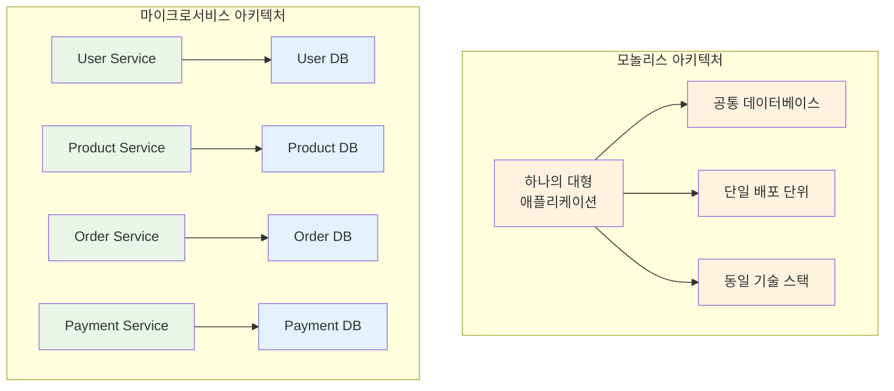
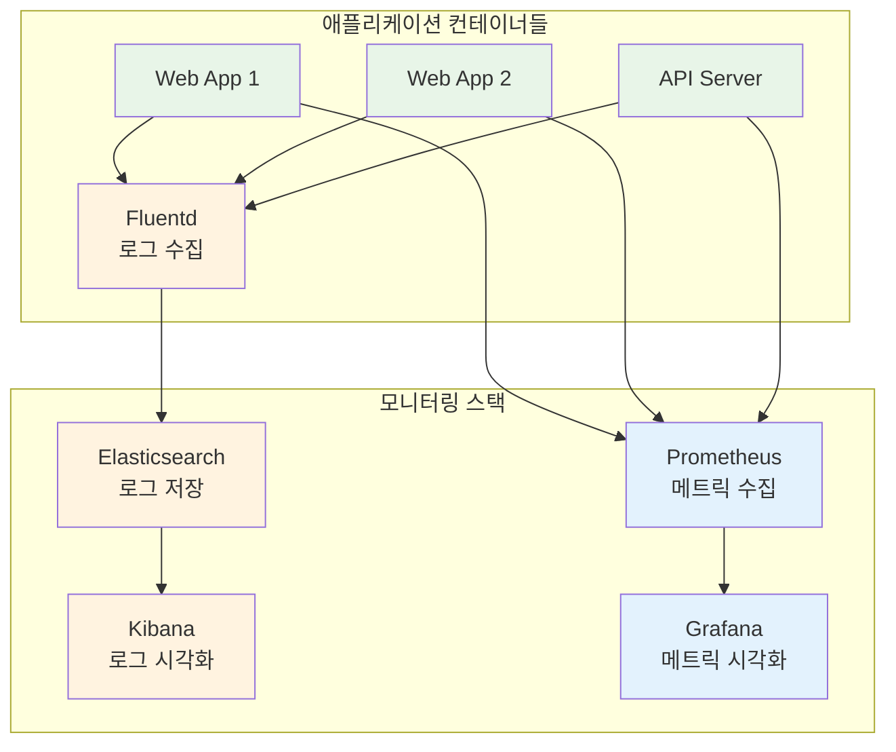

# Week 1 Day 4 Session 2: 멀티 컨테이너 아키텍처 설계

<div align="center">

**🏗️ 아키텍처 설계 패턴** • **확장 가능한 시스템**

*실무에서 사용하는 멀티 컨테이너 아키텍처 패턴*

</div>

---

## 🕘 세션 정보

**시간**: 10:00-10:50 (50분)  
**목표**: 실무에서 사용하는 멀티 컨테이너 아키텍처 패턴 이해  
**방식**: 아키텍처 분석 + 설계 실습 + 팀 토론

---

## 🎯 세션 목표

### 📚 학습 목표
- **이해 목표**: 실무에서 사용하는 멀티 컨테이너 아키텍처 패턴 이해
- **적용 목표**: 확장 가능하고 유지보수가 용이한 아키텍처 설계 능력
- **협업 목표**: 페어 토론을 통한 아키텍처 설계 및 트레이드오프 분석

### 🤔 왜 필요한가? (5분)

**아키텍처 설계의 중요성**:
- 💼 **업계 현실**: 대형 서비스들의 장애 대부분이 단일 장애점 아키텍처 문제
- 🏠 **일상 비유**: 아파트 설계 시 전기/수도/가스 따로 설계하듯 서비스도 분리
- 📊 **비용 현실**: 잘못된 아키텍처로 인한 연간 유지보수 비용 차이 극심

**아키텍처 선택의 영향**:


**업계 트렌드**:
- **스트리밍 서비스**: 모놀리스에서 마이크로서비스로 전환하여 글로벌 서비스 안정성 확보
- **전자상거래**: 마이크로서비스 도입으로 배포 주기 대폭 단축
- **모빌리티 서비스**: 3-Tier 아키텍처로 실시간 대용량 트래픽 처리

---

## 📖 핵심 개념 (35분)

### 🔍 개념 1: 3-Tier 아키텍처 (12분)

> **정의**: 프레젠테이션, 비즈니스 로직, 데이터 계층으로 분리된 구조

**🖼️ 3-Tier 아키텍처 패턴**

*3계층 애플리케이션 아키텍처*

**3-Tier 구조**:


**각 계층의 역할**:
- **Presentation**: 사용자 인터페이스, 로드 밸런싱
- **Application**: 비즈니스 로직, API 서버
- **Data**: 데이터 저장, 캐싱, 검색

### 🔍 개념 2: 마이크로서비스 vs 모놀리스 (12분)

> **정의**: 서비스 분할 전략 - 하나의 대형 애플리케이션 vs 여러 소형 서비스로 분할

**모놀리스 vs 마이크로서비스 비교**:


**🖼️ 마이크로서비스 아키텍처**

*마이크로서비스 아키텍처 패턴*

**주요 차이점 상세**:

**💻 개발 및 유지보수**:
- **모놀리스**: 하나의 코드베이스, 단순한 디버깅
- **마이크로서비스**: 여러 코드베이스, 복잡한 디버깅

**🚀 배포 및 운영**:
- **모놀리스**: 전체 애플리케이션 재배포, 단순한 모니터링
- **마이크로서비스**: 서비스별 독립 배포, 복잡한 모니터링

**📊 성능 및 확장성**:
- **모놀리스**: 전체 스케일링, 내부 함수 호출
- **마이크로서비스**: 선택적 스케일링, 네트워크 통신 오버헤드

**🔒 보안 및 데이터**:
- **모놀리스**: 단순한 보안 모델, 데이터 일관성 보장
- **마이크로서비스**: 복잡한 보안 모델, 분산 데이터 관리

**모놀리스 vs 마이크로서비스 비교**:

| 구분 | 모놀리스 | 마이크로서비스 |
|------|----------|-------------|
| **개발 복잡도** | 낮음 (단순) | 높음 (복잡) |
| **배포** | 전체 애플리케이션 | 서비스별 독립 |
| **확장성** | 수직 확장 | 수평 확장 |
| **기술 스택** | 단일 스택 | 서비스별 다양 |
| **데이터** | 공통 DB | 서비스별 DB |
| **장애 영향** | 전체 영향 | 부분 영향 |
| **팀 규모** | 소규모 (1-10명) | 대규모 (10명+) |
| **운영 복잡도** | 낮음 | 높음 |

**언제 어떤 것을 선택할까?**

**모놀리스 선택 시기**:
- 팀 규모 10명 이하
- 비즈니스 로직이 단순함
- 빠른 개발과 출시가 우선
- DevOps 전문 인력 부족

**마이크로서비스 선택 시기**:
- 팀 규모 10명 이상
- 복잡한 비즈니스 도메인
- 높은 가용성과 확장성 요구
- 충분한 DevOps 역량과 예산

### 🔍 개념 3: 모니터링과 로깅 통합 (11분)

> **정의**: 멀티 컨테이너 환경에서의 관측성 확보 방안

**🖼️ 관측성 스택 (ELK + Prometheus)**

*관측성 모니터링 스택*

**관측성 스택**:


**모니터링 구성 요소**:
- **로그 수집**: Fluentd, Logstash
- **로그 저장**: Elasticsearch, Loki
- **로그 시각화**: Kibana, Grafana
- **메트릭 수집**: Prometheus, InfluxDB
- **알림**: Alertmanager, PagerDuty

---

## 💭 함께 생각해보기 (10분)

### 🤝 페어 토론 (7분)
**실무 중심 토론 주제**:
1. **서비스 분할 전략**: "현재 회사/프로젝트에서 모놀리스 vs 마이크로서비스 중 어떤 것을 선택하고 왜 그런가요?"
   - **고려요소**: 팀 규모, 비즈니스 복잡도, 배포 빈도, 유지보수성
   - **실제 사례**: 스타트업 vs 대기업, 단순 vs 복잡 비즈니스

2. **컨테이너 구성 전략**: "3-Tier 아키텍처를 Docker Compose로 구성할 때 각 계층을 어떻게 컨테이너로 나눠시겠어요?"
   - **시나리오**: 전자상거래 사이트, 블로그 서비스, 사내 시스템
   - **고려사항**: 네트워크 분리, 보안, 확장성, 유지보수

3. **모니터링 전략**: "멀티 컨테이너 환경에서 가장 중요한 모니터링 메트릭 3가지를 선택한다면?"
   - **옵션**: 시스템 메트릭, 애플리케이션 메트릭, 비즈니스 메트릭
   - **이유**: 왜 그 메트릭이 가장 중요한가?

### 🎯 전체 공유 (3분)
**실무 인사이트 공유**:
- **서비스 분할 전략**: 모놀리스 vs 마이크로서비스 선택 기준
- **컨테이너 구성**: 3-Tier 아키텍처를 컨테이너로 효과적으로 구성하는 방법
- **모니터링 우선순위**: 제한된 리소스로 최대 효과를 내는 모니터링 전략
- **실무 적용**: 각자의 프로젝트에 적용 가능한 아키텍처 패턴

---

## 🔑 핵심 키워드

### 아키텍처 패턴
- **3-Tier Architecture**: 계층형 아키텍처
- **Microservices**: 마이크로서비스 아키텍처
- **API Gateway**: 서비스 진입점 통합
- **Load Balancer**: 부하 분산 장치

### 확장성 요소
- **Horizontal Scaling**: 수평 확장 (인스턴스 추가)
- **Vertical Scaling**: 수직 확장 (리소스 증가)
- **Service Mesh**: 서비스 간 통신 관리
- **Circuit Breaker**: 장애 전파 방지

---

## 🛠️ 아키텍처 설계 실습 (10분)

### 🎨 3-Tier 아키텍처 설계

**실습 목표**: 간단한 3계층 애플리케이션 구성

```bash
# 아키텍처 실습 디렉토리
mkdir ~/architecture-practice && cd ~/architecture-practice

# 3-Tier 아키텍처 Compose 파일
cat > docker-compose.yml << 'EOF'
version: '3.8'

services:
  # Presentation Tier
  nginx:
    image: nginx:alpine
    ports:
      - "80:80"
    volumes:
      - ./nginx.conf:/etc/nginx/nginx.conf
    depends_on:
      - frontend
      - backend
    networks:
      - frontend-network
      - backend-network

  frontend:
    image: httpd:alpine
    volumes:
      - ./html:/usr/local/apache2/htdocs
    networks:
      - frontend-network

  # Application Tier
  backend:
    image: node:alpine
    working_dir: /app
    command: sh -c "echo 'console.log(\"Backend running on port 3000\");' > app.js && node -e 'require(\"http\").createServer((req,res)=>{res.writeHead(200,{\"Content-Type\":\"application/json\"});res.end(JSON.stringify({status:\"healthy\",tier:\"application\"}))}).listen(3000)'"
    networks:
      - backend-network
      - database-network

  # Data Tier
  postgres:
    image: postgres:13-alpine
    environment:
      POSTGRES_DB: appdb
      POSTGRES_USER: user
      POSTGRES_PASSWORD: password
    volumes:
      - postgres_data:/var/lib/postgresql/data
    networks:
      - database-network

  redis:
    image: redis:alpine
    networks:
      - database-network

volumes:
  postgres_data:

networks:
  frontend-network:
  backend-network:
  database-network:
EOF

# Nginx 설정
cat > nginx.conf << 'EOF'
events { worker_connections 1024; }
http {
    upstream frontend {
        server frontend:80;
    }
    upstream backend {
        server backend:3000;
    }
    server {
        listen 80;
        location / {
            proxy_pass http://frontend;
        }
        location /api/ {
            proxy_pass http://backend/;
        }
    }
}
EOF

# 간단한 HTML
mkdir html
cat > html/index.html << 'EOF'
<!DOCTYPE html>
<html>
<head><title>3-Tier Architecture</title></head>
<body>
    <h1>🏢 3-Tier Architecture Demo</h1>
    <p><strong>Presentation Tier:</strong> Nginx + Frontend</p>
    <p><strong>Application Tier:</strong> Node.js Backend</p>
    <p><strong>Data Tier:</strong> PostgreSQL + Redis</p>
    <button onclick="fetch('/api/').then(r=>r.json()).then(d=>alert(JSON.stringify(d)))">Test Backend</button>
</body>
</html>
EOF

# 실행 및 테스트
docker-compose up -d
docker-compose ps

# 네트워크 구조 확인
docker network ls | grep architecture

# 정리
docker-compose down
```

### ✅ 실습 체크포인트
- [ ] 3계층 아키텍처 Compose 파일 작성
- [ ] 계층별 네트워크 분리 설정
- [ ] 로드 밸런서(Nginx) 설정
- [ ] 전체 시스템 동작 확인

---

## 📝 세션 마무리

### ✅ 오늘 세션 성과
- [ ] 3-Tier 아키텍처 패턴 완전 이해
- [ ] 마이크로서비스 아키텍처 개념 습득
- [ ] 모니터링과 로깅 통합 방안 파악
- [ ] 3계층 아키텍처 실습 완료
- [ ] 실무 아키텍처 설계 기반 완성

### 🎯 다음 세션 준비
- **주제**: 환경별 설정 관리 (dev/staging/prod)
- **연결고리**: 아키텍처 설계 → 환경별 배포 전략
- **준비사항**: 개발/운영 환경 차이점과 관리 방법 궁금증 가지기

---

<div align="center">

**🏗️ 멀티 컨테이너 아키텍처 설계를 완전히 이해했습니다**

*3-Tier부터 마이크로서비스까지*

**다음**: [Session 3 - 환경별 설정 관리](./session_3.md)

</div>