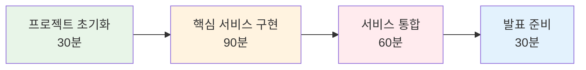

# Week 1 Day 4 Session 4: 마이크로서비스 구축 팀 프로젝트

<div align="center">

**🏆 팀 협업 마이크로서비스 구축** • **3시간 집중 프로젝트**

*설계부터 구현까지, 실무급 마이크로서비스 아키텍처 완성*

</div>

---

## 🕘 세션 정보

**시간**: 13:00-16:00 (3시간)  
**목표**: 팀 협업을 통한 완전한 마이크로서비스 애플리케이션 구축  
**방식**: 팀 프로젝트 + 역할 분담 + AI 활용 + 상호 지원

---

## 🎯 세션 목표

### 📚 학습 목표
- **구현 목표**: 완전히 동작하는 마이크로서비스 애플리케이션 완성
- **협업 목표**: 효과적인 팀워크와 자연스러운 역할 분담 경험
- **통합 목표**: 모든 서비스가 연동되는 통합 시스템 구축

### 🤔 왜 필요한가? (5분)
**팀 프로젝트의 중요성**:
- 💼 **실무 준비**: 실제 개발 환경과 동일한 팀 협업 경험
- 🏠 **일상 비유**: 오케스트라가 하나의 곡을 완성하는 것
- 📊 **효과**: 개별 역량 + 팀워크 = 시너지 효과

---

## 👥 팀 구성 및 역할 분담 (30분)

### 🎯 팀 구성 원칙
**팀 구성**: 3-4명씩 3개 팀
- **Team Alpha**: 4명 (초급 1명 + 중급 2명 + 고급 1명)
- **Team Beta**: 4명 (초급 2명 + 중급 1명 + 고급 1명)  
- **Team Gamma**: 4명 (초급 1명 + 중급 3명)

### 🏆 프로젝트 옵션 선택

#### Option 1: E-commerce 플랫폼 "ShopMaster"
```yaml
services:
  # Frontend
  web-ui:
    description: "React 기반 쇼핑몰 UI"
    tech_stack: "React + Nginx"
    
  # Backend Services  
  api-gateway:
    description: "API 게이트웨이 및 라우팅"
    tech_stack: "Node.js + Express"
    
  user-service:
    description: "사용자 관리 및 인증"
    tech_stack: "Python Flask + JWT"
    
  product-service:
    description: "상품 카탈로그 관리"
    tech_stack: "Node.js + MongoDB"
    
  order-service:
    description: "주문 처리 및 관리"
    tech_stack: "Python Django + PostgreSQL"
    
  # Infrastructure
  database:
    description: "PostgreSQL + MongoDB + Redis"
  
  monitoring:
    description: "Prometheus + Grafana"
```

#### Option 2: 블로그 플랫폼 "BlogHub"
```yaml
services:
  # Frontend
  blog-ui:
    description: "Vue.js 기반 블로그 UI"
    tech_stack: "Vue.js + Nginx"
    
  # Backend Services
  api-gateway:
    description: "API 게이트웨이"
    tech_stack: "Kong + Nginx"
    
  auth-service:
    description: "사용자 인증 및 권한"
    tech_stack: "Python FastAPI + JWT"
    
  content-service:
    description: "블로그 포스트 관리"
    tech_stack: "Node.js + PostgreSQL"
    
  comment-service:
    description: "댓글 시스템"
    tech_stack: "Python Flask + MongoDB"
    
  search-service:
    description: "검색 기능"
    tech_stack: "Elasticsearch + Python"
    
  # Infrastructure
  database:
    description: "PostgreSQL + MongoDB + Elasticsearch"
    
  monitoring:
    description: "ELK Stack (Elasticsearch + Logstash + Kibana)"
```

#### Option 3: 채팅 애플리케이션 "ChatFlow"
```yaml
services:
  # Frontend
  chat-ui:
    description: "React 기반 채팅 UI"
    tech_stack: "React + Socket.io + Nginx"
    
  # Backend Services
  api-gateway:
    description: "WebSocket 프록시 포함"
    tech_stack: "Node.js + Socket.io"
    
  user-service:
    description: "사용자 관리"
    tech_stack: "Python Flask + PostgreSQL"
    
  chat-service:
    description: "실시간 채팅"
    tech_stack: "Node.js + Socket.io + Redis"
    
  message-service:
    description: "메시지 저장 및 히스토리"
    tech_stack: "Python Django + MongoDB"
    
  notification-service:
    description: "푸시 알림"
    tech_stack: "Node.js + RabbitMQ"
    
  # Infrastructure
  database:
    description: "PostgreSQL + MongoDB + Redis"
    
  message_queue:
    description: "RabbitMQ"
    
  monitoring:
    description: "Grafana + Loki"
```

### 🎭 역할 분담 가이드

#### 🟢 초급자 역할
- **Frontend 개발**: React/Vue 컴포넌트 작성 (AI 활용 권장)
- **기본 API 연동**: 간단한 CRUD 기능 구현
- **문서화**: README 작성 및 사용법 정리
- **테스트**: 기능 테스트 및 버그 리포트

#### 🟡 중급자 역할  
- **백엔드 서비스**: API 서버 개발 및 비즈니스 로직
- **데이터베이스 설계**: 스키마 설계 및 마이그레이션
- **서비스 통합**: 마이크로서비스 간 통신 구현
- **DevOps**: Docker Compose 설정 및 배포

#### 🔴 고급자 역할
- **아키텍처 설계**: 전체 시스템 아키텍처 리드
- **인프라 구성**: 네트워크, 보안, 모니터링 설정
- **성능 최적화**: 병목 지점 분석 및 최적화
- **기술 멘토링**: 팀원 기술 지원 및 코드 리뷰

---

## 🛠️ 프로젝트 구현 단계 (2시간 30분)

### 🚀 Phase 1: 프로젝트 초기화 및 기본 구조 (30분)

#### Step 1: 프로젝트 구조 생성 (10분)
```bash
# 프로젝트 디렉토리 생성
mkdir microservices-project
cd microservices-project

# 기본 구조 생성
mkdir -p services/{frontend,api-gateway,user-service,product-service}
mkdir -p infrastructure/{databases,monitoring,nginx}
mkdir -p docs

# 기본 파일 생성
touch docker-compose.yml
touch .env
touch README.md
```

**프로젝트 구조**:
```
microservices-project/
├── docker-compose.yml
├── .env
├── README.md
├── services/
│   ├── frontend/
│   │   ├── Dockerfile
│   │   └── src/
│   ├── api-gateway/
│   │   ├── Dockerfile
│   │   └── src/
│   ├── user-service/
│   │   ├── Dockerfile
│   │   └── src/
│   └── product-service/
│       ├── Dockerfile
│       └── src/
├── infrastructure/
│   ├── databases/
│   ├── monitoring/
│   └── nginx/
└── docs/
    ├── architecture.md
    └── api-docs.md
```

#### Step 2: 기본 Docker Compose 설정 (10분)
```yaml
version: '3.8'

services:
  # Frontend
  frontend:
    build: ./services/frontend
    ports:
      - "3000:3000"
    networks:
      - frontend-net
    depends_on:
      - api-gateway

  # API Gateway
  api-gateway:
    build: ./services/api-gateway
    ports:
      - "8080:8080"
    networks:
      - frontend-net
      - backend-net
    environment:
      - USER_SERVICE_URL=http://user-service:3000
      - PRODUCT_SERVICE_URL=http://product-service:3000

  # User Service
  user-service:
    build: ./services/user-service
    networks:
      - backend-net
      - user-db-net
    environment:
      - DATABASE_URL=postgresql://user-db:5432/users
    depends_on:
      - user-db

  # Product Service  
  product-service:
    build: ./services/product-service
    networks:
      - backend-net
      - product-db-net
    environment:
      - DATABASE_URL=mongodb://product-db:27017/products
    depends_on:
      - product-db

  # Databases
  user-db:
    image: postgres:13
    environment:
      - POSTGRES_DB=users
      - POSTGRES_USER=userservice
      - POSTGRES_PASSWORD=password123
    volumes:
      - user_db_data:/var/lib/postgresql/data
    networks:
      - user-db-net

  product-db:
    image: mongo:4.4
    volumes:
      - product_db_data:/data/db
    networks:
      - product-db-net

  # Monitoring
  prometheus:
    image: prom/prometheus
    ports:
      - "9090:9090"
    volumes:
      - ./infrastructure/monitoring/prometheus.yml:/etc/prometheus/prometheus.yml
    networks:
      - monitoring-net

  grafana:
    image: grafana/grafana
    ports:
      - "3001:3000"
    environment:
      - GF_SECURITY_ADMIN_PASSWORD=admin123
    networks:
      - monitoring-net

networks:
  frontend-net:
  backend-net:
  user-db-net:
  product-db-net:
  monitoring-net:

volumes:
  user_db_data:
  product_db_data:
```

#### Step 3: 역할별 작업 시작 (10분)
**팀 내 역할 분담 및 작업 시작**:
- 🟢 **초급자**: Frontend 기본 구조 생성 (AI 활용)
- 🟡 **중급자**: 백엔드 서비스 기본 API 구현
- 🔴 **고급자**: 인프라 설정 및 네트워크 구성

### 🌟 Phase 2: 핵심 서비스 구현 (90분)

#### 🤖 AI 활용 가이드
**Frontend 개발 프롬프트 예시**:
```
"React로 [프로젝트명] 프론트엔드를 만들어주세요.
요구사항:
- 현대적인 UI/UX (Material-UI 또는 Tailwind CSS)
- 반응형 디자인
- API 연동을 위한 axios 설정
- 라우팅 (React Router)
- 상태 관리 (Context API 또는 Redux)
- Docker 컨테이너화 가능한 구조"
```

**Backend API 개발 프롬프트 예시**:
```
"Node.js Express로 [서비스명] API를 만들어주세요.
요구사항:
- RESTful API 설계
- 데이터베이스 연동 (PostgreSQL/MongoDB)
- JWT 인증 (해당하는 경우)
- 에러 핸들링 및 로깅
- 헬스체크 엔드포인트
- Docker 컨테이너화
- 환경변수 설정"
```

#### 서비스별 구현 가이드

**Frontend Service (초급자 담당)**:
```dockerfile
# services/frontend/Dockerfile
FROM node:18-alpine AS builder
WORKDIR /app
COPY package*.json ./
RUN npm ci
COPY . .
RUN npm run build

FROM nginx:alpine
COPY --from=builder /app/build /usr/share/nginx/html
COPY nginx.conf /etc/nginx/nginx.conf
EXPOSE 80
CMD ["nginx", "-g", "daemon off;"]
```

**API Gateway (중급자 담당)**:
```javascript
// services/api-gateway/src/index.js
const express = require('express');
const { createProxyMiddleware } = require('http-proxy-middleware');

const app = express();

// User Service Proxy
app.use('/api/users', createProxyMiddleware({
  target: process.env.USER_SERVICE_URL,
  changeOrigin: true,
  pathRewrite: { '^/api/users': '' }
}));

// Product Service Proxy
app.use('/api/products', createProxyMiddleware({
  target: process.env.PRODUCT_SERVICE_URL,
  changeOrigin: true,
  pathRewrite: { '^/api/products': '' }
}));

// Health Check
app.get('/health', (req, res) => {
  res.json({ status: 'OK', service: 'API Gateway' });
});

const PORT = process.env.PORT || 8080;
app.listen(PORT, () => {
  console.log(`API Gateway running on port ${PORT}`);
});
```

**User Service (중급자 담당)**:
```python
# services/user-service/src/app.py
from flask import Flask, request, jsonify
from flask_sqlalchemy import SQLAlchemy
import os

app = Flask(__name__)
app.config['SQLALCHEMY_DATABASE_URI'] = os.getenv('DATABASE_URL')
db = SQLAlchemy(app)

class User(db.Model):
    id = db.Column(db.Integer, primary_key=True)
    username = db.Column(db.String(80), unique=True, nullable=False)
    email = db.Column(db.String(120), unique=True, nullable=False)

@app.route('/health')
def health():
    return {'status': 'OK', 'service': 'User Service'}

@app.route('/users', methods=['GET'])
def get_users():
    users = User.query.all()
    return jsonify([{'id': u.id, 'username': u.username, 'email': u.email} for u in users])

@app.route('/users', methods=['POST'])
def create_user():
    data = request.json
    user = User(username=data['username'], email=data['email'])
    db.session.add(user)
    db.session.commit()
    return jsonify({'id': user.id, 'username': user.username, 'email': user.email})

if __name__ == '__main__':
    with app.app_context():
        db.create_all()
    app.run(host='0.0.0.0', port=3000)
```

#### ✅ Phase 2 체크포인트 (매 30분마다)
- [ ] 모든 서비스 컨테이너 정상 실행
- [ ] API Gateway를 통한 서비스 라우팅 동작
- [ ] 데이터베이스 연결 및 기본 CRUD 동작
- [ ] Frontend에서 API 호출 성공

### 🏆 Phase 3: 서비스 통합 및 고급 기능 (60분)

#### Step 1: 서비스 간 통신 구현 (20분)
```javascript
// 서비스 간 HTTP 통신 예시
const axios = require('axios');

class ServiceClient {
  constructor(baseURL) {
    this.client = axios.create({
      baseURL,
      timeout: 5000,
      headers: {
        'Content-Type': 'application/json'
      }
    });
  }

  async getUser(userId) {
    try {
      const response = await this.client.get(`/users/${userId}`);
      return response.data;
    } catch (error) {
      console.error('User service error:', error.message);
      throw new Error('User service unavailable');
    }
  }
}

// 사용 예시
const userService = new ServiceClient(process.env.USER_SERVICE_URL);
```

#### Step 2: 모니터링 및 로깅 구현 (20분)
```yaml
# infrastructure/monitoring/prometheus.yml
global:
  scrape_interval: 15s

scrape_configs:
  - job_name: 'api-gateway'
    static_configs:
      - targets: ['api-gateway:8080']
  
  - job_name: 'user-service'
    static_configs:
      - targets: ['user-service:3000']
      
  - job_name: 'product-service'
    static_configs:
      - targets: ['product-service:3000']
```

#### Step 3: 통합 테스트 및 디버깅 (20분)
```bash
# 전체 시스템 시작
docker-compose up -d

# 서비스 상태 확인
docker-compose ps

# 로그 확인
docker-compose logs -f api-gateway
docker-compose logs -f user-service

# 헬스체크
curl http://localhost:8080/health
curl http://localhost:8080/api/users/health

# 기능 테스트
curl -X POST http://localhost:8080/api/users \
  -H "Content-Type: application/json" \
  -d '{"username": "testuser", "email": "test@example.com"}'

curl http://localhost:8080/api/users
```

#### ✅ Phase 3 체크포인트
- [ ] 모든 서비스 정상 통신
- [ ] 데이터 플로우 완전 동작
- [ ] 모니터링 대시보드 구성
- [ ] 기본 에러 처리 구현

### 🎤 Phase 4: 발표 준비 및 문서화 (30분)

#### 발표 자료 준비 (20분)
**발표 구성** (팀당 10분):
1. **프로젝트 소개** (2분): 선택한 프로젝트와 목표
2. **아키텍처 설명** (3분): 서비스 구조와 통신 방식
3. **구현 결과** (3분): 실제 동작 시연
4. **팀워크** (1분): 역할 분담과 협업 경험
5. **배운 점** (1분): 기술적 인사이트와 개선점

#### 문서화 (10분)
```markdown
# [프로젝트명] - 마이크로서비스 아키텍처

## 🏗️ 아키텍처 개요
[아키텍처 다이어그램]

## 🚀 서비스 구성
- **Frontend**: React + Nginx
- **API Gateway**: Node.js + Express
- **User Service**: Python Flask + PostgreSQL
- **Product Service**: Node.js + MongoDB

## 🛠️ 실행 방법
```bash
docker-compose up -d
```

## 📊 모니터링
- Prometheus: http://localhost:9090
- Grafana: http://localhost:3001

## 👥 팀 구성 및 역할
- [이름]: Frontend 개발
- [이름]: Backend API 개발
- [이름]: 인프라 구성
- [이름]: 통합 및 테스트

## 📈 성과 지표
- 서비스 수: N개
- API 엔드포인트: N개
- 데이터베이스: N개
- 모니터링 메트릭: N개
```

---

## 🏆 프로젝트 평가 기준

### 📊 평가 항목 (100점 만점)
1. **아키텍처 설계** (25점)
   - 서비스 분해의 적절성
   - 네트워크 구성의 보안성
   - 데이터베이스 설계의 효율성

2. **구현 완성도** (25점)
   - 모든 서비스 정상 동작
   - API 통신 완전 구현
   - 에러 처리 및 예외 상황 대응

3. **팀워크** (25점)
   - 역할 분담의 효율성
   - 협업 과정의 원활함
   - 상호 지원과 지식 공유

4. **기술적 우수성** (15점)
   - 코드 품질과 구조
   - 모니터링 및 로깅 구현
   - 성능 최적화 노력

5. **발표 및 문서화** (10점)
   - 명확한 결과 발표
   - 체계적인 문서화
   - 배운 점과 개선 방안

### 🥇 특별상
- **🏆 최고 아키텍처상**: 가장 잘 설계된 마이크로서비스
- **🤝 최고 팀워크상**: 가장 효과적인 협업을 보인 팀
- **💡 창의성상**: 가장 독창적인 기능 구현
- **🚀 완성도상**: 가장 완벽하게 동작하는 시스템
- **📊 모니터링상**: 가장 체계적인 관측성 구현

---

## 📝 세션 마무리

### ✅ 3시간 프로젝트 성과
- [ ] **완전한 마이크로서비스**: 모든 서비스 정상 통신 및 동작
- [ ] **팀워크 경험**: 효과적인 역할 분담과 협업 완성
- [ ] **실무 역량**: 실제 프로젝트와 동일한 개발 경험
- [ ] **통합 시스템**: 프론트엔드부터 데이터베이스까지 완전 통합
- [ ] **모니터링**: 운영을 위한 관측성 구현

### 🎯 다음 세션 준비
- **주제**: 팀 지원 & 발표 (105분)
- **연결고리**: 프로젝트 완성 → 발표 준비 → 결과 공유
- **준비사항**: 발표 자료 정리 및 시연 준비

### 📊 3시간 집중 프로젝트 완료!


---

<div align="center">

**🏆 마이크로서비스 팀 프로젝트 완주!**

*설계부터 구현까지, 실무급 마이크로서비스 아키텍처 완성과 팀워크 경험*

**이전**: [Session 3 - 마이크로서비스 아키텍처](./session_3.md) | **다음**: [Session 5 - 팀 지원 & 발표](./session_5.md)

</div>