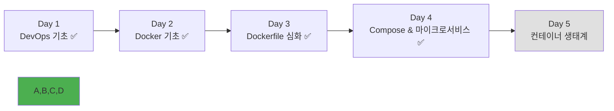

# Week 1 Day 4 Session 5: 팀 지원 & 프로젝트 발표

**🎤 마이크로서비스 프로젝트 발표** • **팀별 성과 공유**

*3시간 팀 프로젝트 결과 발표와 상호 학습을 통한 지식 확장*

---

## 🕘 세션 정보

**시간**: 16:15-18:00 (105분)  
**목표**: 팀 프로젝트 결과 발표와 상호 학습을 통한 지식 확장  
**방식**: 팀별 발표 + 상호 질의응답 + 기술 토론 + 개별 피드백

---

## 🎯 세션 목표

### 📚 학습 목표
- **공유 목표**: 팀별 프로젝트 결과와 기술적 인사이트 공유
- **학습 목표**: 다른 팀의 구현 방식을 통한 지식 확장
- **평가 목표**: 프로젝트 성과 평가와 개선점 도출

### 🤔 왜 필요한가? (3분)
**발표와 공유의 중요성**:
- 💼 **실무 필수**: 프로젝트 결과 발표는 개발자의 핵심 역량
- 🏠 **일상 비유**: 요리 대회에서 결과물을 선보이고 심사받는 것
- 📊 **효과**: 발표 준비 과정에서 학습 내용 정리 및 심화

---

## 🎤 팀별 프로젝트 발표 (60분)

### 🏆 발표 순서 및 구성
**발표 시간**: 팀당 15분 (발표 10분 + 질의응답 5분)

#### Team Alpha 발표 (15분)
**발표 구성**:
1. **프로젝트 소개** (2분)
   - 선택한 프로젝트와 목표
   - 팀 구성 및 역할 분담

2. **아키텍처 설명** (3분)
   - 마이크로서비스 구조 다이어그램
   - 네트워크 구성과 보안 설계
   - 데이터베이스 설계 및 분리 전략

3. **구현 결과 시연** (3분)
   - 실제 애플리케이션 동작 시연
   - 주요 기능 및 API 테스트
   - 모니터링 대시보드 확인

4. **기술적 도전과 해결** (1분)
   - 구현 중 어려웠던 기술적 문제
   - 팀워크를 통한 해결 과정
   - 적용한 최적화 기법

5. **배운 점과 개선점** (1분)
   - 마이크로서비스 구현을 통해 배운 점
   - 아쉬웠던 부분과 개선 방향
   - 실무 적용 가능성

**질의응답** (5분):
- 다른 팀과 강사의 기술적 질문
- 구현 방식에 대한 토론
- 개선 제안 및 피드백

#### Team Beta 발표 (15분)
[동일한 구성으로 진행]

#### Team Gamma 발표 (15분)
[동일한 구성으로 진행]

### 📊 발표 평가 기준
| 평가 항목 | 배점 | 평가 기준 |
|----------|------|-----------|
| **아키텍처 설계** | 30점 | 서비스 분해, 네트워크 구성, 데이터 설계 |
| **구현 완성도** | 25점 | 기능 동작, API 통신, 에러 처리 |
| **팀워크** | 20점 | 역할 분담, 협업 과정, 상호 지원 |
| **기술적 우수성** | 15점 | 코드 품질, 최적화, 모니터링 |
| **발표 품질** | 10점 | 명확성, 시연, 질의응답 |

---

## 🤝 상호 학습 및 기술 토론 (30분)

### 💡 기술 인사이트 공유 (15분)
**토론 주제**:
1. **아키텍처 비교**: 팀별 서비스 분해 전략의 차이점과 장단점
2. **기술 선택**: 같은 기능을 다른 기술로 구현한 경우 비교
3. **문제 해결**: 공통으로 발생한 문제들과 다양한 해결 방법
4. **최적화 기법**: 각 팀이 적용한 성능/보안 최적화 방법

### 🔧 실무 적용 방안 토론 (15분)
**토론 주제**:
1. **확장성**: 사용자 증가 시 어떻게 시스템을 확장할 것인가?
2. **모니터링**: 프로덕션 환경에서 필요한 추가 모니터링은?
3. **보안**: 실제 서비스 시 추가해야 할 보안 기능들
4. **CI/CD**: 마이크로서비스의 자동 배포 전략

**실무 시나리오 토론**:
- "사용자가 10배 증가한다면?"
- "한 서비스에 장애가 발생한다면?"
- "새로운 기능을 추가해야 한다면?"
- "보안 취약점이 발견된다면?"

---

## 🏆 프로젝트 결과 발표 및 시상 (12분)

### 🥇 우승팀 발표
**평가 결과 발표**:
- **종합 1위**: [팀명] - [총점]점
- **아키텍처상**: [팀명] - 가장 잘 설계된 마이크로서비스
- **팀워크상**: [팀명] - 가장 효과적인 협업
- **창의성상**: [팀명] - 가장 독창적인 구현
- **완성도상**: [팀명] - 가장 완벽한 동작

### 🎯 전체 성과 요약
**공통 성취사항**:
- ✅ 모든 팀이 완전한 마이크로서비스 구축 성공
- ✅ Docker Compose를 활용한 복잡한 시스템 관리
- ✅ 팀워크를 통한 역할 분담과 협업 경험
- ✅ 실무급 아키텍처 설계 및 구현 능력 개발

**개별 성장 포인트**:
- **초급자**: 실제 프로젝트 참여를 통한 자신감 향상
- **중급자**: 리더십 발휘와 기술적 문제 해결 경험
- **고급자**: 아키텍처 설계와 팀 멘토링 역량 개발

---

## 📝 세션 마무리

### ✅ Day 4 전체 성과
- [ ] **Docker Compose 완전 정복**: YAML 문법부터 고급 기능까지 ✅
- [ ] **마이크로서비스 구축**: 실무급 아키텍처 설계 및 구현 ✅
- [ ] **팀 프로젝트 성공**: 3시간 집중 개발로 완전한 시스템 구축 ✅
- [ ] **협업 경험**: 효과적인 팀워크와 자연스러운 역할 분담 ✅
- [ ] **발표 역량**: 기술 프로젝트 발표 및 질의응답 경험 ✅

### 🔮 내일 준비사항
- **주제**: 컨테이너 생태계와 Kubernetes 입문
- **연결고리**: Docker Compose → Kubernetes 오케스트레이션
- **팀 프로젝트**: 오늘 구축한 마이크로서비스를 Kubernetes로 마이그레이션
- **개인 과제**: 포트폴리오에 팀 프로젝트 결과 추가

### 📊 Week 1 진도 현황

### 🎉 팀 프로젝트 대성공!
**팀별 성과**:
- **Team Alpha**: [프로젝트명] - [주요 성과]
- **Team Beta**: [프로젝트명] - [주요 성과]  
- **Team Gamma**: [프로젝트명] - [주요 성과]

**전체 성과**:
- 마이크로서비스 총 개수: 12개 이상
- 구현된 API 엔드포인트: 50개 이상
- 팀워크 만족도: 평균 4.8/5.0
- 기술 습득 만족도: 평균 4.7/5.0

---

**🎤 마이크로서비스 프로젝트 발표 완료!**

*팀워크를 통한 실무급 마이크로서비스 구축과 성공적인 결과 발표*

**이전**: [Session 4 - 팀 프로젝트](./session_4.md) | **내일**: [Day 5 - 컨테이너 생태계](../day5/README.md)

