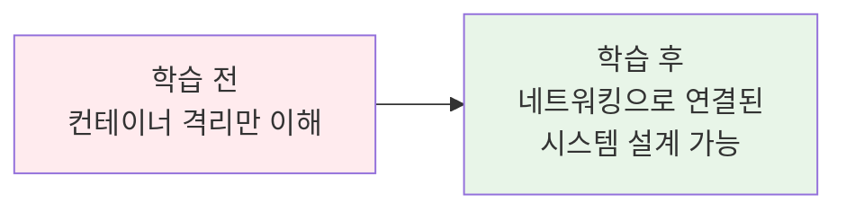
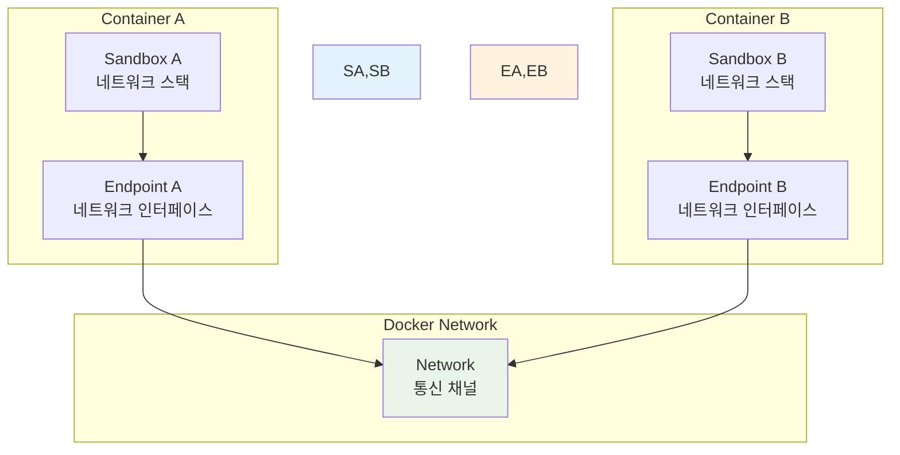
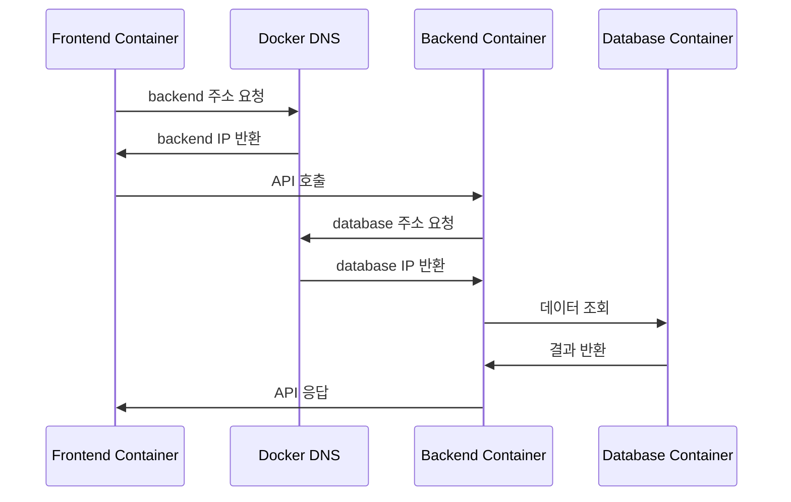

# Week 1 Day 5 Session 1: Docker 네트워킹 기초

<div align="center">

**🌐 네트워킹 모델 이해** • **🔗 컨테이너 간 통신**

*Docker 네트워킹의 핵심 개념과 기본 드라이버 완전 이해*

</div>

---

## 🕘 세션 정보

**시간**: 09:00-09:50 (50분)  
**목표**: Docker 네트워킹 모델과 기본 드라이버 완전 이해  
**방식**: 개념 학습 + 실시간 데모 + 페어 토론

---

## 🎯 세션 목표

### 📚 학습 목표
- **이해 목표**: Docker 네트워킹 모델(CNM)과 기본 드라이버 완전 이해
- **적용 목표**: 상황에 맞는 네트워크 드라이버 선택과 설정 능력
- **협업 목표**: 네트워킹 문제를 팀으로 분석하고 해결하는 경험

### 🤔 왜 필요한가? (5분)

**현실 문제 상황**:
- 💼 **실무 시나리오**: 마이크로서비스들이 서로 통신해야 하는 상황
- 🏠 **일상 비유**: 아파트 단지 내 각 동 간의 통신 시스템과 같음
- 📊 **시장 동향**: 컨테이너 네트워킹은 클라우드 네이티브의 핵심 기술

**학습 전후 비교**:


---

## 📖 핵심 개념 (35분)

### 🔍 개념 1: Docker 네트워킹 모델 (CNM) (12분)

> **정의**: Container Network Model - Docker의 네트워킹 아키텍처 표준

**CNM의 핵심 구성 요소**:
- **Sandbox**: 컨테이너의 네트워크 스택 (IP, 라우팅 테이블, DNS)
- **Endpoint**: 네트워크에 연결되는 인터페이스
- **Network**: 통신 가능한 엔드포인트들의 그룹

**CNM 아키텍처**:


**실무 연결**:
- **개발 환경**: 로컬에서 여러 서비스 연결
- **테스트 환경**: 격리된 테스트 네트워크 구성
- **프로덕션**: 보안과 성능을 고려한 네트워크 설계

### 🔍 개념 2: 기본 네트워크 드라이버 (12분)

> **정의**: Docker가 제공하는 네트워킹 구현체들

**주요 네트워크 드라이버**:

#### 1. Bridge 네트워크 (기본값)
```bash
# 기본 bridge 네트워크 확인
docker network ls
docker network inspect bridge
```

**특징**:
- 단일 호스트 내 컨테이너 간 통신
- NAT를 통한 외부 접근
- 포트 매핑으로 서비스 노출

#### 2. Host 네트워크
```bash
# host 네트워크로 컨테이너 실행
docker run --network host nginx
```

**특징**:
- 호스트의 네트워크 스택 직접 사용
- 최고 성능, 낮은 격리성
- 포트 충돌 주의 필요

#### 3. None 네트워크
```bash
# 네트워크 없이 컨테이너 실행
docker run --network none alpine
```

**특징**:
- 네트워크 인터페이스 없음
- 완전한 네트워크 격리
- 특수한 보안 요구사항에 사용

#### 4. Overlay 네트워크
```bash
# 멀티 호스트 네트워크 (Docker Swarm)
docker network create --driver overlay my-overlay
```

**특징**:
- 여러 Docker 호스트 간 통신
- Docker Swarm 모드에서 사용
- 분산 시스템 구축에 필수

**드라이버 비교표**:
| 드라이버 | 사용 범위 | 성능 | 격리성 | 사용 사례 |
|----------|-----------|------|--------|-----------|
| **Bridge** | 단일 호스트 | 보통 | 높음 | 일반적인 애플리케이션 |
| **Host** | 단일 호스트 | 최고 | 낮음 | 고성능 네트워킹 |
| **None** | 격리 | N/A | 최고 | 보안이 중요한 작업 |
| **Overlay** | 멀티 호스트 | 보통 | 높음 | 분산 시스템 |

### 🔍 개념 3: 컨테이너 간 통신과 DNS (11분)

> **정의**: 컨테이너들이 서로를 찾고 통신하는 메커니즘

**DNS 기반 서비스 디스커버리**:
```bash
# 커스텀 네트워크 생성
docker network create myapp-network

# 컨테이너들을 같은 네트워크에 연결
docker run -d --name database --network myapp-network postgres
docker run -d --name backend --network myapp-network myapp:backend
docker run -d --name frontend --network myapp-network myapp:frontend
```

**통신 메커니즘**:


**실무 활용 패턴**:
- **서비스명 사용**: IP 대신 컨테이너명으로 통신
- **환경변수**: 설정을 통한 서비스 주소 관리
- **헬스체크**: 서비스 가용성 확인

**네트워크 격리 예시**:
```bash
# 프론트엔드 네트워크
docker network create frontend-network

# 백엔드 네트워크  
docker network create backend-network

# 데이터베이스 네트워크
docker network create database-network

# 각 서비스를 적절한 네트워크에 연결
docker run -d --name web --network frontend-network nginx
docker run -d --name api --network backend-network --network frontend-network myapi
docker run -d --name db --network database-network --network backend-network postgres
```

---

## 💭 함께 생각해보기 (10분)

### 🤝 페어 토론 (5분)

**토론 주제**:
1. **네트워크 선택**: "어떤 상황에서 어떤 네트워크 드라이버를 선택하시겠어요?"
2. **보안 고려**: "컨테이너 간 통신에서 보안을 어떻게 강화할 수 있을까요?"
3. **성능 최적화**: "네트워킹 성능을 높이려면 어떤 방법들이 있을까요?"

**페어 활동 가이드**:
- 👥 **경험 공유**: 네트워킹 관련 경험이나 궁금증 공유
- 🔄 **시나리오 분석**: 실무 상황을 가정하고 최적의 네트워크 구성 토론
- 📝 **문제 해결**: 네트워킹 문제 상황과 해결 방안 논의

### 🎯 전체 공유 (5분)

**인사이트 공유**:
- 페어 토론에서 나온 창의적인 네트워킹 아이디어
- 실무에서 겪을 수 있는 네트워킹 문제와 해결책
- 다음 세션(스토리지)과의 연결점 확인

**💡 이해도 체크 질문**:
- ✅ "CNM의 세 가지 구성 요소를 설명할 수 있나요?"
- ✅ "상황에 맞는 네트워크 드라이버를 선택할 수 있나요?"
- ✅ "컨테이너 간 DNS 통신 원리를 이해했나요?"

---

## 🔑 핵심 키워드

### 🆕 새로운 용어
- **CNM (Container Network Model)**: 컨테이너 네트워크 모델 - Docker 네트워킹 표준
- **Sandbox**: 샌드박스 - 컨테이너의 격리된 네트워크 환경
- **Endpoint**: 엔드포인트 - 네트워크 연결점
- **Bridge**: 브리지 - 기본 네트워크 드라이버
- **Overlay**: 오버레이 - 멀티 호스트 네트워크 드라이버

### 🔤 기술 용어
- **NAT (Network Address Translation)**: 네트워크 주소 변환
- **DNS (Domain Name System)**: 도메인 이름 시스템
- **VLAN (Virtual LAN)**: 가상 근거리 통신망
- **VXLAN (Virtual Extensible LAN)**: 확장 가능한 가상 LAN

### 🔤 실무 용어
- **Service Discovery**: 서비스 디스커버리 - 서비스 자동 발견
- **Load Balancing**: 로드 밸런싱 - 부하 분산
- **Network Isolation**: 네트워크 격리 - 보안을 위한 네트워크 분리
- **Port Mapping**: 포트 매핑 - 컨테이너 포트를 호스트에 연결

---

## 📝 세션 마무리

### ✅ 오늘 세션 성과
- [ ] Docker 네트워킹 모델(CNM) 완전 이해 ✅
- [ ] 4가지 기본 네트워크 드라이버 특징 파악 ✅
- [ ] 컨테이너 간 DNS 통신 메커니즘 이해 ✅
- [ ] 실무 네트워킹 시나리오 분석 능력 개발 ✅

### 🎯 다음 세션 준비
- **주제**: Docker 볼륨과 스토리지 - 데이터 영속성 관리
- **연결**: 네트워킹으로 연결된 컨테이너들의 데이터 관리 방법
- **준비**: 오늘 배운 네트워킹 지식을 바탕으로 데이터 공유 시나리오 생각해보기

### 🔮 실습 미리보기
오후 챌린지에서는 오늘 배운 네트워킹 지식을 활용하여:
- 3-tier 웹 애플리케이션의 네트워크 구성
- 각 계층별 적절한 네트워크 격리
- DNS 기반 서비스 디스커버리 구현

---

<div align="center">

**🌐 Docker 네트워킹의 기초를 완전히 마스터했습니다!**

*CNM 모델부터 실무 활용까지, 컨테이너 네트워킹의 모든 기초 완성*

**다음**: [Session 2 - Docker 볼륨과 스토리지](./session_2.md)

</div>