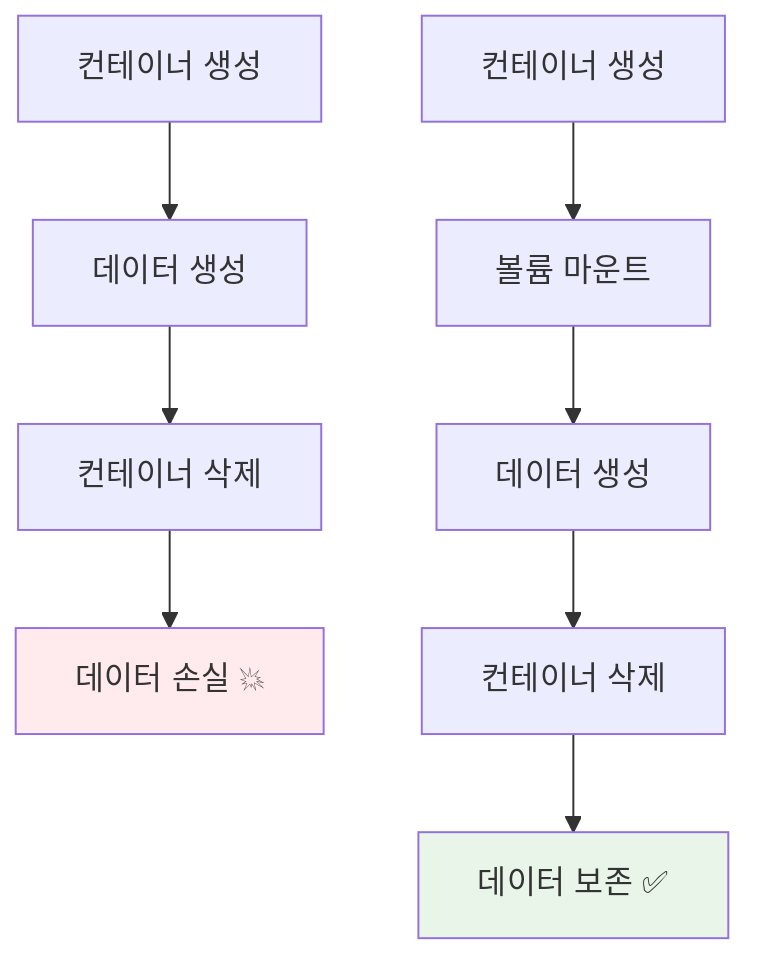
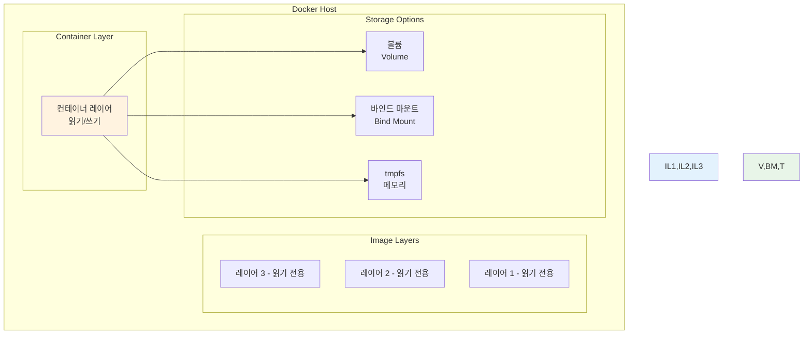
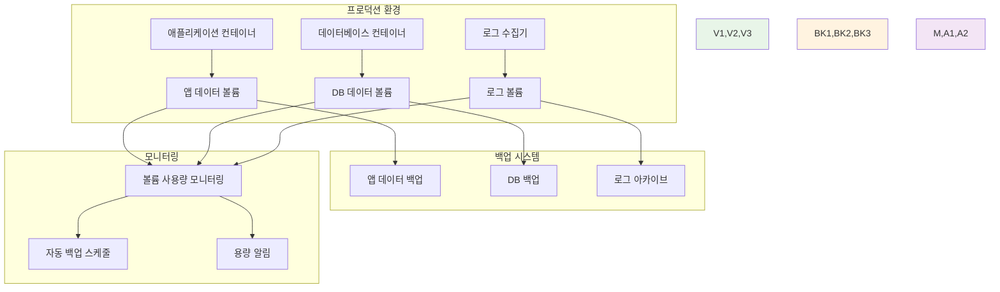

# Week 1 Day 5 Session 2: Docker 볼륨과 스토리지

<div align="center">

**💾 데이터 영속성** • **🔄 스토리지 관리**

*컨테이너 생명주기와 독립적인 데이터 관리 완전 마스터*

</div>

---

## 🕘 세션 정보

**시간**: 10:00-10:50 (50분)  
**목표**: Docker 스토리지 시스템과 데이터 영속성 완전 이해  
**방식**: 개념 학습 + 실시간 데모 + 실습 체험

---

## 🎯 세션 목표

### 📚 학습 목표
- **이해 목표**: 볼륨, 바인드 마운트, tmpfs의 차이점과 사용 시나리오 완전 이해
- **적용 목표**: 상황에 맞는 스토리지 방식 선택과 구성 능력
- **협업 목표**: 데이터 공유와 백업 전략을 팀으로 설계하는 경험

### 🤔 왜 필요한가? (5분)

**현실 문제 상황**:
- 💼 **실무 시나리오**: 데이터베이스 컨테이너가 재시작되어도 데이터가 보존되어야 함
- 🏠 **일상 비유**: 이사를 가도 중요한 물건들은 따로 보관하는 것과 같음
- 📊 **시장 동향**: 스테이트풀 애플리케이션의 컨테이너화가 급증

**컨테이너 데이터의 문제점**:


---

## 📖 핵심 개념 (35분)

### 🔍 개념 1: Docker 스토리지 드라이버와 아키텍처 (12분)

> **정의**: Docker가 이미지와 컨테이너 데이터를 관리하는 시스템

**스토리지 아키텍처**:


**스토리지 드라이버 종류**:
- **overlay2**: 현재 기본 드라이버 (성능 우수)
- **aufs**: 구형 Ubuntu에서 사용
- **devicemapper**: Red Hat 계열에서 사용
- **btrfs**: Btrfs 파일시스템 활용

**실무 확인 명령어**:
```bash
# 현재 스토리지 드라이버 확인
docker info | grep "Storage Driver"

# 스토리지 사용량 확인
docker system df
docker system df -v
```

### 🔍 개념 2: 세 가지 스토리지 방식 비교 (12분)

> **정의**: Docker에서 제공하는 데이터 저장 방식들

#### 1. 볼륨 (Volumes) - 권장 방식
```bash
# 볼륨 생성
docker volume create my-volume

# 볼륨 정보 확인
docker volume inspect my-volume

# 볼륨을 사용하는 컨테이너 실행
docker run -d --name db-container -v my-volume:/var/lib/mysql mysql:8.0
```

**볼륨의 특징**:
- Docker가 완전히 관리
- 호스트 파일시스템과 독립적
- 여러 컨테이너 간 안전한 공유
- 백업과 마이그레이션 용이

#### 2. 바인드 마운트 (Bind Mounts) - 개발 환경
```bash
# 바인드 마운트로 컨테이너 실행
docker run -d --name web-dev -v /host/path:/app nginx

# 현재 디렉토리를 컨테이너에 마운트
docker run -d --name dev-env -v $(pwd):/workspace node:18
```

**바인드 마운트의 특징**:
- 호스트의 특정 경로를 직접 마운트
- 실시간 파일 동기화 (개발에 유용)
- 호스트 파일시스템에 의존적
- 보안 위험 가능성

#### 3. tmpfs 마운트 - 임시 데이터
```bash
# tmpfs 마운트로 컨테이너 실행
docker run -d --name cache-app --tmpfs /tmp redis

# 크기 제한이 있는 tmpfs
docker run -d --tmpfs /tmp:size=100m,noexec alpine
```

**tmpfs의 특징**:
- 메모리에만 저장 (디스크 I/O 없음)
- 컨테이너 종료 시 데이터 삭제
- 민감한 임시 데이터에 적합
- 최고 성능

**세 방식 비교표**:
| 특징 | 볼륨 | 바인드 마운트 | tmpfs |
|------|------|---------------|-------|
| **관리 주체** | Docker | 사용자 | Docker |
| **성능** | 높음 | 보통 | 최고 |
| **보안** | 높음 | 낮음 | 높음 |
| **영속성** | 영구 | 영구 | 임시 |
| **공유** | 쉬움 | 어려움 | 불가 |
| **사용 사례** | 프로덕션 DB | 개발 환경 | 캐시, 임시파일 |

### 🔍 개념 3: 볼륨 관리와 백업 전략 (11분)

> **정의**: 프로덕션 환경에서의 볼륨 운영과 데이터 보호

**볼륨 라이프사이클 관리**:
```bash
# 볼륨 목록 확인
docker volume ls

# 사용하지 않는 볼륨 정리
docker volume prune

# 특정 볼륨 삭제
docker volume rm my-volume

# 볼륨 상세 정보
docker volume inspect my-volume
```

**볼륨 백업 전략**:
```bash
# 볼륨 백업 (tar 파일로)
docker run --rm -v my-volume:/data -v $(pwd):/backup alpine \
  tar czf /backup/backup.tar.gz -C /data .

# 볼륨 복원
docker run --rm -v my-volume:/data -v $(pwd):/backup alpine \
  tar xzf /backup/backup.tar.gz -C /data
```

**고급 볼륨 활용**:


**실무 볼륨 네이밍 규칙**:
```bash
# 환경별 네이밍
docker volume create prod-mysql-data
docker volume create dev-postgres-data
docker volume create test-redis-cache

# 프로젝트별 네이밍
docker volume create myapp-prod-db
docker volume create myapp-prod-uploads
docker volume create myapp-prod-logs
```

**볼륨 드라이버 활용**:
```bash
# NFS 볼륨 생성 (클러스터 환경)
docker volume create --driver local \
  --opt type=nfs \
  --opt o=addr=192.168.1.100,rw \
  --opt device=:/path/to/dir \
  nfs-volume

# 암호화된 볼륨 생성
docker volume create --driver local \
  --opt type=tmpfs \
  --opt device=tmpfs \
  --opt o=size=100m,uid=1000 \
  encrypted-volume
```

---

## 💭 함께 생각해보기 (10분)

### 🤝 페어 토론 (5분)

**토론 주제**:
1. **스토리지 선택**: "데이터베이스, 웹서버, 캐시 서버에 각각 어떤 스토리지 방식을 사용하시겠어요?"
2. **백업 전략**: "중요한 데이터의 백업을 어떻게 자동화할 수 있을까요?"
3. **성능 최적화**: "스토리지 성능을 높이려면 어떤 방법들이 있을까요?"

**페어 활동 가이드**:
- 👥 **시나리오 분석**: 실제 프로젝트 상황을 가정하고 스토리지 전략 수립
- 🔄 **경험 공유**: 데이터 손실이나 백업 관련 경험 공유
- 📝 **베스트 프랙티스**: 효과적인 데이터 관리 방법 토론

### 🎯 전체 공유 (5분)

**인사이트 공유**:
- 페어 토론에서 나온 창의적인 스토리지 활용 아이디어
- 실무에서 겪을 수 있는 데이터 관리 문제와 해결책
- 네트워킹과 스토리지를 결합한 시스템 설계 아이디어

**💡 이해도 체크 질문**:
- ✅ "볼륨, 바인드 마운트, tmpfs의 차이점을 설명할 수 있나요?"
- ✅ "상황에 맞는 스토리지 방식을 선택할 수 있나요?"
- ✅ "볼륨 백업과 복원 과정을 이해했나요?"

---

## 🔑 핵심 키워드

### 🆕 새로운 용어
- **Volume**: 볼륨 - Docker가 관리하는 데이터 저장소
- **Bind Mount**: 바인드 마운트 - 호스트 경로를 직접 마운트
- **tmpfs**: 임시 파일시스템 - 메모리 기반 저장소
- **Storage Driver**: 스토리지 드라이버 - 이미지/컨테이너 레이어 관리
- **Overlay2**: 오버레이2 - 현재 기본 스토리지 드라이버

### 🔤 기술 용어
- **Copy-on-Write (CoW)**: 쓰기 시 복사 - 효율적인 레이어 관리
- **Union Filesystem**: 유니온 파일시스템 - 여러 레이어를 하나로 통합
- **Persistence**: 영속성 - 데이터의 지속적 보존
- **Ephemeral**: 임시적 - 일시적인 데이터

### 🔤 실무 용어
- **Data Migration**: 데이터 마이그레이션 - 데이터 이전
- **Backup Strategy**: 백업 전략 - 데이터 보호 계획
- **Volume Driver**: 볼륨 드라이버 - 다양한 스토리지 백엔드 지원
- **Stateful Application**: 상태 유지 애플리케이션 - 데이터 보존이 필요한 앱

---

## 📝 세션 마무리

### ✅ 오늘 세션 성과
- [ ] Docker 스토리지 아키텍처 완전 이해 ✅
- [ ] 세 가지 스토리지 방식의 특징과 사용 사례 파악 ✅
- [ ] 볼륨 관리와 백업 전략 수립 능력 개발 ✅
- [ ] 실무 데이터 관리 시나리오 분석 능력 향상 ✅

### 🎯 다음 세션 준비
- **주제**: 고급 네트워킹과 보안 - 커스텀 네트워크와 보안 정책
- **연결**: 네트워킹과 스토리지를 결합한 보안 아키텍처
- **준비**: 오늘 배운 스토리지 지식을 바탕으로 데이터 보안 방안 생각해보기

### 🔮 실습 미리보기
오후 챌린지에서는 네트워킹과 스토리지를 결합하여:
- 데이터베이스 볼륨의 안전한 네트워크 격리
- 애플리케이션 데이터의 효율적인 공유
- 백업과 모니터링이 포함된 완전한 시스템 구축

---

<div align="center">

**💾 Docker 스토리지 시스템을 완전히 마스터했습니다!**

*볼륨부터 백업 전략까지, 데이터 영속성 관리의 모든 것 완성*

**이전**: [Session 1 - Docker 네트워킹 기초](./session_1.md) | **다음**: [Session 3 - 고급 네트워킹과 보안](./session_3.md)

</div>