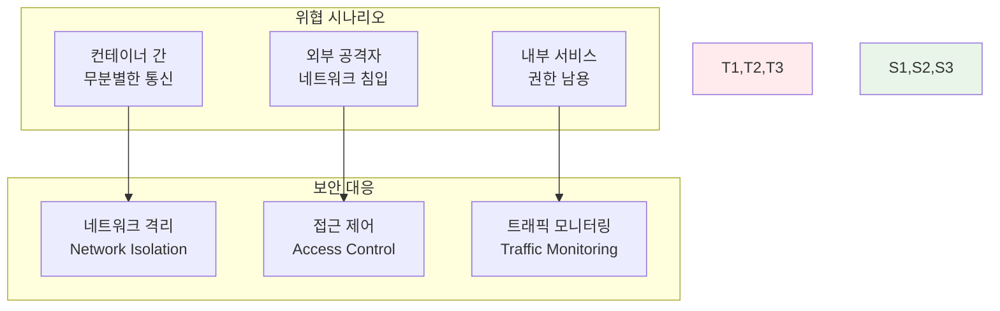
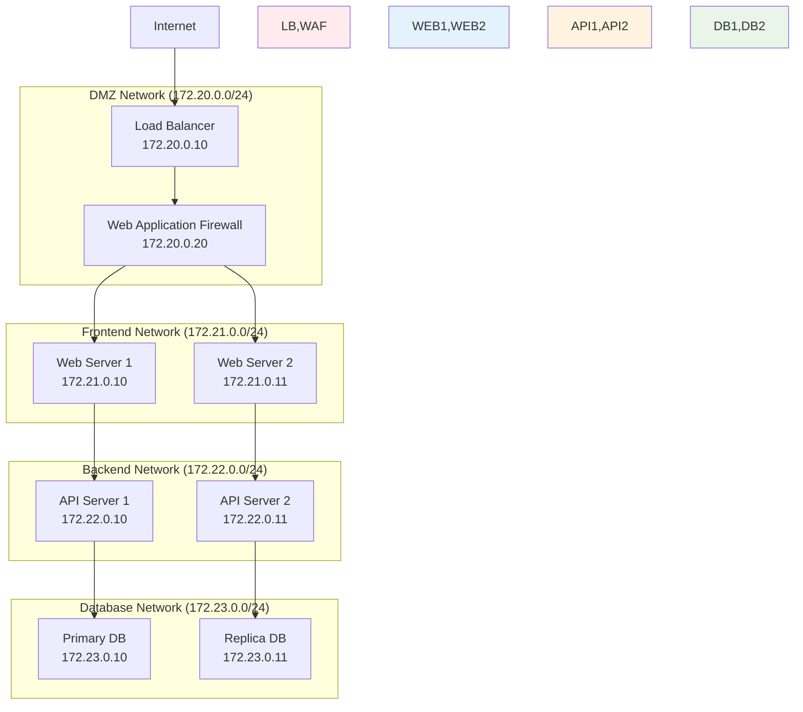
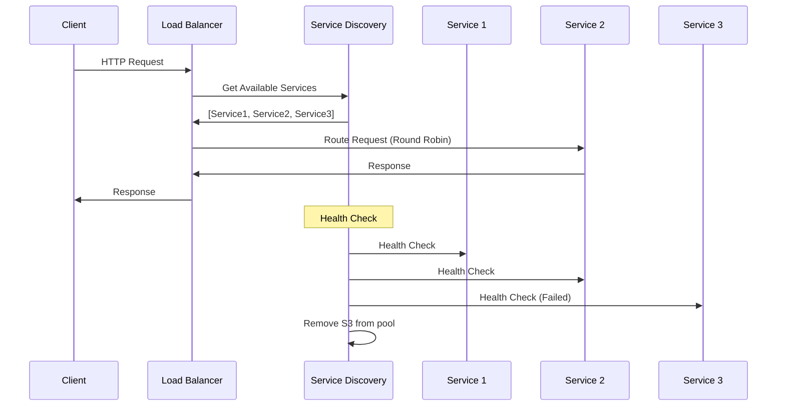

# Week 1 Day 5 Session 3: 고급 네트워킹과 보안

<div align="center">

**🔒 네트워크 보안** • **⚙️ 커스텀 네트워크**

*실무급 네트워킹 구성과 보안 정책 완전 마스터*

</div>

---

## 🕘 세션 정보

**시간**: 11:00-11:50 (50분)  
**목표**: 고급 네트워킹 기법과 보안 베스트 프랙티스 완전 습득  
**방식**: 심화 개념 + 실시간 구현 + 보안 시나리오 분석

---

## 🎯 세션 목표

### 📚 학습 목표
- **이해 목표**: 커스텀 네트워크 설계와 고급 네트워킹 패턴 완전 이해
- **적용 목표**: 네트워크 보안 정책과 격리 전략 실무 적용 능력
- **협업 목표**: 복잡한 네트워크 아키텍처를 팀으로 설계하고 구현

### 🤔 왜 필요한가? (5분)

**현실 문제 상황**:
- 💼 **실무 시나리오**: 마이크로서비스 간 보안 통신과 네트워크 격리 필요
- 🏠 **일상 비유**: 아파트 단지의 구역별 출입 통제 시스템과 같음
- 📊 **시장 동향**: 제로 트러스트 네트워킹과 마이크로세그멘테이션 급증

**보안 위협과 대응**:


---

## 📖 핵심 개념 (35분)

### 🔍 개념 1: 커스텀 네트워크 설계와 관리 (12분)

> **정의**: 비즈니스 요구사항에 맞는 맞춤형 네트워크 구성

**커스텀 네트워크 생성과 구성**:
```bash
# 기본 브리지 네트워크 생성
docker network create --driver bridge myapp-network

# 서브넷과 게이트웨이 지정
docker network create \
  --driver bridge \
  --subnet=172.20.0.0/16 \
  --ip-range=172.20.240.0/20 \
  --gateway=172.20.0.1 \
  custom-network

# VLAN 태그가 있는 네트워크
docker network create \
  --driver macvlan \
  --subnet=192.168.1.0/24 \
  --gateway=192.168.1.1 \
  -o parent=eth0.100 \
  vlan-network
```

**네트워크 토폴로지 설계**:


**고급 네트워크 옵션**:
```bash
# IPv6 지원 네트워크
docker network create --ipv6 --subnet=2001:db8::/64 ipv6-network

# 내부 전용 네트워크 (외부 접근 차단)
docker network create --internal internal-network

# 암호화된 오버레이 네트워크
docker network create \
  --driver overlay \
  --opt encrypted \
  secure-overlay
```

### 🔍 개념 2: 네트워크 보안과 격리 정책 (12분)

> **정의**: 컨테이너 네트워크의 보안을 강화하는 정책과 기법

**네트워크 격리 전략**:
```bash
# 완전 격리된 네트워크 생성
docker network create --internal database-network
docker network create --internal cache-network
docker network create frontend-network

# 선택적 연결 (API 서버만 DB 접근 가능)
docker run -d --name api-server \
  --network frontend-network \
  --network database-network \
  myapp:api

docker run -d --name web-server \
  --network frontend-network \
  myapp:web

docker run -d --name database \
  --network database-network \
  postgres:13
```

**포트 노출 제어**:
```bash
# 내부 포트만 노출 (외부 접근 불가)
docker run -d --name internal-api \
  --network backend-network \
  --expose 8080 \
  myapp:api

# 특정 인터페이스에만 바인딩
docker run -d --name secure-web \
  -p 127.0.0.1:8080:80 \
  nginx

# 포트 범위 제한
docker run -d --name limited-service \
  -p 8080-8090:8080-8090 \
  myapp:service
```

**네트워크 정책 구현**:
```yaml
# docker-compose.yml에서 네트워크 정책
version: '3.8'
services:
  frontend:
    image: myapp:frontend
    networks:
      - frontend-network
    ports:
      - "80:80"
  
  backend:
    image: myapp:backend
    networks:
      - frontend-network
      - backend-network
    # 외부 포트 노출 없음
  
  database:
    image: postgres:13
    networks:
      - backend-network
    # 완전히 격리됨

networks:
  frontend-network:
    driver: bridge
  backend-network:
    driver: bridge
    internal: true  # 외부 접근 차단
```

**컨테이너 보안 강화**:
```bash
# 비특권 사용자로 실행
docker run -d --name secure-app \
  --user 1000:1000 \
  --read-only \
  --tmpfs /tmp \
  myapp:secure

# 리소스 제한
docker run -d --name limited-app \
  --memory=512m \
  --cpus=0.5 \
  --pids-limit=100 \
  myapp:app

# 보안 옵션 적용
docker run -d --name hardened-app \
  --security-opt=no-new-privileges:true \
  --cap-drop=ALL \
  --cap-add=NET_BIND_SERVICE \
  myapp:app
```

### 🔍 개념 3: 로드 밸런싱과 서비스 디스커버리 (11분)

> **정의**: 고가용성과 확장성을 위한 네트워크 패턴

**Docker 내장 로드 밸런싱**:
```bash
# 서비스 스케일링 (Docker Swarm 모드)
docker service create --name web-service \
  --replicas 3 \
  --publish 80:80 \
  nginx

# 서비스 스케일 조정
docker service scale web-service=5

# 로드 밸런싱 확인
docker service ps web-service
```

**외부 로드 밸런서 통합**:
```yaml
# HAProxy를 이용한 로드 밸런싱
version: '3.8'
services:
  haproxy:
    image: haproxy:2.4
    ports:
      - "80:80"
      - "443:443"
    volumes:
      - ./haproxy.cfg:/usr/local/etc/haproxy/haproxy.cfg
    networks:
      - frontend-network
  
  web1:
    image: myapp:web
    networks:
      - frontend-network
    labels:
      - "traefik.enable=true"
      - "traefik.http.routers.web.rule=Host(`myapp.local`)"
  
  web2:
    image: myapp:web
    networks:
      - frontend-network
    labels:
      - "traefik.enable=true"
      - "traefik.http.routers.web.rule=Host(`myapp.local`)"

networks:
  frontend-network:
    driver: bridge
```

**서비스 디스커버리 패턴**:


**고급 네트워킹 모니터링**:
```bash
# 네트워크 트래픽 모니터링
docker run -d --name netdata \
  --pid host \
  --network host \
  -v /proc:/host/proc:ro \
  -v /sys:/host/sys:ro \
  netdata/netdata

# 네트워크 연결 상태 확인
docker exec container-name netstat -tulpn
docker exec container-name ss -tulpn

# 네트워크 성능 테스트
docker run --rm --network myapp-network \
  nicolaka/netshoot \
  iperf3 -c target-container
```

---

## 💭 함께 생각해보기 (10분)

### 🤝 페어 토론 (5분)

**토론 주제**:
1. **보안 아키텍처**: "3-tier 웹 애플리케이션의 네트워크 보안을 어떻게 설계하시겠어요?"
2. **성능 vs 보안**: "네트워크 보안과 성능 사이의 균형점을 어떻게 찾을까요?"
3. **장애 대응**: "네트워크 장애 시 빠른 복구를 위한 전략은 무엇일까요?"

**페어 활동 가이드**:
- 👥 **아키텍처 설계**: 실제 서비스를 가정하고 네트워크 보안 설계
- 🔄 **위험 분석**: 네트워크 보안 위험과 대응 방안 토론
- 📝 **모니터링 전략**: 네트워크 상태 모니터링과 알림 체계 논의

### 🎯 전체 공유 (5분)

**인사이트 공유**:
- 페어 토론에서 나온 창의적인 보안 아키텍처 아이디어
- 실무에서 겪을 수 있는 네트워크 보안 문제와 해결책
- 오후 챌린지에서 구현할 네트워크 설계 아이디어

**💡 이해도 체크 질문**:
- ✅ "커스텀 네트워크를 설계하고 구성할 수 있나요?"
- ✅ "네트워크 격리와 보안 정책을 적용할 수 있나요?"
- ✅ "로드 밸런싱과 서비스 디스커버리 원리를 이해했나요?"

---

## 🔑 핵심 키워드

### 🆕 새로운 용어
- **Network Isolation**: 네트워크 격리 - 보안을 위한 네트워크 분리
- **Microsegmentation**: 마이크로세그멘테이션 - 세밀한 네트워크 분할
- **Zero Trust**: 제로 트러스트 - 모든 접근을 검증하는 보안 모델
- **Service Mesh**: 서비스 메시 - 마이크로서비스 간 통신 관리
- **Ingress Controller**: 인그레스 컨트롤러 - 외부 트래픽 라우팅

### 🔤 기술 용어
- **VLAN (Virtual LAN)**: 가상 근거리 통신망
- **VXLAN (Virtual Extensible LAN)**: 확장 가상 LAN
- **BGP (Border Gateway Protocol)**: 경계 게이트웨이 프로토콜
- **IPAM (IP Address Management)**: IP 주소 관리
- **CNI (Container Network Interface)**: 컨테이너 네트워크 인터페이스

### 🔤 실무 용어
- **DMZ (Demilitarized Zone)**: 비무장지대 - 외부 접근 허용 구역
- **WAF (Web Application Firewall)**: 웹 애플리케이션 방화벽
- **DDoS Protection**: 분산 서비스 거부 공격 방어
- **Network Policy**: 네트워크 정책 - 트래픽 제어 규칙
- **Circuit Breaker**: 회로 차단기 - 장애 전파 방지 패턴

---

## 📝 세션 마무리

### ✅ 오늘 세션 성과
- [ ] 커스텀 네트워크 설계와 고급 구성 완전 습득 ✅
- [ ] 네트워크 보안 정책과 격리 전략 실무 적용 능력 개발 ✅
- [ ] 로드 밸런싱과 서비스 디스커버리 패턴 이해 ✅
- [ ] 실무급 네트워크 아키텍처 설계 능력 완성 ✅

### 🎯 오후 챌린지 준비
- **통합 활용**: 오전 3세션에서 배운 모든 네트워킹과 스토리지 지식 결합
- **실무 시나리오**: 3-tier 웹 애플리케이션의 완전한 네트워크와 데이터 아키텍처 구축
- **보안 강화**: 네트워크 격리와 데이터 보호가 적용된 프로덕션급 시스템

### 🔮 챌린지 미리보기
**마이크로서비스 네트워킹 챌린지**에서 구현할 내용:
- 계층별 네트워크 격리 (DMZ, Frontend, Backend, Database)
- 볼륨을 활용한 데이터 영속성과 백업
- 로드 밸런싱과 헬스체크가 포함된 고가용성 구성
- 모니터링과 로깅이 통합된 운영 환경

---

<div align="center">

**🔒 고급 네트워킹과 보안을 완전히 마스터했습니다!**

*커스텀 네트워크부터 보안 정책까지, 실무급 네트워킹 아키텍처 완성*

**이전**: [Session 2 - Docker 볼륨과 스토리지](./session_2.md) | **다음**: [Session 4 - 마이크로서비스 네트워킹 챌린지](./session_4.md)

</div>