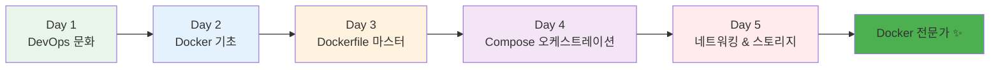
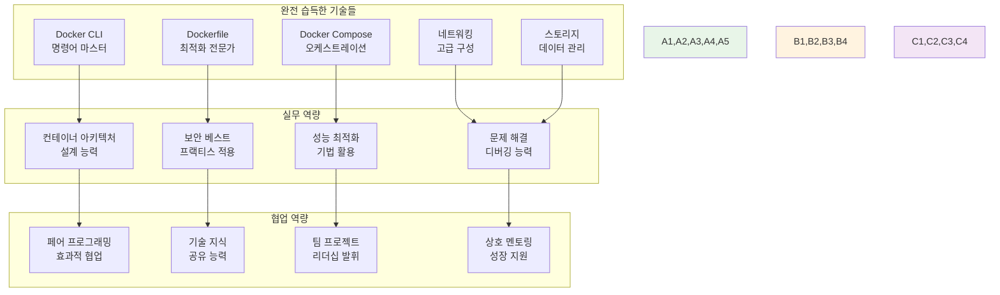
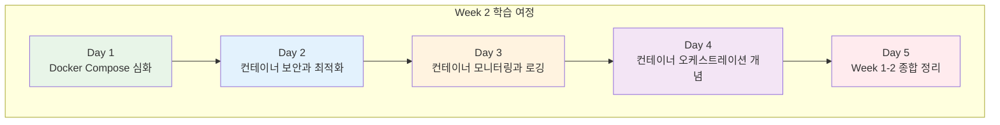
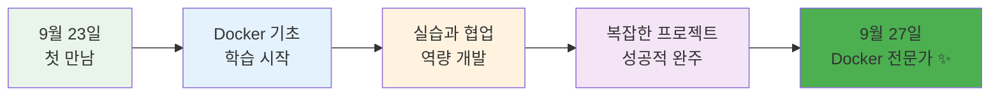

# Week 1 Day 5 Session 5: 주간 회고 & 다음 주 준비

<div align="center">

**🏆 Week 1 완주 축하** • **🚀 Week 2 준비**

*Docker 전문가로의 성장과 다음 단계 도약 준비*

</div>

---

## 🕘 세션 정보

**시간**: 16:15-18:00 (105분)  
**목표**: Week 1 완주 축하와 성과 정리, Week 2 Docker Compose 학습 준비  
**방식**: 전체 회고 + 개별 성장 확인 + 다음 주 계획 수립

---

## 🎯 세션 목표

### 📚 학습 목표
- **성과 정리**: Week 1에서 습득한 모든 Docker 기술과 역량 종합 정리
- **성장 확인**: 개인별 성장 포인트와 달성한 목표 명확히 인식
- **준비 완료**: Week 2 Docker Compose 학습을 위한 완벽한 준비 상태 구축

### 🤝 협업 목표
- **팀 성과 공유**: 5일간의 협업 경험과 성과를 함께 축하
- **상호 격려**: 서로의 성장을 인정하고 격려하는 시간
- **미래 계획**: Week 2에서의 협업 방향과 역할 계획 수립

### 🤔 왜 회고가 중요한가? (5분)

**회고의 가치**:
- 💼 **실무 연결**: 실제 프로젝트에서도 회고는 필수 프로세스
- 🏠 **일상 비유**: 여행 후 사진을 보며 추억을 정리하는 것과 같음
- 📊 **성장 가속**: 의식적인 회고를 통한 학습 효과 극대화

**Week 1의 여정**:


---

## 🏆 Week 1 완주 축하 (30분)

### 🎉 전체 성과 발표 (15분)

#### 📊 Week 1 통계 및 성과
**학습 통계**:
- **총 학습 시간**: 40시간 (8시간 × 5일)
- **이론 세션**: 15개 세션 완주
- **실습 프로젝트**: 10개 프로젝트 완성
- **팀 협업**: 20회 이상의 페어/팀 활동
- **포트폴리오**: 개인별 5개 이상의 결과물

**기술 습득 현황**:


#### 🌟 특별한 성과들
**개인별 하이라이트**:
- **초급자 성과**: 기본 개념 완전 이해 + 자신감 대폭 향상
- **중급자 성과**: 실무 적용 능력 + 자연스러운 리더십 발휘
- **고급자 성과**: 전문성 심화 + 효과적인 멘토링 역량

**팀 협업 하이라이트**:
- 다양한 배경의 12명이 하나의 팀으로 성장
- 자연스러운 역할 분담과 상호 지원
- 복잡한 프로젝트를 함께 성공적으로 완주

### 🎊 성공 스토리 공유 (15분)

#### 개인별 성장 스토리 (1분씩 × 12명)
**공유 내용**:
1. **가장 기억에 남는 순간**: Week 1에서 가장 인상 깊었던 학습 경험
2. **극복한 어려움**: 어려웠던 부분을 어떻게 해결했는지
3. **협업의 힘**: 동료들과 함께 해서 더 잘할 수 있었던 경험
4. **자신감 변화**: Week 1 시작 전과 지금의 자신감 차이

**예시 공유**:
```
"처음에는 Docker가 너무 어려웠는데, 
페어 프로그래밍을 통해 동료에게 배우면서 
점점 자신감이 생겼어요. 
특히 오늘 마이크로서비스 챌린지에서 
네트워크 설정을 제가 주도할 수 있어서 
정말 뿌듯했습니다!"
```

---

## 📊 개별 성장 확인 및 피드백 (45분)

### 🔍 개인별 성장 포인트 분석 (30분)

#### 초급자 성장 확인 (개인당 2-3분 × 4명)
**성장 지표 체크**:
- [ ] **기술 이해도**: Docker 기본 개념 → 실무 적용 가능 수준
- [ ] **자신감 향상**: 두려움 → 적극적 참여와 질문
- [ ] **협업 능력**: 수동적 참여 → 능동적 기여와 아이디어 제시
- [ ] **문제 해결**: 의존적 → 독립적 문제 해결 시도

**개별 피드백**:
```
초급자 A: "Docker 명령어를 완전히 숙달했고, 
특히 Dockerfile 최적화에서 뛰어난 성과를 보였습니다. 
페어 프로그래밍에서도 적극적으로 아이디어를 제시하며 
팀에 큰 기여를 했습니다."

초급자 B: "처음에는 어려워했지만 꾸준한 노력으로 
모든 실습을 완주했습니다. 특히 네트워킹 부분에서 
깊이 있는 질문을 통해 전체 팀의 이해도를 높였습니다."
```

#### 중급자 성장 확인 (개인당 2-3분 × 6명)
**성장 지표 체크**:
- [ ] **기술 심화**: 기본 지식 → 고급 기법과 최적화
- [ ] **리더십 발휘**: 개인 작업 → 팀 리더 역할 수행
- [ ] **멘토링 능력**: 자기 중심 → 동료 지원과 지식 공유
- [ ] **아키텍처 사고**: 단순 구현 → 전체 시스템 설계 관점

**개별 피드백**:
```
중급자 A: "뛰어난 기술 이해력을 바탕으로 
팀 프로젝트에서 자연스럽게 기술 리더 역할을 했습니다. 
초급자들을 도우면서도 자신의 학습을 놓치지 않는 
균형감이 인상적이었습니다."

중급자 B: "실무 경험을 바탕으로 한 실용적인 접근이 
팀 전체에 큰 도움이 되었습니다. 
특히 보안과 성능 관점에서의 조언이 매우 가치있었습니다."
```

#### 고급자 성장 확인 (개인당 2-3분 × 2명)
**성장 지표 체크**:
- [ ] **전문성 심화**: 기존 지식 → 최신 트렌드와 고급 패턴
- [ ] **멘토링 마스터**: 개별 도움 → 체계적 멘토링 시스템
- [ ] **아키텍처 리더**: 기술 구현 → 전체 시스템 설계 주도
- [ ] **지식 전파**: 개인 학습 → 팀 전체 역량 향상 기여

**개별 피드백**:
```
고급자 A: "깊이 있는 기술 지식을 바탕으로 
팀 전체의 기술 수준을 끌어올렸습니다. 
복잡한 네트워킹 문제를 해결하면서도 
초급자들이 이해할 수 있도록 설명하는 능력이 탁월했습니다."

고급자 B: "최신 기술 트렌드에 대한 인사이트를 
팀과 공유하며 학습 방향을 제시했습니다. 
멘토링 스킬이 한 단계 더 발전한 것을 확인할 수 있었습니다."
```

### 🎯 개인별 Week 2 목표 설정 (15분)

#### 맞춤형 학습 계획 수립
**초급자 목표**:
- Docker Compose 완전 마스터
- 복잡한 멀티 컨테이너 애플리케이션 구축
- 팀 프로젝트에서 더 적극적인 역할 수행
- 기술 블로그 작성 시작

**중급자 목표**:
- 고급 Compose 패턴과 프로덕션 설정
- 컨테이너 보안과 성능 최적화 전문가
- 초급자 멘토링 체계화
- 기술 세미나 발표 준비

**고급자 목표**:
- 최신 컨테이너 기술 트렌드 연구
- 엔터프라이즈급 컨테이너 아키텍처 설계
- 멘토링 방법론 개발
- 오픈소스 기여 계획 수립

---

## 🚀 Week 2 준비 및 미리보기 (30분)

### 📚 Week 2: Docker Compose와 컨테이너 생태계 (15분)

#### Week 2 커리큘럼 소개


**Day 1: Docker Compose 심화**
- 고급 Compose 패턴과 베스트 프랙티스
- 환경별 설정 관리 (dev, staging, prod)
- 서비스 의존성과 헬스체크
- 스케일링과 로드 밸런싱

**Day 2: 컨테이너 보안과 최적화**
- 컨테이너 보안 스캔과 취약점 관리
- 이미지 최적화 고급 기법
- 런타임 보안과 정책 적용
- 성능 모니터링과 튜닝

**Day 3: 컨테이너 모니터링과 로깅**
- 중앙화된 로깅 시스템 구축
- 메트릭 수집과 알림 시스템
- 분산 추적과 APM 통합
- 장애 대응과 복구 자동화

**Day 4: 컨테이너 오케스트레이션 개념**
- Kubernetes 기초 개념 미리보기
- 컨테이너 오케스트레이션 필요성
- Docker Swarm vs Kubernetes 비교
- 클라우드 네이티브 아키텍처 소개

**Day 5: Week 1-2 종합 정리**
- 2주간 학습 내용 통합 정리
- 포트폴리오 완성과 발표
- Week 3 Kubernetes 학습 준비
- 중간 평가와 피드백

### 🎯 Week 2 학습 전략 (15분)

#### 협업 학습 강화 방안
**팀 구성 최적화**:
- Week 1 경험을 바탕으로 한 효과적인 팀 매칭
- 상호 보완적인 역할 분담
- 정기적인 팀 회고와 개선

**프로젝트 기반 학습**:
- 실제 서비스를 모델로 한 복합 프로젝트
- 단계별 기능 확장과 개선
- 지속적인 코드 리뷰와 품질 관리

**멘토링 시스템 고도화**:
- 고급자 → 중급자 → 초급자 멘토링 체인
- 정기적인 멘토링 세션과 피드백
- 멘토링 효과 측정과 개선

#### 개인별 학습 지원 강화
**초급자 지원**:
- 추가 실습 자료와 튜토리얼 제공
- 1:1 멘토링 시간 확대
- 기초 개념 반복 학습 기회

**중급자 도전**:
- 고급 프로젝트와 기술 연구 과제
- 기술 발표와 지식 공유 기회
- 리더십 역량 개발 프로그램

**고급자 전문화**:
- 최신 기술 트렌드 연구 프로젝트
- 오픈소스 기여와 커뮤니티 활동
- 기술 세미나와 워크샵 주도

---

## 📝 세션 마무리

### ✅ Week 1 완주 성과 총정리
- [ ] **Docker 전문가 완성**: 기초부터 고급까지 모든 Docker 기술 완전 습득 ✅
- [ ] **실무 역량 확보**: 프로덕션 환경에서 바로 활용 가능한 실무 능력 ✅
- [ ] **협업 리더십 개발**: 다양한 팀 프로젝트를 통한 협업과 리더십 역량 ✅
- [ ] **문제 해결 능력**: 복잡한 컨테이너 문제를 독립적으로 해결하는 능력 ✅
- [ ] **지식 공유 문화**: 서로 가르치고 배우는 학습 문화 정착 ✅
- [ ] **자신감 확립**: Docker 기술에 대한 확고한 자신감과 전문성 ✅

### 🎯 Week 2 준비 완료
- [ ] **학습 목표 명확화**: 개인별 맞춤 학습 목표와 계획 수립 ✅
- [ ] **팀 협업 계획**: 효과적인 협업 방향과 역할 분담 계획 ✅
- [ ] **기술 기반 완성**: Week 2 학습을 위한 충분한 기술적 기반 구축 ✅
- [ ] **동기부여 충전**: 지속적인 학습과 성장에 대한 강한 동기 ✅

### 🏆 Week 1 완주 축하!


### 🔮 다음 주 첫날 미리보기
**Week 2 Day 1: Docker Compose 심화**
- 오늘 구축한 마이크로서비스 시스템을 Compose로 재구성
- 환경별 설정 관리와 프로덕션 배포 준비
- 더욱 복잡하고 실무적인 프로젝트 도전

---

## 🎉 Week 1 완주 축하 메시지

<div align="center">

### 🏆 축하합니다! Week 1 완벽 완주! 🏆

**5일간의 여정을 통해 여러분은:**

✨ **Docker 전문가**로 성장했습니다  
🤝 **협업의 달인**이 되었습니다  
🚀 **실무 역량**을 완전히 갖췄습니다  
💪 **자신감**을 확고히 다졌습니다  

**이제 여러분은 어떤 컨테이너 프로젝트든 자신 있게 도전할 수 있습니다!**

### 🌟 Week 2에서 더욱 놀라운 성장이 기다리고 있습니다 🌟

*Docker Compose부터 Kubernetes 준비까지*  
*함께 만들어갈 더 큰 성공을 기대합니다!*

</div>

---

<div align="center">

**🏆 Week 1 완주** • **🚀 Week 2 준비 완료** • **💪 Docker 전문가 완성**

*5일간의 완벽한 여정을 마치고 새로운 도전을 향해*

**이전**: [Session 4 - 마이크로서비스 네트워킹 챌린지](./session_4.md) | **다음**: [Week 2 Day 1 - Docker Compose 심화](../../week_02/day1/README.md)

</div>