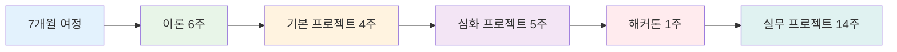
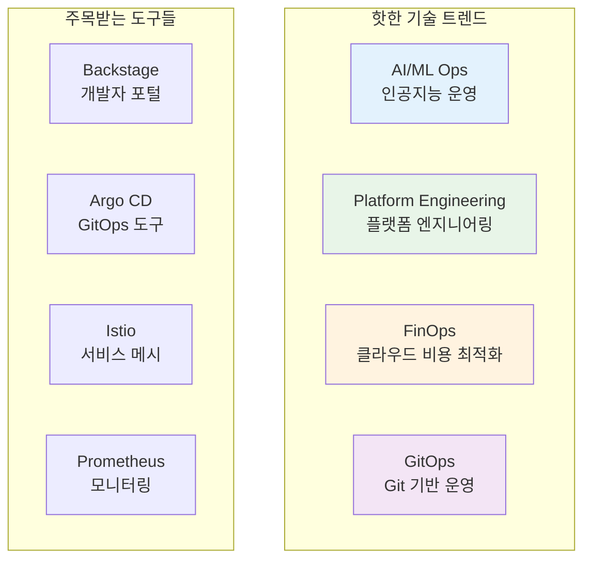
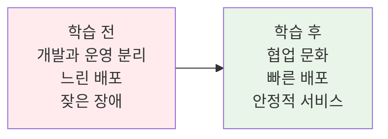
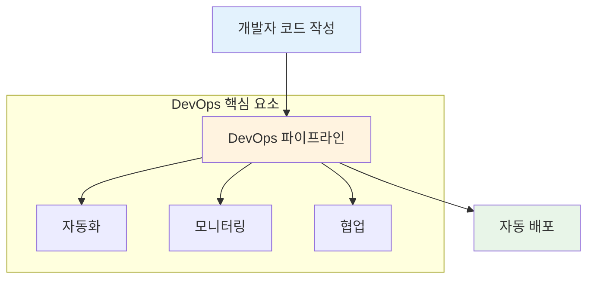
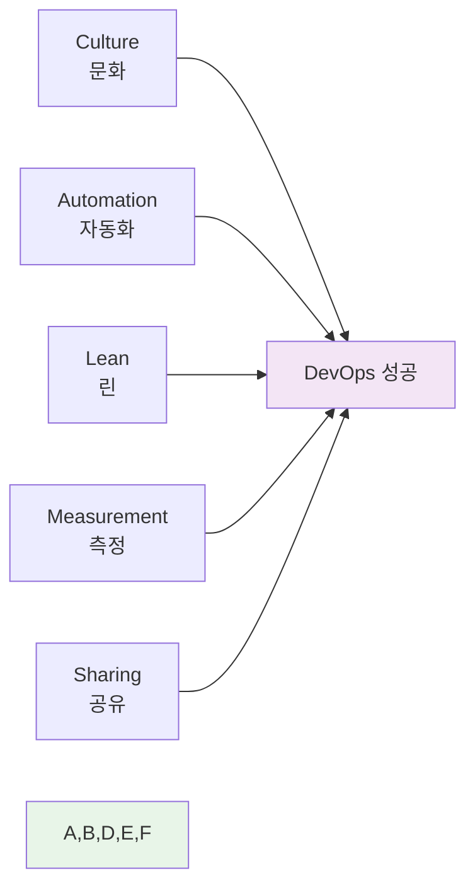
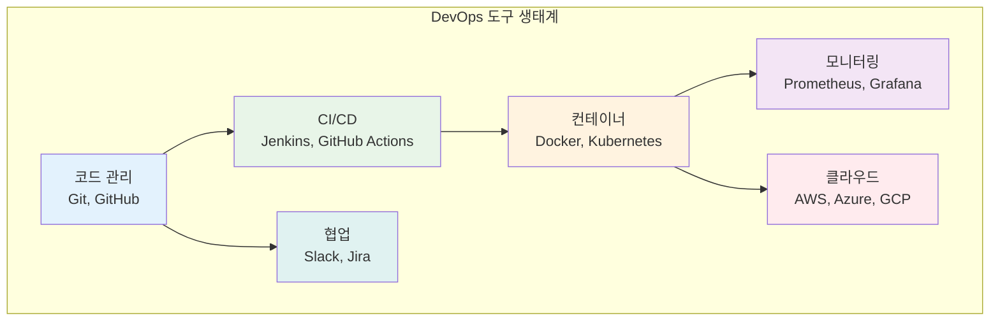
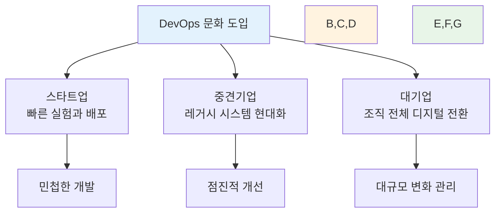
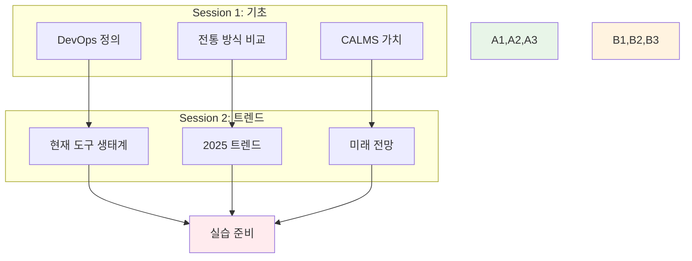
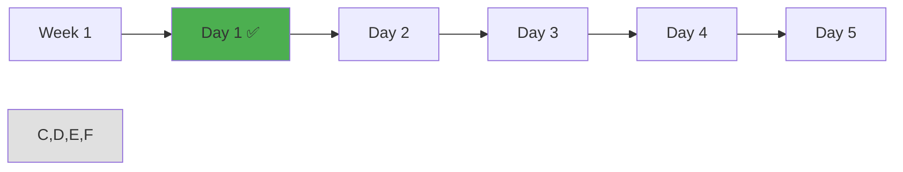

# Week 1 Day 1: 오리엔테이션 & DevOps 개념 소개

<div align="center">

**🎓 첫날 특별 구성** • **오리엔테이션 + DevOps 기초**

*7개월 여정의 시작 - 라포 형성과 기본 개념 학습*

</div>

---

## 🕘 일일 스케줄 (첫날 특별 구성)

### 📊 시간 배분 (첫날 특별 구성)
```
🎯 오리엔테이션: 2시간 (25%)
📚 이론 강의: 2시간 (25%) - 쉬운 개념부터 시작
🛠️ 기본 실습: 2시간 (25%) - 환경 설정 중심
👥 개별 상담: 2시간 (25%) - 라포 형성 중심
```

### 🗓️ 상세 스케줄
| 시간 | 구분 | 내용 | 목적 |
|------|------|------|------|
| **09:00-11:00** | 🎯 오리엔테이션 | 과정소개 + 강사소개 + 아이스브레이킹 | 라포 형성 |
| **11:00-11:15** | ☕ 휴식 | 15분 휴식 | |
| **11:15-12:15** | 📚 이론 1 | DevOps 개념 기초 | 쉬운 시작 |
| **12:15-13:15** | 🍽️ 점심 | 점심시간 | |
| **13:15-14:15** | 📚 이론 2 | DevOps 트렌드와 미래 | 동기부여 |
| **14:15-14:30** | ☕ 휴식 | 15분 휴식 | |
| **14:30-16:30** | 🛠️ 실습 | 개발환경 설정 + 간단한 실습 | 적응 시간 |
| **16:30-18:00** | 👥 1:1 상담 | 개별 라포 형성 (5분×12명) + 학습 상담 | 친목 도모 |

---

## 🎯 오리엔테이션 (2시간)

### 1. 과정 소개 (30분)

#### 🌟 KT Cloud TECH UP 2025 소개
**참고**: https://ktcloud-techup.com/cloud-native



**과정의 특별함**:
- 🏢 **KT Cloud 직접 운영**: 국내 최대 클라우드 인프라 경험
- 👨💼 **현직자 멘토링**: 실무 전문가와 함께하는 학습
- 🚀 **실무 프로젝트**: 실제 기업 과제 해결
- 💼 **취업 연계**: KT Cloud 및 파트너사 취업 기회

#### 📈 클라우드 시장 전망
```
글로벌 클라우드 시장 규모
2023년: $545B → 2030년: $1,266B (연평균 13% 성장)

국내 클라우드 시장
2023년: 4.2조원 → 2027년: 7.8조원 (85% 성장)

클라우드 네이티브 전문가 수요
현재 대비 300% 증가 예상 (2025년까지)
```

### 2. 강사 소개 (15분)

#### 👨🏫 강사 프로필
- **경력**: DevOps 및 클라우드 아키텍처 10년+ 경험
- **전문 분야**: DevOps, Kubernetes, 클라우드 아키텍처
- **실무 경험**: 대규모 클라우드 마이그레이션 및 DevOps 전환 프로젝트
- **교육 철학**: "이론과 실무의 완벽한 결합"

#### 🎯 교육 방침
- **협업 중심**: 다양한 배경의 학생들이 함께 성장하는 환경
- **상호 학습**: 서로 가르치고 배우며 전체가 발전
- **실무 연계**: 현장에서 바로 쓸 수 있는 기술과 협업 능력
- **자연스러운 성장**: 각자의 강점이 자연스럽게 발현되는 학습

### 3. 아이스브레이킹 (45분)

#### 🎲 자기소개 게임 (30분)
**"3가지 키워드로 나를 소개하기"**

각자 3가지 키워드로 자신을 소개:
1. **배경** (전공, 관심사, 취미)
2. **목표** (이 과정을 통해 이루고 싶은 것)
3. **특기** (자신만의 강점이나 재능)

**진행 방식**:
- 1인당 2분 소개
- 다른 사람 소개 들으며 공통점 찾기
- 질문과 대화 자유롭게
- 모든 배경과 경험을 환영하는 분위기

#### 🧩 팀 빌딩 퀴즈 (15분)
**"IT 상식 퀴즈 + 협력 게임"**

```
퀴즈 예시:
1. Docker의 로고는 무엇 모양일까요?
2. Kubernetes를 줄여서 뭐라고 부를까요?
3. DevOps에서 가장 중요한 것은?
   a) 도구  b) 문화  c) 기술  d) 프로세스

협력 게임:
- 3-4명씩 팀을 이뤄서 퀴즈 해결
- 모르는 문제는 팀원끼리 토론
- 정답보다는 소통과 협력이 목적
```

### 4. DevOps 트렌드 소개 (30분)

#### 📊 2024-2025 DevOps 트렌드


**왜 지금 DevOps인가?**
- 🚀 **디지털 전환 가속화**: 모든 기업이 소프트웨어 기업화
- ⚡ **빠른 배포 요구**: 일주일 → 하루 → 실시간 배포
- 🔒 **보안 강화 필요**: DevSecOps로 진화
- 💰 **비용 최적화**: 클라우드 비용 관리의 중요성

---

## 📚 이론 강의 (2시간) - 쉬운 시작

### Session 1: DevOps란 무엇인가? (60분)

#### 🎯 학습 목표
- DevOps의 기본 정의 이해
- 전통적 개발 방식과의 차이점 파악
- DevOps가 필요한 이유 공감

#### 🤔 왜 필요한가? (5분 - 동기부여 및 맥락 제공)
**현실 문제 상황**:
- 💼 **실무 시나리오**: 개발팀이 만든 코드가 운영 환경에서 동작하지 않는 문제
- 🏠 **일상 비유**: 요리사(개발)와 서빙(운영)이 따로 놀면 고객 불만족
- 📊 **시장 동향**: 빠른 변화에 대응하지 못하는 기업들의 몰락

**학습 전후 비교**:


#### 📖 핵심 개념 (35분 - 체계적 지식 구축)

**🔍 개념 1: DevOps의 기본 정의**
> **정의**: Development(개발) + Operations(운영) = 협업을 통한 빠르고 안정적인 소프트웨어 배포

**상세 설명**:
- **핵심 원리**: 개발과 운영의 벽을 허물고 하나의 팀으로 협업
- **주요 특징**: 
  - 지속적 통합/배포 (CI/CD)
  - 자동화된 테스트와 배포
  - 모니터링과 피드백 루프
  - 문화적 변화와 협업
- **사용 목적**: 소프트웨어 품질 향상과 배포 속도 증가

**시각적 이해**:


**🔍 개념 2: 전통적 방식 vs DevOps**
> **정의**: 기존의 분리된 개발/운영 방식에서 통합된 협업 방식으로의 전환

**단계별 이해**:
1. **1단계**: 개발팀과 운영팀이 완전히 분리된 상태
2. **2단계**: 일부 협업이 시작되지만 여전히 벽이 존재
3. **3단계**: 완전한 DevOps 문화로 하나의 팀처럼 협업

**실무 연결**:
- **사용 사례**: Netflix의 마이크로서비스 아키텍처, Amazon의 2-pizza 팀
- **장단점**: 
  - 장점: 빠른 배포, 높은 품질, 빠른 피드백
  - 한계점: 문화 변화의 어려움, 초기 투자 비용
- **대안 기술**: Agile, Lean, Site Reliability Engineering (SRE)

**🔍 개념 3: DevOps 핵심 가치 - CALMS**
> **정의**: DevOps 성공을 위한 5가지 핵심 요소

**개념 간 관계**:


**종합 비교표**:
| 구분 | 전통적 방식 | DevOps 방식 | 핵심 차이점 |
|------|-------------|-------------|-------------|
| **팀 구조** | 개발팀 ↔ 운영팀 분리 | 통합된 크로스펑셔널 팀 | 협업 vs 분리 |
| **배포 주기** | 몇 달에 한 번 | 매일 또는 실시간 | 속도 vs 안정성 |
| **책임 범위** | 개발 vs 운영으로 분리 | 전체 생명주기 공유 | 공유 책임 |
| **문제 해결** | 서로 책임 전가 | 함께 해결 | 협력적 문제 해결 |
| **도구 사용** | 수동 작업 중심 | 자동화 도구 활용 | 효율성 증대 |

**🔑 핵심 키워드 정리**:
- **새로운 용어**: 
  - DevOps(데브옵스) - 개발과 운영의 협업 문화
  - CI/CD(Continuous Integration/Continuous Deployment) - 지속적 통합/배포
  - Infrastructure as Code(IaC) - 인프라를 코드로 관리
- **중요 개념**: 
  - 자동화(Automation) - 반복 작업의 자동화로 효율성 증대
  - 모니터링(Monitoring) - 시스템 상태 지속적 관찰
- **실무 용어**: 
  - 파이프라인(Pipeline) - 코드에서 배포까지의 자동화된 흐름
  - 배포(Deployment) - 개발된 소프트웨어를 운영 환경에 적용

#### 💭 함께 생각해보기 (10분 - 상호작용 및 이해도 확인)

**🤝 페어 토론** (5분):
**토론 주제**:
1. **개념 적용**: "여러분의 경험에서 개발과 운영이 분리되어 생긴 문제가 있었나요?"
2. **문제 해결**: "DevOps 문화가 있었다면 그 문제를 어떻게 해결할 수 있었을까요?"
3. **경험 공유**: "협업이 잘 되었던 경험이나 잘 안 되었던 경험을 공유해주세요"

**페어 활동 가이드**:
- 👥 **자유 페어링**: 관심사나 경험이 비슷한 사람끼리
- 🔄 **역할 교대**: 3분씩 설명자/질문자 역할 바꾸기
- 📝 **핵심 정리**: 대화 내용 중 중요한 점 메모하기

**🎯 전체 공유** (5분):
- **인사이트 공유**: 페어 토론에서 나온 좋은 아이디어
- **질문 수집**: 아직 이해가 어려운 부분
- **다음 연결**: 다음 세션과의 연결고리 확인

**💡 이해도 체크 질문**:
- ✅ "DevOps를 한 문장으로 설명할 수 있나요?"
- ✅ "전통적 방식과 DevOps의 가장 큰 차이점은 무엇인가요?"
- ✅ "DevOps가 왜 필요한지 실무 관점에서 설명할 수 있나요?"

### Session 2: DevOps 트렌드와 미래 (60분)

#### 🎯 학습 목표
- 현재 DevOps 생태계 이해
- 2025년 최신 트렌드 파악
- 미래 DevOps 전문가로서의 비전 수립

#### 📖 핵심 개념 (35분)

**🔍 개념 1: 현재 DevOps 도구 생태계**
> **정의**: DevOps 구현을 위한 다양한 도구들의 통합적 활용

**주요 DevOps 도구들**:


**성공 사례**:
- **Netflix**: 하루 1000번 이상 배포, 마이크로서비스 아키텍처
- **Amazon**: 11.7초마다 배포, 2-pizza 팀 문화
- **Google**: 20억 개 컨테이너 운영, SRE 문화

**🔍 개념 2: 2025년 최신 DevOps 트렌드**
> **정의**: 현재 주목받고 있는 DevOps 기술과 문화적 변화

**핫한 기술 트렌드**:
1. **Platform Engineering**: 개발자 경험(DX) 향상을 위한 내부 플랫폼 구축
2. **FinOps**: 클라우드 비용 최적화와 재무 운영의 결합
3. **AI/MLOps**: 인공지능 모델의 개발, 배포, 운영 자동화
4. **Green DevOps**: 지속가능한 소프트웨어 개발과 환경 고려

**🔍 개념 3: DevOps 전문가의 미래**
> **정의**: DevOps 기술 발전에 따른 전문가 역할의 변화와 기회

**미래 역할 변화**:
- **기술적 역할**: 단순 도구 사용 → 플랫폼 설계자
- **문화적 역할**: 팀 내 협업 → 조직 전체 변화 리더
- **비즈니스 역할**: 기술 지원 → 비즈니스 가치 창출

#### 🌟 실무 연계 (15분 - 현장 적용성 강화)

**📊 업계 동향**:
- **시장 현황**: DevOps 도구 시장 연평균 20% 성장
- **주요 기업 사례**: 
  - Spotify의 Squad 모델
  - Uber의 마이크로서비스 전환
  - Airbnb의 데이터 드리븐 DevOps
- **미래 전망**: AI 기반 자동화, 서버리스 아키텍처 확산

**🏢 실무 적용 사례**:


**💼 직무별 활용도**:
- **개발자**: 코드 품질 향상, 배포 자동화, 모니터링 통합
- **운영자**: 인프라 자동화, 장애 대응 개선, 성능 최적화
- **관리자**: 팀 생산성 향상, 비용 최적화, 리스크 관리

**⚠️ 실무 주의사항**:
- 🚨 **흔한 실수**: 도구만 도입하고 문화 변화 없이 진행
- 💡 **베스트 프랙티스**: 작은 것부터 시작해서 점진적 확장
- 🔧 **트러블슈팅**: 저항하는 조직 문화를 어떻게 변화시킬 것인가

#### 🔗 전체 연결 및 정리 (10분 - 학습 통합)

**📚 2개 세션 통합 맵**:


**🎯 실습 연결**:
- **환경 설정**: DevOps 도구들의 실제 설치와 사용
- **Git 협업**: 실제 협업 문화 체험
- **자동화 맛보기**: 간단한 자동화 스크립트 작성

**📋 학습 점검 체크리스트**:
- [ ] **DevOps 정의**: DevOps가 무엇인지 명확히 설명할 수 있다
- [ ] **문화 이해**: 기술보다 문화가 중요함을 이해한다
- [ ] **트렌드 파악**: 2025년 주요 트렌드를 알고 있다
- [ ] **실습 준비**: 오후 실습에 필요한 개념을 이해했다

**🔮 다음 학습 예고**:
- **내일 연결**: DevOps 문화 → 컨테이너 기술로 자연스러운 연결
- **주간 목표**: DevOps 철학을 바탕으로 한 기술 학습
- **장기 비전**: 6주 후 DevOps 전문가로서의 기초 완성

---

## 🛠️ 기본 실습 (2시간) - 환경 설정 중심

### 🎯 실습 개요
**목표**: DevOps 도구 환경 구축 + 첫 협업 경험

### 📋 실습 준비 (15분)
**환경 설정 체크**:
- 개인 노트북 준비 상태 확인
- 인터넷 연결 및 계정 준비
- 실습 가이드 문서 배포

### 🚀 Phase 1: 개발 환경 설정 (60분)
**목표**: DevOps 필수 도구 설치 및 설정

#### 🔧 설치 단계
**Step 1: Git 설치 및 설정**
```bash
# Git 설치 확인
git --version

# Git 사용자 설정
git config --global user.name "Your Name"
git config --global user.email "your.email@example.com"
```

**Step 2: VS Code 설치 및 확장**
- VS Code 설치
- 필수 확장 프로그램 설치:
  - Git Graph
  - Docker
  - YAML

**Step 3: Docker Desktop 설치**
```bash
# Docker 설치 확인
docker --version

# 첫 컨테이너 실행
docker run hello-world
```

#### ✅ Phase 1 체크포인트
- [ ] Git 명령어 정상 실행
- [ ] VS Code에서 Git 연동 확인
- [ ] Docker Hello World 성공

### 🌟 Phase 2: 첫 협업 실습 (60분)
**목표**: Git을 활용한 협업 기초 체험

#### 🔧 협업 구현
**페어 프로그래밍 진행**:
- 2명씩 자유롭게 페어링
- 간단한 프로젝트 공동 작성
- Git 기본 워크플로우 실습

**실습 내용**:
1. GitHub 저장소 생성
2. README.md 파일 공동 작성
3. 브랜치 생성 및 병합
4. Pull Request 체험

#### ✅ Phase 2 체크포인트
- [ ] GitHub 저장소 생성 완료
- [ ] 페어와 함께 파일 수정 완료
- [ ] Git 기본 명령어 사용 가능

### 🏆 Phase 3: 환경 점검 및 정리 (15분)
**목표**: 설치된 도구들의 정상 작동 확인

**최종 확인**:
- 모든 도구 설치 상태 점검
- 내일 학습을 위한 준비 완료
- 문제 발생 시 해결 방안 안내

---

## 👥 개별 상담 및 친목 시간 (90분)

### 🤝 1:1 개별 상담 (60분)
**진행 방식**: 5분 × 12명

#### 상담 목적
- 서로 알아가는 시간
- 학습 목표와 관심사 공유
- 편안한 학습 분위기 조성
- 개별 맞춤 지원 방안 모색

#### 대화 주제
**자유로운 대화** (2-3분):
- 개인 관심사, 취미, 특별한 경험
- 이 과정에 참여한 계기와 기대
- 앞으로의 목표나 꿈

**협업 관련 대화** (2-3분):
- 지금까지의 다양한 경험 (IT 외 분야도 환영)
- 팀 프로젝트에서 기여하고 싶은 부분
- 다른 사람들과 함께 배우고 싶은 것

### 🎯 협업 학습 환경 조성 (30분)

#### 🌟 우리 과정의 특별한 점
**12명의 다양한 배경이 만드는 시너지**:
- 1978년생부터 2001년생까지 풍부한 세대 경험
- CS 전공자와 비전공자의 창의적 관점 융합
- 신입부터 경력자까지 상호 보완적 지식 공유
- 각자의 인생 경험이 만드는 독특한 학습 환경

#### 🤝 함께 성장하는 방법
- **자연스러운 협업**: 억지로 만든 역할이 아닌 자연스러운 도움
- **상호 학습**: 가르치는 사람도 배우는 사람도 모두 성장
- **프로젝트 중심**: 실제 문제를 함께 해결하며 실력 향상
- **리더십 발현**: 프로젝트 과정에서 각자의 리더십 자연 발현

---

## 📝 일일 마무리

### ✅ 오늘의 성과
- [ ] 전체 과정 이해 및 동기부여 완료
- [ ] 동료들과 라포 형성 및 친목 도모
- [ ] DevOps 기본 개념과 문화 이해
- [ ] 개발 환경 설정 및 도구 사용법 습득
- [ ] Git 협업 기초 경험

### 🎯 내일 준비사항
- **예습**: 컨테이너와 가상머신의 차이점 생각해보기
- **복습**: 오늘 배운 DevOps 개념과 CALMS 가치 정리
- **환경**: 설치한 도구들(Git, VS Code, Docker) 정상 작동 확인

### 📊 학습 진도 체크


---

## 🔄 피드백 및 개선

### 📈 일일 회고 (15분)
**학습 회고**:
1. DevOps 문화에 대해 새롭게 알게 된 점은?
2. 아이스브레이킹과 자기소개에서 인상 깊었던 동료는?
3. 개발 환경 설정에서 어려웠던 부분과 해결 방법은?
4. 내일 컨테이너 기술 학습에 대한 기대는?

### 🎯 개선 포인트
**📊 강사 관찰 기반**:
- 개념 이해도 차이 발견 시 추가 설명 제공
- 환경 설정에서 발생한 공통 문제점 정리
- 페어 활동에서 소극적인 학생 참여 유도

**💬 학생 피드백 기반**:
- 첫날 긴장감 해소를 위한 추가 아이스브레이킹
- 기술 용어 설명의 난이도 조절
- 실습 시간 배분 최적화

---

<div align="center">

**🎉 KT Cloud TECH UP 2025 여정의 시작을 축하합니다! 🎉**

*함께 성장하는 7개월, 클라우드 네이티브 전문가로의 변화*

**다음**: [Day 2 - 컨테이너 기술 이론](./day_02_container_technology_theory.md)

</div>