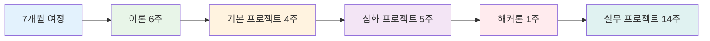
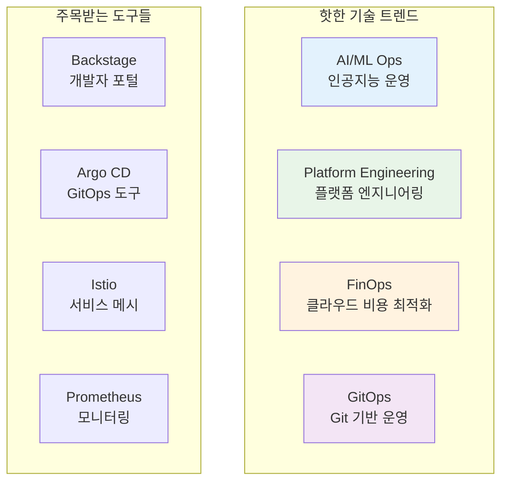
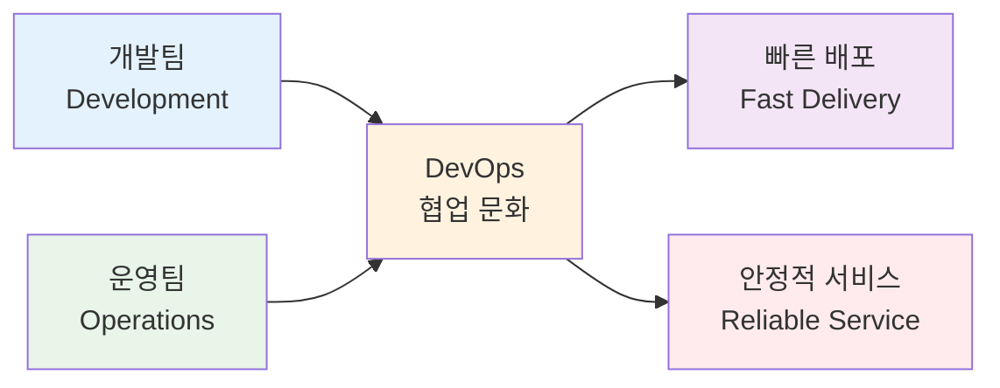
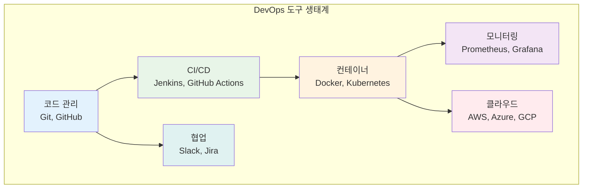

# Week 1 Day 1: 오리엔테이션 & DevOps 개념 소개

<div align="center">

**🎓 첫날 특별 구성** • **오리엔테이션 + DevOps 기초**

*7개월 여정의 시작 - 라포 형성과 기본 개념 학습*

</div>

---

## 🕘 일일 스케줄 (첫날 특별 구성)

### 📊 시간 배분 (첫날 특별 구성)
```
🎯 오리엔테이션: 2시간 (25%)
📚 이론 강의: 2시간 (25%) - 쉬운 개념부터 시작
🛠️ 기본 실습: 2시간 (25%) - 환경 설정 중심
👥 개별 상담: 2시간 (25%) - 라포 형성 중심
```

### 🗓️ 상세 스케줄
| 시간 | 구분 | 내용 | 목적 |
|------|------|------|------|
| **09:00-11:00** | 🎯 오리엔테이션 | 과정소개 + 강사소개 + 아이스브레이킹 | 라포 형성 |
| **11:00-11:15** | ☕ 휴식 | 15분 휴식 | |
| **11:15-12:15** | 📚 이론 1 | DevOps 개념 기초 | 쉬운 시작 |
| **12:15-13:15** | 🍽️ 점심 | 점심시간 | |
| **13:15-14:15** | 📚 이론 2 | DevOps 트렌드와 미래 | 동기부여 |
| **14:15-14:30** | ☕ 휴식 | 15분 휴식 | |
| **14:30-16:30** | 🛠️ 실습 | 개발환경 설정 + 간단한 실습 | 적응 시간 |
| **16:30-18:00** | 👥 1:1 상담 | 개별 라포 형성 (5분×12명) + 학습 상담 | 친목 도모 |

---

## 🎯 오리엔테이션 (2시간)

### 1. 과정 소개 (30분)

#### 🌟 KT Cloud TECH UP 2025 소개
**참고**: https://ktcloud-techup.com/cloud-native



**과정의 특별함**:
- 🏢 **KT Cloud 직접 운영**: 국내 최대 클라우드 인프라 경험
- 👨‍💼 **현직자 멘토링**: 실무 전문가와 함께하는 학습
- 🚀 **실무 프로젝트**: 실제 기업 과제 해결
- 💼 **취업 연계**: KT Cloud 및 파트너사 취업 기회

#### 📈 클라우드 시장 전망
```
글로벌 클라우드 시장 규모
2023년: $545B → 2030년: $1,266B (연평균 13% 성장)

국내 클라우드 시장
2023년: 4.2조원 → 2027년: 7.8조원 (85% 성장)

클라우드 네이티브 전문가 수요
현재 대비 300% 증가 예상 (2025년까지)
```

### 2. 강사 소개 (15분)

#### 👨‍🏫 강사 프로필
- **경력**: [강사 경력 사항]
- **전문 분야**: DevOps, Kubernetes, 클라우드 아키텍처
- **실무 경험**: [실무 프로젝트 경험]
- **교육 철학**: "이론과 실무의 완벽한 결합"

#### 🎯 교육 방침
- **개별 맞춤**: 각자의 수준에 맞는 학습 지원
- **실무 중심**: 현장에서 바로 쓸 수 있는 기술
- **협업 강화**: 팀워크와 소통 능력 개발
- **지속 성장**: 평생 학습할 수 있는 기반 구축

### 3. 아이스브레이킹 (45분)

#### 🎲 자기소개 게임 (30분)
**"3가지 키워드로 나를 소개하기"**

각자 3가지 키워드로 자신을 소개:
1. **배경** (전공, 관심사, 취미)
2. **목표** (이 과정을 통해 이루고 싶은 것)
3. **특기** (자신만의 강점이나 재능)

**진행 방식**:
- 1인당 2분 소개
- 다른 사람 소개 들으며 공통점 찾기
- 질문과 대화 자유롭게
- 모든 배경과 경험을 환영하는 분위기

#### 🧩 팀 빌딩 퀴즈 (15분)
**"IT 상식 퀴즈 + 협력 게임"**

```
퀴즈 예시:
1. Docker의 로고는 무엇 모양일까요?
2. Kubernetes를 줄여서 뭐라고 부를까요?
3. DevOps에서 가장 중요한 것은?
   a) 도구  b) 문화  c) 기술  d) 프로세스

협력 게임:
- 3-4명씩 팀을 이뤄서 퀴즈 해결
- 모르는 문제는 팀원끼리 토론
- 정답보다는 소통과 협력이 목적
```

### 4. DevOps 트렌드 소개 (30분)

#### 📊 2024-2025 DevOps 트렌드


**왜 지금 DevOps인가?**
- 🚀 **디지털 전환 가속화**: 모든 기업이 소프트웨어 기업화
- ⚡ **빠른 배포 요구**: 일주일 → 하루 → 실시간 배포
- 🔒 **보안 강화 필요**: DevSecOps로 진화
- 💰 **비용 최적화**: 클라우드 비용 관리의 중요성

---

## 📚 이론 강의 (2시간) - 쉬운 시작

### Session 1: DevOps란 무엇인가? (60분)

#### 🎯 학습 목표
- DevOps의 기본 정의 이해
- 전통적 개발 방식과의 차이점 파악
- DevOps가 필요한 이유 공감

#### 📖 핵심 개념 (40분)

**DevOps의 간단한 정의**
> **Dev**(개발) + **Ops**(운영) = 개발과 운영의 협업 문화



**전통적 방식 vs DevOps**

| 구분 | 전통적 방식 | DevOps 방식 |
|------|-------------|-------------|
| **팀 구조** | 개발팀 ↔ 운영팀 분리 | 통합된 팀 |
| **배포 주기** | 몇 달에 한 번 | 매일 또는 실시간 |
| **책임 범위** | 개발 vs 운영으로 분리 | 전체 생명주기 공유 |
| **문제 해결** | 서로 책임 전가 | 함께 해결 |
| **도구** | 수동 작업 중심 | 자동화 도구 활용 |

**DevOps의 핵심 가치 - CALMS**
- **C**ulture (문화): 협업과 소통
- **A**utomation (자동화): 반복 작업 자동화
- **L**ean (린): 낭비 제거, 효율성
- **M**easurement (측정): 데이터 기반 개선
- **S**haring (공유): 지식과 책임 공유

#### 💭 토론 및 질의응답 (20분)

**토론 주제**:
1. "여러분이 경험한 개발/운영의 어려움은?"
2. "DevOps가 해결할 수 있는 문제들은?"
3. "우리 과정에서 어떤 DevOps 경험을 하고 싶나요?"

### Session 2: DevOps 트렌드와 미래 (60분)

#### 🚀 현재 DevOps 생태계 (30분)

**주요 DevOps 도구들**


**성공 사례 간단 소개**:
- **Netflix**: 하루 1000번 이상 배포
- **Amazon**: 11.7초마다 배포
- **Google**: 20억 개 컨테이너 운영

#### 🔮 DevOps의 미래 (20분)

**새로운 트렌드들**:
1. **AI/ML Ops**: 인공지능 모델 운영 자동화
2. **Platform Engineering**: 개발자 경험 개선
3. **FinOps**: 클라우드 비용 최적화
4. **Green DevOps**: 친환경 소프트웨어 개발

#### 💼 취업 시장 전망 (10분)

**DevOps 엔지니어 전망**:
- 📈 **수요 증가**: 연평균 20% 성장
- 💰 **연봉 수준**: 신입 4,000만원 ~ 경력 8,000만원+
- 🏢 **채용 기업**: 모든 IT 기업 + 전통 기업의 디지털 전환
- 🌍 **글로벌 기회**: 원격 근무 가능한 직군

---

## 🛠️ 기본 실습 (2시간) - 환경 설정 중심

### 실습 1: 개발 환경 설정 (60분)

#### 🖥️ 필수 도구 설치
**모든 학생 공통 설치**:
1. **Git**: 버전 관리 도구
2. **VS Code**: 코드 에디터
3. **Docker Desktop**: 컨테이너 실행 환경
4. **WSL2** (Windows 사용자): Linux 환경

**설치 가이드**:
- 단계별 스크린샷 제공
- 오류 발생 시 즉시 지원
- 설치 완료 확인 체크리스트

#### ✅ 설치 확인 실습
```bash
# Git 설치 확인
git --version

# Docker 설치 확인
docker --version

# 간단한 Docker 실행
docker run hello-world
```

### 실습 2: 첫 번째 협업 실습 (60분)

#### 🤝 Git 협업 기초
**페어 프로그래밍으로 진행**:
- 2명씩 자유롭게 페어링
- 간단한 README 파일 공동 작성
- Git 기본 명령어 실습
- 서로 도우며 함께 학습

**실습 내용**:
1. GitHub 계정 생성 및 설정
2. 저장소 생성 및 클론
3. 파일 수정 및 커밋
4. 푸시 및 풀 리퀘스트

---

## 👥 개별 상담 및 친목 시간 (90분)

### 🤝 1:1 개별 상담 (5분 × 12명 = 60분)

#### 상담 목적
- 서로 알아가는 시간
- 학습 목표와 관심사 공유
- 편안한 학습 분위기 조성
- 개별 맞춤 지원 방안 모색

#### 대화 주제
```
1. 자유로운 대화 (2-3분)
   - 개인 관심사, 취미
   - 이 과정에 참여한 계기
   - 앞으로의 목표나 꿈

2. 학습 관련 대화 (2-3분)
   - 지금까지의 경험 (어떤 분야든 환영)
   - 이 과정에서 가장 기대하는 것
   - 궁금하거나 관심 있는 기술 분야

3. 격려 및 안내 (1분)
   - 모든 학생을 위한 맞춤 지원 안내
   - 언제든 질문할 수 있는 분위기 조성
   - 다양한 배경이 모인 팀의 강점 강조
```

### 🎯 학습 그룹 구성 (30분)

#### 자연스러운 그룹 형성
**관심사와 학습 스타일을 바탕으로 학습 버디 매칭**:
- 서로 도움을 줄 수 있는 페어 구성
- 다양한 배경의 사람들과 협업 기회
- 상호 학습하며 함께 성장하는 파트너
- 각자의 강점을 살린 역할 분담

#### 협업 학습 안내
- **페어 프로그래밍**: 함께 문제를 해결하며 학습
- **스터디 그룹**: 관심사가 비슷한 사람들과 심화 학습
- **프로젝트 팀**: 다양한 역할을 경험할 수 있는 팀 구성

---

## 📝 첫날 마무리

### ✅ 오늘의 성과
- [x] 전체 과정 이해 및 동기부여
- [x] 동료들과 라포 형성
- [x] DevOps 기본 개념 이해
- [x] 개발 환경 설정 완료
- [x] 학습 파트너 매칭 및 협업 계획

### 🎯 내일 준비사항
- **예습**: 컨테이너와 가상머신 차이점 생각해보기
- **복습**: 오늘 배운 DevOps 개념 정리
- **환경**: 설치한 도구들 정상 작동 확인

### ☕ 커피챗 신청 안내
**기간**: 9/23 ~ 10/2 (8일간)
**대상**: 희망자 누구나
**시간**: 16:00 ~ 18:00 중 편한 시간
**신청**: 언제든 편하게 요청하세요!

**커피챗에서 나눌 수 있는 이야기**:
- 학습 관련 궁금한 점들
- 진로나 취업 고민
- 개인적인 학습 어려움
- 그냥 수다 떨고 싶을 때도 OK!

---

## 🎬 녹화 안내

**녹화 정책**:
- 모든 이론 강의는 녹화됩니다
- 복습용으로 활용 가능
- 개인 정보 보호를 위해 외부 공유 금지
- 질문이나 토론 부분도 포함하여 녹화

**활용 방법**:
- 놓친 부분 복습
- 개념 재정리
- 실습 단계 재확인

---

<div align="center">

**🎉 KT Cloud TECH UP 2025 여정의 시작을 축하합니다! 🎉**

*함께 성장하는 7개월, 클라우드 네이티브 전문가로의 변화*

</div>