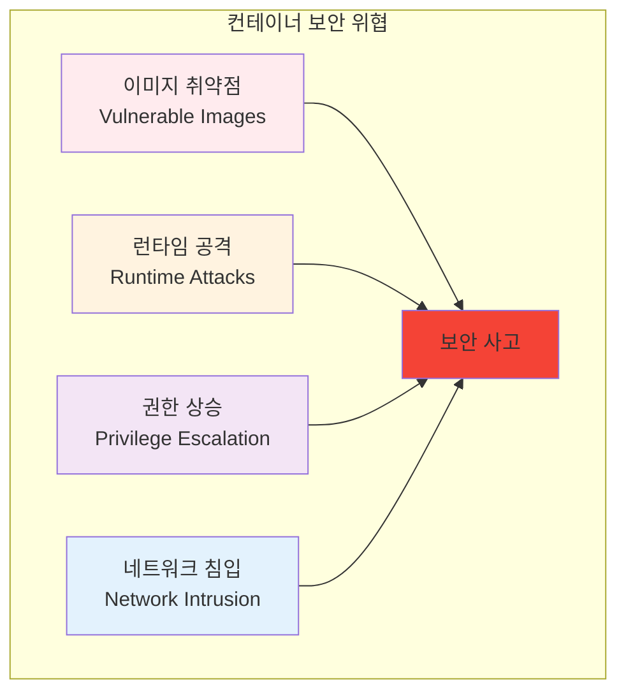
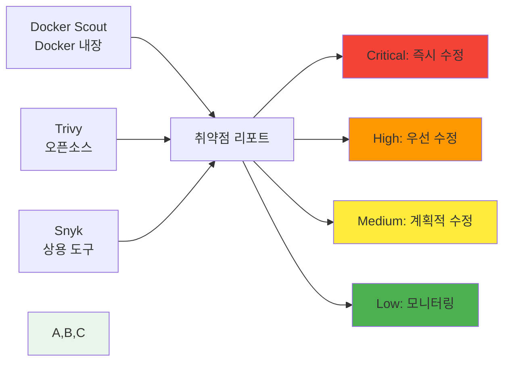
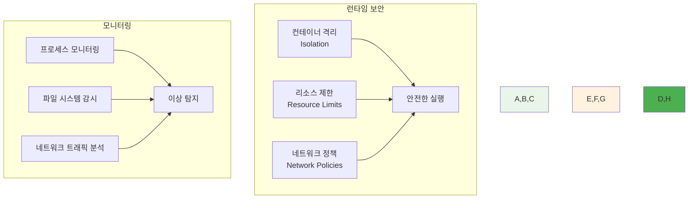
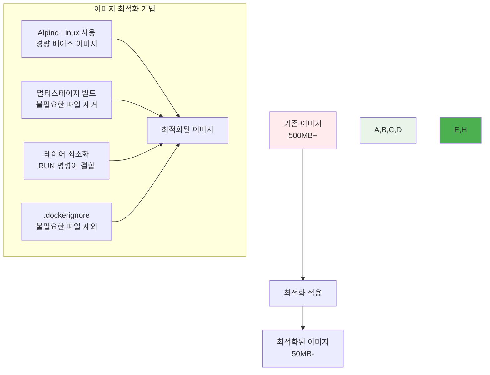
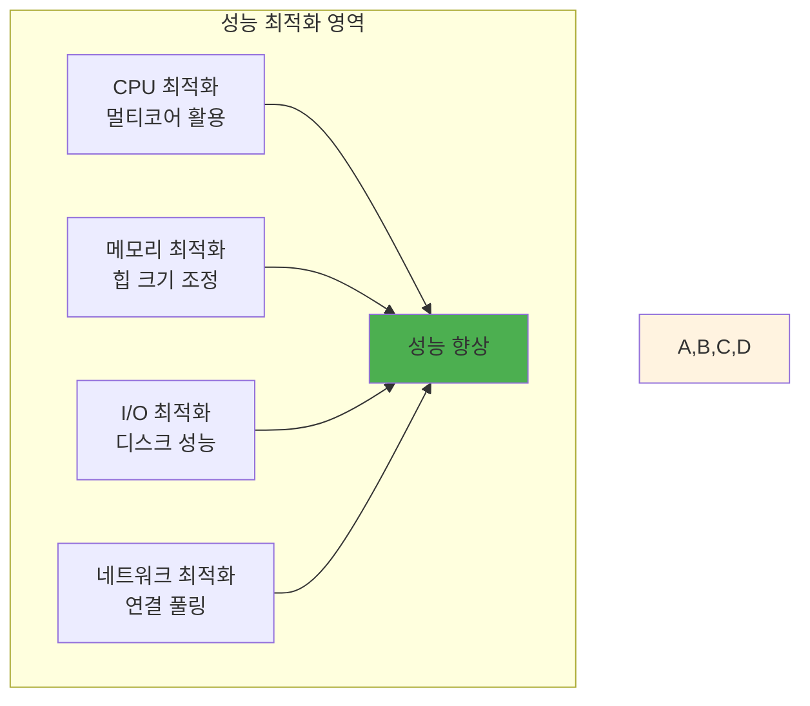
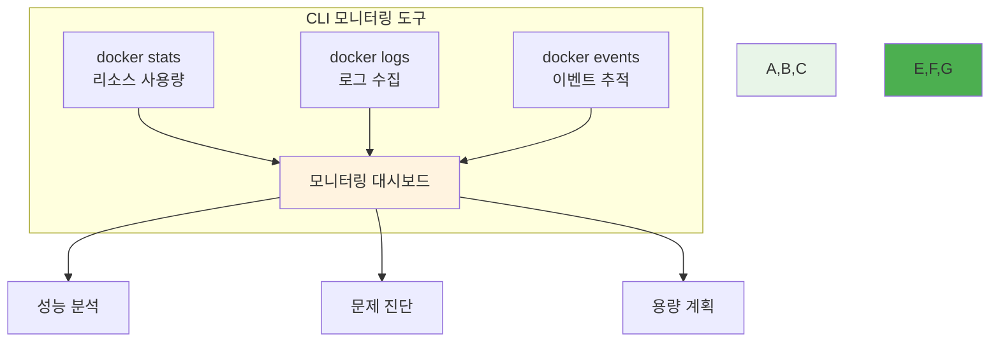
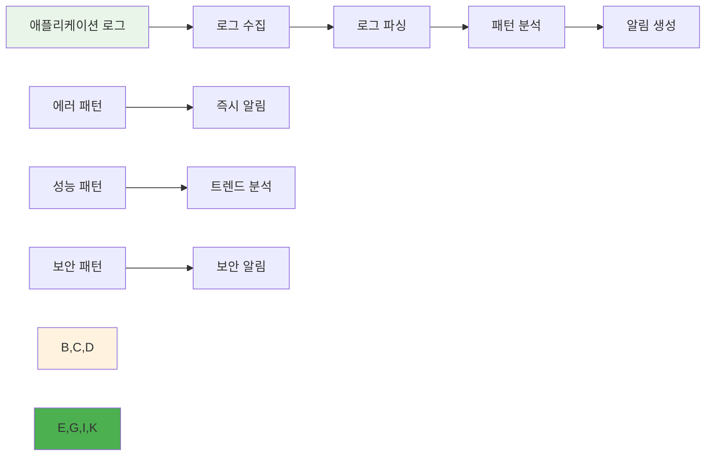
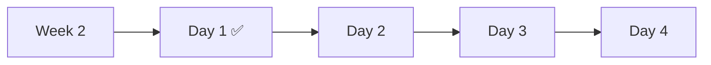

# Week 2 Day 1: 컨테이너 보안 & 최적화 & 모니터링

<div align="center">

**🔒 컨테이너 보안** • **⚡ 성능 최적화** • **📊 모니터링**

*Docker 심화 기술 통합 학습 - 실무 운영을 위한 핵심 역량*

</div>

---

## 🕘 일일 스케줄

### 📊 시간 배분
```
📚 이론 강의: 2.5시간 (31.25%) - 50분×3세션
🛠️ 실습 챌린지: 3시간 (37.5%) - 통합 실습
👥 학생 케어: 2.5시간 (31.25%) - 개별 지원 강화
```

### 🗓️ 상세 스케줄
| 시간 | 구분 | 내용 | 목적 |
|------|------|------|------|
| **09:00-09:50** | 📚 이론 1 | 컨테이너 보안 기초 (50분) | 보안 취약점 이해 |
| **09:50-10:00** | ☕ 휴식 | 10분 휴식 | |
| **10:00-10:50** | 📚 이론 2 | 이미지 최적화 & 성능 (50분) | 성능 튜닝 |
| **10:50-11:00** | ☕ 휴식 | 10분 휴식 | |
| **11:00-11:50** | 📚 이론 3 | CLI 모니터링 & 로깅 (50분) | 운영 관리 |
| **11:50-13:00** | 🍽️ 점심 | 점심시간 (70분) | |
| **13:00-16:00** | 🛠️ 챌린지 | 보안-최적화-모니터링 통합 (3시간) | 실무 적용 |
| **16:00-16:15** | ☕ 휴식 | 15분 휴식 | |
| **16:15-18:00** | 👥 케어 | 개별 멘토링 & 회고 (105분) | 맞춤 지원 |

---

## 📚 이론 강의 (2.5시간 - 50분×3세션)

### Session 1: 컨테이너 보안 기초와 취약점 분석 (50분)

#### 🎯 학습 목표
- **이해 목표**: 컨테이너 보안 위협과 취약점 유형 완전 이해
- **적용 목표**: 보안 스캔 도구를 활용한 취약점 발견 및 해결 능력
- **협업 목표**: 팀원들과 보안 정책 수립 및 대응 방안 토론

#### 🤔 왜 필요한가? (5분)
**현실 문제 상황**:
- 💼 **보안 사고 급증**: 2024년 컨테이너 관련 보안 사고 300% 증가
- 🏠 **일상 비유**: 집에 문을 열어두고 사는 것과 같은 위험
- 📊 **시장 동향**: DevSecOps 도입이 필수가 된 현대 개발 환경

#### 📖 핵심 개념 (35분)

**🔍 개념 1: 컨테이너 보안 위협 모델 (12분)**
> **정의**: 컨테이너 환경에서 발생할 수 있는 다양한 보안 위협과 공격 벡터

**주요 위협 유형**:


**OWASP Container Top 10**:
1. **Insecure Container Images**: 취약한 베이스 이미지 사용
2. **Inadequate Identity and Access Management**: 부적절한 접근 권한 관리
3. **Insecure Networking**: 안전하지 않은 네트워크 구성
4. **Insecure Data Storage**: 민감한 데이터의 부적절한 저장
5. **Inadequate Monitoring & Logging**: 불충분한 모니터링과 로깅

**🔍 개념 2: 이미지 보안 스캔 (12분)**
> **정의**: 컨테이너 이미지의 알려진 취약점을 자동으로 검사하는 도구와 방법

**보안 스캔 도구들**:


**스캔 결과 해석**:
- **Critical**: 즉시 수정 필요, 배포 중단
- **High**: 24시간 내 수정 계획
- **Medium**: 다음 릴리스에서 수정
- **Low**: 정기적 모니터링

**🔍 개념 3: 런타임 보안 (11분)**
> **정의**: 컨테이너 실행 중 발생하는 보안 위협을 탐지하고 대응하는 방법

**런타임 보안 요소**:


**보안 베스트 프랙티스**:
- **최소 권한 원칙**: 필요한 최소한의 권한만 부여
- **읽기 전용 파일시스템**: 가능한 경우 읽기 전용으로 설정
- **비root 사용자**: 컨테이너 내부에서 root 사용 금지
- **시크릿 관리**: 환경 변수 대신 전용 시크릿 관리 도구 사용

#### 💭 함께 생각해보기 (10분)

**🤝 페어 토론** (5분):
**토론 주제**:
1. **보안 경험**: "컨테이너나 애플리케이션에서 보안 문제를 겪어본 적이 있나요?"
2. **위험 평가**: "우리 프로젝트에서 가장 큰 보안 위험은 무엇일까요?"
3. **대응 방안**: "보안 취약점을 발견했을 때 어떻게 대응해야 할까요?"

**🎯 전체 공유** (5분):
- **보안 인식**: 컨테이너 보안의 중요성에 대한 이해 확인
- **실습 준비**: 오후 보안 스캔 실습에서 확인할 내용들

### Session 2: 이미지 최적화와 성능 튜닝 (50분)

#### 🎯 학습 목표
- **이해 목표**: 컨테이너 이미지 최적화 기법과 성능 튜닝 방법 이해
- **적용 목표**: 이미지 크기 최소화와 실행 성능 향상 기술 습득
- **협업 목표**: 팀원들과 최적화 전략 수립 및 성능 측정 방법 토론

#### 📖 핵심 개념 (35분)

**🔍 개념 1: 이미지 크기 최적화 (12분)**
> **정의**: 컨테이너 이미지의 크기를 최소화하여 배포 속도와 저장 효율성을 향상시키는 기법

**최적화 전략**:


**크기 비교 예시**:
| 베이스 이미지 | 크기 | 최적화 후 | 감소율 |
|---------------|------|-----------|--------|
| `ubuntu:20.04` | 72MB | `alpine:3.18` | 5MB (93% 감소) |
| `node:18` | 993MB | `node:18-alpine` | 174MB (82% 감소) |
| `python:3.9` | 885MB | `python:3.9-alpine` | 45MB (95% 감소) |

**🔍 개념 2: 런타임 성능 최적화 (12분)**
> **정의**: 컨테이너 실행 시 CPU, 메모리, I/O 성능을 최적화하는 방법

**성능 튜닝 영역**:


**리소스 제한 설정**:
```yaml
# docker-compose.yml
services:
  web:
    image: myapp:optimized
    deploy:
      resources:
        limits:
          cpus: '2.0'
          memory: 1G
        reservations:
          cpus: '0.5'
          memory: 512M
```

**🔍 개념 3: 빌드 최적화 (11분)**
> **정의**: Docker 이미지 빌드 과정을 최적화하여 빌드 시간을 단축하는 방법

**빌드 최적화 기법**:
```dockerfile
# 최적화된 Dockerfile 예시
FROM node:18-alpine AS builder

# 의존성 먼저 설치 (캐시 활용)
WORKDIR /app
COPY package*.json ./
RUN npm ci --only=production && npm cache clean --force

# 소스 코드 복사
COPY . .
RUN npm run build

# 프로덕션 스테이지
FROM nginx:alpine
COPY --from=builder /app/dist /usr/share/nginx/html
RUN rm -rf /var/cache/apk/*

# 보안 설정
RUN adduser -D -s /bin/sh nginx
USER nginx

EXPOSE 80
CMD ["nginx", "-g", "daemon off;"]
```

**빌드 캐시 전략**:
- **레이어 순서**: 자주 변경되지 않는 것부터 먼저
- **BuildKit 사용**: 병렬 빌드와 고급 캐싱
- **멀티스테이지**: 빌드 도구와 런타임 분리

#### 💭 함께 생각해보기 (15분)

**🤝 페어 토론** (10분):
**토론 주제**:
1. **최적화 경험**: "애플리케이션 성능을 개선해본 경험이 있나요?"
2. **트레이드오프**: "이미지 크기와 기능성 사이의 균형을 어떻게 맞출까요?"
3. **측정 방법**: "성능 개선 효과를 어떻게 측정하고 검증할까요?"

**🎯 전체 공유** (5분):
- **최적화 전략**: 효과적인 이미지 최적화 방안
- **성능 측정**: 성능 개선 효과 측정 방법

### Session 3: CLI 기반 모니터링과 로깅 (50분)

#### 🎯 학습 목표
- **이해 목표**: CLI 도구를 활용한 컨테이너 모니터링과 로그 분석 방법 이해
- **적용 목표**: 실시간 모니터링과 문제 진단 능력 습득
- **협업 목표**: 팀원들과 모니터링 전략 수립 및 장애 대응 방안 토론

#### 📖 핵심 개념 (35분)

**🔍 개념 1: Docker 모니터링 명령어 (12분)**
> **정의**: Docker CLI를 활용한 컨테이너 상태 모니터링과 리소스 사용량 추적

**핵심 모니터링 명령어**:
```bash
# 컨테이너 상태 확인
docker ps -a
docker stats --no-stream

# 리소스 사용량 실시간 모니터링
docker stats

# 컨테이너 상세 정보
docker inspect <container-name>

# 프로세스 확인
docker top <container-name>

# 포트 매핑 확인
docker port <container-name>
```

**모니터링 대시보드 구성**:


**🔍 개념 2: 로그 관리와 분석 (12분)**
> **정의**: 컨테이너 로그를 효과적으로 수집, 저장, 분석하는 방법

**로그 수집 전략**:
```bash
# 로그 확인
docker logs <container-name>
docker logs -f --tail 100 <container-name>

# 로그 드라이버 설정
docker run --log-driver=json-file --log-opt max-size=10m myapp

# 로그 로테이션
docker run --log-opt max-size=10m --log-opt max-file=3 myapp
```

**로그 분석 패턴**:


**🔍 개념 3: 시스템 모니터링 도구 (11분)**
> **정의**: 컨테이너 호스트 시스템의 전반적인 상태를 모니터링하는 도구들

**시스템 모니터링 도구**:
```bash
# 시스템 리소스 모니터링
htop
iotop
nethogs

# Docker 시스템 정보
docker system df
docker system events
docker system prune

# 네트워크 모니터링
docker network ls
docker network inspect bridge
```

**모니터링 스크립트 예시**:
```bash
#!/bin/bash
# container-monitor.sh

echo "=== Container Resource Usage ==="
docker stats --no-stream --format "table {{.Container}}\t{{.CPUPerc}}\t{{.MemUsage}}\t{{.NetIO}}"

echo -e "\n=== Disk Usage ==="
docker system df

echo -e "\n=== Container Health ==="
docker ps --format "table {{.Names}}\t{{.Status}}\t{{.Ports}}"

echo -e "\n=== Recent Events ==="
docker events --since 1h --until now
```

#### 💭 함께 생각해보기 (15분)

**🤝 페어 토론** (10분):
**토론 주제**:
1. **모니터링 경험**: "시스템이나 애플리케이션을 모니터링해본 경험이 있나요?"
2. **문제 진단**: "성능 문제나 장애가 발생했을 때 어떻게 원인을 찾나요?"
3. **알림 전략**: "어떤 상황에서 알림을 받고 싶으신가요?"

**🎯 전체 공유** (5분):
- **모니터링 전략**: 효과적인 컨테이너 모니터링 방안
- **문제 해결**: 일반적인 문제 상황과 해결 방법

---

## 🛠️ 실습 챌린지 (3시간)

### 🎯 챌린지 개요
**통합 실습 목표**:
- 보안 스캔부터 성능 최적화, 모니터링까지 완전 통합
- 실무와 동일한 보안-성능-운영 워크플로우 체험
- 팀 협업을 통한 종합적 문제 해결

### 📋 챌린지 준비 (15분)
**환경 설정**:
- 보안 스캔 도구 설치 (Trivy, Docker Scout)
- 모니터링 도구 준비
- 팀 구성 (3-4명씩)

### 🚀 Phase 1: 보안 취약점 스캔 및 수정 (90분)

#### 🔧 구현 단계
**Step 1: 취약한 이미지 분석**
```bash
# 의도적으로 취약한 이미지 생성
FROM ubuntu:18.04
RUN apt-get update && apt-get install -y \
    curl \
    wget \
    python2.7 \
    nodejs=8.10.0~dfsg-2ubuntu0.4

COPY app.py /app/
WORKDIR /app
EXPOSE 8080
CMD ["python2.7", "app.py"]
```

**Step 2: 보안 스캔 실행**
```bash
# Trivy로 이미지 스캔
trivy image vulnerable-app:latest

# Docker Scout 스캔
docker scout cves vulnerable-app:latest

# 취약점 리포트 분석
docker scout recommendations vulnerable-app:latest
```

**Step 3: 보안 취약점 수정**
```dockerfile
# 보안이 강화된 Dockerfile
FROM ubuntu:22.04
RUN apt-get update && apt-get install -y \
    curl \
    python3 \
    python3-pip \
    && rm -rf /var/lib/apt/lists/*

# 비root 사용자 생성
RUN useradd -m -u 1001 appuser
USER appuser

COPY --chown=appuser:appuser app.py /app/
WORKDIR /app
EXPOSE 8080
CMD ["python3", "app.py"]
```

#### ✅ Phase 1 체크포인트
- [ ] 취약점 스캔 도구 사용법 습득
- [ ] Critical/High 취약점 식별 및 분석
- [ ] 보안 강화된 이미지 빌드 성공
- [ ] 취약점 수정 전후 비교 분석

### 🌟 Phase 2: 이미지 최적화 실습 (90분)

#### 🔧 최적화 구현
**Step 1: 기본 이미지 크기 측정**
```bash
# 이미지 크기 확인
docker images --format "table {{.Repository}}\t{{.Tag}}\t{{.Size}}"

# 이미지 레이어 분석
docker history myapp:basic
```

**Step 2: 멀티스테이지 빌드 적용**
```dockerfile
# 최적화된 Node.js 애플리케이션
FROM node:18 AS builder
WORKDIR /app
COPY package*.json ./
RUN npm ci --only=production

COPY . .
RUN npm run build

# 프로덕션 스테이지
FROM node:18-alpine
WORKDIR /app
COPY --from=builder /app/dist ./dist
COPY --from=builder /app/node_modules ./node_modules
COPY package*.json ./

RUN addgroup -g 1001 -S nodejs && \
    adduser -S nextjs -u 1001
USER nextjs

EXPOSE 3000
CMD ["npm", "start"]
```

**Step 3: 성능 벤치마크**
```bash
# 빌드 시간 측정
time docker build -t myapp:optimized .

# 이미지 크기 비교
docker images | grep myapp

# 컨테이너 시작 시간 측정
time docker run -d --name test-container myapp:optimized
```

#### ✅ Phase 2 체크포인트
- [ ] 이미지 크기 50% 이상 감소 달성
- [ ] 빌드 시간 단축 확인
- [ ] 멀티스테이지 빌드 완전 이해
- [ ] 성능 벤치마크 결과 분석

### 🏆 Phase 3: 모니터링 대시보드 구축 (15분)

#### 🤝 팀별 모니터링 시스템 구축
**팀별 역할 분담**:
- **Team 1**: 리소스 모니터링 스크립트
- **Team 2**: 로그 분석 도구
- **Team 3**: 알림 시스템
- **Team 4**: 성능 대시보드

**통합 모니터링 구성**:
```bash
#!/bin/bash
# integrated-monitoring.sh

# 실시간 모니터링 대시보드
watch -n 5 '
echo "=== Container Stats ==="
docker stats --no-stream --format "table {{.Container}}\t{{.CPUPerc}}\t{{.MemUsage}}"

echo -e "\n=== Security Status ==="
trivy image --severity HIGH,CRITICAL myapp:latest | grep Total

echo -e "\n=== Performance Metrics ==="
docker inspect myapp --format="{{.State.Status}} {{.State.StartedAt}}"
'
```

### 🎤 결과 발표 및 공유 (30분)
**팀별 발표** (7분×4팀):
- 발견한 보안 취약점과 해결 방법
- 이미지 최적화 결과와 성능 개선 효과
- 구축한 모니터링 시스템과 특징
- 통합 워크플로우에서 배운 점

---

## 👥 학생 케어 (105분)

### 🟢 초급자 케어 (집중 지원) - 45분
**개별 멘토링**:
- 보안 개념과 스캔 도구 사용법 완전 이해
- 이미지 최적화 기법 단계별 설명
- CLI 모니터링 명령어 반복 연습
- 실습 결과물 완성도 점검

### 🟡 중급자 케어 (리더십 개발) - 45분
**그룹 멘토링**:
- 보안 정책 수립과 자동화 방안
- 성능 튜닝 고급 기법 토론
- 모니터링 전략과 알림 체계 설계
- 초급자 지원 경험 공유

### 🔴 고급자 케어 (전문성 강화) - 15분
**심화 토론**:
- 엔터프라이즈 보안 아키텍처
- 대규모 시스템 모니터링 전략
- DevSecOps 파이프라인 구축
- 오픈소스 보안 도구 기여 방안

---

## 📝 일일 마무리

### ✅ 오늘의 성과
- [ ] 컨테이너 보안 위협 이해 및 대응 방법 습득
- [ ] 이미지 최적화를 통한 성능 향상 달성
- [ ] CLI 기반 모니터링 시스템 구축 완료
- [ ] 보안-성능-운영 통합 워크플로우 체험

### 🎯 내일 준비사항
- **예습**: 컨테이너 오케스트레이션 개념 기초
- **복습**: 오늘 학습한 보안 도구와 최적화 기법 정리
- **환경**: Docker Swarm 실습을 위한 환경 준비

### 📊 학습 진도 체크


---

<div align="center">

**🔒 보안 전문가** • **⚡ 성능 최적화 마스터** • **📊 모니터링 전문가**

*Docker 심화 기술을 통합적으로 활용할 수 있게 되었습니다*

</div>