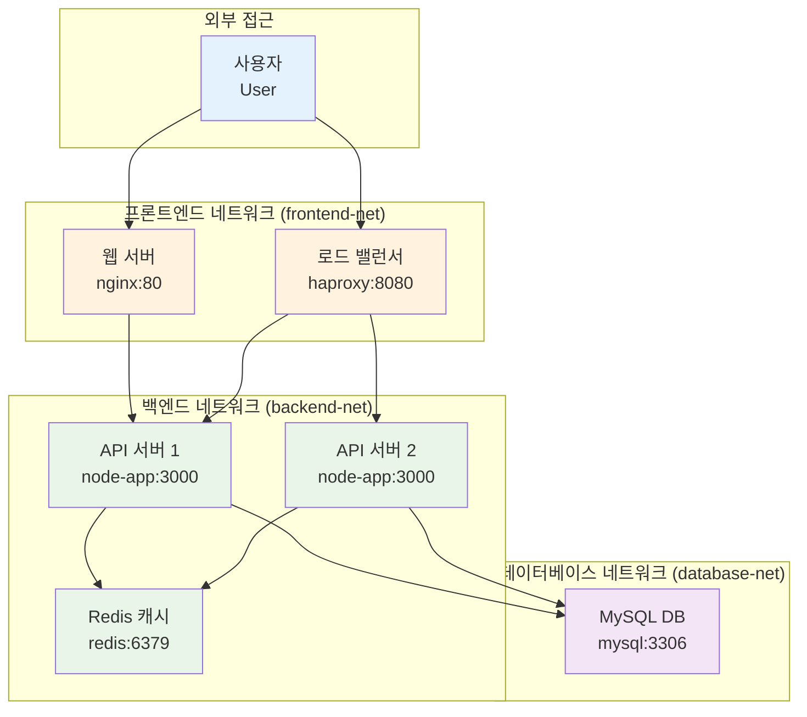

# Week 2 Day 1 Lab 1: 멀티 컨테이너 네트워크 구성

<div align="center">

**🏗️ 3-tier 아키텍처** • **🌐 커스텀 네트워크** • **🔗 서비스 연결**

*커스텀 네트워크를 활용한 멀티 컨테이너 시스템 구축*

</div>

---

## 🕘 실습 정보

**시간**: 12:00-12:50 (50분)  
**목표**: 커스텀 네트워크를 활용한 멀티 컨테이너 시스템 구축  
**방식**: 단계별 가이드 + 페어 프로그래밍 + 결과 검증

---

## 🎯 실습 목표

### 📚 당일 이론 적용
- Session 1-3에서 배운 네트워킹 개념을 실제 구현
- Bridge, Custom 네트워크를 활용한 실무 시나리오 구현
- 컨테이너 간 통신과 서비스 디스커버리 체험

### 🏗️ 구축할 시스템 아키텍처


---

## 📋 실습 준비 (5분)

### 환경 설정
```bash
# 작업 디렉토리 생성
mkdir -p ~/docker-network-lab
cd ~/docker-network-lab

# 기존 컨테이너 정리 (필요시)
docker container prune -f
docker network prune -f
```

### 페어 구성 (필요시)
- 👥 **페어 프로그래밍**: 2명씩 짝을 이루어 진행
- 🔄 **역할 분담**: Driver(실행자) / Navigator(가이드) 역할 교대
- 📝 **공동 작업**: 하나의 화면에서 함께 작업

---

## 🔧 실습 단계 (40분)

### Step 1: 네트워크 인프라 구축 (10분)

**🚀 자동화 스크립트 사용**
```bash
# 네트워크 인프라 자동 구축
./lab_scripts/lab1/setup_networks.sh
```

**📋 스크립트 내용**: [setup_networks.sh](./lab_scripts/lab1/setup_networks.sh)

**1-1. 수동 실행 (학습용)**
```bash
# 프론트엔드 네트워크 (외부 접근 가능)
docker network create --driver bridge \
  --subnet=172.20.1.0/24 \
  --gateway=172.20.1.1 \
  frontend-net

# 백엔드 네트워크 (내부 통신용)
docker network create --driver bridge \
  --subnet=172.20.2.0/24 \
  --gateway=172.20.2.1 \
  backend-net

# 데이터베이스 네트워크 (격리된 네트워크)
docker network create --driver bridge \
  --subnet=172.20.3.0/24 \
  --gateway=172.20.3.1 \
  --internal \
  database-net
```

**1-2. 네트워크 구성 검증**
```bash
# 각 네트워크의 상세 정보 확인
echo "=== Frontend Network ==="
docker network inspect frontend-net | grep -A 5 "IPAM"

echo "=== Backend Network ==="
docker network inspect backend-net | grep -A 5 "IPAM"

echo "=== Database Network ==="
docker network inspect database-net | grep -A 5 "IPAM"
```

### Step 2: 데이터베이스 계층 구축 (10분)

**🚀 자동화 스크립트 사용**
```bash
# 데이터베이스 자동 배포
./lab_scripts/lab1/deploy_database.sh
```

**📋 스크립트 내용**: [deploy_database.sh](./lab_scripts/lab1/deploy_database.sh)

**2-1. 수동 실행 (학습용)**
```bash
# MySQL 컨테이너 실행
docker run -d \
  --name mysql-db \
  --network database-net \
  --ip 172.20.3.10 \
  -e MYSQL_ROOT_PASSWORD=secretpassword \
  -e MYSQL_DATABASE=webapp \
  -e MYSQL_USER=appuser \
  -e MYSQL_PASSWORD=apppass \
  mysql:8.0

# 데이터베이스 연결 테스트
sleep 30
docker exec mysql-db mysql -u root -psecretpassword -e "SHOW DATABASES;"
```

### Step 3: 백엔드 서비스 구축 (10분)

**🚀 자동화 스크립트 사용**
```bash
# 백엔드 서비스 자동 배포
./lab_scripts/lab1/deploy_backend.sh
```

**📋 스크립트 내용**: [deploy_backend.sh](./lab_scripts/lab1/deploy_backend.sh)

**3-1. Redis 캐시 서버 배포**
```bash
# Redis 컨테이너 실행
docker run -d \
  --name redis-cache \
  --network backend-net \
  --ip 172.20.2.10 \
  redis:7-alpine

# Redis 연결 테스트
docker exec redis-cache redis-cli ping
docker exec redis-cache redis-cli set test-key "Hello Redis"
docker exec redis-cache redis-cli get test-key
```

**3-2. Node.js API 서버 배포**
```bash
# 간단한 API 서버 Dockerfile 생성
cat > Dockerfile << 'EOF'
FROM node:18-alpine
WORKDIR /app
COPY package*.json ./
RUN npm install
COPY . .
EXPOSE 3000
CMD ["node", "server.js"]
EOF

# package.json 생성
cat > package.json << 'EOF'
{
  "name": "api-server",
  "version": "1.0.0",
  "dependencies": {
    "express": "^4.18.0",
    "mysql2": "^3.6.0",
    "redis": "^4.6.0"
  }
}
EOF

# API 서버 코드 생성
cat > server.js << 'EOF'
const express = require('express');
const mysql = require('mysql2/promise');
const redis = require('redis');

const app = express();
const port = 3000;

// Redis 클라이언트 설정
const redisClient = redis.createClient({
  host: 'redis-cache',
  port: 6379
});

// MySQL 연결 설정
const dbConfig = {
  host: 'mysql-db',
  user: 'appuser',
  password: 'apppass',
  database: 'webapp'
};

app.get('/health', (req, res) => {
  res.json({ status: 'healthy', timestamp: new Date().toISOString() });
});

app.get('/users', async (req, res) => {
  try {
    const connection = await mysql.createConnection(dbConfig);
    const [rows] = await connection.execute('SELECT * FROM users');
    await connection.end();
    
    res.json({ users: rows, source: 'database' });
  } catch (error) {
    res.status(500).json({ error: error.message });
  }
});

app.listen(port, '0.0.0.0', () => {
  console.log(`API server running on port ${port}`);
});
EOF

# API 서버 이미지 빌드
docker build -t api-server:latest .

# API 서버 인스턴스 2개 실행
docker run -d \
  --name api-server-1 \
  --network backend-net \
  --ip 172.20.2.20 \
  api-server:latest

docker run -d \
  --name api-server-2 \
  --network backend-net \
  --ip 172.20.2.21 \
  api-server:latest

# API 서버들을 데이터베이스 네트워크에도 연결
docker network connect database-net api-server-1
docker network connect database-net api-server-2
```

### Step 4: 프론트엔드 및 로드 밸런서 구축 (10분)

**🚀 자동화 스크립트 사용**
```bash
# 프론트엔드 및 로드 밸런서 자동 배포
./lab_scripts/lab1/deploy_frontend.sh
```

**📋 스크립트 내용**: [deploy_frontend.sh](./lab_scripts/lab1/deploy_frontend.sh)

**4-1. HAProxy 로드 밸런서 설정**
```bash
# HAProxy 설정 파일 생성
cat > haproxy.cfg << 'EOF'
global
    daemon

defaults
    mode http
    timeout connect 5000ms
    timeout client 50000ms
    timeout server 50000ms

frontend api_frontend
    bind *:8080
    default_backend api_servers

backend api_servers
    balance roundrobin
    server api1 api-server-1:3000 check
    server api2 api-server-2:3000 check

listen stats
    bind *:8404
    stats enable
    stats uri /stats
    stats refresh 30s
EOF

# HAProxy 컨테이너 실행
docker run -d \
  --name load-balancer \
  --network frontend-net \
  --ip 172.20.1.10 \
  -p 8080:8080 \
  -p 8404:8404 \
  -v $(pwd)/haproxy.cfg:/usr/local/etc/haproxy/haproxy.cfg \
  haproxy:2.8

# 로드 밸런서를 백엔드 네트워크에도 연결
docker network connect backend-net load-balancer
```

**4-2. Nginx 웹 서버 배포**
```bash
# Nginx 설정 파일 생성
cat > nginx.conf << 'EOF'
server {
    listen 80;
    server_name localhost;

    location / {
        root /usr/share/nginx/html;
        index index.html;
    }

    location /api/ {
        proxy_pass http://load-balancer:8080/;
        proxy_set_header Host $host;
        proxy_set_header X-Real-IP $remote_addr;
    }
}
EOF

# 간단한 웹 페이지 생성
cat > index.html << 'EOF'
<!DOCTYPE html>
<html>
<head>
    <title>Multi-Container Network Demo</title>
    <style>
        body { font-family: Arial, sans-serif; margin: 40px; }
        .container { max-width: 800px; margin: 0 auto; }
        button { padding: 10px 20px; margin: 10px; }
        #result { background: #f5f5f5; padding: 20px; margin: 20px 0; }
    </style>
</head>
<body>
    <div class="container">
        <h1>Multi-Container Network Demo</h1>
        <p>이 페이지는 여러 네트워크에 분산된 컨테이너들이 협력하여 서비스를 제공합니다.</p>
        
        <button onclick="testAPI()">API 테스트</button>
        <button onclick="loadUsers()">사용자 목록 조회</button>
        
        <div id="result"></div>
    </div>

    <script>
        async function testAPI() {
            try {
                const response = await fetch('/api/health');
                const data = await response.json();
                document.getElementById('result').innerHTML = 
                    '<h3>API 상태</h3><pre>' + JSON.stringify(data, null, 2) + '</pre>';
            } catch (error) {
                document.getElementById('result').innerHTML = 
                    '<h3>오류</h3><p>' + error.message + '</p>';
            }
        }

        async function loadUsers() {
            try {
                const response = await fetch('/api/users');
                const data = await response.json();
                document.getElementById('result').innerHTML = 
                    '<h3>사용자 목록</h3><pre>' + JSON.stringify(data, null, 2) + '</pre>';
            } catch (error) {
                document.getElementById('result').innerHTML = 
                    '<h3>오류</h3><p>' + error.message + '</p>';
            }
        }
    </script>
</body>
</html>
EOF

# Nginx 컨테이너 실행
docker run -d \
  --name web-server \
  --network frontend-net \
  --ip 172.20.1.20 \
  -p 80:80 \
  -v $(pwd)/nginx.conf:/etc/nginx/conf.d/default.conf \
  -v $(pwd)/index.html:/usr/share/nginx/html/index.html \
  nginx:alpine

# 웹 서버를 백엔드 네트워크에도 연결
docker network connect backend-net web-server
```

---

## ✅ 실습 체크포인트

### 기본 기능 구현 완료
- [ ] **네트워크 생성**: 3개의 커스텀 네트워크 생성 완료
- [ ] **데이터베이스**: MySQL 컨테이너 정상 동작 및 데이터 생성
- [ ] **백엔드 서비스**: API 서버 2개 인스턴스 + Redis 캐시 동작
- [ ] **프론트엔드**: 웹 서버 + 로드 밸런서 구성 완료

### 설정 및 구성 확인
- [ ] **네트워크 분리**: 각 계층이 적절한 네트워크에 배치
- [ ] **서비스 디스커버리**: 컨테이너 이름으로 통신 가능
- [ ] **로드 밸런싱**: HAProxy를 통한 API 서버 부하 분산
- [ ] **외부 접근**: 웹 브라우저에서 애플리케이션 접근 가능

### 동작 테스트 성공

**🚀 자동화 테스트 스크립트 사용**
```bash
# 전체 시스템 종합 테스트
./lab_scripts/lab1/test_system.sh
```

**📋 스크립트 내용**: [test_system.sh](./lab_scripts/lab1/test_system.sh)

**수동 테스트 (핵심만)**
```bash
# 컨테이너 상태 확인
docker ps

# 웹 애플리케이션 테스트
curl -s http://localhost/api/health
curl -s http://localhost/api/users
```

---

## 🔄 실습 마무리 (5분)

### 결과 공유
- **시연**: 완성된 멀티 컨테이너 시스템 데모
- **아키텍처 설명**: 각 네트워크와 컨테이너의 역할 설명
- **통신 흐름**: 사용자 요청이 어떻게 처리되는지 추적

### 질문 해결
- **어려웠던 부분**: 구현 과정에서 어려웠던 점 공유
- **문제 해결**: 발생한 오류와 해결 방법 토론
- **개선 아이디어**: 더 나은 구성 방법에 대한 아이디어

### 다음 연결
- **Lab 2 준비**: 보안 강화된 네트워크 환경 구축 준비
- **보안 요소**: 현재 구성에서 보안상 취약한 부분 식별

---

## 🎯 추가 도전 과제 (시간 여유시)

### 고급 기능 구현
```bash
# 1. 컨테이너 헬스 체크 추가
docker run -d \
  --name api-server-3 \
  --network backend-net \
  --health-cmd="curl -f http://localhost:3000/health || exit 1" \
  --health-interval=30s \
  --health-timeout=10s \
  --health-retries=3 \
  api-server:latest

# 2. 네트워크 트래픽 모니터링
docker run -d \
  --name network-monitor \
  --network backend-net \
  --cap-add NET_ADMIN \
  nicolaka/netshoot tcpdump -i eth0

# 3. 로그 수집 시스템
docker run -d \
  --name log-collector \
  --network backend-net \
  -v /var/lib/docker/containers:/var/lib/docker/containers:ro \
  fluent/fluent-bit
```

---

<div align="center">

**🏗️ 멀티 컨테이너 네트워크 시스템 구축 완료!**

**다음**: [Lab 2 - 보안 강화된 네트워크 환경 구축](./lab_2.md)

</div>