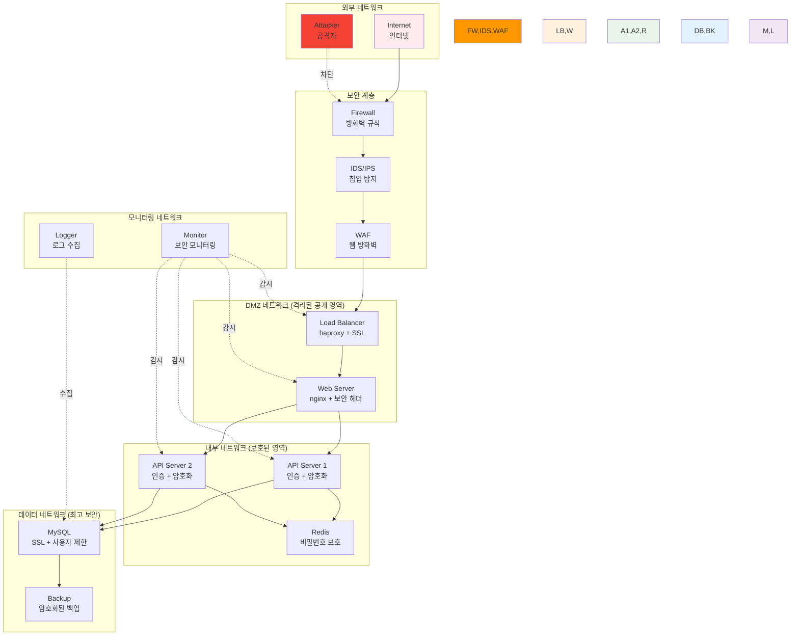

# Week 2 Day 1 Lab 2: 보안 강화된 네트워크 환경 구축

<div align="center">

**🛡️ 네트워크 보안** • **🚪 접근 제어** • **📊 보안 모니터링**

*방화벽과 보안 정책이 적용된 프로덕션급 네트워크 구성*

</div>

---

## 🕘 실습 정보

**시간**: 14:00-14:50 (50분)  
**목표**: 방화벽과 보안 정책이 적용된 프로덕션급 네트워크 구성  
**방식**: 보안 강화 + 모니터링 구현 + 침입 테스트

---

## 🎯 심화 목표

### 🛡️ 고급 기능 구현
- Lab 1에서 구축한 시스템에 보안 계층 추가
- 실무 환경에서 사용하는 보안 정책 적용
- 보안 모니터링과 자동 대응 시스템 구축
- 침입 테스트를 통한 보안 검증

### 🏗️ 보안 강화 아키텍처


---

## 📋 실습 준비 (5분)

### 환경 설정
```bash
# Lab 1에서 구축한 환경 확인
cd ~/docker-network-lab
docker ps --format "table {{.Names}}\t{{.Status}}\t{{.Ports}}"

# 보안 설정을 위한 추가 디렉토리 생성
mkdir -p security/{ssl,configs,scripts,logs}
cd security
```

### 보안 요구사항 정의
- **네트워크 분리**: DMZ, 내부, 데이터 네트워크 완전 격리
- **접근 제어**: 최소 권한 원칙 적용
- **암호화**: 모든 통신 SSL/TLS 적용
- **모니터링**: 실시간 보안 이벤트 감시
- **자동 대응**: 의심스러운 활동 자동 차단

---

## 🔧 심화 구현 (40분)

### Step 1: SSL/TLS 인증서 생성 및 적용 (10분)

**🚀 자동화 스크립트 사용**
```bash
# SSL 인증서 자동 생성
./lab_scripts/lab2/generate_ssl.sh
```

**📋 스크립트 내용**: [generate_ssl.sh](./lab_scripts/lab2/generate_ssl.sh)

**1-1. 수동 실행 (학습용)**
```bash
# SSL 인증서 생성 스크립트
cat > generate_ssl.sh << 'EOF'
#!/bin/bash

# CA 개인키 생성
openssl genrsa -out ca-key.pem 4096

# CA 인증서 생성
openssl req -new -x509 -days 365 -key ca-key.pem -sha256 -out ca.pem -subj "/C=KR/ST=Seoul/L=Seoul/O=DevOps Lab/OU=Security/CN=Lab CA"

# 서버 개인키 생성
openssl genrsa -out server-key.pem 4096

# 서버 인증서 요청 생성
openssl req -subj "/C=KR/ST=Seoul/L=Seoul/O=DevOps Lab/OU=Security/CN=localhost" -sha256 -new -key server-key.pem -out server.csr

# 서버 인증서 생성
echo subjectAltName = DNS:localhost,IP:127.0.0.1,IP:172.20.1.10 >> extfile.cnf
echo extendedKeyUsage = serverAuth >> extfile.cnf
openssl x509 -req -days 365 -sha256 -in server.csr -CA ca.pem -CAkey ca-key.pem -out server-cert.pem -extfile extfile.cnf -CAcreateserial

# 클라이언트 개인키 생성
openssl genrsa -out client-key.pem 4096

# 클라이언트 인증서 요청 생성
openssl req -subj '/C=KR/ST=Seoul/L=Seoul/O=DevOps Lab/OU=Security/CN=client' -new -key client-key.pem -out client.csr

# 클라이언트 인증서 생성
echo extendedKeyUsage = clientAuth > extfile-client.cnf
openssl x509 -req -days 365 -sha256 -in client.csr -CA ca.pem -CAkey ca-key.pem -out client-cert.pem -extfile extfile-client.cnf -CAcreateserial

# 권한 설정
chmod 400 ca-key.pem server-key.pem client-key.pem
chmod 444 ca.pem server-cert.pem client-cert.pem

echo "SSL 인증서 생성 완료!"
ls -la *.pem
EOF

chmod +x generate_ssl.sh
./generate_ssl.sh
```

**1-2. HTTPS 지원 로드 밸런서 구성**
```bash
# SSL 지원 HAProxy 설정
cat > configs/haproxy-ssl.cfg << 'EOF'
global
    daemon
    ssl-default-bind-ciphers ECDHE-ECDSA-AES256-GCM-SHA384:ECDHE-RSA-AES256-GCM-SHA384
    ssl-default-bind-options ssl-min-ver TLSv1.2 no-tls-tickets

defaults
    mode http
    timeout connect 5000ms
    timeout client 50000ms
    timeout server 50000ms
    option httplog
    option dontlognull
    option log-health-checks

frontend https_frontend
    bind *:443 ssl crt /etc/ssl/server.pem
    bind *:80
    redirect scheme https if !{ ssl_fc }
    
    # 보안 헤더 추가
    http-response set-header Strict-Transport-Security "max-age=31536000; includeSubDomains"
    http-response set-header X-Frame-Options "DENY"
    http-response set-header X-Content-Type-Options "nosniff"
    http-response set-header X-XSS-Protection "1; mode=block"
    
    # Rate limiting
    stick-table type ip size 100k expire 30s store http_req_rate(10s)
    http-request track-sc0 src
    http-request reject if { sc_http_req_rate(0) gt 20 }
    
    default_backend api_servers

backend api_servers
    balance roundrobin
    option httpchk GET /health
    http-check expect status 200
    server api1 api-server-1:3000 check inter 5s fall 3 rise 2
    server api2 api-server-2:3000 check inter 5s fall 3 rise 2

listen stats
    bind *:8404
    stats enable
    stats uri /stats
    stats refresh 30s
    stats admin if TRUE
EOF

# SSL 인증서를 하나의 파일로 결합
cat server-cert.pem server-key.pem > ssl/server.pem

# 기존 로드 밸런서 중지 및 새로운 보안 로드 밸런서 시작
docker stop load-balancer
docker rm load-balancer

docker run -d \
  --name secure-load-balancer \
  --network frontend-net \
  --ip 172.20.1.10 \
  -p 80:80 \
  -p 443:443 \
  -p 8404:8404 \
  -v $(pwd)/configs/haproxy-ssl.cfg:/usr/local/etc/haproxy/haproxy.cfg \
  -v $(pwd)/ssl/server.pem:/etc/ssl/server.pem \
  haproxy:2.8

docker network connect backend-net secure-load-balancer
```

### Step 2: 방화벽 규칙 및 접근 제어 구현 (15분)

**🚀 자동화 스크립트 사용**
```bash
# 방화벽 규칙 자동 설정 (sudo 권한 필요)
sudo ./lab_scripts/lab2/setup_firewall.sh
```

**📋 스크립트 내용**: [setup_firewall.sh](./lab_scripts/lab2/setup_firewall.sh)

**2-1. 수동 실행 (학습용)**
```bash
# 방화벽 규칙 스크립트 생성
cat > scripts/setup_firewall.sh << 'EOF'
#!/bin/bash

echo "Docker 방화벽 규칙 설정 중..."

# 기본 정책: 모든 접근 차단
iptables -P FORWARD DROP

# Docker 사용자 정의 체인 생성 (없는 경우)
iptables -N DOCKER-USER 2>/dev/null || true

# 기존 DOCKER-USER 규칙 초기화
iptables -F DOCKER-USER

# 1. 로컬호스트 통신 허용
iptables -A DOCKER-USER -i lo -j ACCEPT

# 2. 기존 연결 유지
iptables -A DOCKER-USER -m conntrack --ctstate RELATED,ESTABLISHED -j ACCEPT

# 3. DMZ 네트워크 (frontend-net) 규칙
# - 외부에서 웹 서버(80, 443)와 로드 밸런서 접근 허용
iptables -A DOCKER-USER -p tcp --dport 80 -j ACCEPT
iptables -A DOCKER-USER -p tcp --dport 443 -j ACCEPT
iptables -A DOCKER-USER -p tcp --dport 8404 -s 172.20.1.0/24 -j ACCEPT

# 4. 백엔드 네트워크 (backend-net) 보호
# - DMZ에서만 백엔드 접근 허용
iptables -A DOCKER-USER -s 172.20.1.0/24 -d 172.20.2.0/24 -p tcp --dport 3000 -j ACCEPT
iptables -A DOCKER-USER -s 172.20.1.0/24 -d 172.20.2.0/24 -p tcp --dport 6379 -j ACCEPT

# 5. 데이터베이스 네트워크 (database-net) 최고 보안
# - 백엔드에서만 데이터베이스 접근 허용
iptables -A DOCKER-USER -s 172.20.2.0/24 -d 172.20.3.0/24 -p tcp --dport 3306 -j ACCEPT

# 6. 공격 패턴 차단
# - 포트 스캔 차단
iptables -A DOCKER-USER -p tcp --tcp-flags ALL NONE -j DROP
iptables -A DOCKER-USER -p tcp --tcp-flags SYN,FIN SYN,FIN -j DROP
iptables -A DOCKER-USER -p tcp --tcp-flags SYN,RST SYN,RST -j DROP

# - SYN Flood 공격 방지
iptables -A DOCKER-USER -p tcp --syn -m limit --limit 1/s --limit-burst 3 -j ACCEPT
iptables -A DOCKER-USER -p tcp --syn -j DROP

# - 과도한 연결 시도 차단
iptables -A DOCKER-USER -p tcp --dport 22 -m connlimit --connlimit-above 3 -j DROP
iptables -A DOCKER-USER -p tcp --dport 3306 -m connlimit --connlimit-above 10 -j DROP

# 7. 로깅 (의심스러운 활동)
iptables -A DOCKER-USER -m limit --limit 5/min -j LOG --log-prefix "DOCKER-FIREWALL: "

# 8. 기본 거부
iptables -A DOCKER-USER -j DROP

# 규칙 확인
echo "현재 방화벽 규칙:"
iptables -L DOCKER-USER -n -v

echo "방화벽 설정 완료!"
EOF

chmod +x scripts/setup_firewall.sh
sudo ./scripts/setup_firewall.sh
```

**2-2. 보안 강화된 서비스 배포**

**🚀 자동화 스크립트 사용**
```bash
# 보안 강화된 서비스 자동 배포
./lab_scripts/lab2/deploy_secure_services.sh
```

**📋 스크립트 내용**: [deploy_secure_services.sh](./lab_scripts/lab2/deploy_secure_services.sh)

**수동 실행 (학습용)**
```bash
# 보안 강화된 MySQL 컨테이너 재배포
docker stop mysql-db
docker rm mysql-db

docker run -d \
  --name secure-mysql-db \
  --network database-net \
  --ip 172.20.3.10 \
  --user 999:999 \
  --read-only \
  --tmpfs /tmp \
  --tmpfs /var/run/mysqld \
  -v mysql-data:/var/lib/mysql \
  -v $(pwd)/configs/mysql-secure.cnf:/etc/mysql/conf.d/security.cnf \
  -e MYSQL_ROOT_PASSWORD=VerySecurePassword123! \
  -e MYSQL_DATABASE=webapp \
  -e MYSQL_USER=appuser \
  -e MYSQL_PASSWORD=SecureAppPass456! \
  --cap-drop ALL \
  --cap-add CHOWN \
  --cap-add DAC_OVERRIDE \
  --cap-add SETGID \
  --cap-add SETUID \
  mysql:8.0

# MySQL 보안 설정 파일
cat > configs/mysql-secure.cnf << 'EOF'
[mysqld]
# 보안 설정
bind-address = 0.0.0.0
skip-name-resolve
ssl-ca = /etc/mysql/ssl/ca.pem
ssl-cert = /etc/mysql/ssl/server-cert.pem
ssl-key = /etc/mysql/ssl/server-key.pem
require_secure_transport = ON

# 성능 및 보안
max_connections = 50
max_user_connections = 10
connect_timeout = 10
wait_timeout = 600
interactive_timeout = 600

# 로깅
general_log = ON
general_log_file = /var/log/mysql/general.log
slow_query_log = ON
slow_query_log_file = /var/log/mysql/slow.log
long_query_time = 2
EOF

# Redis 보안 강화
docker stop redis-cache
docker rm redis-cache

docker run -d \
  --name secure-redis-cache \
  --network backend-net \
  --ip 172.20.2.10 \
  --user 999:999 \
  --read-only \
  --tmpfs /tmp \
  -v $(pwd)/configs/redis-secure.conf:/usr/local/etc/redis/redis.conf \
  --cap-drop ALL \
  redis:7-alpine redis-server /usr/local/etc/redis/redis.conf

# Redis 보안 설정
cat > configs/redis-secure.conf << 'EOF'
# 네트워크 보안
bind 0.0.0.0
protected-mode yes
port 6379
requirepass SecureRedisPass789!

# 보안 설정
rename-command FLUSHDB ""
rename-command FLUSHALL ""
rename-command KEYS ""
rename-command CONFIG "CONFIG_b835c3f8a5d2e7f1"

# 성능 제한
maxclients 100
timeout 300
tcp-keepalive 300

# 로깅
loglevel notice
logfile /var/log/redis/redis.log
EOF
```

### Step 3: 보안 모니터링 시스템 구축 (10분)

**🚀 자동화 스크립트 사용**
```bash
# 보안 모니터링 시스템 자동 구축
./lab_scripts/lab2/setup_monitoring.sh
```

**📋 스크립트 내용**: [setup_monitoring.sh](./lab_scripts/lab2/setup_monitoring.sh)

**3-1. 수동 실행 (학습용)**
```bash
# 보안 모니터링 네트워크 생성
docker network create --driver bridge \
  --subnet=172.20.4.0/24 \
  --gateway=172.20.4.1 \
  monitoring-net

# Fail2ban 기반 침입 탐지 시스템
cat > configs/fail2ban.conf << 'EOF'
[DEFAULT]
bantime = 3600
findtime = 600
maxretry = 3
backend = auto

[nginx-http-auth]
enabled = true
port = http,https
filter = nginx-http-auth
logpath = /var/log/nginx/error.log
maxretry = 3

[nginx-limit-req]
enabled = true
port = http,https
filter = nginx-limit-req
logpath = /var/log/nginx/error.log
maxretry = 10

[mysql-auth]
enabled = true
port = 3306
filter = mysql-auth
logpath = /var/log/mysql/error.log
maxretry = 3
EOF

# 보안 모니터링 컨테이너
docker run -d \
  --name security-monitor \
  --network monitoring-net \
  --ip 172.20.4.10 \
  --privileged \
  -v /var/log:/var/log:ro \
  -v $(pwd)/configs/fail2ban.conf:/etc/fail2ban/jail.local \
  -v $(pwd)/scripts:/scripts \
  crazymax/fail2ban:latest

# 네트워크 트래픽 분석기
docker run -d \
  --name network-analyzer \
  --network monitoring-net \
  --ip 172.20.4.20 \
  --cap-add NET_ADMIN \
  --cap-add NET_RAW \
  -v $(pwd)/logs:/logs \
  nicolaka/netshoot tcpdump -i any -w /logs/network-traffic.pcap

# 로그 수집 및 분석 시스템
cat > configs/fluent-bit.conf << 'EOF'
[SERVICE]
    Flush         1
    Log_Level     info
    Daemon        off
    Parsers_File  parsers.conf

[INPUT]
    Name              tail
    Path              /var/log/nginx/*.log
    Parser            nginx
    Tag               nginx.*
    Refresh_Interval  5

[INPUT]
    Name              tail
    Path              /var/log/mysql/*.log
    Parser            mysql
    Tag               mysql.*
    Refresh_Interval  5

[OUTPUT]
    Name  file
    Match *
    Path  /logs/
    File  security-events.log
    Format json_lines

[OUTPUT]
    Name  stdout
    Match *
    Format json_lines
EOF

docker run -d \
  --name log-collector \
  --network monitoring-net \
  --ip 172.20.4.30 \
  -v /var/log:/var/log:ro \
  -v $(pwd)/logs:/logs \
  -v $(pwd)/configs/fluent-bit.conf:/fluent-bit/etc/fluent-bit.conf \
  fluent/fluent-bit:latest
```

**3-2. 보안 대시보드 및 알림 시스템**
```bash
# 보안 이벤트 분석 스크립트
cat > scripts/security_analyzer.py << 'EOF'
#!/usr/bin/env python3
import json
import time
import subprocess
from datetime import datetime

class SecurityAnalyzer:
    def __init__(self):
        self.suspicious_ips = set()
        self.alert_threshold = {
            'failed_logins': 5,
            'port_scans': 10,
            'high_traffic': 100
        }
    
    def analyze_logs(self, log_file):
        """로그 파일 분석"""
        try:
            with open(log_file, 'r') as f:
                for line in f:
                    try:
                        event = json.loads(line.strip())
                        self.process_event(event)
                    except json.JSONDecodeError:
                        continue
        except FileNotFoundError:
            print(f"로그 파일을 찾을 수 없습니다: {log_file}")
    
    def process_event(self, event):
        """보안 이벤트 처리"""
        if 'nginx' in event.get('tag', ''):
            self.analyze_web_traffic(event)
        elif 'mysql' in event.get('tag', ''):
            self.analyze_db_access(event)
    
    def analyze_web_traffic(self, event):
        """웹 트래픽 분석"""
        log_data = event.get('log', '')
        
        # 실패한 인증 시도 탐지
        if '401' in log_data or '403' in log_data:
            ip = self.extract_ip(log_data)
            if ip:
                self.handle_suspicious_activity(ip, 'failed_auth')
        
        # SQL 인젝션 시도 탐지
        if any(keyword in log_data.lower() for keyword in ['union', 'select', 'drop', 'insert']):
            ip = self.extract_ip(log_data)
            if ip:
                self.handle_suspicious_activity(ip, 'sql_injection')
    
    def analyze_db_access(self, event):
        """데이터베이스 접근 분석"""
        log_data = event.get('log', '')
        
        # 실패한 DB 연결 시도
        if 'Access denied' in log_data:
            ip = self.extract_ip(log_data)
            if ip:
                self.handle_suspicious_activity(ip, 'db_auth_fail')
    
    def extract_ip(self, log_data):
        """로그에서 IP 주소 추출"""
        import re
        ip_pattern = r'\b(?:[0-9]{1,3}\.){3}[0-9]{1,3}\b'
        match = re.search(ip_pattern, log_data)
        return match.group() if match else None
    
    def handle_suspicious_activity(self, ip, activity_type):
        """의심스러운 활동 처리"""
        print(f"[{datetime.now()}] 의심스러운 활동 탐지: {ip} - {activity_type}")
        
        self.suspicious_ips.add(ip)
        
        # 자동 차단 (iptables)
        if len(self.suspicious_ips) > 3:
            self.block_ip(ip)
    
    def block_ip(self, ip):
        """IP 주소 차단"""
        try:
            subprocess.run(['iptables', '-A', 'DOCKER-USER', '-s', ip, '-j', 'DROP'], 
                         check=True, capture_output=True)
            print(f"IP {ip} 차단 완료")
        except subprocess.CalledProcessError as e:
            print(f"IP 차단 실패: {e}")
    
    def generate_report(self):
        """보안 리포트 생성"""
        report = {
            'timestamp': datetime.now().isoformat(),
            'suspicious_ips': list(self.suspicious_ips),
            'total_threats': len(self.suspicious_ips)
        }
        
        with open('/logs/security-report.json', 'w') as f:
            json.dump(report, f, indent=2)
        
        return report

if __name__ == "__main__":
    analyzer = SecurityAnalyzer()
    
    while True:
        analyzer.analyze_logs('/logs/security-events.log')
        report = analyzer.generate_report()
        print(f"보안 리포트 생성: {report['total_threats']}개 위협 탐지")
        time.sleep(30)
EOF

chmod +x scripts/security_analyzer.py

# 보안 분석기 컨테이너 실행
docker run -d \
  --name security-analyzer \
  --network monitoring-net \
  --ip 172.20.4.40 \
  --privileged \
  -v $(pwd)/scripts:/scripts \
  -v $(pwd)/logs:/logs \
  python:3.9-alpine python /scripts/security_analyzer.py
```

### Step 4: 침입 테스트 및 보안 검증 (5분)

**🚀 자동화 스크립트 사용**
```bash
# 종합 보안 테스트 실행
./lab_scripts/lab2/security_test.sh
```

**📋 스크립트 내용**: [security_test.sh](./lab_scripts/lab2/security_test.sh)

**4-1. 수동 실행 (학습용)**
```bash
# 보안 테스트 스크립트
cat > scripts/security_test.sh << 'EOF'
#!/bin/bash

echo "=== 보안 테스트 시작 ==="

# 1. 포트 스캔 테스트
echo "1. 포트 스캔 테스트..."
nmap -sS -O localhost 2>/dev/null | grep -E "(open|filtered|closed)"

# 2. 웹 애플리케이션 보안 테스트
echo "2. 웹 애플리케이션 보안 테스트..."

# SQL 인젝션 시도
curl -s "http://localhost/api/users?id=1' OR '1'='1" | head -n 5

# XSS 시도
curl -s "http://localhost/api/users?name=<script>alert('xss')</script>" | head -n 5

# 무차별 대입 공격 시뮬레이션
echo "3. 무차별 대입 공격 시뮬레이션..."
for i in {1..25}; do
    curl -s -w "%{http_code}\n" -o /dev/null "http://localhost/admin" &
done
wait

# 4. 데이터베이스 직접 접근 시도
echo "4. 데이터베이스 직접 접근 시도..."
timeout 5 nc -zv 172.20.3.10 3306 2>&1 | grep -E "(succeeded|failed)"

# 5. 내부 네트워크 접근 시도
echo "5. 내부 네트워크 접근 시도..."
timeout 5 nc -zv 172.20.2.10 6379 2>&1 | grep -E "(succeeded|failed)"

echo "=== 보안 테스트 완료 ==="
EOF

chmod +x scripts/security_test.sh

# 보안 테스트 실행
./scripts/security_test.sh

# 방화벽 로그 확인
echo "=== 방화벽 차단 로그 ==="
sudo dmesg | grep "DOCKER-FIREWALL" | tail -10

# 보안 모니터링 결과 확인
echo "=== 보안 모니터링 결과 ==="
docker logs security-monitor | tail -10
docker logs security-analyzer | tail -10
```

---

## ✅ 심화 체크포인트

### 고급 기능 구현
- [ ] **SSL/TLS 암호화**: HTTPS 통신 및 인증서 적용 완료
- [ ] **방화벽 규칙**: 계층별 접근 제어 및 공격 패턴 차단
- [ ] **보안 모니터링**: 실시간 위협 탐지 및 자동 대응 시스템
- [ ] **침입 테스트**: 다양한 공격 시나리오 테스트 및 방어 확인

### 실무 환경 연동
- [ ] **보안 정책**: 최소 권한 원칙 및 네트워크 분리 적용
- [ ] **로그 관리**: 중앙화된 로그 수집 및 분석 시스템
- [ ] **자동 대응**: 의심스러운 활동 자동 차단 메커니즘
- [ ] **보안 리포트**: 실시간 보안 상태 리포트 생성

### 성능 최적화
- [ ] **SSL 성능**: 암호화 오버헤드 최소화 설정
- [ ] **방화벽 효율성**: 규칙 순서 최적화로 성능 향상
- [ ] **모니터링 부하**: 보안 모니터링의 시스템 부하 최소화
- [ ] **로그 관리**: 효율적인 로그 로테이션 및 압축

### 베스트 프랙티스
- [ ] **보안 헤더**: 웹 보안 헤더 적용 (HSTS, CSP 등)
- [ ] **접근 제한**: IP 화이트리스트 및 Rate Limiting
- [ ] **데이터 보호**: 데이터베이스 암호화 및 접근 제한
- [ ] **백업 보안**: 암호화된 백업 및 안전한 저장

---

## 🎤 결과 발표 및 회고 (5분)

### 시연
- **보안 강화 데모**: HTTPS 접속 및 보안 헤더 확인
- **침입 차단 시연**: 공격 시도와 자동 차단 과정 시연
- **모니터링 대시보드**: 실시간 보안 이벤트 모니터링 화면
- **성능 비교**: 보안 적용 전후 성능 비교

### 기술적 인사이트
- **보안 계층화**: 다층 보안 방어의 중요성과 구현 방법
- **자동화의 가치**: 수동 대응 vs 자동 대응의 효율성 차이
- **모니터링 전략**: 효과적인 보안 모니터링 포인트 식별
- **성능 균형**: 보안과 성능 사이의 균형점 찾기

### 베스트 프랙티스
- **보안 정책 수립**: 체계적인 보안 정책 설계 방법론
- **위험 평가**: 보안 위험 식별 및 우선순위 결정
- **사고 대응**: 보안 사고 발생 시 대응 절차
- **지속적 개선**: 보안 시스템의 지속적 모니터링과 개선

### 문제 해결 경험
- **SSL 인증서**: 자체 서명 인증서 생성과 적용 과정의 어려움
- **방화벽 규칙**: iptables 규칙 충돌 및 해결 방법
- **성능 이슈**: 보안 기능으로 인한 성능 저하 최적화
- **로그 관리**: 대용량 로그 처리 및 분석 최적화

### 향후 발전 방향
- **클라우드 보안**: AWS/Azure 보안 서비스 연동 방안
- **컨테이너 보안**: Kubernetes 보안 정책 적용 준비
- **AI 기반 탐지**: 머신러닝을 활용한 이상 탐지 시스템
- **제로 트러스트**: 제로 트러스트 아키텍처 구현 계획

---

## 🧹 실습 환경 정리

**실습 완료 후 정리**
```bash
# 모든 실습 환경 자동 정리
./lab_scripts/lab2/cleanup.sh
```

**📋 스크립트 내용**: [cleanup.sh](./lab_scripts/lab2/cleanup.sh)

---

## 🔒 추가 보안 강화 (시간 여유시)

### 고급 보안 기능
```bash
# 1. 웹 애플리케이션 방화벽 (WAF) 추가
docker run -d \
  --name waf-protection \
  --network frontend-net \
  -p 8080:80 \
  -v $(pwd)/configs/modsecurity.conf:/etc/modsecurity/modsecurity.conf \
  owasp/modsecurity-crs:apache

# 2. 네트워크 침입 탐지 시스템 (NIDS)
docker run -d \
  --name nids-suricata \
  --network monitoring-net \
  --cap-add NET_ADMIN \
  --cap-add SYS_NICE \
  -v $(pwd)/configs/suricata.yaml:/etc/suricata/suricata.yaml \
  jasonish/suricata:latest

# 3. 취약점 스캐너
docker run --rm \
  --network frontend-net \
  -v $(pwd)/reports:/reports \
  owasp/zap2docker-stable zap-baseline.py \
  -t http://web-server \
  -J /reports/zap-report.json

# 4. 컨테이너 보안 스캐너
docker run --rm \
  -v /var/run/docker.sock:/var/run/docker.sock \
  -v $(pwd)/reports:/reports \
  aquasec/trivy image --format json --output /reports/trivy-report.json nginx:alpine
```

---

<div align="center">

**🛡️ 프로덕션급 보안 네트워크 환경 구축 완료!**

**축하합니다! Docker 네트워킹과 보안의 모든 것을 마스터했습니다!**

**다음**: [Day 2 - Docker 스토리지 & 데이터 관리](../day2/README.md)

</div>