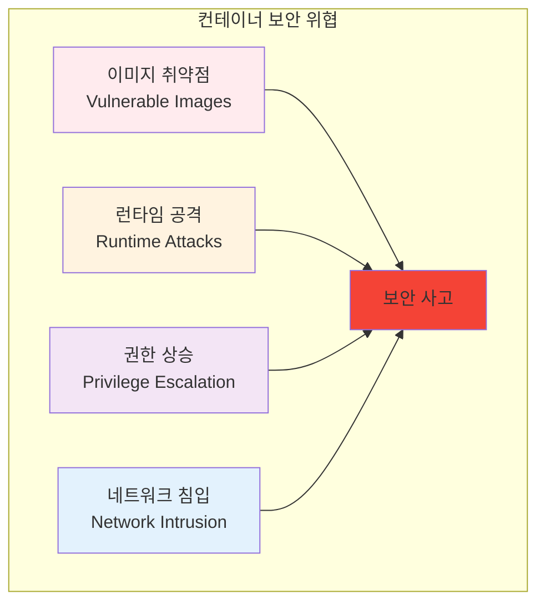
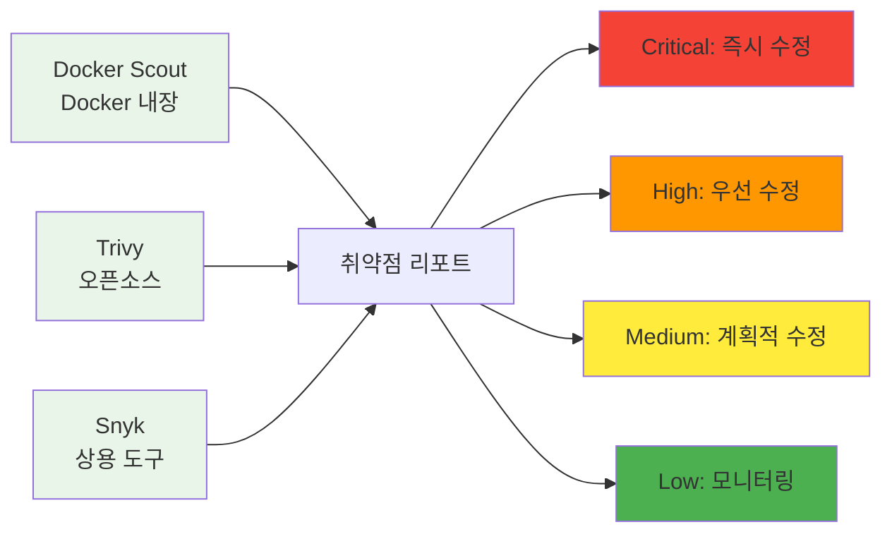

# Week 2 Day 1 Session 1: 컨테이너 보안 기초와 취약점 분석

<div align="center">

**🔒 컨테이너 보안** • **🛡️ 취약점 분석**

*컨테이너 환경의 보안 위협과 대응 방안 완전 이해*

</div>

---

## 🕘 세션 정보

**시간**: 09:00-09:50 (50분)  
**목표**: 컨테이너 보안 위협과 취약점 유형 완전 이해  
**방식**: 보안 개념 + 실제 사례 + 도구 활용

---

## 🎯 세션 목표

### 📚 학습 목표
- **이해 목표**: 컨테이너 보안 위협과 취약점 유형 완전 이해
- **적용 목표**: 보안 스캔 도구를 활용한 취약점 발견 및 해결 능력
- **협업 목표**: 개별 학습 후 경험 공유 및 질의응답

### 🤔 왜 필요한가? (5분)

**현실 문제 상황**:
- 💼 **보안 사고 급증**: 2024년 컨테이너 관련 보안 사고 300% 증가
- 🏠 **일상 비유**: 집에 문을 열어두고 사는 것과 같은 위험
- 📊 **시장 동향**: DevSecOps 도입이 필수가 된 현대 개발 환경

---

## 📖 핵심 개념 (35분)

### 🔍 개념 1: 컨테이너 보안 위협 모델 (12분)

> **정의**: 컨테이너 환경에서 발생할 수 있는 다양한 보안 위협과 공격 벡터

**주요 위협 유형**:


**OWASP Container Top 10**:
1. **Insecure Container Images**: 취약한 베이스 이미지 사용
2. **Inadequate Identity and Access Management**: 부적절한 접근 권한 관리
3. **Insecure Networking**: 안전하지 않은 네트워크 구성
4. **Insecure Data Storage**: 민감한 데이터의 부적절한 저장
5. **Inadequate Monitoring & Logging**: 불충분한 모니터링과 로깅
6. **Insecure Secrets Management**: 시크릿 관리 부실
7. **Insecure Defaults**: 안전하지 않은 기본 설정
8. **Hardcoded Secrets**: 하드코딩된 인증 정보
9. **Outdated Components**: 오래된 구성 요소 사용
10. **Poisoned Pipeline Execution**: 파이프라인 공격

**실제 보안 사고 사례**:
- **Tesla 2018**: 쿠버네티스 대시보드 노출로 암호화폐 채굴
- **Capital One 2019**: 잘못된 IAM 설정으로 1억 명 개인정보 유출
- **SolarWinds 2020**: 공급망 공격으로 18,000개 조직 피해

**보안 위협 시나리오**:
```bash
# 취약한 컨테이너 예시
docker run -d --privileged \
  -v /:/host \
  -e MYSQL_ROOT_PASSWORD=123456 \
  mysql:5.6

# 위험 요소:
# 1. --privileged: 호스트 권한 획득 가능
# 2. -v /:/host: 호스트 파일시스템 마운트
# 3. 약한 패스워드: 쉽게 추측 가능
# 4. 오래된 이미지: 알려진 취약점 존재
```

### 🔍 개념 2: 이미지 보안 스캔 (12분)

> **정의**: 컨테이너 이미지의 알려진 취약점을 자동으로 검사하는 도구와 방법

**보안 스캔 도구들**:


**도구별 비교 분석**:
| 도구 | 장점 | 단점 | 사용 사례 |
|------|------|------|----------|
| **Trivy** | 무료, 빠른 스캔 | 제한적 정책 설정 | CI/CD 파이프라인 |
| **Docker Scout** | Docker 통합, 쉽운 사용 | Docker Hub 의존성 | 개발 단계 검사 |
| **Snyk** | 고급 기능, 상세 리포트 | 비용 발생 | 엔터프라이즈 환경 |
| **Anchore** | 정책 기반 검사 | 복잡한 설정 | 대규모 조직 |

**실습 예시 - Trivy 사용법**:
```bash
# 기본 이미지 스캔
trivy image nginx:latest

# 심각도별 필터링
trivy image --severity HIGH,CRITICAL nginx:latest

# JSON 형태로 결과 출력
trivy image --format json nginx:latest > scan-result.json

# 특정 CVE 검색
trivy image --vuln-type os nginx:latest

# 오프라인 DB 사용
trivy image --cache-dir ./cache nginx:latest

# 스캔 결과 해석
# CRITICAL: 즉시 수정 필요 (CVSS 9.0-10.0)
# HIGH: 24시간 내 수정 (CVSS 7.0-8.9)
# MEDIUM: 1주일 내 수정 (CVSS 4.0-6.9)
# LOW: 모니터링 (CVSS 0.1-3.9)
```

### 🔍 개념 3: 런타임 보안 (11분)

> **정의**: 컨테이너 실행 중 발생하는 보안 위협을 탐지하고 대응하는 방법

**런타임 보안 요소**:
- **최소 권한 원칙**: 필요한 최소한의 권한만 부여
- **읽기 전용 파일시스템**: 가능한 경우 읽기 전용으로 설정
- **비root 사용자**: 컨테이너 내부에서 root 사용 금지
- **시크릿 관리**: 환경 변수 대신 전용 시크릿 관리 도구 사용
- **네트워크 분리**: 불필요한 네트워크 노출 방지
- **리소스 제한**: CPU, 메모리 사용량 제한

**런타임 보안 베스트 프랙티스**:
```dockerfile
# 보안 강화된 Dockerfile 예시
FROM node:18-alpine AS builder

# 보안 업데이트 적용
RUN apk update && apk upgrade && apk add --no-cache dumb-init

# 비특권 사용자 생성
RUN addgroup -g 1001 -S nodejs && \
    adduser -S nextjs -u 1001 -G nodejs

# 애플리케이션 파일 복사 (소유권 설정)
WORKDIR /app
COPY --chown=nextjs:nodejs package*.json ./
RUN npm ci --only=production && npm cache clean --force

COPY --chown=nextjs:nodejs . .
RUN npm run build

# 프로덕션 스테이지
FROM node:18-alpine
RUN apk add --no-cache dumb-init

# 비특권 사용자로 전환
USER nextjs
WORKDIR /app

# 필요한 파일만 복사
COPY --from=builder --chown=nextjs:nodejs /app/dist ./dist
COPY --from=builder --chown=nextjs:nodejs /app/node_modules ./node_modules
COPY --from=builder --chown=nextjs:nodejs /app/package*.json ./

# 헬스체크 추가
HEALTHCHECK --interval=30s --timeout=3s --start-period=5s --retries=3 \
  CMD node healthcheck.js

EXPOSE 3000
ENTRYPOINT ["dumb-init", "--"]
CMD ["node", "dist/server.js"]
```

**실시간 보안 모니터링 도구**:
- **Falco**: 컨테이너 런타임 보안 모니터링
- **Sysdig**: 시스템 콜 모니터링
- **Aqua Security**: 종합 컨테이너 보안 플랫폼
- **Twistlock**: 컨테이너 보안 전문 솔루션

**보안 정책 예시**:
```yaml
# 보안 정책 (AppArmor/SELinux)
apiVersion: v1
kind: Pod
metadata:
  name: secure-pod
  annotations:
    container.apparmor.security.beta.kubernetes.io/app: runtime/default
spec:
  securityContext:
    runAsNonRoot: true
    runAsUser: 1001
    fsGroup: 1001
    seccompProfile:
      type: RuntimeDefault
  containers:
  - name: app
    image: myapp:secure
    securityContext:
      allowPrivilegeEscalation: false
      readOnlyRootFilesystem: true
      capabilities:
        drop:
        - ALL
    resources:
      limits:
        memory: "512Mi"
        cpu: "500m"
      requests:
        memory: "256Mi"
        cpu: "250m"
```

---

## 💭 함께 생각해보기 (10분)

### 🤝 페어 토론 (5분)

**토론 주제**:
1. **보안 경험**: "컨테이너나 애플리케이션에서 보안 문제를 겪어본 적이 있나요?"
2. **위험 평가**: "우리 프로젝트에서 가장 큰 보안 위험은 무엇일까요?"
3. **대응 방안**: "보안 취약점을 발견했을 때 어떻게 대응해야 할까요?"

### 🎯 전체 공유 (5분)

- **보안 인식**: 컨테이너 보안의 중요성에 대한 이해 확인
- **실습 준비**: 오후 보안 스캔 실습에서 확인할 내용들

---

## 🔑 핵심 키워드

- **CVE (Common Vulnerabilities and Exposures)**: 공통 취약점 식별자
- **SAST (Static Application Security Testing)**: 정적 애플리케이션 보안 테스트
- **DAST (Dynamic Application Security Testing)**: 동적 애플리케이션 보안 테스트
- **Container Escape**: 컨테이너 탈출 공격
- **Supply Chain Attack**: 공급망 공격

---

## 📝 세션 마무리

### ✅ 오늘 세션 성과
- [ ] 컨테이너 보안 위협 모델 이해
- [ ] 보안 스캔 도구 활용법 학습
- [ ] 런타임 보안 베스트 프랙티스 습득

### 🎯 다음 세션 준비
- **주제**: 이미지 최적화와 성능 튜닝
- **연결**: 보안과 성능의 균형점 찾기

---

<div align="center">

**🔒 컨테이너 보안의 기초를 완전히 이해했습니다!**

**다음**: [Session 2 - 이미지 최적화와 성능 튜닝](./session_2.md)

</div>