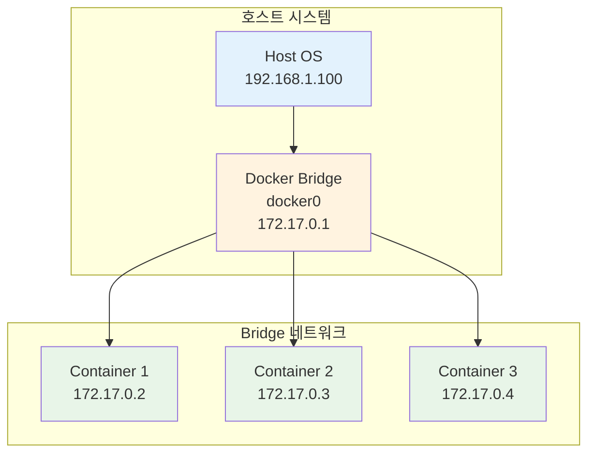
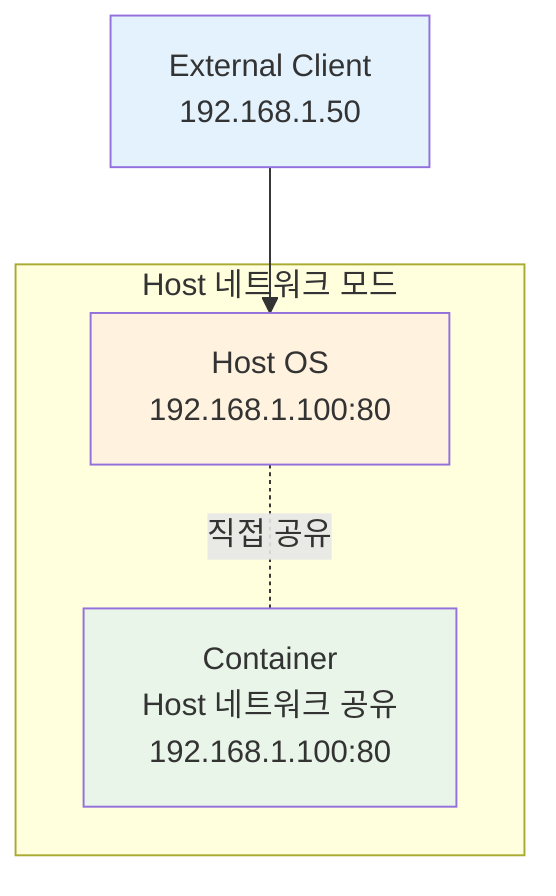
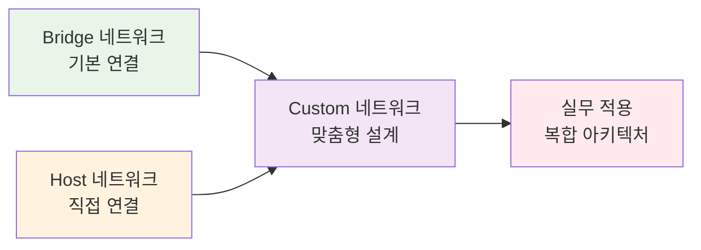

# Week 2 Day 1 Session 1: Docker 네트워킹 심화 (Bridge, Host, Custom)

<div align="center">

**🌐 네트워킹 기초** • **🔗 연결의 이해** • **🏗️ 맞춤형 구성**

*컨테이너 네트워킹의 모든 유형과 활용법 완전 마스터*

</div>

---

## 🕘 세션 정보

**시간**: 09:00-09:50 (50분)  
**목표**: Docker 네트워킹의 모든 유형과 활용법 완전 마스터  
**방식**: 기초 개념 + 실생활 비유 + 단계적 실습

---

## 🎯 학습 목표

### 📚 학습 목표 (명확하고 측정 가능한 목표)
- **이해 목표**: Bridge, Host, Custom 네트워크의 차이점과 동작 원리를 완전히 이해
- **적용 목표**: 상황에 맞는 네트워크 유형을 선택하고 구성할 수 있는 능력
- **협업 목표**: 네트워크 설정을 동료와 함께 토론하고 최적화할 수 있는 역량

### 🤔 왜 필요한가? (5분 - 동기부여 및 맥락 제공)

**현실 문제 상황**:
- 💼 **실무 시나리오**: "컨테이너들이 서로 통신하지 못해 애플리케이션이 작동하지 않아요!"
- 🏠 **일상 비유**: 아파트 단지에서 각 동과 호수가 서로 연결되어야 하는 것처럼, 컨테이너들도 네트워크로 연결되어야 합니다
- 📊 **시장 동향**: 마이크로서비스 아키텍처에서 컨테이너 간 네트워킹은 필수 기술

**학습 전후 비교**:


---

## 📖 핵심 개념 (35분 - 체계적 지식 구축)

### 🔍 개념 1: Bridge 네트워크 - 기본 연결의 이해 (12분)

> **정의**: Docker의 기본 네트워크 방식으로, 컨테이너들을 가상의 다리(Bridge)로 연결하는 방법

**상세 설명**:
- **핵심 원리**: 호스트에 가상 브리지를 만들어 컨테이너들을 연결
- **주요 특징**: 
  - Docker 설치 시 자동으로 생성되는 기본 네트워크
  - 컨테이너마다 고유한 IP 주소 할당 (172.17.0.0/16 대역)
  - 외부와의 통신은 NAT를 통해 이루어짐
- **사용 목적**: 일반적인 컨테이너 간 통신과 외부 접근

**시각적 이해**:


**실생활 비유**: 
아파트 단지의 중앙 관리소가 Bridge 역할을 합니다. 각 세대(컨테이너)는 관리소를 통해 서로 연락하고, 외부 방문자도 관리소를 거쳐 각 세대에 도달합니다.

**기본 명령어**:
```bash
# 기본 브리지 네트워크 확인
docker network ls

# 브리지 네트워크 상세 정보
docker network inspect bridge

# 컨테이너를 브리지 네트워크에 연결
docker run -d --name web-server nginx
docker inspect web-server | grep IPAddress
```

### 🔍 개념 2: Host 네트워크 - 직접 연결의 힘 (12분)

> **정의**: 컨테이너가 호스트의 네트워크를 직접 사용하는 방식으로, 네트워크 격리 없이 최고 성능을 제공

**단계별 이해**:
1. **1단계 (기본)**: 컨테이너가 호스트와 동일한 네트워크 인터페이스 사용
2. **2단계 (중급)**: 포트 매핑 없이 직접 호스트 포트 사용
3. **3단계 (고급)**: 네트워크 오버헤드 최소화로 최고 성능 달성

**실무 연결**:
- **사용 사례**: 
  - 고성능이 필요한 데이터베이스 서버
  - 네트워크 모니터링 도구
  - 로드 밸런서나 프록시 서버
- **장단점**: 
  - ✅ 장점: 최고 성능, 포트 충돌 없음, 네트워크 오버헤드 최소
  - ❌ 단점: 보안성 낮음, 포트 관리 복잡, 컨테이너 격리 효과 감소
- **대안 기술**: Bridge 네트워크, Macvlan 네트워크

**Host 네트워크 구조**:


**실제 사용 예시**:
```bash
# Host 네트워크로 컨테이너 실행
docker run -d --network host --name nginx-host nginx

# 호스트의 네트워크 인터페이스 확인
ip addr show

# 컨테이너 내부에서 네트워크 확인 (호스트와 동일)
docker exec nginx-host ip addr show
```

### 🔍 개념 3: Custom 네트워크 - 맞춤형 네트워크 설계 (11분)

> **정의**: 사용자가 직접 생성하고 관리하는 네트워크로, 특정 요구사항에 맞춘 맞춤형 네트워크 환경 제공

**개념 간 관계**:


**Custom 네트워크의 고급 기능**:
- **DNS 해상도**: 컨테이너 이름으로 직접 통신 가능
- **네트워크 분리**: 서로 다른 네트워크 간 격리
- **IP 대역 설정**: 원하는 IP 대역 사용 가능
- **드라이버 선택**: bridge, overlay, macvlan 등 다양한 드라이버

**종합 비교표**:
| 구분 | Bridge | Host | Custom |
|------|--------|------|--------|
| **목적** | 기본 컨테이너 통신 | 최고 성능 네트워킹 | 맞춤형 네트워크 설계 |
| **특징** | 자동 IP 할당, NAT | 호스트 네트워크 공유 | 사용자 정의 설정 |
| **사용 시기** | 일반적인 애플리케이션 | 고성능 요구 서비스 | 복잡한 네트워크 구조 |
| **장점** | 간단함, 격리성 | 최고 성능, 직접 접근 | 유연성, 고급 기능 |
| **주의사항** | 성능 오버헤드 | 보안 위험, 포트 충돌 | 설정 복잡성 |

**Custom 네트워크 실습**:
```bash
# Custom 브리지 네트워크 생성
docker network create --driver bridge \
  --subnet=192.168.100.0/24 \
  --gateway=192.168.100.1 \
  my-custom-network

# 네트워크에 컨테이너 연결
docker run -d --name web1 --network my-custom-network nginx
docker run -d --name web2 --network my-custom-network nginx

# 컨테이너 간 이름으로 통신 테스트
docker exec web1 ping web2

# 네트워크 상세 정보 확인
docker network inspect my-custom-network
```

**🔑 핵심 키워드 정리**:
- **Bridge Network (브리지 네트워크)**: docker0 - Docker의 기본 네트워크 방식
- **Host Network (호스트 네트워크)**: --network host - 호스트와 네트워크 공유
- **Custom Network (커스텀 네트워크)**: 사용자 정의 - 맞춤형 네트워크 설계
- **NAT (Network Address Translation)**: 네트워크 주소 변환 - 내부 IP를 외부 IP로 변환
- **DNS Resolution (DNS 해상도)**: 도메인 이름 해석 - 컨테이너 이름으로 통신

---

## 💭 함께 생각해보기 (10분 - 상호작용 및 이해도 확인)

### 🤝 페어 토론 (5분)

**토론 주제**:
1. **개념 적용**: "우리가 만들 웹 애플리케이션에서는 어떤 네트워크 방식이 가장 적합할까요?"
2. **문제 해결**: "컨테이너 간 통신이 안 될 때 어떤 순서로 문제를 해결하시겠어요?"
3. **경험 공유**: "네트워크 관련해서 겪어본 문제나 궁금한 점이 있다면 공유해주세요"

**페어 활동 가이드**:
- 👥 **자유 페어링**: 관심사나 이해도가 비슷한 사람끼리
- 🔄 **역할 교대**: 5분씩 설명자/질문자 역할 바꾸기
- 📝 **핵심 정리**: 대화 내용 중 중요한 점 메모하기

### 🎯 전체 공유 (5분)

- **인사이트 공유**: 페어 토론에서 나온 좋은 아이디어
- **질문 수집**: 아직 이해가 어려운 부분
- **다음 연결**: 다음 세션 "컨테이너 간 통신"과의 연결고리 확인

**💡 이해도 체크 질문**:
- ✅ "Bridge, Host, Custom 네트워크의 차이점을 한 문장으로 설명할 수 있나요?"
- ✅ "실무에서 언제 어떤 네트워크를 사용할지 예상할 수 있나요?"
- ✅ "다른 사람에게 Docker 네트워킹을 설명할 수 있을 정도로 이해했나요?"

---

## 🔑 핵심 키워드

- **Bridge Network (브리지 네트워크)**: Docker의 기본 네트워크 방식
- **Host Network (호스트 네트워크)**: 호스트와 네트워크를 공유하는 방식
- **Custom Network (커스텀 네트워크)**: 사용자가 정의하는 맞춤형 네트워크
- **docker0**: Docker의 기본 브리지 인터페이스
- **NAT (Network Address Translation)**: 네트워크 주소 변환

---

## 📝 세션 마무리

### ✅ 오늘 세션 성과
- [ ] Bridge, Host, Custom 네트워크의 차이점과 특징 완전 이해
- [ ] 각 네트워크 유형의 적합한 사용 시나리오 파악
- [ ] 기본적인 네트워크 명령어 사용법 습득

### 🎯 다음 세션 준비
- **주제**: 컨테이너 간 통신 & 서비스 디스커버리
- **연결**: 오늘 배운 네트워크 기초 위에 실제 통신 방법 학습

---

<div align="center">

**🌐 Docker 네트워킹의 기초를 완전히 마스터했습니다!**

**다음**: [Session 2 - 컨테이너 간 통신 & 서비스 디스커버리](./session_2.md)

</div>