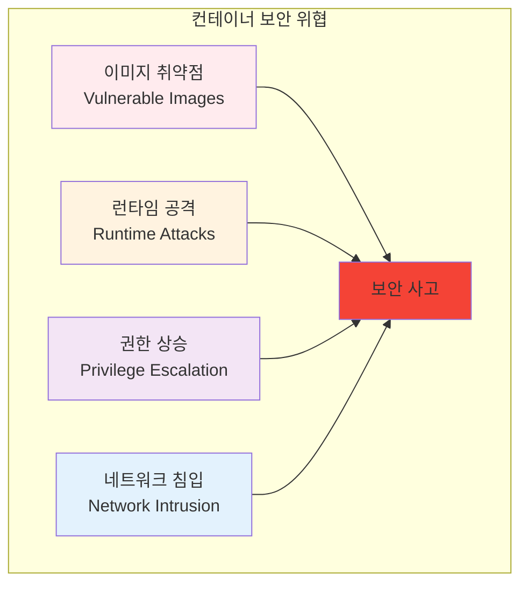
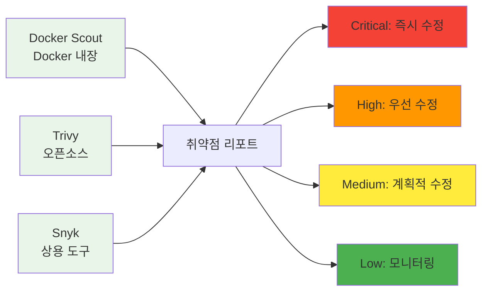

# Week 2 Day 1 Session 1: 컨테이너 보안 기초와 취약점 분석

**🔒 컨테이너 보안** • **🛡️ 취약점 분석**

*컨테이너 환경의 보안 위협과 대응 방안 완전 이해*

---

## 🕘 세션 정보

**시간**: 09:00-09:50 (50분)  
**목표**: 컨테이너 보안 위협과 취약점 유형 완전 이해  
**방식**: 보안 개념 + 실제 사례 + 도구 활용

---

## 🎯 세션 목표

### 📚 학습 목표
- **이해 목표**: 컨테이너 보안 위협과 취약점 유형 완전 이해
- **적용 목표**: 보안 스캔 도구를 활용한 취약점 발견 및 해결 능력
- **협업 목표**: 개별 학습 후 경험 공유 및 질의응답

### 🤔 왜 필요한가? (5분)

**현실 문제 상황**:
- 💼 **보안 사고 급증**: 2024년 컨테이너 관련 보안 사고 300% 증가
- 🏠 **일상 비유**: 집에 문을 열어두고 사는 것과 같은 위험
- 📊 **시장 동향**: DevSecOps 도입이 필수가 된 현대 개발 환경

---

## 📖 핵심 개념 (35분)

### 🔍 개념 1: 컨테이너 보안 위협 모델 (12분)

> **정의**: 컨테이너 환경에서 발생할 수 있는 다양한 보안 위협과 공격 벡터

**주요 위협 유형**:

**OWASP Container Top 10**:
1. **Insecure Container Images**: 취약한 베이스 이미지 사용
2. **Inadequate Identity and Access Management**: 부적절한 접근 권한 관리
3. **Insecure Networking**: 안전하지 않은 네트워크 구성
4. **Insecure Data Storage**: 민감한 데이터의 부적절한 저장
5. **Inadequate Monitoring & Logging**: 불충분한 모니터링과 로깅

### 🔍 개념 2: 이미지 보안 스캔 (12분)

> **정의**: 컨테이너 이미지의 알려진 취약점을 자동으로 검사하는 도구와 방법

**보안 스캔 도구들**:

### 🔍 개념 3: 런타임 보안 (11분)

> **정의**: 컨테이너 실행 중 발생하는 보안 위협을 탐지하고 대응하는 방법

**런타임 보안 요소**:
- **최소 권한 원칙**: 필요한 최소한의 권한만 부여
- **읽기 전용 파일시스템**: 가능한 경우 읽기 전용으로 설정
- **비root 사용자**: 컨테이너 내부에서 root 사용 금지
- **시크릿 관리**: 환경 변수 대신 전용 시크릿 관리 도구 사용

---

## 💭 함께 생각해보기 (10분)

### 🤝 페어 토론 (5분)

**토론 주제**:
1. **보안 경험**: "컨테이너나 애플리케이션에서 보안 문제를 겪어본 적이 있나요?"
2. **위험 평가**: "우리 프로젝트에서 가장 큰 보안 위험은 무엇일까요?"
3. **대응 방안**: "보안 취약점을 발견했을 때 어떻게 대응해야 할까요?"

### 🎯 전체 공유 (5분)

- **보안 인식**: 컨테이너 보안의 중요성에 대한 이해 확인
- **실습 준비**: 오후 보안 스캔 실습에서 확인할 내용들

---

## 🔑 핵심 키워드

- **CVE (Common Vulnerabilities and Exposures)**: 공통 취약점 식별자
- **SAST (Static Application Security Testing)**: 정적 애플리케이션 보안 테스트
- **DAST (Dynamic Application Security Testing)**: 동적 애플리케이션 보안 테스트
- **Container Escape**: 컨테이너 탈출 공격
- **Supply Chain Attack**: 공급망 공격

---

## 📝 세션 마무리

### ✅ 오늘 세션 성과
- [ ] 컨테이너 보안 위협 모델 이해
- [ ] 보안 스캔 도구 활용법 학습
- [ ] 런타임 보안 베스트 프랙티스 습득

### 🎯 다음 세션 준비
- **주제**: 이미지 최적화와 성능 튜닝
- **연결**: 보안과 성능의 균형점 찾기

---

**🔒 컨테이너 보안의 기초를 완전히 이해했습니다!**

**다음**: [Session 2 - 이미지 최적화와 성능 튜닝](./session_2.md)

