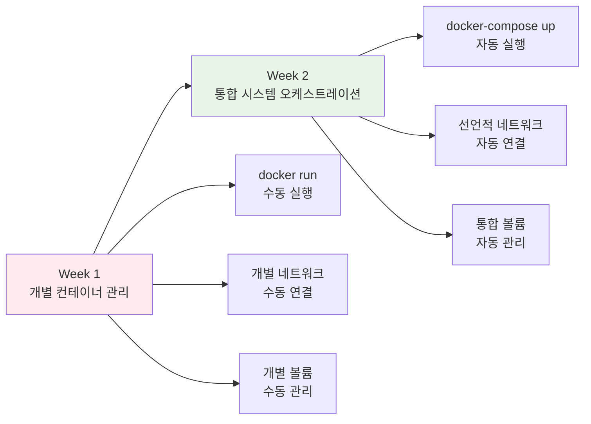

# Week 2 Day 1 Session 1: 고급 Compose 패턴과 베스트 프랙티스

<div align="center">

**🎼 고급 오케스트레이션** • **🏗️ 실무 패턴**

*Docker Compose의 모든 고급 기능과 프로덕션 베스트 프랙티스 완전 마스터*

</div>

---

## 🕘 세션 정보

**시간**: 09:00-09:50 (50분)  
**목표**: Docker Compose 고급 기능과 실무 패턴 완전 습득  
**방식**: 심화 개념 + 실시간 구현 + Week 1 연계 학습

---

## 🎯 세션 목표

### 📚 학습 목표
- **이해 목표**: Docker Compose의 모든 고급 기능과 문법 완전 이해
- **적용 목표**: 프로덕션 환경에서 사용할 수 있는 Compose 패턴 습득
- **협업 목표**: Week 1 마이크로서비스를 팀으로 Compose화 계획 수립

### 🤔 왜 고급 Compose인가? (5분)

**현실 문제 상황**:
- 💼 **실무 시나리오**: 복잡한 마이크로서비스를 효율적으로 관리해야 함
- 🏠 **일상 비유**: 오케스트라 지휘자가 모든 악기를 조화롭게 연주시키는 것
- 📊 **시장 동향**: 컨테이너 오케스트레이션은 현대 DevOps의 핵심 기술

**Week 1에서 Week 2로의 진화**:


---

## 📖 핵심 개념 (35분)

### 🔍 개념 1: Compose 파일 구조와 고급 문법 (12분)

> **정의**: Docker Compose의 선언적 서비스 정의와 고급 구성 옵션

**Compose 파일 버전과 진화**:
```yaml
# docker-compose.yml (최신 버전)
version: '3.8'  # 최신 안정 버전

services:
  # 서비스 정의
  
networks:
  # 네트워크 정의
  
volumes:
  # 볼륨 정의
  
configs:
  # 설정 파일 정의 (Swarm 모드)
  
secrets:
  # 시크릿 정의 (Swarm 모드)
```

**고급 서비스 구성 옵션**:
```yaml
services:
  web:
    image: nginx:alpine
    
    # 고급 네트워킹
    networks:
      - frontend
      - backend
    ports:
      - "80:80"
      - "443:443"
    
    # 리소스 제한
    deploy:
      resources:
        limits:
          cpus: '0.50'
          memory: 512M
        reservations:
          cpus: '0.25'
          memory: 256M
      replicas: 2
      restart_policy:
        condition: on-failure
        delay: 5s
        max_attempts: 3
    
    # 헬스체크
    healthcheck:
      test: ["CMD", "curl", "-f", "http://localhost/health"]
      interval: 30s
      timeout: 10s
      retries: 3
      start_period: 40s
    
    # 로깅 설정
    logging:
      driver: "json-file"
      options:
        max-size: "10m"
        max-file: "3"
    
    # 환경 설정
    environment:
      - NODE_ENV=production
      - API_URL=http://api:3000
    env_file:
      - .env
      - .env.production
    
    # 볼륨 마운트
    volumes:
      - ./nginx.conf:/etc/nginx/nginx.conf:ro
      - web-data:/var/www/html
      - type: tmpfs
        target: /tmp
        tmpfs:
          size: 100M
    
    # 의존성 정의
    depends_on:
      api:
        condition: service_healthy
      database:
        condition: service_started
```

**네트워크 고급 구성**:
```yaml
networks:
  frontend:
    driver: bridge
    driver_opts:
      com.docker.network.bridge.name: frontend-br
    ipam:
      config:
        - subnet: 172.20.0.0/24
          gateway: 172.20.0.1
  
  backend:
    driver: bridge
    internal: true  # 외부 접근 차단
    
  database:
    driver: bridge
    internal: true
    encrypt: true  # 암호화된 네트워크
```

### 🔍 개념 2: 멀티스테이지 Compose와 오버라이드 패턴 (12분)

> **정의**: 환경별 설정과 단계별 구성을 위한 고급 패턴

**기본 Compose 파일 구조**:
```yaml
# docker-compose.yml (기본 설정)
version: '3.8'

services:
  app:
    build: .
    ports:
      - "3000:3000"
    environment:
      - NODE_ENV=development
    volumes:
      - .:/app
      - /app/node_modules
    
  database:
    image: postgres:13
    environment:
      - POSTGRES_DB=myapp
      - POSTGRES_USER=user
      - POSTGRES_PASSWORD=password
    volumes:
      - db-data:/var/lib/postgresql/data

volumes:
  db-data:
```

**개발 환경 오버라이드**:
```yaml
# docker-compose.override.yml (개발 환경 - 자동 적용)
version: '3.8'

services:
  app:
    build:
      target: development  # 멀티스테이지 빌드의 development 스테이지
    volumes:
      - .:/app:cached  # 개발용 볼륨 마운트
      - /app/node_modules
    environment:
      - DEBUG=true
      - HOT_RELOAD=true
    command: npm run dev
    
  database:
    ports:
      - "5432:5432"  # 개발용 포트 노출
    environment:
      - POSTGRES_PASSWORD=dev_password
```

**프로덕션 환경 설정**:
```yaml
# docker-compose.prod.yml (프로덕션 환경)
version: '3.8'

services:
  app:
    build:
      target: production
    restart: unless-stopped
    environment:
      - NODE_ENV=production
    deploy:
      replicas: 3
      resources:
        limits:
          memory: 512M
        reservations:
          memory: 256M
    healthcheck:
      test: ["CMD", "curl", "-f", "http://localhost:3000/health"]
      interval: 30s
      timeout: 10s
      retries: 3
    
  database:
    restart: unless-stopped
    environment:
      - POSTGRES_PASSWORD_FILE=/run/secrets/db_password
    secrets:
      - db_password
    deploy:
      resources:
        limits:
          memory: 1G
        reservations:
          memory: 512M

secrets:
  db_password:
    external: true
```

**환경별 실행 명령어**:
```bash
# 개발 환경 (기본 + override 자동 적용)
docker-compose up

# 프로덕션 환경
docker-compose -f docker-compose.yml -f docker-compose.prod.yml up -d

# 테스트 환경
docker-compose -f docker-compose.yml -f docker-compose.test.yml up --abort-on-container-exit
```

### 🔍 개념 3: 프로덕션 베스트 프랙티스 (11분)

> **정의**: 실제 운영 환경에서 안정적이고 효율적인 Compose 구성

**보안 베스트 프랙티스**:
```yaml
services:
  app:
    # 비root 사용자 실행
    user: "1000:1000"
    
    # 읽기 전용 루트 파일시스템
    read_only: true
    
    # 임시 파일시스템
    tmpfs:
      - /tmp:noexec,nosuid,size=100m
    
    # 보안 옵션
    security_opt:
      - no-new-privileges:true
    
    # 캐퍼빌리티 제한
    cap_drop:
      - ALL
    cap_add:
      - NET_BIND_SERVICE
    
    # 시크릿 사용
    secrets:
      - source: app_secret
        target: /run/secrets/app_secret
        mode: 0400
```

**성능 최적화 패턴**:
```yaml
services:
  web:
    # 리소스 제한과 예약
    deploy:
      resources:
        limits:
          cpus: '2.0'
          memory: 2G
        reservations:
          cpus: '1.0'
          memory: 1G
    
    # 효율적인 볼륨 마운트
    volumes:
      - type: bind
        source: ./static
        target: /app/static
        read_only: true
      - type: volume
        source: cache-data
        target: /app/cache
        volume:
          nocopy: true
    
    # 로깅 최적화
    logging:
      driver: "json-file"
      options:
        max-size: "10m"
        max-file: "3"
        compress: "true"
```

**모니터링과 관측성**:
```yaml
services:
  app:
    # 헬스체크 구성
    healthcheck:
      test: ["CMD-SHELL", "curl -f http://localhost:3000/health || exit 1"]
      interval: 30s
      timeout: 10s
      retries: 3
      start_period: 60s
    
    # 라벨을 통한 메타데이터
    labels:
      - "traefik.enable=true"
      - "traefik.http.routers.app.rule=Host(`myapp.local`)"
      - "prometheus.io/scrape=true"
      - "prometheus.io/port=3000"
      - "prometheus.io/path=/metrics"
    
    # 환경별 설정
    environment:
      - LOG_LEVEL=${LOG_LEVEL:-info}
      - METRICS_ENABLED=${METRICS_ENABLED:-true}
```

**Week 1 마이크로서비스를 Compose로 변환**:
```yaml
# Week 1에서 구축한 E-Commerce 시스템을 Compose로
version: '3.8'

services:
  # Load Balancer
  nginx-lb:
    image: nginx:alpine
    ports:
      - "80:80"
      - "443:443"
    networks:
      - dmz-network
    volumes:
      - ./nginx/nginx.conf:/etc/nginx/nginx.conf:ro
    depends_on:
      - frontend-1
      - frontend-2
  
  # Frontend Services
  frontend-1:
    image: ecommerce-frontend:latest
    networks:
      - frontend-network
      - backend-network
    environment:
      - REACT_APP_API_URL=http://nginx-lb/api
    depends_on:
      user-api:
        condition: service_healthy
      product-api:
        condition: service_healthy
  
  # API Services
  user-api:
    image: user-api:latest
    networks:
      - backend-network
      - database-network
    environment:
      - DB_HOST=user-db
      - REDIS_HOST=redis-cache
    healthcheck:
      test: ["CMD", "curl", "-f", "http://localhost:3001/health"]
      interval: 30s
      timeout: 10s
      retries: 3
    depends_on:
      user-db:
        condition: service_healthy
      redis-cache:
        condition: service_started

networks:
  dmz-network:
    driver: bridge
  frontend-network:
    driver: bridge
  backend-network:
    driver: bridge
  database-network:
    driver: bridge
    internal: true

volumes:
  user-db-data:
  product-db-data:
  order-db-data:
  redis-data:
```

---

## 💭 함께 생각해보기 (10분)

### 🤝 페어 토론 (5분)

**토론 주제**:
1. **Week 1 연계**: "Week 1에서 구축한 마이크로서비스를 Compose로 변환할 때 가장 중요한 고려사항은?"
2. **환경 분리**: "개발/스테이징/프로덕션 환경을 어떻게 효과적으로 분리할 수 있을까요?"
3. **성능 최적화**: "대규모 서비스에서 Compose 성능을 높이려면 어떤 방법들이 있을까요?"

**페어 활동 가이드**:
- 👥 **경험 공유**: Week 1에서 겪었던 수동 관리의 어려움과 Compose의 장점 비교
- 🔄 **설계 토론**: 실제 서비스를 가정하고 Compose 구조 설계
- 📝 **베스트 프랙티스**: 각자 알고 있는 Compose 활용 팁 공유

### 🎯 전체 공유 (5분)

**인사이트 공유**:
- 페어 토론에서 나온 창의적인 Compose 활용 아이디어
- Week 1 시스템을 Compose로 개선할 수 있는 방안
- 오후 챌린지에서 구현할 아키텍처 아이디어

**💡 이해도 체크 질문**:
- ✅ "Compose 파일의 고급 옵션들을 활용할 수 있나요?"
- ✅ "환경별 오버라이드 패턴을 이해했나요?"
- ✅ "프로덕션 베스트 프랙티스를 적용할 수 있나요?"

---

## 🔑 핵심 키워드

### 🆕 새로운 용어
- **Override Pattern**: 오버라이드 패턴 - 환경별 설정 덮어쓰기
- **Multi-stage Compose**: 멀티스테이지 컴포즈 - 단계별 구성 관리
- **Service Dependency**: 서비스 의존성 - 서비스 간 시작 순서 관리
- **Health Check**: 헬스체크 - 서비스 상태 확인 메커니즘
- **Resource Limits**: 리소스 제한 - CPU/메모리 사용량 제어

### 🔤 기술 용어
- **YAML Anchors**: YAML 앵커 - 설정 재사용을 위한 참조
- **External Networks**: 외부 네트워크 - 기존 네트워크 재사용
- **Named Volumes**: 명명된 볼륨 - 관리되는 데이터 저장소
- **Bind Mounts**: 바인드 마운트 - 호스트 경로 직접 마운트
- **Tmpfs Mounts**: Tmpfs 마운트 - 메모리 기반 임시 저장소

### 🔤 실무 용어
- **Blue-Green Deployment**: 블루-그린 배포 - 무중단 배포 전략
- **Rolling Update**: 롤링 업데이트 - 점진적 서비스 업데이트
- **Circuit Breaker**: 회로 차단기 - 장애 전파 방지 패턴
- **Service Mesh**: 서비스 메시 - 마이크로서비스 통신 관리
- **Observability**: 관측성 - 시스템 상태 모니터링과 추적

---

## 📝 세션 마무리

### ✅ 오늘 세션 성과
- [ ] Docker Compose 고급 문법과 기능 완전 습득 ✅
- [ ] 멀티스테이지와 오버라이드 패턴 이해 ✅
- [ ] 프로덕션 베스트 프랙티스 학습 ✅
- [ ] Week 1 시스템의 Compose 변환 계획 수립 ✅

### 🎯 다음 세션 준비
- **주제**: 환경별 설정 관리와 시크릿 - 운영 환경 대응
- **연결**: 오늘 배운 고급 패턴을 환경별 설정에 적용
- **준비**: 개발/스테이징/프로덕션 환경의 차이점 생각해보기

### 🔮 오후 챌린지 미리보기
**E-Commerce 플랫폼 Compose 구축**에서 활용할 내용:
- 오늘 배운 고급 Compose 패턴 전면 적용
- Week 1 마이크로서비스의 완전한 Compose 변환
- 환경별 설정과 프로덕션 베스트 프랙티스 구현

---

<div align="center">

**🎼 Docker Compose 고급 패턴을 완전히 마스터했습니다!**

*Week 1의 수동 관리에서 선언적 오케스트레이션으로의 완전한 진화*

**다음**: [Session 2 - 환경별 설정 관리와 시크릿](./session_2.md)

</div>