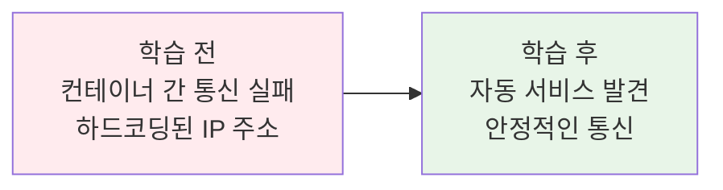
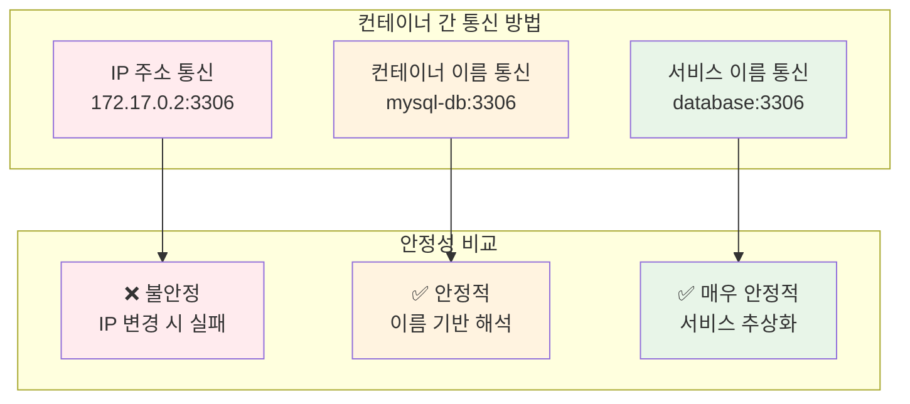
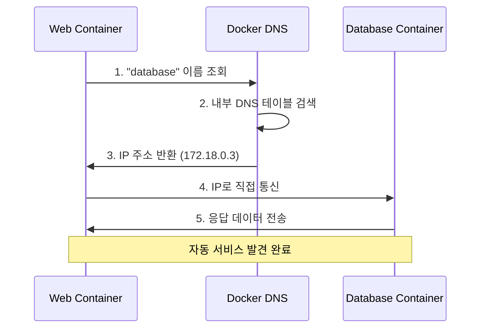
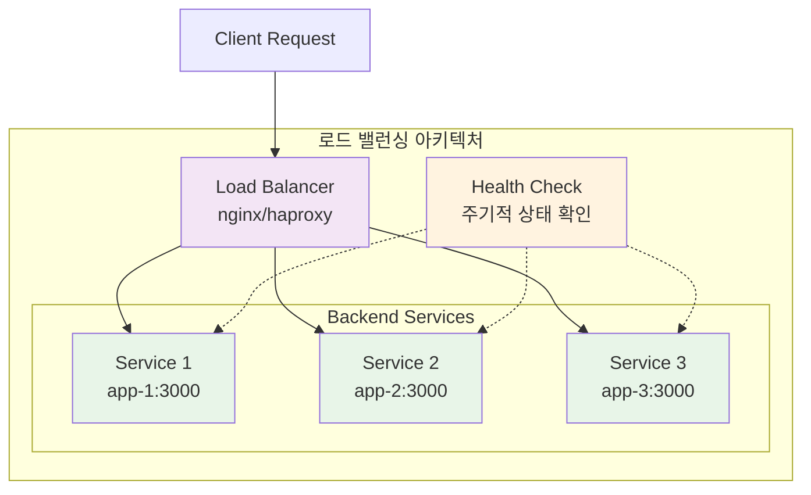
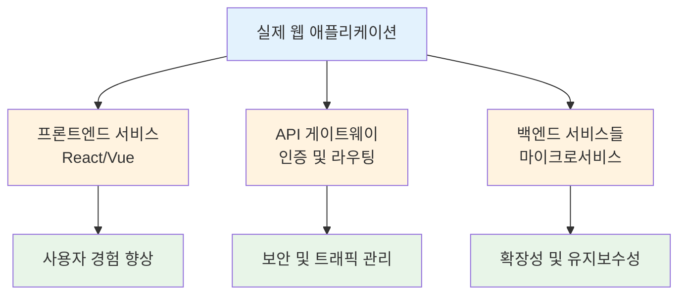

# Week 2 Day 1 Session 2: 컨테이너 간 통신 & 서비스 디스커버리

<div align="center">

**📞 컨테이너 통신** • **🔍 서비스 발견** • **⚖️ 로드 밸런싱**

*멀티 컨테이너 환경에서의 효율적 통신 패턴 습득*

</div>

---

## 🕘 세션 정보

**시간**: 10:00-10:50 (50분)  
**목표**: 멀티 컨테이너 환경에서의 효율적 통신 패턴 습득  
**방식**: 실무 시나리오 + 단계별 실습 + 문제 해결

---

## 🎯 학습 목표

### 📚 학습 목표 (명확하고 측정 가능한 목표)
- **이해 목표**: 컨테이너 간 다양한 통신 방법과 서비스 디스커버리 원리 완전 이해
- **적용 목표**: DNS 기반 통신과 로드 밸런싱을 실제 구현할 수 있는 능력
- **협업 목표**: 복잡한 네트워크 구조를 동료와 함께 설계하고 문제를 해결하는 역량

### 🤔 왜 필요한가? (5분 - 동기부여 및 맥락 제공)

**현실 문제 상황**:
- 💼 **실무 시나리오**: "웹 서버가 데이터베이스를 찾지 못해 500 에러가 계속 발생해요!"
- 🏠 **일상 비유**: 대형 쇼핑몰에서 각 매장이 서로를 찾고 고객을 안내하는 것처럼, 컨테이너들도 서로를 찾고 통신해야 합니다
- 📊 **시장 동향**: 마이크로서비스에서 서비스 간 통신은 시스템 안정성의 핵심

**학습 전후 비교**:


---

## 📖 핵심 개념 (35분 - 체계적 지식 구축)

### 🔍 개념 1: 컨테이너 간 통신 방법 (12분)

> **정의**: 여러 컨테이너가 서로 데이터를 주고받는 다양한 방법과 패턴

**상세 설명**:
- **핵심 원리**: 네트워크를 통한 통신, 볼륨을 통한 파일 공유, 환경 변수를 통한 설정 공유
- **주요 특징**: 
  - IP 주소 기반 통신 (불안정)
  - 컨테이너 이름 기반 통신 (안정적)
  - 포트 기반 서비스 접근
- **사용 목적**: 마이크로서비스 아키텍처에서 서비스 간 협업

**통신 방법 비교**:


**실생활 비유**: 
친구에게 연락할 때 전화번호(IP)보다는 이름으로 연락처를 저장하는 것처럼, 컨테이너도 IP보다는 이름으로 통신하는 것이 안전합니다.

**기본 통신 테스트**:
```bash
# 두 컨테이너 생성 (같은 네트워크)
docker network create app-network
docker run -d --name web-app --network app-network nginx
docker run -d --name api-server --network app-network httpd

# 컨테이너 이름으로 통신 테스트
docker exec web-app ping api-server
docker exec web-app nslookup api-server

# 서비스 포트 확인
docker exec web-app curl http://api-server:80
```

### 🔍 개념 2: DNS 기반 서비스 디스커버리 (12분)

> **정의**: 컨테이너 이름을 IP 주소로 자동 변환해주는 DNS 시스템을 통한 서비스 발견 메커니즘

**단계별 이해**:
1. **1단계 (기본)**: Docker 내장 DNS 서버가 컨테이너 이름을 IP로 변환
2. **2단계 (중급)**: 네트워크별로 독립적인 DNS 네임스페이스 제공
3. **3단계 (고급)**: 서비스 별칭과 라운드 로빈 DNS를 통한 로드 밸런싱

**실무 연결**:
- **사용 사례**: 
  - 웹 애플리케이션 → 데이터베이스 연결
  - API 게이트웨이 → 마이크로서비스 라우팅
  - 모니터링 시스템 → 각종 서비스 수집
- **장단점**: 
  - ✅ 장점: 자동화, 동적 변경 대응, 설정 간소화
  - ❌ 단점: DNS 캐시 문제, 네트워크 의존성
- **대안 기술**: 외부 서비스 디스커버리 (Consul, etcd), 로드 밸런서

**DNS 해상도 과정**:


**실제 DNS 테스트**:
```bash
# 복잡한 애플리케이션 스택 구성
docker network create webapp-net

# 데이터베이스 컨테이너
docker run -d --name database \
  --network webapp-net \
  -e MYSQL_ROOT_PASSWORD=secret \
  mysql:8.0

# 웹 애플리케이션 컨테이너
docker run -d --name webapp \
  --network webapp-net \
  -e DB_HOST=database \
  -e DB_PORT=3306 \
  wordpress

# DNS 해상도 확인
docker exec webapp nslookup database
docker exec webapp dig database

# 실제 연결 테스트
docker exec webapp nc -zv database 3306
```

### 🔍 개념 3: 로드 밸런싱과 헬스 체크 (11분)

> **정의**: 여러 컨테이너 인스턴스 간 트래픽을 분산하고 건강한 인스턴스만 서비스하는 메커니즘

**개념 간 관계**:


**로드 밸런싱 알고리즘**:
- **Round Robin**: 순차적으로 요청 분배
- **Least Connections**: 연결 수가 가장 적은 서버로 분배
- **IP Hash**: 클라이언트 IP 기반 일관된 분배
- **Weighted**: 서버 성능에 따른 가중치 분배

**종합 비교표**:
| 구분 | IP 통신 | DNS 통신 | 로드 밸런싱 |
|------|---------|----------|-------------|
| **목적** | 직접 연결 | 이름 기반 연결 | 트래픽 분산 |
| **특징** | 고정 IP 필요 | 동적 이름 해석 | 다중 인스턴스 |
| **사용 시기** | 단순한 구조 | 일반적인 서비스 | 고가용성 필요 |
| **장점** | 빠른 연결 | 유연성, 자동화 | 확장성, 안정성 |
| **주의사항** | IP 변경 위험 | DNS 캐시 이슈 | 복잡성 증가 |

**실제 로드 밸런싱 구현**:
```bash
# 여러 웹 서버 인스턴스 생성
docker network create lb-network

docker run -d --name web1 --network lb-network nginx
docker run -d --name web2 --network lb-network nginx
docker run -d --name web3 --network lb-network nginx

# Nginx 로드 밸런서 설정
cat > nginx.conf << EOF
upstream backend {
    server web1:80;
    server web2:80;
    server web3:80;
}

server {
    listen 80;
    location / {
        proxy_pass http://backend;
        proxy_set_header Host \$host;
        health_check;
    }
}
EOF

# 로드 밸런서 컨테이너 실행
docker run -d --name load-balancer \
  --network lb-network \
  -p 8080:80 \
  -v $(pwd)/nginx.conf:/etc/nginx/nginx.conf \
  nginx

# 로드 밸런싱 테스트
for i in {1..10}; do
  curl -s http://localhost:8080 | grep "Server"
done
```

**🔑 핵심 키워드 정리**:
- **Service Discovery (서비스 디스커버리)**: 서비스 발견 - 동적으로 서비스 위치 찾기
- **DNS Resolution (DNS 해상도)**: 이름을 IP로 변환하는 과정
- **Load Balancing (로드 밸런싱)**: 부하 분산 - 여러 서버에 트래픽 분산
- **Health Check (헬스 체크)**: 상태 확인 - 서비스 정상 동작 여부 확인
- **Round Robin (라운드 로빈)**: 순환 방식 - 순서대로 요청 분배

---

## 🌟 실무 연계 (15분 - 현장 적용성 강화)

### 📊 업계 동향
- **시장 현황**: 마이크로서비스 아키텍처 도입률 70% 이상 (2024년 기준)
- **주요 기업 사례**: 
  - **Netflix**: 수백 개 마이크로서비스 간 통신 관리
  - **Uber**: 실시간 서비스 디스커버리로 글로벌 서비스 운영
  - **Amazon**: ECS/EKS에서 자동 서비스 메시 구현
- **미래 전망**: 서비스 메시(Istio, Linkerd) 기술로 발전

### 🏢 실무 적용 사례


### 💼 직무별 활용도
- **개발자**: 마이크로서비스 간 API 통신 설계
- **운영자**: 서비스 상태 모니터링 및 장애 대응
- **아키텍트**: 전체 시스템의 통신 구조 설계

### ⚠️ 실무 주의사항
- 🚨 **흔한 실수**: 하드코딩된 IP 주소 사용, DNS 캐시 미고려
- 💡 **베스트 프랙티스**: 환경 변수 활용, 헬스 체크 구현, 타임아웃 설정
- 🔧 **트러블슈팅**: 네트워크 연결 확인, DNS 해상도 테스트, 로그 분석

---

## 💭 함께 생각해보기 (10분 - 상호작용 및 이해도 확인)

### 🤝 페어 토론 (5분)

**토론 주제**:
1. **개념 적용**: "우리 프로젝트에서 어떤 서비스들이 서로 통신해야 할까요?"
2. **문제 해결**: "서비스 간 통신이 느려질 때 어떻게 원인을 찾고 해결하시겠어요?"
3. **경험 공유**: "로드 밸런싱이나 서비스 디스커버리 관련 경험이나 궁금한 점이 있나요?"

**페어 활동 가이드**:
- 👥 **자유 페어링**: 관심사나 이해도가 비슷한 사람끼리
- 🔄 **역할 교대**: 5분씩 설명자/질문자 역할 바꾸기
- 📝 **핵심 정리**: 대화 내용 중 중요한 점 메모하기

### 🎯 전체 공유 (5분)

- **인사이트 공유**: 페어 토론에서 나온 좋은 아이디어
- **질문 수집**: 아직 이해가 어려운 부분
- **다음 연결**: 다음 세션 "네트워크 보안"과의 연결고리 확인

**💡 이해도 체크 질문**:
- ✅ "컨테이너 간 통신 방법의 차이점을 설명할 수 있나요?"
- ✅ "DNS 기반 서비스 디스커버리의 장점을 말할 수 있나요?"
- ✅ "로드 밸런싱이 필요한 상황을 예상할 수 있나요?"

---

## 🔑 핵심 키워드

- **Service Discovery (서비스 디스커버리)**: 동적으로 서비스 위치를 찾는 메커니즘
- **DNS Resolution (DNS 해상도)**: 컨테이너 이름을 IP 주소로 변환
- **Load Balancing (로드 밸런싱)**: 여러 인스턴스에 트래픽 분산
- **Health Check (헬스 체크)**: 서비스 상태 확인 및 모니터링
- **Round Robin (라운드 로빈)**: 순차적 요청 분배 알고리즘

---

## 📝 세션 마무리

### ✅ 오늘 세션 성과
- [ ] 컨테이너 간 다양한 통신 방법 완전 이해
- [ ] DNS 기반 서비스 디스커버리 원리 습득
- [ ] 로드 밸런싱과 헬스 체크 개념 파악

### 🎯 다음 세션 준비
- **주제**: 네트워크 보안 & 방화벽 설정
- **연결**: 안전한 컨테이너 통신을 위한 보안 설정 학습

---

<div align="center">

**📞 컨테이너 간 통신의 모든 것을 마스터했습니다!**

**다음**: [Session 3 - 네트워크 보안 & 방화벽 설정](./session_3.md)

</div>