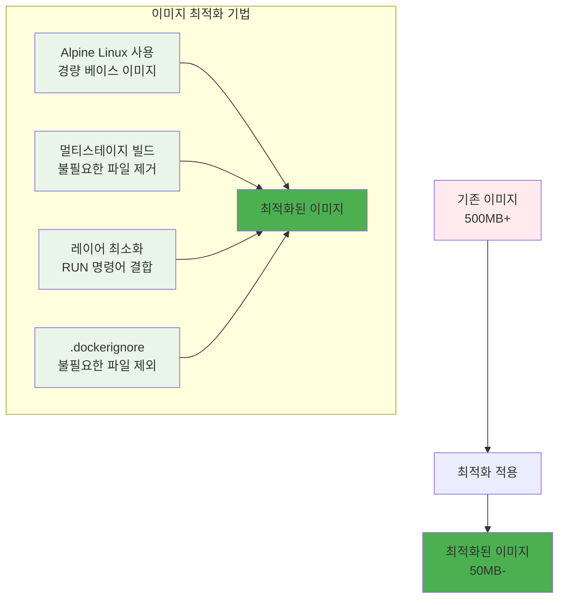
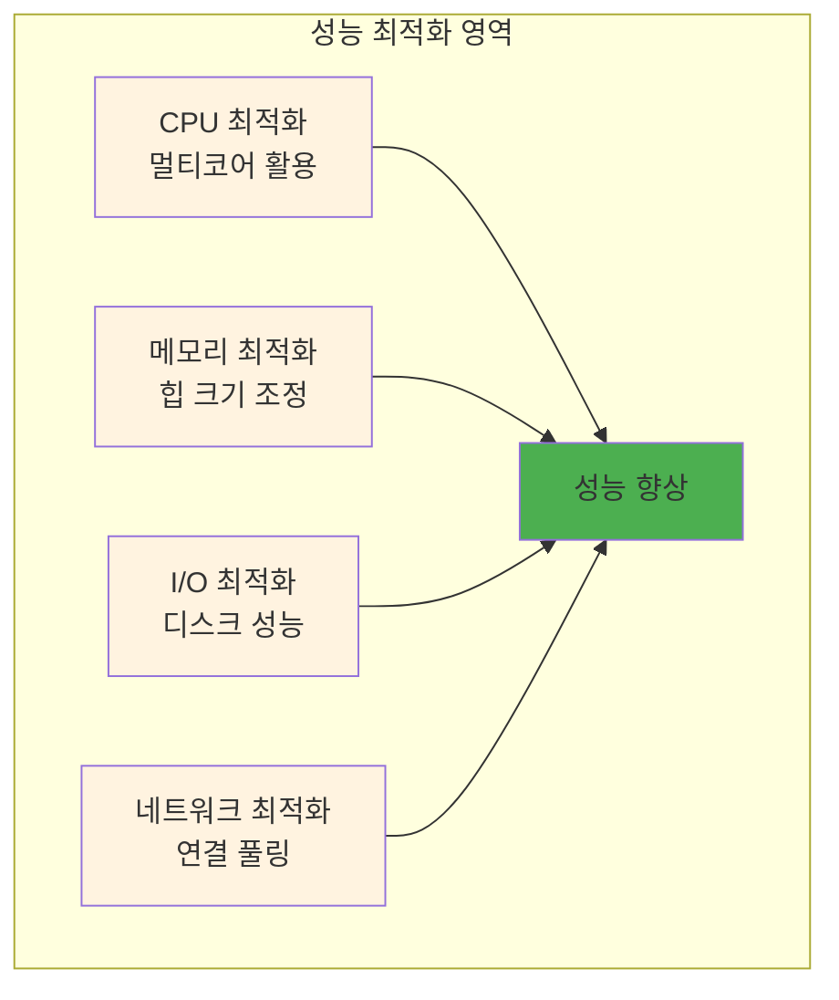

# Week 2 Day 1 Session 2: 이미지 최적화와 성능 튜닝

<div align="center">

**⚡ 성능 최적화** • **📦 이미지 경량화**

*컨테이너 이미지 최적화와 실행 성능 향상 기법*

</div>

---

## 🕘 세션 정보

**시간**: 10:00-10:50 (50분)  
**목표**: 컨테이너 이미지 최적화 기법과 성능 튜닝 방법 이해  
**방식**: 최적화 기법 + 실제 측정 + 성능 비교

---

## 🎯 세션 목표

### 📚 학습 목표
- **이해 목표**: 컨테이너 이미지 최적화 기법과 성능 튜닝 방법 이해
- **적용 목표**: 이미지 크기 최소화와 실행 성능 향상 기술 습득
- **협업 목표**: 개별 학습 후 경험 공유 및 질의응답

---

## 📖 핵심 개념 (35분)

### 🔍 개념 1: 이미지 크기 최적화 (12분)

> **정의**: 컨테이너 이미지의 크기를 최소화하여 배포 속도와 저장 효율성을 향상시키는 기법

**최적화 전략**:


**크기 비교 예시**:
| 베이스 이미지 | 크기 | 최적화 후 | 감소율 |
|---------------|------|-----------|--------|
| `ubuntu:20.04` | 72MB | `alpine:3.18` | 5MB (93% 감소) |
| `node:18` | 993MB | `node:18-alpine` | 174MB (82% 감소) |
| `python:3.9` | 885MB | `python:3.9-alpine` | 45MB (95% 감소) |
| `openjdk:11` | 628MB | `openjdk:11-jre-slim` | 204MB (67% 감소) |
| `nginx:latest` | 142MB | `nginx:alpine` | 23MB (84% 감소) |

**이미지 최적화 전략 상세**:

**1. 베이스 이미지 선택**:
- **Alpine Linux**: 가장 작은 크기, 보안성 우수
- **Distroless**: Google의 미니멀 이미진
- **Slim 버전**: 기본 이미지의 경량화 버전
- **Scratch**: 빈 이미지 (정적 바이너리용)

**2. 레이어 최적화 기법**:
```dockerfile
# 비효율적인 예시
RUN apt-get update
RUN apt-get install -y curl
RUN apt-get install -y wget
RUN rm -rf /var/lib/apt/lists/*

# 효율적인 예시 (레이어 결합)
RUN apt-get update && \
    apt-get install -y curl wget && \
    rm -rf /var/lib/apt/lists/*
```

**3. .dockerignore 활용**:
```bash
# .dockerignore 예시
node_modules
npm-debug.log
.git
.gitignore
README.md
.env
.nyc_output
coverage
.cache
*.log
*.tmp
.DS_Store
Thumbs.db
```

### 🔍 개념 2: 런타임 성능 최적화 (12분)

> **정의**: 컨테이너 실행 시 CPU, 메모리, I/O 성능을 최적화하는 방법

**성능 튜닝 영역**:


### 🔍 개념 3: 빌드 최적화 (11분)

> **정의**: Docker 이미지 빌드 과정을 최적화하여 빌드 시간을 단축하는 방법

**최적화된 Dockerfile 예시**:
```dockerfile
# 멀티스테이지 빌드
FROM node:18-alpine AS builder

# 의존성 먼저 설치 (캐시 활용)
WORKDIR /app
COPY package*.json ./
RUN npm ci --only=production && npm cache clean --force

# 소스 코드 복사
COPY . .
RUN npm run build

# 프로덕션 스테이지
FROM nginx:alpine
COPY --from=builder /app/dist /usr/share/nginx/html
RUN rm -rf /var/cache/apk/*

# 보안 설정
RUN adduser -D -s /bin/sh nginx
USER nginx

EXPOSE 80
CMD ["nginx", "-g", "daemon off;"]
```

**성능 벤치마크 도구**:
- **Apache Bench (ab)**: HTTP 로드 테스트
- **wrk**: 현대적인 HTTP 벤치마킹 도구
- **hey**: Go로 작성된 가벼운 로드 테스터
- **JMeter**: GUI 기반 종합 테스트 도구

**성능 모니터링 스크립트**:
```bash
#!/bin/bash
# performance-monitor.sh

echo "=== 컨테이너 성능 모니터링 ==="

# CPU 사용률
echo "CPU Usage:"
docker stats --no-stream --format "table {{.Container}}\t{{.CPUPerc}}" | head -10

# 메모리 사용률
echo -e "\nMemory Usage:"
docker stats --no-stream --format "table {{.Container}}\t{{.MemUsage}}\t{{.MemPerc}}" | head -10

# 네트워크 I/O
echo -e "\nNetwork I/O:"
docker stats --no-stream --format "table {{.Container}}\t{{.NetIO}}" | head -10

# 디스크 I/O
echo -e "\nDisk I/O:"
docker stats --no-stream --format "table {{.Container}}\t{{.BlockIO}}" | head -10

# 시스템 리소스
echo -e "\nSystem Resources:"
echo "Load Average: $(uptime | awk -F'load average:' '{print $2}')"
echo "Disk Usage: $(df -h / | awk 'NR==2{print $5}')"
echo "Memory Usage: $(free | awk 'NR==2{printf "%.2f%%", $3*100/$2}')"
```

**리소스 제한 및 최적화**:
```bash
# CPU 제한 (0.5 코어)
docker run --cpus="0.5" myapp:latest

# 메모리 제한 (512MB)
docker run --memory="512m" myapp:latest

# 복합 리소스 제한
docker run \
  --cpus="0.5" \
  --memory="512m" \
  --memory-swap="1g" \
  --oom-kill-disable=false \
  myapp:latest

# 네트워크 대역폭 제한
docker run --network-bandwidth 100m myapp:latest
```

**성능 최적화 체크리스트**:
- [ ] 멀티스테이지 빌드 적용
- [ ] Alpine 베이스 이미지 사용
- [ ] 불필요한 패키지 제거
- [ ] .dockerignore 파일 작성
- [ ] 레이어 최소화
- [ ] 리소스 제한 설정
- [ ] 헬스체크 구성
- [ ] 성능 벤치마크 수행
- [ ] 캐시 전략 최적화
- [ ] 네트워크 연결 풀링

---

## 💭 함께 생각해보기 (15분)

### 🤝 페어 토론 (10분)

**토론 주제**:
1. **최적화 경험**: "애플리케이션 성능을 개선해본 경험이 있나요?"
2. **트레이드오프**: "이미지 크기와 기능성 사이의 균형을 어떻게 맞출까요?"
3. **측정 방법**: "성능 개선 효과를 어떻게 측정하고 검증할까요?"

### 🎯 전체 공유 (5분)

- **최적화 전략**: 효과적인 이미지 최적화 방안
- **성능 측정**: 성능 개선 효과 측정 방법

---

## 🔑 핵심 키워드

- **Multi-stage Build**: 멀티스테이지 빌드
- **Alpine Linux**: 경량 리눅스 배포판
- **Layer Caching**: 레이어 캐싱
- **Resource Limits**: 리소스 제한
- **Performance Profiling**: 성능 프로파일링

---

## 📝 세션 마무리

### ✅ 오늘 세션 성과
- [ ] 이미지 최적화 기법 습득
- [ ] 성능 튜닝 방법 이해
- [ ] 빌드 최적화 전략 학습

### 🎯 다음 세션 준비
- **주제**: CLI 기반 모니터링과 로깅
- **연결**: 최적화된 시스템의 모니터링 방법

---

<div align="center">

**⚡ 컨테이너 성능 최적화를 완전히 마스터했습니다!**

**다음**: [Session 3 - CLI 기반 모니터링과 로깅](./session_3.md)

</div>